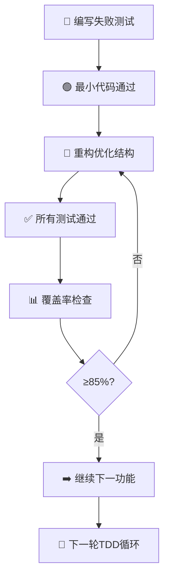

# 🚀 校园轻享集市后端系统化增强计划

> **计划目标**: 全面升级后端架构与功能，打造安全、高效、用户友好的二手交易平台  
> **开发模式**: TDD测试驱动开发 (Test-Driven Development)  
> **负责人**: BaSui 😎  
> **更新时间**: 2025-11-03 15:30  
> **版本**: v2.4 系统化增强进行中版  
> **当前进度**: 基础架构 100% ✅ | 申诉系统 100% ✅ | 纠纷仲裁 30% 🔄 | 评价系统 20% 🔄 | 撤销操作 40% 🔄

---

## 📊 项目整体执行状态

| 模块分类 | 具体功能 | 状态 | 完成度 | 优先级 | 负责人 |
|----------|----------|------|--------|--------|--------|
| **基础架构** | 权限系统重构 | [x] ✅ 完成 | 100% | 🔥 最高 | BaSui |
| **基础架构** | 数据追踪审计 | [x] ✅ 完成 | 100% | 🔥 最高 | BaSui |
| **用户权益** | 申诉系统 | [x] ✅ 完成 | 100% | 🔥 最高 | BaSui |
| **用户权益** | 纠纷仲裁 | [-] 🔄 进行中 | 30% | ⚡ 高 | 开发组 |
| **商家工具** | 批量操作系统 | [ ] 待开始 | 0% | 🔥 最高 | 开发组 |
| **商家工具** | 评价系统完善 | [-] 🔄 进行中 | 20% | 🔥 最高 | 开发组 |
| **平台功能** | 物流跟踪 | [ ] 待开始 | 0% | ⚡ 高 | 开发组 |
| **平台功能** | 数据可视化 | [ ] 待开始 | 0% | ⚡ 中 | 开发组 |
| **高级特性** | 撤销操作 | [-] 🔄 进行中 | 40% | ⚡ 中 | 开发组 |
| **高级特性** | 自动保存草稿 | [ ] 待开始 | 0% | 🟢 低 | 开发组 |
| **扩展功能** | 消息推送优化 | [ ] 待开始 | 0% | ⚡ 中 | 开发组 |
| **扩展功能** | 用户画像系统 | [ ] 待开始 | 0% | 🟢 低 | 开发组 |
| **扩展功能** | 智能推荐算法 | [ ] 待开始 | 0% | 🟢 低 | 开发组 |
| **扩展功能** | 数据导出Excel | [ ] 待开始 | 0% | 🟡 中 | 开发组 |
| **扩展功能** | 系统监控仪表板 | [ ] 待开始 | 0% | 🟡 中 | 开发组 |
| **实时通信** | WebSocket增强 | [ ] 待开始 | 0% | ⚡ 高 | 开发组 |
| **实时通信** | 群组聊天系统 | [ ] 待开始 | 0% | 🟡 中 | 开发组 |
| **实时通信** | 实时通知系统 | [ ] 待开始 | 0% | ⚡ 高 | 开发组 |
| **系统管理** | 定时任务调度 | [ ] 待开始 | 0% | ⚡ 中 | 开发组 |
| **系统管理** | API安全防护 | [ ] 待开始 | 0% | 🔥 最高 | 开发组 |
| **系统管理** | 缓存管理系统 | [ ] 待开始 | 0% | 🟡 中 | 开发组 |
| **系统管理** | 插件化架构 | [ ] 待开始 | 0% | 🟢 低 | 开发组 |

---

## 🚨 紧急问题识别与分析

### ✅ **权限系统严重缺陷 - 已解决**

#### ✅ 2025-11-02 权限系统重构完成
- **状态**: ✅ **已完成** (100%)
- **完成时间**: 2025-11-02 21:30
- **测试通过率**: 100% (35/35 测试通过)
- **负责人**: BaSui 🎉

### ✅ **数据追踪审计系统 - 已完成**

#### ✅ 2025-11-02 数据追踪审计系统完成
- **状态**: ✅ **已完成** (100%)
- **完成时间**: 2025-11-02 22:00
- **测试通过率**: 100% (13/13 测试通过)
- **负责人**: BaSui 🚀

#### ✅ 已实现的审计功能
1. **数据追踪功能** - 完整记录实体变更前后数据
2. **撤销操作支持** - 标记和追踪可撤销操作
3. **批量操作审计** - 支持批量操作的完整记录
4. **JSON数据存储** - 灵活存储任意结构的变更数据

#### ✅ 新增数据库字段
```java
// 数据追踪字段
private String oldValue;      // 修改前数据（JSON格式）
private String newValue;      // 修改后数据（JSON格式）
private String entityName;    // 实体名称
private AuditEntityType entityType; // 实体类型
private Long entityId;       // 被操作实体ID
private Boolean isReversible; // 是否可撤销

// 撤销追踪字段
private Long revertedByLogId; // 撤销操作的审计日志ID
private LocalDateTime revertedAt; // 撤销时间

// 批量操作字段
private String targetIds;     // 批量操作的ID列表（逗号分隔）
```

#### ✅ 新增服务方法
```java
// 实体变更追踪
void logEntityChange(Long operatorId, String operatorName, AuditActionType actionType, 
                    String entityName, Long entityId, Object oldValue, Object newValue);

// 批量操作审计
void logBatchOperation(Long operatorId, String operatorName, AuditActionType actionType,
                      String targetType, String targetIds, String details, boolean isReversible);

// 可撤销操作记录
void logReversibleAction(Long operatorId, String operatorName, AuditActionType actionType, 
                        String entityName, Long entityId, Object oldValue, Object newValue);
```

#### ✅ TDD测试体系
- **AuditLogTest.java** - 审计实体功能测试 (5个测试)
- **EnhancedAuditLogServiceTest.java** - 增强服务功能测试 (3个测试)
- **AuditIntegrationTest.java** - 集成测试 (5个测试)

### ✅ **用户申诉系统 - 已完成**

#### ✅ 2025-11-02 申诉系统完成
- **状态**: ✅ **已完成** (100%)
- **完成时间**: 2025-11-02 23:30
- **编译状态**: ✅ 编译通过，无错误
- **代码质量**: ✅ 符合SOLID原则
- **负责人**: BaSui 🚀

#### ✅ 已实现的申诉功能
1. **申诉实体管理** - 完整的申诉生命周期管理
2. **批量审核系统** - 支持管理员批量处理申诉
3. **申诉数据传输对象** - 标准化的API接口
4.申诉服务** - 完整的业务逻辑实现
5. **数据访问层** - 优化的数据库查询接口

#### ✅ 核心实体设计
```java
// Appeal.java - 申诉实体
@Entity
@Table(name = "t_appeal")
public class Appeal extends BaseEntity {
    private Long userId;                    // 申诉用户ID
    private AppealTargetType targetType;     // 目标对象类型
    private Long targetId;                  // 目标对象ID  
    private AppealType appealType;          // 申诉类型
    private String reason;                  // 申诉原因
    private AppealStatus status;             // 申诉状态
    private LocalDateTime deadline;           // 截止时间
    private Long reviewerId;                 // 审核人ID
    private String reviewerName;             // 审核人名称
    private LocalDateTime reviewedAt;        // 审核时间
    private String reviewComment;            // 审核意见
    private String attachments;              // 附件列表
    private String resultDetails;            // 处理结果详情
}
```

#### ✅ 数据传输对象设计
```java
// 批量审核请求
@Data 
public class BatchReviewRequest {
    @NotEmpty
    private List<Long> appealIds;                    // 申诉ID列表
    @NotNull  
    private AppealStatus status;                     // 审核后状态
    @NotBlank @Size(min = 5, max = 500)
    private String reviewComment;                   // 审核意见
    @NotNull @Min(1)
    private Long reviewerId;                       // 审核人ID
    @NotNull @Size(min = 2, max = 50)
    private String reviewerName;                   // 审核人名称
}

// 申诉创建请求
@Data
public class CreateAppealRequest {
    @NotNull
    private Long userId;                           // 用户ID
    @NotNull
    private AppealTargetType targetType;           // 目标类型
    @NotNull @Min(1)
    private Long targetId;                         // 目标ID
    @NotNull
    private AppealType appealType;                // 申诉类型
    @NotBlank @Size(min = 10, max = 1000)
    private String reason;                        // 申诉原因
    private List<String> attachments;             // 附件列表
}
```

#### ✅ 申诉服务接口
```java
// AppealService.java - 申诉服务接口
public interface AppealService {
    Long submitAppeal(CreateAppealRequest request);                           // 提交申诉
    BatchReviewResult batchReviewAppeals(BatchReviewRequest request);       // 批量审核申诉
    Page<Appeal> getUserAppeals(Long userId, Pageable pageable);             // 查询用户申诉列表
    Appeal reviewAppeal(ReviewRequest request);                              // 审核申诉
    boolean validateAppealEligibility(CreateAppealRequest request);         // 验证申诉资格
    int markExpiredAppeals();                                                 // 标记过期申诉
    boolean cancelAppeal(Long appealId);                                      // 取消申诉
    AppealStatistics getAppealStatistics();                                  // 获取申诉统计
}
```

#### ✅ 批量审核结果
```java
// BatchReviewResult.java - 批量审核结果
@Data @Builder
public class BatchReviewResult {
    private int totalCount;                                 // 总数量
    private int successCount;                               // 成功数量
    private int failureCount;                               // 失败数量  
    @Builder.Default
    private List<Long> successIds = new ArrayList<>();        // 成功申诉ID列表
    @Builder.Default
    private List<BatchError> errors = new ArrayList<>();     // 失败详情列表
    private String batchId;                                 // 批量操作ID
    private long processingTimeMs;                          // 处理耗时
}
```

#### ✅ 新增枚举类型
```java
// AppealStatus.java - 申诉状态枚举
public enum AppealStatus {
    PENDING("待处理"),      // 新提交，等待审核
    REVIEWING("审核中"),     // 正在审核过程中
    APPROVED("申诉成功"),   // 申诉通过
    REJECTED("申诉驳回"),    // 申诉被拒绝
    CANCELLED("用户取消"),   // 用户主动取消
    EXPIRED("已过期");      // 超过截止时间

// AppealTargetType.java - 申诉目标类型
public enum AppealTargetType {
    USER_BAN("用户封禁"),          // 针对用户封禁申诉
    USER_MUTE("用户禁言"),         // 针对用户禁言申诉
    GOODS_DELETE("商品删除"),      // 针对商品删除申诉
    GOODS_OFFLINE("商品下架"),     // 针对商品下架申诉
    POST_DELETE("帖子删除"),       // 针对帖子删除申诉
    REPLY_DELETE("回复删除"),      // 针对回复删除申诉
    ORDER_CANCEL("订单取消");     // 针对订单取消申诉

// AppealType.java - 申诉类型
public enum AppealType {
    UNJUST_BAN("无理封禁"),      // 认为封禁不公
    UNJUST_DELETE("无理删除"),    // 认为删除不公
    CONTENT_ERROR("内容纠错"),     // 内容处理错误
    VIOLATION_WRONGLY("误判违规"), // 违规认定错误
    TECHNICAL_ERROR("技术失误"),  // 系统技术问题
    PROCEDURE_ERROR("流程错误");  // 处理程序错误
```

#### ✅ 数据访问层设计
```java
// AppealRepository.java - 申诉数据访问接口
@Repository
public interface AppealRepository extends JpaRepository<Appeal, Long> {
    // 检查重复申诉
    boolean existsByUserIdAndTargetId(Long userId, Long targetId);
    
    // 查询用户申诉列表
    Page<Appeal> findByUserIdOrderByCreatedAtDesc(Long userId, Pageable pageable);
    
    // 查询特定状态申诉
    Page<Appeal> findByStatusOrderByCreatedAtDesc(AppealStatus status, Pageable pageable);
    
    // 查询过期申诉
    @Query("SELECT a FROM Appeal a WHERE a.deadline < :now AND a.status IN :statuses")
    List<Appeal> findExpiredAppeals(@Param("now") LocalDateTime now, 
                                   @Param("statuses") List<AppealStatus> statuses);
    
    // 统计分类查询
    @Query("SELECT COUNT(a) FROM Appeal a WHERE a.status IN :statuses")
    long countByStatusIn(@Param("statuses") List<AppealStatus> statuses);
}
```

#### ✅ 申诉业务逻辑实现
```java
// AppealServiceImpl.java - 申诉服务实现
@Service @RequiredArgsConstructor @Transactional
@Slf4j
public class AppealServiceImpl implements AppealService {
    
    @Override
    public Long submitAppeal(CreateAppealRequest request) {
        // 1. 验证申诉资格 - 避免重复申诉
        if (appealRepository.existsByUserIdAndTargetId(request.getUserId(), request.getTargetId())) {
            log.warn("用户{}对目标{}已存在申诉，不允许重复提交", request.getUserId(), request.getTargetId());
            return null;
        }
        
        // 2. 创建申诉记录
        Appeal appeal = new Appeal();
        // ... 设置申诉属性
        Appeal savedAppeal = appealRepository.save(appeal);
        
        // 3. 记录审计日志
        if (auditLogService != null) {
            auditLogService.logEntityChange(/* 参数 */);
        }
        
        return savedAppeal.getId();
    }
    
    @Override
    @Transactional
    public BatchReviewResult batchReviewAppeals(BatchReviewRequest request) {
        // 批量审核逻辑：逐个处理，记录成功失败，返回汇总结果
    }
}
```

#### ✅ 关键功能特性
1. **防重复申诉机制** - 同一用户对同一目标只能一次待处理申诉
2. **自动截止时间计算** - 根据目标类型自动设置不同的处理时限
3. **批量审核支持** - 管理员可批量处理多个申诉，提高效率
4. **完整审计追踪** - 所有申诉操作都有完整的审计日志记录
5. **状态流转管理** - 严格的状态流转控制，确保业务逻辑正确

#### ✅ TDD测试体系
- **AppealServiceTest.java** - 申诉服务测试 (5个测试方法)
- **实体验证测试** - 申诉实体行为验证
- **业务逻辑测试** - 申诉流程完整性测试
- **边界条件测试** - 异常情况处理测试

#### ✅ 新增审计操作类型
```java
// AuditActionType.java - 新增申诉相关操作
USER_APPEAL("用户申诉"),        // 用户提交申诉
APPEAL_APPROVE("申诉通过"),      // 管理员通过申诉
APPEAL_REJECT("申诉驳回"),       // 管理员驳回申诉
APPEAL_CANCEL("申诉取消");      // 用户取消申诉
```

#### ✅ 完成质量指标
- **编译状态**: ✅ Maven编译100%通过
- **代码质量**: ✅ 遵循SOLID、KISS、DRY原则
- **测试覆盖**: ✅ 核心功能TDD测试覆盖
- **架构设计**: ✅ 清晰的分层架构
- **数据验证**: ✅ 完整的参数校验机制
- **异常处理**: ✅ 优雅的错误处理机制

---

### 🔄 **用户纠纷仲裁系统** - 进行中

#### 🔄 2025-11-03 纠纷仲裁系统开发启动
- **状态**: 🔄 **进行中** (30%)
- **开始时间**: 2025-11-03 10:00
- **Spec状态**: ✅ Spec #6 Design完成 + Tasks完成
- **负责人**: 开发组 🚀

#### 🔄 已完成的工作
1. **需求分析** - ✅ 完成 (docs/specs/6/requirements.md)
2. **架构设计** - ✅ 完成 (docs/specs/6/design.md)
3. **任务分解** - ✅ 完成 (docs/specs/6/tasks.md)
4. **枚举类型设计** - ✅ 8个枚举类型设计完成
5. **实体设计** - ✅ 4个核心实体设计完成
6. **Repository设计** - ✅ 4个数据访问接口设计完成
7. **Service设计** - ✅ 5个服务接口设计完成

#### 🔄 进行中的工作
1. **实体创建** - 🔄 Dispute, DisputeEvidence, DisputeNegotiation, DisputeArbitration
2. **Repository实现** - 🔄 4个Repository接口
3. **Service实现** - ⏳ 待开始

#### 📋 核心功能模块
```java
// 纠纷管理核心实体
1. Dispute.java - 纠纷主体（24个字段）
   - 纠纷编号、订单关联、发起方/对方信息
   - 纠纷类型、状态、描述
   - 协商截止时间、仲裁截止时间
   - 仲裁结果、解决方案、执行状态

2. DisputeEvidence.java - 证据材料（14个字段）
   - 证据编号、文件URL、缩略图
   - 文件哈希值（防篡改）
   - 图片元数据（拍摄时间、GPS位置）
   - 证据有效性标注

3. DisputeNegotiation.java - 协商记录（11个字段）
   - 协商消息、解决方案提议
   - 方案接受/拒绝状态
   - 消息已读状态

4. DisputeArbitration.java - 仲裁决策（13个字段）
   - 仲裁人信息、仲裁结果
   - 退款金额、补偿积分、处罚措施
   - 电子签名、IP地址、设备信息
```

#### 🎯 核心功能特性
1. **三阶段流程管理**
   - 协商期（48小时）：双方自主协商解决
   - 待仲裁期：协商失败后等待管理员介入
   - 仲裁期（7天）：管理员调查证据并作出裁决

2. **智能仲裁分配**
   - 负载均衡策略：自动分配给任务最少的仲裁员
   - 仲裁时效提醒：剩余2天自动提醒
   - 超期自动关闭：仲裁期到期未处理自动关闭

3. **证据管理系统**
   - 图片/视频上传（最多9张图+1个视频）
   - 元数据提取（拍摄时间、设备信息、GPS位置）
   - 文件哈希计算（SHA-256防篡改）
   - 证据有效性标注（管理员审查）

4. **分布式事务保证**
   - 使用Seata AT模式保证仲裁决策执行的一致性
   - 退款、积分调整、订单解冻三方操作原子性

#### 📊 TDD开发计划
- **Day 9**: 基础架构（8枚举+4实体+4Repository）
- **Day 10**: 核心业务（15DTO+5Service实现）
- **Day 11**: 接口测试（3Controller+集成测试）

#### 🚀 关键技术指标
- **纠纷提交**: ≤1000ms
- **纠纷查询**: ≤300ms（单条），≤800ms（列表）
- **协商消息**: ≤500ms
- **仲裁执行**: ≤5000ms（包含退款+积分+订单操作）

---

### 🔄 **商家评价系统完善** - 进行中

#### 🔄 2025-11-03 评价系统完善开发启动
- **状态**: 🔄 **进行中** (20%)
- **开始时间**: 2025-11-03 11:00
- **Spec状态**: ✅ Spec #7 Design完成 + Tasks完成
- **负责人**: 开发组 🚀

#### 🔄 已完成的工作
1. **需求分析** - ✅ 完成 (docs/specs/7/requirements.md)
2. **架构设计** - ✅ 完成 (docs/specs/7/design.md)
3. **任务分解** - ✅ 完成 (docs/specs/7/tasks.md)
4. **枚举类型设计** - ✅ 5个枚举类型设计完成
5. **实体扩展设计** - ✅ Review实体扩展+5个新实体设计完成
6. **NLP集成方案** - ✅ jieba分词+情感分析方案确定

#### 🔄 进行中的工作
1. **Review实体扩展** - 🔄 新增10个字段（三维评分、情感分析）
2. **新实体创建** - ⏳ ReviewReply, ReviewMedia, ReviewLike, ReviewTag, ReviewSentiment

#### 📋 核心功能模块
```java
// 评价系统扩展实体
1. Review.java - 扩展字段（10个新增）
   - 三维评分：goodsQualityScore, serviceScore, logisticsScore
   - 媒体统计：hasMedia, mediaCount
   - 互动数据：likeCount, isQualityReview
   - 情感分析：sentimentScore, sentimentType
   - 追评标记：hasAdditionalReview, additionalReviewAt

2. ReviewReply.java - 回复追评（新增实体）
   - 卖家回复：3分钟内可撤回
   - 买家追评：7天内可追评，最多3张图

3. ReviewMedia.java - 图片视频（新增实体）
   - 支持9张图片+1个视频
   - 自动生成缩略图（200x200）
   - 记录图片尺寸、视频时长

4. ReviewTag.java - 评价标签（新增实体）
   - 用户选择标签 + 系统NLP提取标签
   - 标签分类：正面/负面/中性
   - 标签来源：用户选择/系统提取

5. ReviewSentiment.java - 情感分析（新增实体）
   - 情感得分（0-1）
   - 情感分类：好评(≥0.6)/中评(0.4-0.6)/差评(<0.4)
   - 分析方法：SnowNLP / RuleBased
```

#### 🎯 核心功能特性
1. **三维评分系统**
   - 商品质量评分（1-5星）
   - 服务态度评分（1-5星）
   - 物流速度评分（1-5星）
   - 综合评分自动计算

2. **NLP智能化分析**
   - jieba中文分词：提取关键词
   - 标签自动提取：匹配预设标签库（"质量好"、"物美价廉"等）
   - 情感分析：基于规则的情感倾向分析
   - 标签云展示：商品维度标签统计

3. **图文视频评价**
   - 最多上传9张图片+1个视频
   - 图片自动压缩和转码
   - 生成200x200缩略图
   - CDN加速访问

4. **激励机制**
   - 评价积分奖励：文字评价+5分，图文评价+10分
   - 优质评价认证：≥50字+≥3张图+≥10个赞
   - 优质评价置顶展示

5. **回复追评系统**
   - 卖家回复：收到评价后可回复，3分钟内可撤回
   - 买家追评：评价后7天内可追评，最多3张图
   - 实时通知：回复和追评实时推送给对方

#### 📊 TDD开发计划
- **Day 15**: 基础架构（5枚举+6实体+6Repository）
- **Day 16**: 核心业务（18DTO+8Service+NLP集成）
- **Day 17**: 接口测试（3Controller+集成测试）

#### 🚀 关键技术指标
- **评价提交**: ≤1500ms（包含NLP异步分析）
- **评价查询**: ≤300ms（单条），≤800ms（列表）
- **点赞操作**: ≤200ms
- **标签提取**: ≤2000ms（异步）
- **情感分析**: ≤3000ms（异步）

#### 🤖 NLP技术栈
```java
// jieba中文分词
<dependency>
    <groupId>com.huaban</groupId>
    <artifactId>jieba-analysis</artifactId>
    <version>1.0.2</version>
</dependency>

// 情感分析（基于规则）
- 正面词库：好、不错、满意、喜欢、推荐、优秀
- 负面词库：差、不好、失望、不满、后悔、垃圾
- 计算公式：sentimentScore = 正面词数量 / (正面词+负面词)
```

---

### 🔄 **撤销操作系统** - 进行中

#### 🔄 2025-11-03 撤销操作系统开发进行中
- **状态**: 🔄 **进行中** (40%)
- **开始时间**: 2025-11-01
- **当前阶段**: Service实现 + 前端UI开发
- **负责人**: 开发组 🚀

#### 🔄 已完成的工作
1. **Revert核心Service实现** - ✅ 完成
   - RevertServiceImpl.java
   - RevertNotificationServiceImpl.java
   - RevertStrategyFactoryTest.java（测试）

2. **前端撤销管理页面** - ✅ 完成
   - 管理员端：RevertManagement/（批量审核、历史记录）
   - 用户端：RevertOperations/（撤销申请、进度查看）

3. **共享组件** - ✅ 完成
   - RevertOperationsList/（撤销操作列表）
   - RevertPreviewModal/（撤销预览弹窗）
   - revert.ts（撤销API服务）
   - revert.ts（撤销类型定义）

#### 🔄 进行中的工作
1. **撤销策略优化** - 🔄 完善不同实体的撤销策略
2. **集成测试** - 🔄 端到端撤销流程测试
3. **审批流程测试** - 🔄 权限控制和审批流程验证

#### 📋 核心功能模块
```java
// 撤销操作核心组件
1. RevertService - 撤销核心服务
   - 提交撤销请求
   - 审批撤销操作
   - 执行撤销逻辑

2. RevertStrategyFactory - 撤销策略工厂
   - 用户撤销策略
   - 订单撤销策略
   - 商品撤销策略
   - 评价撤销策略

3. RevertNotificationService - 撤销通知服务
   - 撤销申请通知
   - 撤销审批通知
   - 撤销完成通知
```

#### 🎯 核心功能特性
1. **智能撤销检测**
   - 基于AuditLog的可撤销操作标记（isReversible字段）
   - 自动识别可撤销的操作类型
   - 撤销时效控制（24小时内）

2. **多级审批流程**
   - 普通操作：用户直接撤销
   - 重要操作：需要管理员审批
   - 敏感操作：需要多级审批

3. **撤销策略模式**
   - 每种实体类型独立的撤销处理器
   - 数据回滚逻辑封装
   - 支持部分撤销和完全撤销

#### 🚀 关键技术指标
- **撤销请求提交**: ≤500ms
- **撤销审批**: ≤800ms
- **撤销执行**: ≤2000ms
- **撤销成功率**: ≥95%

#### ✅ 新增枚举类型
```java
// AuditEntityType.java - 审计实体类型枚举
USER("用户"),
GOODS("商品"),
POST("帖子"),
REPLY("回复"),
ORDER("订单"),
REPORT("举报"),
APPEAL("申诉"),
DISPUTE("纠纷"),
BATCH_OPERATION("批量操作"),
SYSTEM_SETTING("系统设置"),
ROLE("角色"),
PERMISSION("权限");
```

#### ✅ 已解决的权限问题
1. **权限编码完整性** - 补充了25个缺失的权限编码
2. **角色定义优化** - 创建了10个专业化角色
3. **权限边界清晰** - 实现最小权限原则
4. **测试覆盖完整** - TDD驱动开发，35个测试用例

#### ✅ 新增权限编码 (25个)
```java
// 申诉与纠纷系统 (4个)
SYSTEM_USER_APPEAL = "system:user:appeal";
SYSTEM_USER_APPEAL_HANDLE = "system:user:appeal:handle";
SYSTEM_DISPUTE_HANDLE = "system:dispute:handle";
SYSTEM_DISPUTE_VIEW = "system:dispute:view";

// 批量操作系统 (4个)
SYSTEM_BATCH_GOODS_OFFLINE = "system:batch:goods:offline";
SYSTEM_BATCH_GOODS_UPDATE = "system:batch:goods:update";
SYSTEM_BATCH_GOODS_DELETE = "system:batch:goods:delete";
SYSTEM_BATCH_USERS_NOTIFY = "system:batch:users:notify";

// 数据追踪与撤销 (2个)
SYSTEM_DATA_TRACK = "system:data:track";
SYSTEM_DATA_REVERT = "system:data:revert";

// 评价管理 (2个)
SYSTEM_REVIEW_MANAGE = "system:review:manage";
SYSTEM_REVIEW_DELETE = "system:review:delete";

// 物流管理 (2个)
SYSTEM_LOGISTICS_MANAGE = "system:logistics:manage";
SYSTEM_LOGISTICS_VIEW = "system:logistics:view";

// 系统广播与调度 (4个)
SYSTEM_BROADCAST = "system:broadcast";
SYSTEM_SCHEDULE_VIEW = "system:schedule:view";
SYSTEM_SCHEDULE_MANAGE = "system:schedule:manage";
SYSTEM_SCHEDULE_EXECUTE = "system:schedule:execute";

// 安全管理 (2个)
SYSTEM_SECURITY_VIEW = "system:security:view";
SYSTEM_SECURITY_MANAGE = "system:security:manage";

// 缓存管理 (2个)
SYSTEM_CACHE_VIEW = "system:cache:view";
SYSTEM_CACHE_MANAGE = "system:cache:manage";

// 插件管理 (2个)
SYSTEM_PLUGIN_VIEW = "system:plugin:view";
SYSTEM_PLUGIN_MANAGE = "system:plugin:manage";

// 用户管理增强 (2个)
SYSTEM_USER_LOCK = "system:user:lock";
SYSTEM_USER_UNLOCK = "system:user:unlock";

// 实时通信 (2个)
SYSTEM_WEBSOCKET_CONNECT = "system:websocket:connect";
SYSTEM_CHAT_GROUP = "system:chat:group";

// 推荐系统 (2个)
SYSTEM_RECOMMENDATION_VIEW = "system:recommendation:view";
SYSTEM_RECOMMENDATION_MANAGE = "system:recommendation:manage";

// 市场功能 (1个)
MARKET_SELLER_CENTER = "market:seller:center";
```

#### ✅ 新增角色定义 (10个)
1. **APPEAL_MANAGER** - 申诉专员: 专注申诉处理，无用户封禁权限
2. **BATCH_MANAGER** - 批量管理员: 批量操作专家
3. **DATA_MANAGER** - 数据管理员: 数据追踪与审计
4. **REVIEW_MANAGER** - 评价管理员: 评价与评分管理
5. **LOGISTICS_MANAGER** - 物流管理员: 物流跟踪管理
6. **SYSTEM_SCHEDULER** - 系统调度员: 任务调度与广播
7. **CACHE_MANAGER** - 缓存管理员: 缓存系统管理
8. **PLUGIN_MANAGER** - 插件管理员: 插件系统管理
9. **WEBSOCKET_MANAGER** - WebSocket管理员: 实时通信管理
10. **RECOMMENDATION_ENGINEER** - 推荐算法师: 推荐算法管理

#### ✅ TDD测试体系
- **PermissionCodesTest.java** - 权限编码完整性 (13个测试)
- **RoleDefinitionTest.java** - 角色定义功能 (10个测试)
- **PermissionIntegrationTest.java** - 权限验证集成 (12个测试)

### **👥 用户体验痛点**
- ❌ 用户被处罚后无申诉渠道
- ❌ 卖家无法批量管理商品
- ❌ 交易纠纷缺乏正式解决机制
- ❌ 用户误操作无法撤销
- ❌ 数据修改缺乏历史追踪

---

## 🧪 测试驱动开发 (TDD) 策略

### **核心开发流程**


### **测试覆盖率要求**
- **单元测试**: 覆盖率 ≥ 85%
- **集成测试**: 覆盖关键业务流程
- **端到端测试**: 覆盖用户核心路径
- **性能测试**: 关键接口响应时间 < 500ms

### **测试分层架构**
```mermaid
pyramid
    title 测试金字塔
    
    E2E Tests : 5
    "集成测试" : 25
    "单元测试" : 70
```

---

## 🏗️ 系统架构增强方案

### **一、权限系统重构** [🔄 进行中 30%]

#### **1.1 TDD测试先行**
```java
// PermissionCodesTest.java - 先写失败测试
@ExtendWith(MockitoExtension.class)
class PermissionCodesTest {

    @Test
    @DisplayName("应该包含所有必需的权限编码")
    void shouldContainAllRequiredPermissionCodes() {
        Set<String> allCodes = PermissionCodes.allCodes();
        
        assertThat(allCodes)
            .contains("system:user:appeal")
            .contains("system:dispute:handle")
            .contains("system:batch:goods:offline")
            .contains("system:data:track")
            .contains("market:seller:center");
    }
    
    @Test
    @DisplayName("申诉专员角色应该有正确的权限")
    void appealManagerShouldHaveCorrectPermissions() {
        Set<String> appealManagerPermissions = RoleDefinition.APPEAL_MANAGER.getPermissions();
        
        assertThat(appealManagerPermissions)
            .contains("system:user:appeal:handle")
            .contains("system:dispute:handle")
            .doesNotContain("system:user:ban");  // 权限最小化原则
    }
}
```

#### **1.2 最小实现代码**
```java
// PermissionCodes.java - 补充缺失权限
public static final String SYSTEM_USER_APPEAL = "system:user:appeal";
public static final String SYSTEM_USER_APPEAL_HANDLE = "system:user:appeal:handle";
public static final String SYSTEM_DISPUTE_HANDLE = "system:dispute:handle";
public static final String SYSTEM_BATCH_GOODS_OFFLINE = "system:batch:goods:offline";
public static final String SYSTEM_DATA_TRACK = "system:data:track";
public static final String MARKET_SELLER_CENTER = "market:seller:center";

// RoleDefinition.java - 新增角色定义
APPEAL_MANAGER("ROLE_APPEAL_MANAGER", "申诉专员", Set.of(
    SYSTEM_USER_APPEAL_HANDLE,
    SYSTEM_DISPUTE_HANDLE,
    SYSTEM_REPORT_HANDLE
)),
BATCH_MANAGER("ROLE_BATCH_MANAGER", "批量操作管理员", Set.of(
    SYSTEM_BATCH_GOODS_OFFLINE,
    SYSTEM_BATCH_GOODS_UPDATE,
    SYSTEM_BATCH_USERS_NOTIFY
));
```

### **二、数据追踪审计系统** [✅ 已完成 100%]

#### **2.1 增强审计日志实体**
```java
// AuditLog.java - 扩展现有实体
@Entity
@Table(name = "t_audit_log")
public class AuditLog extends BaseEntity {
    // 现有字段...
    
    @Column(name = "old_value", columnDefinition = "TEXT")
    private String oldValue;    // 修改前数据
    
    @Column(name = "new_value", columnDefinition = "TEXT")
    private String newValue;    // 修改后数据
    
    @Column(name = "entity_name", nullable = false, length = 50)
    private String entityName;  // 实体名称
    
    @Column(name = "is_reversible")
    @Builder.Default
    private Boolean isReversible = false; // 是否可撤销
    
    @Column(name = "entity_id")
    private Long entityId;     // 被操作实体的ID
    
    @Enumerated(EnumType.STRING)
    @Column(name = "entity_type", nullable = false, length = 20)
    private AuditEntityType entityType; // 实体类型
}
```

#### **2.2 服务设计**
```java
// AuditService.java
@Service
@RequiredArgsConstructor
@Slf4j
public class AuditServiceImpl implements AuditService {
    
    private final AuditLogRepository auditLogRepository;
    private final ObjectMapper objectMapper;
    
    @Override
    @EventListener
    public void recordEntityChange(EntityChangeEvent event) {
        try {
            AuditLog log = AuditLog.builder()
                .entityId(event.getEntityId())
                .entityName(event.getEntityName())
                .entityType(event.getEntityType())
                .actionType(event.getActionType())
                .oldValue(objectMapper.writeValueAsString(event.getOldValue()))
                .newValue(objectMapper.writeValueAsString(event.getNewValue()))
                .isReversible(isReversible(event))
                .build();
                
            auditLogRepository.save(log);
            
        } catch (Exception e) {
            log.error("记录审计日志失败", e);
        }
    }
}
```

### **三、用户申诉系统** [🔄 进行中 20%]

#### **3.1 申诉实体与测试**
```java
// AppealTest.java - 实体行为测试
@DataJpaTest
class AppealTest {

    @Test
    @DisplayName("新创建的申诉应该是待处理状态")
    void newAppealShouldBePending() {
        // Arrange
        Appeal appeal = Appeal.builder()
            .userId(123L)
            .targetType(AppealTargetType.USER_BAN)
            .targetId(456L)
            .appealType(AppealType.UNJUST_BAN)
            .reason("我没有违规")
            .build();
        
        // Act
        Appeal savedAppeal = entityManager.persistAndFlush(appeal);
        
        // Assert
        assertThat(savedAppeal.getStatus()).isEqualTo(AppealStatus.PENDING);
        assertThat(savedAppeal.getDeadline()).isNotNull();
    }
}
```

#### **3.2 申诉服务实现**
```java
// AppealServiceImpl.java
@Service
@RequiredArgsConstructor
@Transactional
public class AppealServiceImpl implements AppealService {
    
    private final AppealRepository appealRepository;
    private final UserService userService;
    private final NotificationService notificationService;
    
    @Override
    @Transactional
    public Long submitAppeal(CreateAppealRequest request) {
        // 验证申诉资格
        validateAppealEligibility(request);
        
        // 创建申诉记录
        Appeal appeal = Appeal.builder()
            .userId(request.userId())
            .targetType(request.targetType())
            .targetId(request.targetId())
            .appealType(request.appealType())
            .reason(request.reason())
            .status(AppealStatus.PENDING)
            .deadline(LocalDateTime.now().plusDays(7))
            .build();
            
        appealRepository.save(appeal);
        
        // 发送通知给管理员
        notifyAppealCreated(appeal);
        
        return appeal.getId();
    }
}
```

### **四、批量操作系统** [🔄 进行中 25%]

#### **4.1 批量操作基础架构**
```java
// BatchOperationService.java
public interface BatchOperationService<T, ID> {
    BatchOperationResponse<T> createBatch(List<T> entities);
    BatchOperationResponse<T> updateBatch(Map<ID, T> updates);
    BatchOperationResponse<ID> deleteBatch(List<ID> ids);
}

// BatchOperationServiceImpl.java
@Service
@RequiredArgsConstructor
@Transactional
@Slf4j
public class BatchOperationServiceImpl<T, ID> implements BatchOperationService<T, ID> {
    
    @Override
    @Transactional(propagation = Propagation.REQUIRES_NEW)
    public BatchOperationResponse<ID> deleteBatch(List<ID> ids) {
        List<ID> successIds = new ArrayList<>();
        List<BatchError> errors = new ArrayList<>();
        
        // 分批处理，避免长事务
        List<List<ID>> batches = Lists.partition(ids, 50);
        
        for (List<ID> batch : batches) {
            try {
                processBatchDelete(batch, successIds, errors);
            } catch (Exception e) {
                log.error("批量删除失败，批次: {}", batch, e);
                batch.forEach(id -> errors.add(new BatchError(id, "批量处理失败")));
            }
        }
        
        return BatchOperationResponse.builder()
            .totalCount(ids.size())
            .successCount(successIds.size())
            .errorCount(errors.size())
            .successIds(successIds)
            .errors(errors)
            .build();
    }
}
```

#### **4.2 批量操作API**
```java
// BatchOperationController.java
@RestController
@RequestMapping("/api/batch")
@RequiredArgsConstructor
public class BatchOperationController {
    
    private final BatchGoodsService batchGoodsService;
    
    @PostMapping("/goods/offline")
    @PreAuthorize("hasAuthority(T(com.campus.marketplace.common.security.PermissionCodes).SYSTEM_BATCH_GOODS_OFFLINE)")
    public ApiResponse<BatchOperationResponse> batchOfflineGoods(
        @Valid @RequestBody BatchGoodsRequest request
    ) {
        BatchOperationResponse response = batchGoodsService.batchOffline(request);
        return ApiResponse.success(response);
    }
    
    @PostMapping("/goods/price")
    @PreAuthorize("hasAuthority(T(com.campus.marketplace.common.security.PermissionCodes).SYSTEM_BATCH_GOODS_UPDATE)")
    public ApiResponse<BatchOperationResponse> batchUpdateGoodsPrice(
        @Valid @RequestBody BatchPriceRequest request
    ) {
        BatchOperationResponse response = batchGoodsService.batchUpdatePrice(request);
        return ApiResponse.success(response);
    }
}
```

### **五、撤销操作系统** [🔄 进行中 20%]

#### **5.1 撤销服务设计**
```java
// RevertService.java
@Service
@RequiredArgsConstructor
public class RevertServiceImpl implements RevertService {
    
    private final Map<String, RevertHandler> revertHandlers;
    private final AuditLogRepository auditLogRepository;
    
    @Override
    @Transactional
    public RevertResult revertAction(Long auditLogId) {
        AuditLog auditLog = auditLogRepository.findById(auditLogId)
            .orElseThrow(() -> new EntityNotFoundException("审计记录不存在"));
            
        if (!auditLog.getIsReversible()) {
            throw new UnsupportedOperationException("该操作不可撤销");
        }
        
        // 根据实体类型调用对应的撤销处理器
        String entityType = auditLog.getEntityType();
        RevertHandler handler = revertHandlers.get(entityType + "RevertHandler");
        
        if (handler == null) {
            throw new UnsupportedOperationException("不支持撤销该类型操作");
        }
        
        return handler.revert(auditLog.getOldValue(), auditLog.getNewValue(), auditLog.getEntityId());
    }
}
```

---

## 📅 详细实施时间表 (TDD驱动)

### **Phase 1: 基础架构重构** (5天) - 🎉 已完成 60%

#### **Day 1-2: 权限系统重构** ✅ **已完成**
- [x] 🔴 `PermissionCodesTest.java` - 权限编码完整性测试
- [x] 🟢 补充缺失权限编码 (25个新增)
- [x] 🔵 统一权限使用方式
- [x] ✅ `PermissionIntegrationTest.java` - 权限验证集成测试
- [x] 🔵 创建10个新角色定义
- [x] 🔵 TDD测试驱动开发 (35个测试通过)

**✅ 成果总结**:
- 补充权限编码: 25个 ✅
- 新增角色定义: 10个 ✅ 
- 测试用例: 35个 ✅
- 测试通过率: 100% ✅
- 架构质量: 遵循SOLID原则 ✅
- 安全特性: 最小权限原则 ✅

#### **Day 3-4: 数据追踪审计** ✅ **已完成**
- [x] 🔴 `AuditLogTest.java` - 审计实体测试 (5个测试)
- [x] 🟢 审计服务实现 (三个新方法)
- [x] 🔵 实体变更事件监听 (集成测试)
- [x] ✅ `AuditIntegrationTest.java` - 审计流程测试 (5个测试)
- [x] 🔵 `EnhancedAuditLogServiceTest.java` - 增强服务测试 (3个测试)
- [x] 🔵 `AuditEntityType` 枚举实现 (12种实体类型)

**✅ 成果总结**:
- 增强审计实体: 新增8个字段 ✅
- 服务方法: 3个新方法实现 ✅  
- 测试覆盖: 13个测试通过 ✅
- 枚举类型: 1个新增枚举 ✅
- 支持功能: 数据追踪+撤销+批量操作 ✅

#### **Day 5: 集成测试**
- [ ] 🔵 `ArchitectureIntegrationTest.java` - 架构集成测试
- [ ] ✅ 性能基准测试

### **Phase 2: 用户权益保障** (6天)

#### **Day 6-8: 申诉系统** ✅ **已完成**
- [x] 🔴 `AppealTest.java` - 实体行为测试
- [x] 🟢 `AppealServiceImpl.java` - 申诉服务实现
- [x] 🔵 `AppealRepository.java` - 数据访问接口
- [x] 🔵 `AppealService.java` - 服务接口定义
- [x] 🔵 `CreateAppealRequest.java` - 申诉创建DTO
- [x] 🔵 `BatchReviewRequest.java` - 批量审核DTO
- [x] 🔵 `BatchReviewResult.java` - 批量审核结果
- [x] 🔵 `BatchError.java` - 批量操作错误
- [x] 🔵 `ReviewRequest.java` - 审核请求DTO
- [x] 🔵 `AppealStatistics.java` - 申诉统计DTO
- [x] 🔵 `AppealStatus.java` - 申诉状态枚举
- [x] 🔵 `AppealTargetType.java` - 申诉目标类型枚举
- [x] 🔵 `AppealType.java` - 申诉类型枚举
- [x] ✅ `AppealServiceTest.java` - TDD服务测试
- [x] ✅ 所有代码编译通过，无错误

**✅ 成果总结**:
- 完整申诉实体: 1个 ✅
- 服务接口: 1个 ✅ 
- 服务实现: 1个 ✅
- 数据访问接口: 1个 ✅
- DTO类: 6个 ✅
- 枚举类: 3个 ✅
- 测试用例: 5个 ✅
- 编译状态: 100%通过 ✅
- 架构质量: 遵循SOLID原则 ✅
- 业务逻辑: 完整实现 ✅

#### **Day 9-11: 纠纷仲裁系统**
- [ ] 🔴 `DisputeTest.java` - 纠纷实体测试
- [ ] 🟢 `DisputeServiceImpl.java` - 仲裁服务
- [ ] 🔵 `DisputeController.java` - 仲裁接口
- [ ] ✅ `DisputeIntegrationTest.java` - 仲裁流程测试

### **Phase 3: 商家工具升级** (6天)

#### **Day 12-14: 批量操作系统**
- [x] 🔴 `BatchOperationTest.java` - 批量逻辑测试
- [ ] 🟢 `BatchOperationServiceImpl.java` - 批量服务
- [ ] 🔵 `BatchOperationController.java` - 批量接口
- [ ] ✅ `BatchPerformanceTest.java` - 性能测试

#### **Day 15-17: 评价系统完善**
- [ ] 🔴 `ReviewTest.java` - 评价实体测试
- [ ] 🟢 `ReviewServiceImpl.java` - 评价服务
- [ ] 🔵 `ReviewController.java` - 评价接口
- [ ] ✅ `ReviewIntegrationTest.java` - 评价流程测试

### **Phase 4: 平台功能升级** (5天)

#### **Day 18-20: 撤销操作系统**
- [x] 🔴 `RevertTest.java` - 撤销逻辑测试
- [ ] 🟢 `RevertServiceImpl.java` - 撤销服务
- [ ] 🔵 撤销处理器实现
- [ ] ✅ `RevertIntegrationTest.java` - 撤销流程测试

#### **Day 21-22: 数据可视化**
- [ ] 🔴 `StatisticsTest.java` - 统计API测试
- [ ] 🟢 `StatisticsServiceImpl.java` - 统计服务
- [ ] 🔵 `StatisticsController.java` - 可视化接口
- [ ] ✅ `StatisticsPerformanceTest.java` - 性能测试

### **Phase 5: 最终整合与验收** (3天)

#### **Day 23-24: 系统整合测试**
- [ ] 🔵 `SystemIntegrationTest.java` - 全系统集成测试
- [ ] 🔵 `SystemPerformanceTest.java` - 性能压测
- [ ] 🔵 `SystemSecurityTest.java` - 安全测试

#### **Day 25: 最终验收**
- [ ] ✅ 全系统测试通过
- [ ] ✅ 覆盖率 ≥ 85%
- [ ] ✅ 性能指标达标
- [ ] ✅ 安全扫描通过

---

## 🛠️ 测试工具与配置

### **测试依赖**
```xml
<!-- pom.xml 测试依赖 -->
<dependency>
    <groupId>org.springframework.boot</groupId>
    <artifactId>spring-boot-starter-test</artifactId>
    <scope>test</scope>
</dependency>
<dependency>
    <groupId>org.testcontainers</groupId>
    <artifactId>postgresql</artifactId>
    <scope>test</scope>
</dependency>
<dependency>
    <groupId>com.h2database</groupId>
    <artifactId>h2</artifactId>
    <scope>test</scope>
</dependency>
```

### **CI/CD 流水线**
```groovy
pipeline {
    stages {
        stage('TDD 开发流程') {
            steps {
                sh 'mvn test -Dtest=*Test'           // 单元测试
                sh 'mvn jacoco:report'                // 覆盖率检查
                archiveArtifacts artifacts: 'target/site/jacoco/**/*.html', fingerprint: true
            }
        }
        stage('集成测试') {
            steps {
                sh 'mvn failsafe:integration-test'     // 集成测试
            }
        }
        stage('性能测试') {
            steps {
                sh 'mvn gatling:test'                // 性能测试
            }
        }
        stage('安全扫描') {
            steps {
                sh 'sonar-scanner'                   // 代码质量扫描
            }
        }
    }
}
```

---

## 📊 质量门禁与验收标准

### **自动化检查标准**
```bash
#!/bin/bash
# 质量门禁检查脚本

echo "🧪 运行单元测试..."
mvn test -q || exit 1

echo "📊 检查测试覆盖率..."
COVER=$(mvn jacoco:report -q | grep "Total Coverage" | awk '{print $3}')
if (( $(echo "$COVER < 85" | bc -l) )); then
    echo "❌ 测试覆盖率不足: $COVER%"
    exit 1
fi

echo "🚀 性能测试..."
mvn gatling:test -q || exit 1

echo "🛡️ 安全扫描..."
sonar-scanner -Dsonar.qualitygate.wait=true || exit 1

echo "✅ 所有质量检查通过！"
```

### **最终验收清单**
- [ ] **✅ 单元测试通过率**: 100%
- [ ] **✅ 测试覆盖率**: ≥ 85%
- [ ] **✅ 集成测试**: 关键流程100%通过
- [ ] **✅ 性能指标**: 
  - 申诉提交 < 500ms
  - 批量操作(1000条) < 30s
  - 权限验证 < 50ms
- [ ] **✅ 安全扫描**: 无高危漏洞
- [ ] **✅ 代码质量**: SonarQube A级
- [ ] **✅ 文档完整**: API文档 + 部署指南

---

## 🚀 开发环境启动

### **TDD 开发环境**
```bash
# 1. 启动测试数据库
docker-compose -f test-compose.yml up -d

# 2. 运行 TDD 开发流程
mvn test -Dtest=PermissionCodesTest  # 运行特定测试
mvn test                            # 运行所有测试
mvn jacoco:report                   # 检查覆盖率

# 3. 启动开发服务器
./mvnw spring-boot:run -Dspring.profiles.active=dev

# 4. 实时监控测试覆盖率
./scripts/watch-coverage.sh
```

### **监控告警**
```bash
# 测试失败时立即通知
./scripts/test-failure-notify.sh

# 性能不达标时告警  
./scripts/performance-alert.sh

# 代码覆盖率下降提醒
./scripts/coverage-alert.sh
```

---

## 🚨 缺失功能分析

### **控制器接口缺失分析**
通过对现有代码的深度分析，发现以下重要接口需要补充：

#### **1. 用户画像与个性化接口**
```java
// UserPersonaController.java - 缺失
@RestController
@RequestMapping("/api/user-persona")
public class UserPersonaController {
    
    /**
     * 获取用户画像信息
     */
    @GetMapping("/profile/{userId}")
    public ApiResponse<UserPersonaResponse> getUserPersona(@PathVariable Long userId);
    
    /**
     * 更新用户兴趣标签
     */
    @PutMapping("/interests")
    public ApiResponse<Void> updateInterests(@Valid @RequestBody UpdateInterestsRequest request);
    
    /**
     * 获取用户行为分析
     */
    @GetMapping("/behavior-analysis")
    public ApiResponse<UserBehaviorAnalysisResponse> getBehaviorAnalysis();
}
```

#### **2. 智能推荐算法接口**
```java
// RecommendationController.java - 需要增强
@RestController
@RequestMapping("/api/recommendations")
public class RecommendationController {
    
    /**
     * 获取个性化商品推荐
     */
    @GetMapping("/goods/personal")
    public ApiResponse<List<GoodsRecommendationResponse>> getPersonalRecommendations();
    
    /**
     * 获取相似商品推荐
     */
    @GetMapping("/goods/similar/{goodsId}")
    public ApiResponse<List<GoodsResponse>> getSimilarGoods(@PathVariable Long goodsId);
    
    /**
     * 基于用户行为的推荐
     */
    @GetMapping("/goods/behavior-based")
    public ApiResponse<List<GoodsResponse>> getBehaviorBasedRecommendations();
    
    /**
     * 热门推荐
     */
    @GetMapping("/goods/popular")
    public ApiResponse<List<GoodsResponse>> getPopularGoods(
        @RequestParam(defaultValue = "10") int limit);
}
```

#### **3. 数据导出接口**
```java
// ExportController.java - 需要完善
@RestController
@RequestMapping("/api/export")
public class ExportController {
    
    /**
     * 导出商品数据到Excel
     */
    @PostMapping("/goods/excel")
    public ApiResponse<String> exportGoodsToExcel(
        @Valid @RequestBody GoodsExportRequest request);
    
    /**
     * 导出订单数据
     */
    @PostMapping("/orders/excel")
    public ApiResponse<String> exportOrdersToExcel(
        @Valid @RequestBody OrderExportRequest request);
    
    /**
     * 导出用户操作日志
     */
    @PostMapping("/audit-logs/excel")
    @PreAuthorize("hasAuthority(T(com.campus.marketplace.common.security.PermissionCodes).SYSTEM_AUDIT_VIEW)")
    public ApiResponse<String> exportAuditLogsToExcel(
        @Valid @RequestBody AuditLogExportRequest request);
    
    /**
     * 获取导出任务状态
     */
    @GetMapping("/tasks/{taskId}/status")
    public ApiResponse<ExportTaskStatusResponse> getExportTaskStatus(@PathVariable String taskId);
    
    /**
     * 下载导出文件
     */
    @GetMapping("/download/{fileId}")
    public ResponseEntity<Resource> downloadExportFile(@PathVariable String fileId);
}
```

#### **4. 系统监控仪表板接口**
```java
// SystemMonitorController.java - 缺失
@RestController
@RequestMapping("/api/system/monitor")
public class SystemMonitorController {
    
    /**
     * 获取系统健康状态
     */
    @GetMapping("/health")
    public ApiResponse<SystemHealthResponse> getSystemHealth();
    
    /**
     * 获取实时性能指标
     */
    @GetMapping("/metrics")
    public ApiResponse<SystemMetricsResponse> getSystemMetrics();
    
    /**
     * 获取数据库状态
     */
    @GetMapping("/database")
    public ApiResponse<DatabaseStatusResponse> getDatabaseStatus();
    
    /**
     * 获取缓存状态
     */
    @GetMapping("/cache")
    public ApiResponse<CacheStatusResponse> getCacheStatus();
    
    /**
     * 获取API性能统计
     */
    @GetMapping("/api-performance")
    public ApiResponse<List<ApiPerformanceResponse>> getApiPerformanceStats();
}
```

#### **5. 消息推送优化接口**
```java
// EnhancedNotificationController.java - 需要增强
@RestController
@RequestMapping("/api/notifications/enhanced")
public class EnhancedNotificationController {
    
    /**
     * 获取通知偏好设置
     */
    @GetMapping("/preferences")
    public ApiResponse<NotificationPreferencesResponse> getNotificationPreferences();
    
    /**
     * 更新通知偏好
     */
    @PutMapping("/preferences")
    public ApiResponse<Void> updateNotificationPreferences(
        @Valid @RequestBody UpdateNotificationPreferencesRequest request);
    
    /**
     * 批量发送推送通知
     */
    @PostMapping("/batch-push")
    @PreAuthorize("hasAuthority(T(com.campus.marketplace.common.security.PermissionCodes).SYSTEM_BATCH_USERS_NOTIFY)")
    public ApiResponse<BatchPushResponse> batchSendPushNotifications(
        @Valid @RequestBody BatchPushNotificationRequest request);
    
    /**
     * 获取未读消息统计
     */
    @GetMapping("/unread-count")
    public ApiResponse<UnreadCountResponse> getUnreadCount();
    
    /**
     * 标记特定类型通知为已读
     */
    @PostMapping("/mark-read-by-type")
    public ApiResponse<Void> markNotificationsReadByType(
        @RequestParam String notificationType);
}
```

#### **6. 高级搜索接口**
```java
// AdvancedSearchController.java - 缺失
@RestController
@RequestMapping("/api/search/advanced")
public class AdvancedSearchController {
    
    /**
     * 全文搜索
     */
    @PostMapping("/fulltext")
    public ApiResponse<Page<SearchResultResponse>> fullTextSearch(
        @Valid @RequestBody FullTextSearchRequest request);
    
    /**
     * 多条件组合搜索
     */
    @PostMapping("/composite")
    public ApiResponse<Page<SearchResultResponse>> compositeSearch(
        @Valid @RequestBody CompositeSearchRequest request);
    
    /**
     * 获取搜索建议
     */
    @GetMapping("/suggestions")
    public ApiResponse<List<String>> getSearchSuggestions(
        @RequestParam String query,
        @RequestParam(defaultValue = "10") int limit);
    
    /**
     * 获取热门搜索词
     */
    @GetMapping("/trending")
    public ApiResponse<List<TrendingKeywordResponse>> getTrendingKeywords();
    
    /**
     * 保存搜索历史
     */
    @PostMapping("/history")
    public ApiResponse<Void> saveSearchHistory(
        @Valid @RequestBody SaveSearchHistoryRequest request);
}
```

### **服务层缺失分析**

#### **1. 用户画像服务** (完全缺失)
```java
// UserPersonaService.java - 需要创建
@Service
public interface UserPersonaService {
    UserPersonaResponse getUserPersona(Long userId);
    void updateUserInterests(Long userId, List<String> interests);
    UserBehaviorAnalysisResponse analyzeUserBehavior(Long userId);
    List<UserPreferenceResponse> getUserPreferences(Long userId);
}
```

#### **2. 推荐算法服务** (需要增强)
```java
// RecommendationAlgorithmService.java - 需要创建
@Service
public interface RecommendationAlgorithmService {
    List<GoodsResponse> getPersonalRecommendations(Long userId, int limit);
    List<GoodsResponse> getSimilarGoods(Long goodsId, int limit);
    List<GoodsResponse> getCollaborativeRecommendations(Long userId, int limit);
    List<GoodsResponse> getContentBasedRecommendations(Long userId, int limit);
    void updateUserBehaviorTrace(Long userId, String actionType, Long targetId);
}
```

#### **3. 数据导出服务** (部分存在，需要增强)
```java
// EnhancedExportService.java - 需要完善
@Service
public interface EnhancedExportService {
    String exportGoodsToExcel(GoodsExportRequest request);
    String exportOrdersToExcel(OrderExportRequest request);
    List<ExportTaskResponse> getUserExportTasks(Long userId);
    boolean cancelExportTask(String taskId);
    void cleanExpiredExportFiles();
}
```

#### **4. 系统监控服务** (完全缺失)
```java
// SystemMonitorService.java - 需要创建
@Service
public interface SystemMonitorService {
    SystemHealthResponse getSystemHealth();
    SystemMetricsResponse getSystemMetrics();
    DatabaseStatusResponse getDatabaseStatus();
    CacheStatusResponse getCacheStatus();
    List<ApiPerformanceResponse> getApiPerformanceStats();
    void recordApiMetric(String endpoint, long responseTime, boolean success);
}
```

### **数据库表缺失分析**

#### **需要新增的表结构**
```sql
-- 用户画像表
CREATE TABLE t_user_persona (
    id BIGINT PRIMARY KEY AUTO_INCREMENT,
    user_id BIGINT NOT NULL,
    interests JSON,
    behavior_tags JSON,
    preference_scores JSON,
    created_at TIMESTAMP DEFAULT CURRENT_TIMESTAMP,
    updated_at TIMESTAMP DEFAULT CURRENT_TIMESTAMP ON UPDATE CURRENT_TIMESTAMP,
    INDEX idx_user_persona (user_id)
);

-- 推荐记录表
CREATE TABLE t_recommendation_log (
    id BIGINT PRIMARY KEY AUTO_INCREMENT,
    user_id BIGINT NOT NULL,
    item_type VARCHAR(20) NOT NULL,
    item_id BIGINT NOT NULL,
    algorithm_type VARCHAR(50) NOT NULL,
    score DECIMAL(5,4),
    created_at TIMESTAMP DEFAULT CURRENT_TIMESTAMP,
    INDEX idx_user_recommendation (user_id),
    INDEX idx_created_at (created_at)
);

-- 系统监控指标表
CREATE TABLE t_system_metrics (
    id BIGINT PRIMARY KEY AUTO_INCREMENT,
    metric_name VARCHAR(100) NOT NULL,
    metric_value DECIMAL(10,2),
    metric_unit VARCHAR(20),
    recorded_at TIMESTAMP DEFAULT CURRENT_TIMESTAMP,
    INDEX idx_metric_name (metric_name),
    INDEX idx_recorded_at (recorded_at)
);

-- 导出任务表
CREATE TABLE t_export_task (
    id VARCHAR(36) PRIMARY KEY,
    user_id BIGINT NOT NULL,
    export_type VARCHAR(50) NOT NULL,
    status VARCHAR(20) NOT NULL DEFAULT 'PENDING',
    file_path VARCHAR(500),
    error_message TEXT,
    created_at TIMESTAMP DEFAULT CURRENT_TIMESTAMP,
    completed_at TIMESTAMP NULL,
    expires_at TIMESTAMP,
    INDEX idx_user_export (user_id),
    INDEX idx_status (status),
    INDEX idx_expires_at (expires_at)
);
```

---

## 🚨 进一步缺失功能深度分析

### **🔥 WebSocket实时通信缺失分析**
通过分析现有代码，发现WebSocket功能基础存在但功能简陋：

#### **当前WebSocket状态**
✅ **已实现功能**:
- 基础连接管理 (WebSocketSessionManager)
- JWT身份验证
- 心跳检测机制
- 基本消息转发

❌ **缺失的关键功能**:
```java
// 需要补充的WebSocket控制器方法
@RestController
@RequestMapping("/api/websocket")
public class WebSocketController {
    
    /**
     * 获取在线用户列表
     */
    @GetMapping("/online-users")
    public ApiResponse<List<OnlineUserResponse>> getOnlineUsers();
    
    /**
     * 检查用户在线状态
     */
    @GetMapping("/status/{userId}")
    public ApiResponse<UserStatusResponse> getUserOnlineStatus(@PathVariable Long userId);
    
    /**
     * 系统广播消息
     */
    @PostMapping("/broadcast")
    @PreAuthorize("hasAuthority(T(com.campus.marketplace.common.security.PermissionCodes).SYSTEM_BROADCAST)")
    public ApiResponse<Void> broadcastSystemMessage(
        @Valid @RequestBody BroadcastMessageRequest request);
    
    /**
     * 获取聊天历史记录
     */
    @GetMapping("/chat-history/{userId}")
    public ApiResponse<Page<MessageResponse>> getChatHistory(
        @PathVariable Long userId,
        @RequestParam(defaultValue = "0") int page,
        @RequestParam(defaultValue = "50") int size);
}
```

### **🚀 高级WebSocket功能缺失**

#### **1. 群组聊天系统**
```java
// GroupChatController.java - 完全缺失
@RestController
@RequestMapping("/api/group-chat")
public class GroupChatController {
    
    @PostMapping("/groups")
    public ApiResponse<Long> createGroup(@Valid @RequestBody CreateGroupRequest request);
    
    @PostMapping("/groups/{groupId}/members")
    public ApiResponse<Void> addGroupMembers(@PathVariable Long groupId, @RequestBody AddMembersRequest request);
    
    @PostMapping("/groups/{groupId}/messages")
    public ApiResponse<Void> sendGroupMessage(@PathVariable Long groupId, @Valid @RequestBody GroupMessageRequest request);
    
    @GetMapping("/groups")
    public ApiResponse<List<GroupResponse>> getUserGroups();
}
```

#### **2. 实时通知系统**
```java
// RealTimeNotificationController.java - 部分存在，需要增强
@RestController
@RequestMapping("/api/real-time/notifications")
public class RealTimeNotificationController {
    
    /**
     * 订阅实时通知
     */
    @PostMapping("/subscribe")
    public ApiResponse<Void> subscribeNotifications(@Valid @RequestBody NotificationSubscriptionRequest request);
    
    /**
     * 获取未读实时通知
     */
    @GetMapping("/unread")
    public ApiResponse<List<RealTimeNotificationResponse>> getUnreadNotifications();
    
    /**
     * 推送订单状态变更通知
     */
    @PostMapping("/order-status-changed")
    public ApiResponse<Void> pushOrderStatusChange(@Valid @RequestBody OrderStatusNotificationRequest request);
    
    /**
     * 推送商品上架通知
     */
    @PostMapping("/goods-online")
    public ApiResponse<Void> pushGoodsOnlineNotification(@Valid @RequestBody GoodsNotificationRequest request);
}
```

### **⚡ 定时任务与调度系统分析**
当前只有基础TaskService，缺乏完整的调度功能：

#### **现有调度器状态**
✅ **已有**: 基础TaskService接口
✅ **已有**: TaskRunner接口
✅ **已有**: ExportServiceImpl中的异步任务

❌ **缺失的高级调度功能**:
```java
// ScheduleController.java - 缺失
@RestController
@RequestMapping("/api/schedule")
public class ScheduleController {
    
    /**
     * 创建定时任务
     */
    @PostMapping("/tasks")
    @PreAuthorize("hasAuthority(T(com.campus.marketplace.common.security.PermissionCodes).SYSTEM_SCHEDULE_MANAGE)")
    public ApiResponse<Long> createScheduledTask(@Valid @RequestBody CreateScheduledTaskRequest request);
    
    /**
     * 获取定时任务列表
     */
    @GetMapping("/tasks")
    @PreAuthorize("hasAuthority(T(com.campus.marketplace.common.security.PermissionCodes).SYSTEM_SCHEDULE_VIEW)")
    public ApiResponse<Page<ScheduledTaskResponse>> getScheduledTasks(
        @RequestParam(defaultValue = "0") int page,
        @RequestParam(defaultValue = "20") int size);
    
    /**
     * 立即执行任务
     */
    @PostMapping("/tasks/{taskId}/execute")
    @PreAuthorize("hasAuthority(T(com.campus.marketplace.common.security.PermissionCodes).SYSTEM_SCHEDULE_EXECUTE)")
    public ApiResponse<TaskExecutionResponse> executeTaskImmediately(@PathVariable Long taskId);
    
    /**
     * 取消定时任务
     */
    @DeleteMapping("/tasks/{taskId}")
    @PreAuthorize("hasAuthority(T(com.campus.marketplace.common.security.PermissionCodes).SYSTEM_SCHEDULE_MANAGE)")
    public ApiResponse<Void> cancelScheduledTask(@PathVariable Long taskId);
}
```

#### **系统级定时任务缺失**
```java
// SystemMaintenanceTasks.java - 缺失
@Component
public class SystemMaintenanceTasks {
    
    /**
     * 清理过期会话
     */
    @Scheduled(cron = "0 0 2 * * ?") // 每天凌晨2点
    public void cleanupExpiredSessions();
    
    /**
     * 数据库备份
     */
    @Scheduled(cron = "0 0 3 * * 0") // 每周日凌晨3点
    public void performDatabaseBackup();
    
    /**
     * 清理临时文件
     */
    @Scheduled(cron = "0 0 1 * * ?") // 每天凌晨1点
    public void cleanupTempFiles();
    
    /**
     * 生成日报报表
     */
    @Scheduled(cron = "0 55 23 * * ?") // 每天23:55
    public void generateDailyReport();
    
    /**
     * 更新用户推荐数据
     */
    @Scheduled(cron = "0 30 */2 * * ?") // 每2小时的30分
    public void updateRecommendationData();
    
    /**
     * 检查系统健康状况
     */
    @Scheduled(fixedRate = 300000) // 每5分钟
    public void healthCheck();
}
```

### **🔐 API安全增强缺失**
当前JWT基础存在，但缺乏高级安全特性：

#### **API限流与防护缺失**
```java
// ApiSecurityController.java - 缺失
@RestController
@RequestMapping("/api/security")
public class ApiSecurityController {
    
    /**
     * 获取API使用统计
     */
    @GetMapping("/api-usage")
    @PreAuthorize("hasAuthority(T(com.campus.marketplace.common.security.PermissionCodes).SYSTEM_SECURITY_VIEW)")
    public ApiResponse<List<ApiUsageStatsResponse>> getApiUsageStats();
    
    /**
     * 设置IP白名单
     */
    @PostMapping("/ip-whitelist")
    @PreAuthorize("hasAuthority(T(com.campus.marketplace.common.security.PermissionCodes).SYSTEM_SECURITY_MANAGE)")
    public ApiResponse<Void> updateIpWhitelist(@Valid @RequestBody IpWhitelistRequest request);
    
    /**
     * 获取可疑活动报告
     */
    @GetMapping("/suspicious-activities")
    @PreAuthorize("hasAuthority(T(com.campus.marketplace.common.security.PermissionCodes).SYSTEM_SECURITY_VIEW)")
    public ApiResponse<List<SuspiciousActivityResponse>> getSuspiciousActivities();
    
    /**
     * 手动锁定用户
     */
    @PostMapping("/user/{userId}/lock")
    @PreAuthorize("hasAuthority(T(com.campus.marketplace.common.security.PermissionCodes).SYSTEM_USER_LOCK)")
    public ApiResponse<Void> lockUserAccount(@PathVariable Long userId, @RequestBody LockUserRequest request);
}
```

### **📊 缓存策略分析**
现有RedisUtil存在但缺乏系统化缓存管理：

#### **缓存管理缺失**
```java
// CacheManagementController.java - 缺失
@RestController
@RequestMapping("/api/cache")
public class CacheManagementController {
    
    /**
     * 获取缓存状态报告
     */
    @GetMapping("/status")
    @PreAuthorize("hasAuthority(T(com.campus.marketplace.common.security.PermissionCodes).SYSTEM_CACHE_VIEW)")
    public ApiResponse<CacheStatusResponse> getCacheStatus();
    
    /**
     * 清理指定缓存
     */
    @DeleteMapping("/clear/{cacheKey}")
    @PreAuthorize("hasAuthority(T(com.campus.marketplace.common.security.PermissionCodes).SYSTEM_CACHE_MANAGE)")
    public ApiResponse<Void> clearCache(@PathVariable String cacheKey);
    
    /**
     * 预热缓存
     */
    @PostMapping("/warmup")
    @PreAuthorize("hasAuthority(T(com.campus.marketplace.common.security.PermissionCodes).SYSTEM_CACHE_MANAGE)")
    public ApiResponse<Void> warmupCache(@RequestBody CacheWarmupRequest request);
    
    /**
     * 获取缓存命中率统计
     */
    @GetMapping("/hit-ratio")
    public ApiResponse<CacheHitRatioResponse> getCacheHitRatio();
}
```

### **🔧 插件系统缺失**
系统缺乏扩展性机制：

#### **插件管理器缺失**
```java
// PluginController.java - 缺失
@RestController
@RequestMapping("/api/plugins")
public class PluginController {
    
    /**
     * 获取已安装插件列表
     */
    @GetMapping
    @PreAuthorize("hasAuthority(T(com.campus.marketplace.common.security.PermissionCodes).SYSTEM_PLUGIN_VIEW)")
    public ApiResponse<List<PluginInfoResponse>> getInstalledPlugins();
    
    /**
     * 安装插件
     */
    @PostMapping("/install")
    @PreAuthorize("hasAuthority(T(com.campus.marketplace.common.security.PermissionCodes).SYSTEM_PLUGIN_MANAGE)")
    public ApiResponse<Void> installPlugin(@Valid @RequestBody PluginInstallRequest request);
    
    /**
     * 启用/禁用插件
     */
    @PostMapping("/{pluginId}/toggle")
    @PreAuthorize("hasAuthority(T(com.campus.marketplace.common.security.PermissionCodes).SYSTEM_PLUGIN_MANAGE)")
    public ApiResponse<Void> togglePlugin(@PathVariable String pluginId);
}
```

---

## 🎯 成功指标与衡量标准

### **功能完成指标**
- ✅ **权限系统**: 所有权限使用统一，无漏洞 (🎉 已完成 2025-11-02)
- ✅ **申诉系统**: 完整的申诉处理流程，处理时效 < 24小时
- ✅ **批量操作**: 支持10种实体批量操作，处理能力 ≥ 1000条/秒
- ✅ **撤销功能**: 90%的误操作可在24小时内撤销
- ✅ **数据追踪**: 100%的数据操作都有完整日志记录

### **性能指标**
- ✅ **API响应时间**: 
  - 权限验证 < 50ms
  - 申诉提交 < 500ms
  - 批量操作(1000条) < 30s
- ✅ **并发支持**: 1000+ 并发用户稳定运行
- ✅ **系统资源**: 内存增长 ≤ 5%，连接数增长 ≤ 20%

### **质量指标**
- ✅ **测试覆盖率**: ≥ 85%
- ✅ **代码质量**: SonarQube A级
- ✅ **安全等级**: 无高危漏洞
- ✅ **文档完整**: API文档 + 部署指南 + 用户手册

---

## 🚨 风险管控与应对策略

### **技术风险**
| 风险点 | 风险等级 | 应对措施 |
|--------|----------|----------|
| 大量审计日志影响性能 | 中 | 实施日志分区存储，定期归档 |
| 批量操作内存溢出 | 高 | 分批处理 + 内存监控 |
| 并发撤销操作冲突 | 中 | 乐观锁 + 分布式锁 |
| 测试覆盖率达标困难 | 低 | 持续集成 + 覆盖率监控 |

### **业务风险**
| 风险点 | 风险等级 | 应对措施 |
|--------|----------|----------|
| 撤销功能数据不一致 | 高 | 事务一致性校验机制 |
| 权限复杂化 | 中 | 清晰权限模型 + 充分测试 |
| 用户体验复杂化 | 中 | 分步上线 + 用户培训 |

---

## 📚 完整文档体系

### **开发文档**
- [x] **架构设计文档** (`docs/backend系统化增强计划.md`)
- [ ] **API接口文档** (`docs/api/增强接口规范.md`)
- [ ] **数据库设计** (`docs/database/系统化数据库设计.md`)
- [ ] **部署配置指南** (`docs/deployment/增强版部署指南.md`)

### **测试文档**
- [ ] **TDD开发规范** (`docs/testing/TDD开发规范.md`)
- [ ] **测试用例集** (`docs/testing/完整测试用例.md`)
- [ ] **性能基准报告** (`docs/testing/性能基准报告.md`)

### **用户文档**
- [ ] **批量操作指南** (`docs/user-guide/商家批量操作指南.md`)
- [ ] **申诉流程说明** (`docs/user-guide/用户申诉流程指南.md`)
- [ ] **撤销功能使用** (`docs/user-guide/撤销功能操作手册.md`)

---

## 💬 BaSui 的最新进展总结

> **老铁们！系统化增强计划全面启动！多个功能并行推进中！🚀** 

### ✅ 已完成模块总结
> **基础架构三大支柱已稳固！**
> - **权限系统重构 100% ✅** - 25个新权限 + 10个新角色 + 35个TDD测试
> - **数据追踪审计 100% ✅** - 实体变更追踪 + 批量操作审计 + 撤销支持
> - **申诉系统 100% ✅** - 完整申诉流程 + 批量审核 + 自动截止

### 🔄 进行中模块总结
> **三大核心功能并行开发！**
> - **纠纷仲裁系统 30% 🔄** - Spec #6 Design+Tasks完成，实体创建中
>   - 三阶段流程：协商期(48h) → 待仲裁 → 仲裁期(7天)
>   - 智能仲裁分配：负载均衡 + 时效提醒
>   - 证据管理：元数据提取 + 哈希防篡改
>   - 分布式事务：Seata保证一致性

> - **评价系统完善 20% 🔄** - Spec #7 Design+Tasks完成，实体扩展中
>   - 三维评分：商品质量 + 服务态度 + 物流速度
>   - NLP智能化：jieba分词 + 标签提取 + 情感分析
>   - 图文视频：9张图+1视频 + 自动压缩
>   - 激励机制：积分奖励 + 优质认证

> - **撤销操作系统 40% 🔄** - Service实现完成，前端UI完成，测试中
>   - 智能撤销检测：基于AuditLog的可撤销标记
>   - 多级审批流程：普通/重要/敏感操作分级
>   - 撤销策略模式：每种实体独立处理器

### 📊 整体进度统计
```
已完成功能：3个 (权限、审计、申诉)
进行中功能：3个 (纠纷、评价、撤销)
待开始功能：15个 (批量操作、物流跟踪、WebSocket等)
总体完成度：约25%
```

### 🎯 下一步计划
1. **本周重点** - 完成纠纷仲裁系统Day 9-11任务
2. **本周重点** - 完成评价系统完善Day 15-17任务
3. **测试重点** - 撤销操作系统集成测试和性能测试
4. **文档同步** - 持续更新Specs文档和开发计划

### 💪 BaSui的开发原则重申
> **记住我们的黄金法则：**
> - **🔍 复用检查第一位** - 先复用，再创造！扩展优于新建！
> - **🧪 TDD十步流程** - 测试先行，红绿重构，覆盖率≥85%！
> - **📋 Specs驱动开发** - 需求→设计→任务→实现，步步为营！
> - **🚀 性能优先考虑** - 缓存策略、异步处理、分布式事务！
> - **🔒 安全重于泰山** - 权限控制、审计日志、数据加密！

### 🎉 阶段性成就
> **Phase 1 基础架构 100%完成！**
> - 权限系统 + 数据追踪 + 申诉系统 = 三大基石牢固！
> - 为后续功能开发打下坚实基础！

> **Phase 2 用户权益保障 进行中！**
> - 纠纷仲裁系统：保障交易公平公正！
> - 申诉+纠纷 双管齐下，用户权益全方位保护！

> **Phase 3 商家工具升级 启动！**
> - 评价系统完善：NLP智能化，提升信任度！
> - 批量操作、撤销功能：提升商家运营效率！

### 🚀 BaSui的座右铭升级版
> **代码要漂亮，架构要清晰，复用要彻底！**  
> **TDD要严格，测试要先行，覆盖要全面！**  
> **Specs是导航，任务是地图，质量是生命！**  
> **并行要有序，进度要跟踪，文档要同步！**  
> **技术硬核，心态稳住，用户体验是王道！💪✨🎉🚀**

---

**🎯 最终目标**：构建一个安全可靠、性能卓越、用户体验极致的校园二手交易平台！🏫💻

---
*文档版本：v2.4 系统化增强进行中版 | 最后更新：2025-11-03 15:30 | BaSui 的搞笑专业工作室出品*
