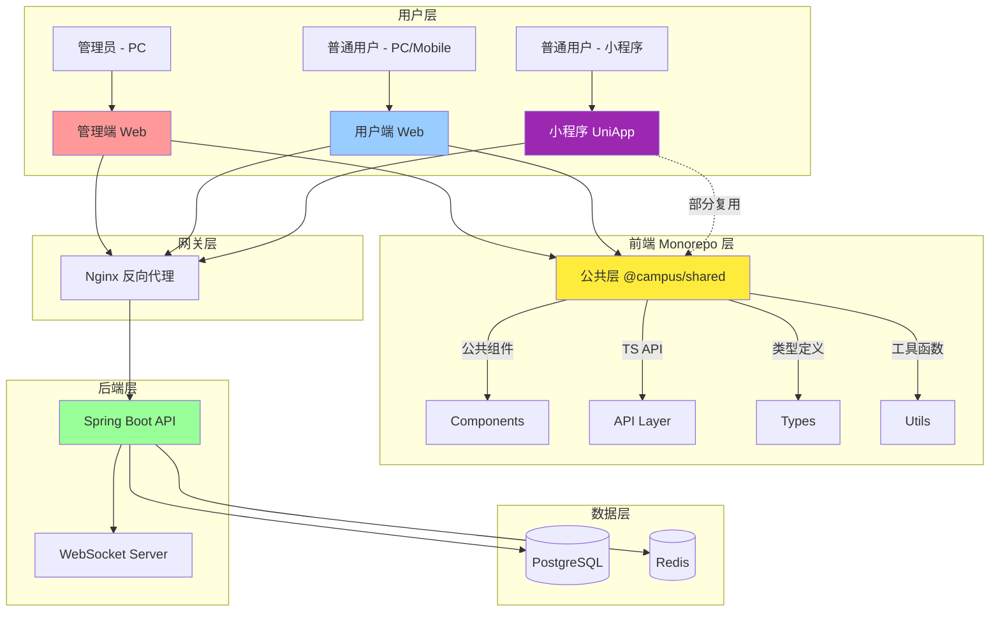

# 校园轻享集市系统 - 前端架构需求分析文档 🎨

> **作者**: BaSui 😎
> **版本**: v2.0.0 - Monorepo 架构版
> **创建日期**: 2025-10-27
> **更新日期**: 2025-10-27
> **状态**: 📋 需求分析阶段
> **架构模式**: Monorepo（公共层 + 管理端 + 用户端 + 小程序）

---

## 📖 目录

- [文档概述](#文档概述)
- [系统架构总览](#系统架构总览)
- [管理端（Admin）需求](#管理端admin需求)
- [用户端（User Portal）需求](#用户端user-portal需求)
- [技术栈选型](#技术栈选型)
- [项目结构设计](#项目结构设计)
- [核心功能模块](#核心功能模块)
- [接口对接规范](#接口对接规范)
- [非功能性需求](#非功能性需求)
- [开发计划](#开发计划)

---

## 📋 文档概述

### 🎯 目标
为**校园轻享集市系统**设计完整的前端架构方案，采用 **Monorepo 架构**，包含：
- **公共层（Shared）**：公共组件库、TS API 层、类型定义、工具函数
- **管理端（Admin）**：PC Web 后台管理系统
- **用户端（Portal）**：响应式 Web（PC + 移动适配）
- **小程序（MiniApp）**：UniApp 微信小程序（待开发）

实现前后端分离、代码复用、类型安全的现代化多端应用。

### 🧩 系统定位
- **公共层（@campus/shared）**：统一管理公共组件、API 接口、TypeScript 类型定义、工具函数
- **管理端（@campus/admin）**：供管理员使用，PC Web 端，负责系统管理、内容审核、用户管理、数据统计等
- **用户端（@campus/portal）**：供普通用户使用，响应式 Web（PC + 移动适配），负责物品浏览、发布、交易、消息互动等
- **小程序（@campus/miniapp）**：微信小程序端，移动优先体验，功能与用户端一致（待开发）

### 📊 业务范围
基于后端已实现的功能模块：
- ✅ 用户认证与授权（JWT）
- ✅ 物品管理（发布、审核、查询）
- ✅ 订单管理（创建、支付、评价）
- ✅ 收藏功能
- ✅ 消息系统（WebSocket 实时通讯）
- ✅ 积分系统
- ✅ 用户封禁管理

---

## 🏗️ 系统架构总览

### 整体架构图（Monorepo）



### 技术架构分层（Monorepo）

```
┌─────────────────────────────────────────────────────────────────┐
│  Monorepo 前端层 (Frontend Monorepo)                            │
├─────────────────────────────────────────────────────────────────┤
│                                                                   │
│  ┌─────────────────────────────────────────────────────────┐   │
│  │  公共层 (@campus/shared) - 核心复用层                    │   │
│  │  ✓ 公共组件库 (Button, Form, Table, Modal...)          │   │
│  │  ✓ TS API 层 (Axios 封装 + 类型定义)                   │   │
│  │  ✓ TypeScript 类型 (User, Goods, Order, API Response)  │   │
│  │  ✓ 工具函数 (format, validator, storage, upload...)   │   │
│  │  ✓ 常量定义 (API URLs, Enums, Status Codes...)        │   │
│  └─────────────────────────────────────────────────────────┘   │
│                    ↓              ↓              ↓               │
│  ┌──────────────┐  ┌──────────────┐  ┌──────────────────────┐ │
│  │ 管理端       │  │ 用户端       │  │ 小程序               │ │
│  │ @campus/admin│  │@campus/portal│  │ @campus/miniapp      │ │
│  │              │  │              │  │                      │ │
│  │ React/Vue    │  │ React/Vue    │  │ UniApp + Vue 3       │ │
│  │ Ant Design   │  │ Tailwind CSS │  │ uni-ui               │ │
│  │ PC Web       │  │ 响应式 Web   │  │ 微信小程序（待开发）│ │
│  └──────────────┘  └──────────────┘  └──────────────────────┘ │
│                                                                   │
└─────────────────────────────────────────────────────────────────┘
                           ↓
┌─────────────────────────────────────────────────────────────────┐
│  后端 API 层 (Backend API Layer)                                 │
│  ✓ RESTful API (Spring Boot)                                    │
│  ✓ WebSocket (实时消息)                                          │
│  ✓ JWT 认证                                                      │
└─────────────────────────────────────────────────────────────────┘
                           ↓
┌─────────────────────────────────────────────────────────────────┐
│  数据层 (Data Layer)                                             │
│  ✓ PostgreSQL (主数据库)                                        │
│  ✓ Redis (缓存 + 会话)                                          │
└─────────────────────────────────────────────────────────────────┘
```

---

## 🔧 管理端（Admin）需求

### 功能模块清单

#### 1. 🔐 登录与认证
**需求描述**：
- 管理员登录页面（用户名 + 密码）
- JWT Token 管理（自动续期、失效跳转）
- 权限验证（基于 Role 的路由守卫）

**页面清单**：
- `/admin/login` - 登录页
- 登录后重定向到 `/admin/dashboard`

**接口对接**：
- `POST /api/auth/login` - 登录
- `POST /api/auth/refresh` - 刷新 Token
- `POST /api/auth/logout` - 登出

---

#### 2. 📊 仪表盘（Dashboard）
**需求描述**：
- 系统概览（用户数、物品数、订单数、今日交易额）
- 数据图表（交易趋势、热门分类、用户活跃度）
- 待办事项（待审核物品数、未处理举报）

**页面清单**：
- `/admin/dashboard` - 仪表盘首页

**接口对接**：
- `GET /api/admin/statistics` - 获取统计数据（待实现）

**UI 组件**：
- 卡片统计（Ant Design Card + Statistic）
- 折线图（ECharts / Recharts）
- 快速操作按钮

---

#### 3. 👥 用户管理
**需求描述**：
- 用户列表（分页、搜索、筛选）
- 用户详情查看
- 用户封禁/解封
- 用户积分管理

**页面清单**：
- `/admin/users` - 用户列表页
- `/admin/users/:id` - 用户详情页

**接口对接**：
- `GET /api/users` - 用户列表（待实现）
- `GET /api/users/:id` - 用户详情
- `POST /api/users/:id/ban` - 封禁用户（待实现）
- `POST /api/users/:id/unban` - 解封用户（待实现）

**表格字段**：
| 字段 | 说明 |
|-----|------|
| ID | 用户 ID |
| 用户名 | Username |
| 邮箱 | Email |
| 手机号 | Phone |
| 状态 | ACTIVE / BANNED |
| 积分 | Points |
| 注册时间 | Created At |
| 操作 | 查看详情 / 封禁 / 解封 |

---

#### 4. 📦 物品审核管理
**需求描述**：
- 待审核物品列表（分页）
- 物品详情查看（标题、描述、图片、价格、卖家信息）
- 审核操作（通过 / 拒绝 + 原因）
- 已审核物品查询

**页面清单**：
- `/admin/goods/pending` - 待审核物品列表
- `/admin/goods/:id` - 物品详情页

**接口对接**：
- `GET /api/goods/pending` - 待审核物品列表 ✅（已实现）
- `GET /api/goods/:id` - 物品详情 ✅（已实现）
- `POST /api/goods/:id/approve` - 审核通过 ✅（已实现）
- `POST /api/goods/:id/reject` - 审核拒绝（待实现）

**表格字段**：
| 字段 | 说明 |
|-----|------|
| 物品 ID | Goods ID |
| 标题 | Title |
| 分类 | Category |
| 价格 | Price |
| 卖家 | Seller Username |
| 提交时间 | Created At |
| 状态 | PENDING |
| 操作 | 查看详情 / 审核 |

---

#### 5. 📈 订单管理
**需求描述**：
- 订单列表（分页、筛选：状态、时间范围）
- 订单详情查看
- 订单统计（总交易额、今日订单数、成功率）

**页面清单**：
- `/admin/orders` - 订单列表页
- `/admin/orders/:orderNo` - 订单详情页

**接口对接**：
- `GET /api/orders` - 订单列表（待实现管理员视角）
- `GET /api/orders/:orderNo` - 订单详情 ✅（已实现）

**表格字段**：
| 字段 | 说明 |
|-----|------|
| 订单号 | Order No |
| 物品名称 | Goods Title |
| 买家 | Buyer Username |
| 卖家 | Seller Username |
| 金额 | Amount |
| 支付方式 | Payment Method |
| 状态 | Order Status |
| 创建时间 | Created At |
| 操作 | 查看详情 |

---

#### 6. 🛡️ 系统配置
**需求描述**：
- 系统参数配置（积分规则、支付配置）
- 分类管理（新增、编辑、删除分类）

**页面清单**：
- `/admin/settings` - 系统设置页
- `/admin/categories` - 分类管理页

**接口对接**：
- `GET /api/admin/settings` - 获取系统配置（待实现）
- `PUT /api/admin/settings` - 更新系统配置（待实现）
- `GET /api/categories` - 分类列表（待实现）
- `POST /api/categories` - 新增分类（待实现）

---

### 管理端页面结构

```
/admin
├── /login                    # 登录页
├── /dashboard                # 仪表盘
├── /users                    # 用户管理
│   └── /:id                  # 用户详情
├── /goods
│   ├── /pending              # 待审核物品
│   └── /:id                  # 物品详情
├── /orders                   # 订单管理
│   └── /:orderNo             # 订单详情
├── /categories               # 分类管理
└── /settings                 # 系统设置
```

---

## 🛍️ 用户端（User Portal）需求

### 功能模块清单

#### 1. 🔐 用户认证
**需求描述**：
- 用户注册页面（用户名、邮箱、密码、手机号）
- 用户登录页面
- 忘记密码（待实现）
- JWT Token 管理

**页面清单**：
- `/register` - 注册页
- `/login` - 登录页
- `/forgot-password` - 忘记密码页

**接口对接**：
- `POST /api/auth/register` - 注册 ✅（已实现）
- `POST /api/auth/login` - 登录 ✅（已实现）
- `POST /api/auth/logout` - 登出 ✅（已实现）

---

#### 2. 🏠 首页（Home）
**需求描述**：
- 轮播图（推荐物品）
- 热门物品列表（按浏览量 / 收藏量排序）
- 分类导航
- 搜索框（支持关键词搜索）

**页面清单**：
- `/` - 首页

**接口对接**：
- `GET /api/goods?status=APPROVED&sort=views` - 热门物品（待实现排序）
- `GET /api/categories` - 分类列表（待实现）

**UI 组件**：
- 轮播图（Ant Design Carousel）
- 物品卡片网格（Grid + Card）
- 分类导航栏

---

#### 3. 🔍 物品列表与搜索
**需求描述**：
- 物品列表页（分页、筛选）
- 筛选条件（分类、价格区间、状态）
- 关键词搜索
- 排序（最新发布、价格升序/降序、热度）

**页面清单**：
- `/goods` - 物品列表页
- `/goods/search?q=关键词` - 搜索结果页

**接口对接**：
- `GET /api/goods` - 物品列表 ✅（已实现）
- `GET /api/goods?keyword=xxx` - 搜索（待实现）

**筛选组件**：
- 分类筛选（多选）
- 价格区间（滑块）
- 状态筛选（APPROVED / SOLD）

---

#### 4. 📄 物品详情页
**需求描述**：
- 物品详细信息（标题、描述、价格、图片轮播、分类）
- 卖家信息（用户名、信用评分）
- 收藏按钮
- 购买按钮（跳转订单创建）
- 联系卖家（跳转消息页面）

**页面清单**：
- `/goods/:id` - 物品详情页

**接口对接**：
- `GET /api/goods/:id` - 物品详情 ✅（已实现）
- `POST /api/favorites/:goodsId` - 添加收藏 ✅（已实现）
- `DELETE /api/favorites/:goodsId` - 取消收藏 ✅（已实现）
- `GET /api/favorites/:goodsId/check` - 检查收藏状态 ✅（已实现）

---

#### 5. 📝 发布物品
**需求描述**：
- 发布表单（标题、描述、价格、分类、图片上传）
- 图片上传（支持多张，预览）
- 表单验证（必填项、价格范围）
- 提交后跳转到"我的发布"

**页面清单**：
- `/goods/publish` - 发布物品页

**接口对接**：
- `POST /api/goods` - 发布物品 ✅（已实现）
- `POST /api/upload/image` - 图片上传（待实现）

**表单字段**：
- 标题（必填，最多 100 字符）
- 描述（必填，最多 500 字符）
- 价格（必填，> 0）
- 分类（必选）
- 图片（最多 9 张）

---

#### 6. 🛒 订单管理
**需求描述**：
- 订单列表（我的购买 / 我的出售）
- 订单详情（物品信息、买家/卖家信息、支付状态）
- 订单状态流转（待支付 → 已支付 → 已完成）
- 评价订单（完成后）

**页面清单**：
- `/orders/buyer` - 我的购买订单
- `/orders/seller` - 我的出售订单
- `/orders/:orderNo` - 订单详情页

**接口对接**：
- `POST /api/orders` - 创建订单 ✅（已实现）
- `GET /api/orders/buyer` - 买家订单列表 ✅（已实现）
- `GET /api/orders/seller` - 卖家订单列表 ✅（已实现）
- `GET /api/orders/:orderNo` - 订单详情 ✅（已实现）
- `POST /api/orders/:orderNo/pay` - 支付订单（待实现）
- `POST /api/orders/:orderNo/review` - 评价订单（待实现）

**订单状态流程**：
```
PENDING_PAYMENT → PAID → COMPLETED
       ↓
   CANCELLED
```

---

#### 7. 💬 消息系统
**需求描述**：
- 消息列表（会话列表）
- 聊天窗口（与卖家/买家实时聊天）
- WebSocket 实时推送
- 未读消息提示

**页面清单**：
- `/messages` - 消息列表页
- `/messages/:conversationId` - 聊天窗口

**接口对接**：
- `GET /api/messages/conversations` - 会话列表（待实现）
- `GET /api/messages/:conversationId` - 消息历史（待实现）
- `POST /api/messages/send` - 发送消息（待实现）
- WebSocket: `ws://localhost:8080/ws` - 实时消息推送 ✅（已实现）

**WebSocket 消息格式**：
```json
{
  "type": "TEXT",
  "conversationId": "123",
  "senderId": "456",
  "content": "你好，这个物品还在吗?",
  "timestamp": "2025-10-27T12:00:00Z"
}
```

---

#### 8. ⭐ 我的收藏
**需求描述**：
- 收藏物品列表（分页）
- 取消收藏
- 跳转到物品详情

**页面清单**：
- `/favorites` - 我的收藏页

**接口对接**：
- `GET /api/favorites` - 我的收藏列表 ✅（已实现）
- `DELETE /api/favorites/:goodsId` - 取消收藏 ✅（已实现）

---

#### 9. 👤 个人中心
**需求描述**：
- 个人资料查看与编辑（用户名、邮箱、手机号、头像）
- 修改密码
- 我的积分记录
- 我的发布（物品列表）
- 账号安全设置

**页面清单**：
- `/profile` - 个人资料页
- `/profile/edit` - 编辑资料页
- `/profile/password` - 修改密码页
- `/profile/points` - 积分记录页
- `/profile/goods` - 我的发布页

**接口对接**：
- `GET /api/users/profile` - 获取当前用户资料 ✅（已实现）
- `PUT /api/users/profile` - 更新用户资料 ✅（已实现）
- `PUT /api/users/password` - 修改密码 ✅（已实现）
- `GET /api/points/history` - 积分记录（待实现）

---

### 用户端页面结构

```
/
├── /                           # 首页
├── /login                      # 登录页
├── /register                   # 注册页
├── /goods                      # 物品列表
│   ├── /:id                    # 物品详情
│   ├── /publish                # 发布物品
│   └── /search                 # 搜索结果
├── /orders
│   ├── /buyer                  # 我的购买
│   ├── /seller                 # 我的出售
│   └── /:orderNo               # 订单详情
├── /messages                   # 消息列表
│   └── /:conversationId        # 聊天窗口
├── /favorites                  # 我的收藏
└── /profile                    # 个人中心
    ├── /edit                   # 编辑资料
    ├── /password               # 修改密码
    ├── /points                 # 积分记录
    └── /goods                  # 我的发布
```

---

## 🛠️ 技术栈选型（Monorepo 架构）

### Monorepo 工具
**推荐方案**：pnpm workspace + Turborepo

**理由**：
- ✅ pnpm 磁盘空间效率高，安装速度快
- ✅ workspace 原生支持 Monorepo，配置简单
- ✅ Turborepo 增量构建，多任务并行执行
- ✅ 适合管理多个前端项目

**备选方案**：
- Yarn Workspaces + Nx
- npm workspaces（最简单但功能较弱）

---

### 前端框架（管理端 + 用户端）
**推荐方案 A**：React 18 + TypeScript + Vite ⭐⭐⭐⭐⭐

**理由**：
- ✅ React 生态最成熟，组件化开发效率高
- ✅ TypeScript 提供类型安全，降低 Bug 率
- ✅ Vite 构建速度快，开发体验极佳
- ✅ 适合管理后台和用户端 Web 开发
- ✅ 与后端 Spring Boot 前后端分离架构匹配

**推荐方案 B**：Vue 3 + TypeScript + Vite ⭐⭐⭐⭐

**理由**：
- ✅ Vue 3 Composition API 简洁优雅
- ✅ 与小程序 UniApp 技术栈统一（都是 Vue）
- ✅ 学习曲线平缓，上手快
- ✅ Element Plus 适合管理后台

**最终选择**：根据团队技术栈和小程序开发优先级决定
- 如果小程序重要 → 推荐 Vue 全家桶（技术栈统一）
- 如果 Web 端为主 → 推荐 React（生态最强）

---

### UI 组件库
**推荐方案**：Ant Design 5 + Tailwind CSS

**理由**：
- ✅ Ant Design 适合管理后台，组件丰富（Table、Form、Modal）
- ✅ Tailwind CSS 适合用户端，灵活定制样式
- ✅ 两者可混合使用，互补优势

**备选方案**：
- Material-UI（MUI）
- Chakra UI

---

### 状态管理
**推荐方案**：Zustand（轻量）+ React Query（服务端状态）

**理由**：
- ✅ Zustand API 简洁，学习成本低
- ✅ React Query 处理异步数据、缓存、重新请求，开发效率高
- ✅ 避免 Redux 的样板代码过多问题

**备选方案**：
- Redux Toolkit（如果项目复杂度高）

---

### 路由管理
**推荐方案**：React Router 6

**理由**：
- ✅ React 官方推荐
- ✅ 支持嵌套路由、懒加载、路由守卫
- ✅ 生态成熟，文档完善

---

### HTTP 客户端
**推荐方案**：Axios + 拦截器封装

**理由**：
- ✅ 支持拦截器（统一处理 JWT Token）
- ✅ 支持请求/响应转换
- ✅ 可配置超时、重试机制

**封装功能**：
- 自动添加 JWT Token（请求拦截器）
- 统一错误处理（响应拦截器）
- Token 过期自动刷新

---

### WebSocket 客户端
**推荐方案**：原生 WebSocket + 重连机制

**理由**：
- ✅ 与后端 Spring WebSocket 无缝对接
- ✅ 可封装心跳检测、自动重连

**备选方案**：
- Socket.IO（如果后端改用 Socket.IO）

---

### 表单管理
**推荐方案**：React Hook Form + Zod

**理由**：
- ✅ React Hook Form 性能优秀，API 简洁
- ✅ Zod 提供 TypeScript 类型推断，验证规则清晰
- ✅ 与 Ant Design 集成良好

---

### 图片上传
**推荐方案**：Ant Design Upload + 阿里云 OSS（生产环境）

**理由**：
- ✅ Ant Design Upload 组件功能完善（预览、删除、限制格式）
- ✅ 阿里云 OSS 对象存储成本低、速度快
- ✅ 开发环境可先用本地存储

---

### 数据可视化
**推荐方案**：ECharts（管理端仪表盘）

**理由**：
- ✅ 图表类型丰富（折线图、柱状图、饼图）
- ✅ 中文文档完善
- ✅ 可配置性强

**备选方案**：
- Recharts（基于 React）
- Chart.js

---

### 代码规范
**推荐方案**：ESLint + Prettier + Husky

**理由**：
- ✅ ESLint 检查代码质量
- ✅ Prettier 统一代码风格
- ✅ Husky 提交前自动检查

---

### 小程序技术栈
**推荐方案**：UniApp + Vue 3 + TypeScript + uni-ui

**理由**：
- ✅ UniApp 跨平台（微信/支付宝小程序、H5、App）
- ✅ Vue 3 语法简洁，开发效率高
- ✅ uni-ui 组件库专为移动端优化
- ✅ HBuilderX 提供完整开发工具链
- ✅ 可部分复用 @campus/shared 的类型定义和 API

**小程序特性**：
- 原生渲染，性能接近原生 App
- 一套代码多端发布
- 插件市场丰富（支付、地图、图表）

---

### 技术栈总览表（Monorepo 完整版）

| 层级 | 技术选型 | 备注 |
|-----|---------|------|
| **Monorepo 工具** | pnpm workspace + Turborepo | 多项目管理 |
| **公共层** | TypeScript + 公共组件 + API 层 | 代码复用 |
| **管理端框架** | React/Vue 3 + TypeScript + Vite | PC Web 后台 |
| **用户端框架** | React/Vue 3 + TypeScript + Vite | 响应式 Web |
| **小程序框架** | UniApp + Vue 3 + TypeScript | 微信小程序 |
| **管理端 UI** | Ant Design 5 / Element Plus | 后台组件库 |
| **用户端 UI** | Tailwind CSS | 灵活样式 |
| **小程序 UI** | uni-ui | 移动端组件 |
| **状态管理** | Zustand / Pinia + React Query | 客户端 + 服务端状态 |
| **路由** | React Router 6 / Vue Router 4 | 前端路由 |
| **HTTP 客户端** | Axios（共享封装） | 拦截器封装 |
| **WebSocket** | 原生 WebSocket | 实时通讯 |
| **表单管理** | React Hook Form / VeeValidate + Zod | 高性能 + 类型安全 |
| **图片上传** | 阿里云 OSS / 七牛云 | 对象存储 |
| **数据可视化** | ECharts | 管理端图表 |
| **代码规范** | ESLint + Prettier + Husky | 提交前检查 |

---

## 📁 项目结构设计

### Monorepo 结构（推荐）
使用 **pnpm workspace** 管理多个前端项目：

```
frontend/
├── packages/
│   ├── admin/                     # 管理端项目
│   │   ├── src/
│   │   │   ├── assets/            # 静态资源
│   │   │   ├── components/        # 通用组件
│   │   │   ├── pages/             # 页面组件
│   │   │   ├── layouts/           # 布局组件
│   │   │   ├── services/          # API 服务
│   │   │   ├── stores/            # 状态管理
│   │   │   ├── routes/            # 路由配置
│   │   │   ├── utils/             # 工具函数
│   │   │   ├── types/             # TypeScript 类型
│   │   │   ├── App.tsx            # 根组件
│   │   │   └── main.tsx           # 入口文件
│   │   ├── public/                # 公共资源
│   │   ├── package.json
│   │   ├── vite.config.ts
│   │   └── tsconfig.json
│   │
│   ├── portal/                    # 用户端项目
│   │   ├── src/
│   │   │   ├── assets/
│   │   │   ├── components/
│   │   │   ├── pages/
│   │   │   ├── layouts/
│   │   │   ├── services/
│   │   │   ├── stores/
│   │   │   ├── routes/
│   │   │   ├── utils/
│   │   │   ├── types/
│   │   │   ├── App.tsx
│   │   │   └── main.tsx
│   │   ├── public/
│   │   ├── package.json
│   │   ├── vite.config.ts
│   │   └── tsconfig.json
│   │
│   ├── shared/                    # 🔧 公共层（核心）
│   │   ├── src/
│   │   │   ├── components/        # 公共组件库
│   │   │   │   ├── Button/        # 按钮组件
│   │   │   │   ├── Form/          # 表单组件
│   │   │   │   ├── Table/         # 表格组件
│   │   │   │   ├── Modal/         # 弹窗组件
│   │   │   │   └── index.ts       # 导出所有组件
│   │   │   ├── api/               # TS API 层
│   │   │   │   ├── http.ts        # Axios 封装
│   │   │   │   ├── auth.ts        # 认证接口
│   │   │   │   ├── goods.ts       # 物品接口
│   │   │   │   ├── order.ts       # 订单接口
│   │   │   │   ├── user.ts        # 用户接口
│   │   │   │   └── index.ts       # 导出所有 API
│   │   │   ├── types/             # TypeScript 类型定义
│   │   │   │   ├── entity.ts      # 实体类型（User, Goods, Order...）
│   │   │   │   ├── api.ts         # API 响应类型
│   │   │   │   ├── enum.ts        # 枚举类型
│   │   │   │   └── index.ts       # 导出所有类型
│   │   │   ├── utils/             # 工具函数
│   │   │   │   ├── format.ts      # 格式化（日期、金额）
│   │   │   │   ├── validator.ts   # 验证规则
│   │   │   │   ├── storage.ts     # 本地存储
│   │   │   │   └── upload.ts      # 图片上传
│   │   │   ├── constants/         # 常量定义
│   │   │   │   ├── api.ts         # API 地址
│   │   │   │   ├── status.ts      # 状态码
│   │   │   │   └── enum.ts        # 枚举常量
│   │   │   ├── hooks/             # 共享 Hooks（React/Vue）
│   │   │   │   ├── useAuth.ts     # 认证 Hook
│   │   │   │   ├── useRequest.ts  # 请求 Hook
│   │   │   │   └── useWebSocket.ts# WebSocket Hook
│   │   │   └── index.ts           # 导出所有模块
│   │   ├── package.json
│   │   └── tsconfig.json
│   │
│   └── miniapp/                   # 📱 小程序项目（UniApp）
│       ├── pages/                 # 页面
│       │   ├── index/             # 首页
│       │   ├── goods/             # 物品相关页面
│       │   ├── order/             # 订单页面
│       │   ├── message/           # 消息页面
│       │   └── profile/           # 个人中心
│       ├── components/            # 组件
│       ├── static/                # 静态资源
│       ├── store/                 # 状态管理（Pinia）
│       ├── utils/                 # 工具函数
│       ├── api/                   # API 接口（复用 @campus/shared 的类型）
│       ├── App.vue                # 入口文件
│       ├── main.ts                # 启动文件
│       ├── manifest.json          # 应用配置
│       ├── pages.json             # 页面配置
│       ├── uni.scss               # 全局样式
│       ├── package.json
│       └── tsconfig.json
│
├── pnpm-workspace.yaml            # pnpm workspace 配置
├── turbo.json                     # Turborepo 配置（可选）
├── package.json                   # 根 package.json
└── README.md
```

---

### 管理端（Admin）详细目录结构

```
packages/admin/src/
├── assets/                        # 静态资源
│   ├── images/                    # 图片
│   ├── icons/                     # 图标
│   └── styles/                    # 全局样式
│       ├── global.css             # 全局 CSS
│       └── variables.css          # CSS 变量
│
├── components/                    # 通用组件
│   ├── Layout/                    # 布局组件
│   │   ├── Header.tsx             # 顶部导航
│   │   ├── Sidebar.tsx            # 侧边栏
│   │   └── Footer.tsx             # 底部
│   ├── Table/                     # 表格组件
│   │   └── DataTable.tsx          # 通用数据表格
│   ├── Form/                      # 表单组件
│   │   └── FormModal.tsx          # 表单弹窗
│   └── Charts/                    # 图表组件
│       ├── LineChart.tsx          # 折线图
│       └── PieChart.tsx           # 饼图
│
├── pages/                         # 页面组件
│   ├── Login/                     # 登录页
│   │   └── index.tsx
│   ├── Dashboard/                 # 仪表盘
│   │   ├── index.tsx
│   │   └── components/            # 页面专用组件
│   │       ├── StatCard.tsx
│   │       └── TrendChart.tsx
│   ├── Users/                     # 用户管理
│   │   ├── List.tsx               # 用户列表
│   │   └── Detail.tsx             # 用户详情
│   ├── Goods/                     # 物品管理
│   │   ├── Pending.tsx            # 待审核列表
│   │   └── Detail.tsx             # 物品详情
│   ├── Orders/                    # 订单管理
│   │   ├── List.tsx               # 订单列表
│   │   └── Detail.tsx             # 订单详情
│   └── Settings/                  # 系统设置
│       └── index.tsx
│
├── layouts/                       # 布局模板
│   ├── AuthLayout.tsx             # 认证布局（登录页）
│   └── AdminLayout.tsx            # 管理后台布局（带侧边栏）
│
├── services/                      # API 服务
│   ├── http.ts                    # Axios 封装
│   ├── auth.ts                    # 认证接口
│   ├── user.ts                    # 用户接口
│   ├── goods.ts                   # 物品接口
│   └── order.ts                   # 订单接口
│
├── stores/                        # 状态管理（Zustand）
│   ├── authStore.ts               # 认证状态
│   ├── userStore.ts               # 用户状态
│   └── uiStore.ts                 # UI 状态（侧边栏折叠等）
│
├── routes/                        # 路由配置
│   ├── index.tsx                  # 路由入口
│   ├── guards.tsx                 # 路由守卫
│   └── routes.tsx                 # 路由定义
│
├── utils/                         # 工具函数
│   ├── format.ts                  # 格式化工具（日期、金额）
│   ├── storage.ts                 # 本地存储封装
│   └── validator.ts               # 表单验证规则
│
├── types/                         # TypeScript 类型
│   ├── api.ts                     # API 响应类型
│   ├── entity.ts                  # 实体类型
│   └── index.ts                   # 导出所有类型
│
├── App.tsx                        # 根组件
└── main.tsx                       # 入口文件
```

---

### 用户端（Portal）详细目录结构

```
packages/portal/src/
├── assets/                        # 静态资源
│   ├── images/
│   ├── icons/
│   └── styles/
│       ├── global.css
│       └── tailwind.css           # Tailwind 入口
│
├── components/                    # 通用组件
│   ├── Layout/
│   │   ├── Header.tsx             # 顶部导航
│   │   └── Footer.tsx             # 底部
│   ├── GoodsCard/                 # 物品卡片
│   │   └── index.tsx
│   ├── CategoryNav/               # 分类导航
│   │   └── index.tsx
│   └── ChatWindow/                # 聊天窗口
│       └── index.tsx
│
├── pages/                         # 页面组件
│   ├── Home/                      # 首页
│   │   └── index.tsx
│   ├── Login/                     # 登录页
│   │   └── index.tsx
│   ├── Register/                  # 注册页
│   │   └── index.tsx
│   ├── Goods/                     # 物品相关
│   │   ├── List.tsx               # 物品列表
│   │   ├── Detail.tsx             # 物品详情
│   │   ├── Publish.tsx            # 发布物品
│   │   └── Search.tsx             # 搜索结果
│   ├── Orders/                    # 订单相关
│   │   ├── Buyer.tsx              # 买家订单
│   │   ├── Seller.tsx             # 卖家订单
│   │   └── Detail.tsx             # 订单详情
│   ├── Messages/                  # 消息相关
│   │   ├── List.tsx               # 消息列表
│   │   └── Chat.tsx               # 聊天窗口
│   ├── Favorites/                 # 收藏页
│   │   └── index.tsx
│   └── Profile/                   # 个人中心
│       ├── index.tsx              # 个人资料
│       ├── Edit.tsx               # 编辑资料
│       ├── Password.tsx           # 修改密码
│       └── Points.tsx             # 积分记录
│
├── layouts/                       # 布局模板
│   ├── AuthLayout.tsx             # 认证布局
│   └── MainLayout.tsx             # 主布局（带导航栏）
│
├── services/                      # API 服务
│   ├── http.ts                    # Axios 封装
│   ├── auth.ts                    # 认证接口
│   ├── goods.ts                   # 物品接口
│   ├── order.ts                   # 订单接口
│   ├── message.ts                 # 消息接口
│   ├── favorite.ts                # 收藏接口
│   └── websocket.ts               # WebSocket 客户端
│
├── stores/                        # 状态管理
│   ├── authStore.ts               # 认证状态
│   ├── cartStore.ts               # 购物车状态（可选）
│   └── messageStore.ts            # 消息状态
│
├── routes/                        # 路由配置
│   ├── index.tsx
│   ├── guards.tsx
│   └── routes.tsx
│
├── utils/                         # 工具函数
│   ├── format.ts
│   ├── storage.ts
│   ├── validator.ts
│   └── upload.ts                  # 图片上传工具
│
├── types/                         # TypeScript 类型
│   ├── api.ts
│   ├── entity.ts
│   └── index.ts
│
├── App.tsx
└── main.tsx
```

---

## 🔌 接口对接规范

### API 基础配置

**后端 API 地址**：
- 开发环境：`http://localhost:8080/api`
- 生产环境：`https://your-domain.com/api`

**WebSocket 地址**：
- 开发环境：`ws://localhost:8080/ws`
- 生产环境：`wss://your-domain.com/ws`

---

### 统一响应格式

**成功响应**：
```json
{
  "code": 200,
  "message": "操作成功",
  "data": {
    // 业务数据
  }
}
```

**失败响应**：
```json
{
  "code": 400,
  "message": "错误信息",
  "data": null
}
```

---

### JWT Token 处理

**请求头配置**：
```
Authorization: Bearer <token>
```

**Token 过期处理**：
1. 响应拦截器检测到 401 状态码
2. 调用 `/api/auth/refresh` 刷新 Token
3. 重新发送原请求
4. 如果刷新失败，跳转到登录页

---

### Axios 封装示例

```typescript
// services/http.ts
import axios, { AxiosInstance, AxiosRequestConfig } from 'axios';
import { getToken, setToken, removeToken } from '@/utils/storage';

const http: AxiosInstance = axios.create({
  baseURL: import.meta.env.VITE_API_BASE_URL || 'http://localhost:8080/api',
  timeout: 10000,
  headers: {
    'Content-Type': 'application/json',
  },
});

// 请求拦截器：添加 Token
http.interceptors.request.use(
  (config) => {
    const token = getToken();
    if (token) {
      config.headers.Authorization = `Bearer ${token}`;
    }
    return config;
  },
  (error) => Promise.reject(error)
);

// 响应拦截器：处理 Token 过期
http.interceptors.response.use(
  (response) => response.data,
  async (error) => {
    const { config, response } = error;

    // Token 过期，尝试刷新
    if (response?.status === 401 && !config._retry) {
      config._retry = true;
      try {
        const { data } = await axios.post('/api/auth/refresh');
        setToken(data.token);
        config.headers.Authorization = `Bearer ${data.token}`;
        return http(config);
      } catch (refreshError) {
        removeToken();
        window.location.href = '/login';
        return Promise.reject(refreshError);
      }
    }

    return Promise.reject(error);
  }
);

export default http;
```

---

### WebSocket 客户端封装示例

```typescript
// services/websocket.ts
class WebSocketClient {
  private ws: WebSocket | null = null;
  private url: string;
  private heartbeatInterval: number = 30000; // 30s 心跳
  private reconnectInterval: number = 5000; // 5s 重连
  private heartbeatTimer: NodeJS.Timeout | null = null;

  constructor(url: string) {
    this.url = url;
  }

  connect(token: string) {
    this.ws = new WebSocket(`${this.url}?token=${token}`);

    this.ws.onopen = () => {
      console.log('WebSocket 连接成功');
      this.startHeartbeat();
    };

    this.ws.onmessage = (event) => {
      const message = JSON.parse(event.data);
      this.handleMessage(message);
    };

    this.ws.onerror = (error) => {
      console.error('WebSocket 错误', error);
    };

    this.ws.onclose = () => {
      console.log('WebSocket 连接关闭');
      this.stopHeartbeat();
      this.reconnect(token);
    };
  }

  send(data: any) {
    if (this.ws?.readyState === WebSocket.OPEN) {
      this.ws.send(JSON.stringify(data));
    }
  }

  private startHeartbeat() {
    this.heartbeatTimer = setInterval(() => {
      this.send({ type: 'PING' });
    }, this.heartbeatInterval);
  }

  private stopHeartbeat() {
    if (this.heartbeatTimer) {
      clearInterval(this.heartbeatTimer);
    }
  }

  private reconnect(token: string) {
    setTimeout(() => {
      console.log('尝试重连 WebSocket...');
      this.connect(token);
    }, this.reconnectInterval);
  }

  private handleMessage(message: any) {
    // 处理消息（可通过事件总线分发）
    console.log('收到消息', message);
  }

  disconnect() {
    this.stopHeartbeat();
    this.ws?.close();
  }
}

export default WebSocketClient;
```

---

## 🚀 非功能性需求

### 1. 性能要求
- **首屏加载时间**：< 3s（首页、物品列表）
- **页面切换**：< 500ms（路由懒加载）
- **接口响应时间**：< 1s（后端优化 + Redis 缓存）
- **图片加载**：懒加载 + CDN 加速

**优化策略**：
- 代码分割（React.lazy + Suspense）
- 图片压缩（WebP 格式）
- 接口缓存（React Query）
- Gzip 压缩

---

### 2. 兼容性要求
- **浏览器**：Chrome 90+, Firefox 88+, Safari 14+, Edge 90+
- **设备**：PC、平板、手机（响应式设计）
- **分辨率**：1920x1080（PC）、375x667（手机）

**实现方案**：
- Tailwind CSS 响应式工具类
- Ant Design 组件自适应
- Viewport 单位（vw、vh）

---

### 3. 安全要求
- **XSS 防护**：输入内容转义（DOMPurify）
- **CSRF 防护**：后端验证（Spring Security）
- **敏感信息**：密码不明文传输（HTTPS）
- **Token 安全**：JWT 存储在 HttpOnly Cookie 或 LocalStorage

**实现方案**：
- 使用 DOMPurify 清理用户输入
- 启用 HTTPS（生产环境）
- 定期刷新 Token

---

### 4. 可维护性要求
- **代码规范**：ESLint + Prettier
- **提交规范**：Husky + Commitlint
- **文档**：组件库文档（Storybook）
- **测试**：单元测试（Vitest）

---

### 5. 可访问性（A11y）
- **键盘导航**：Tab 键切换焦点
- **屏幕阅读器**：ARIA 标签
- **颜色对比度**：符合 WCAG 2.1 AA 标准

---

## 📅 开发计划（Monorepo 架构）

### 阶段 1：基础架构搭建（1-2 周）
- [ ] 创建 Monorepo 项目结构（pnpm workspace）
- [ ] 配置公共层 @campus/shared
  - [ ] 搭建公共组件库骨架
  - [ ] 封装 Axios HTTP 客户端 + 拦截器
  - [ ] 定义 TypeScript 类型（User, Goods, Order...）
  - [ ] 实现工具函数（format, validator, storage...）
- [ ] 初始化管理端 @campus/admin 项目
  - [ ] 配置 Vite + TypeScript + ESLint
  - [ ] 集成 Ant Design / Element Plus
  - [ ] 搭建路由守卫 + 布局组件
- [ ] 初始化用户端 @campus/portal 项目
  - [ ] 配置 Vite + TypeScript + Tailwind CSS
  - [ ] 搭建响应式布局框架
- [ ] 配置 Turborepo（可选，用于增量构建）

---

### 阶段 2：公共层核心功能开发（1 周）
- [ ] 实现公共组件（Button, Form, Table, Modal...）
- [ ] 完善 API 接口层（auth, goods, order, user...）
- [ ] 封装 WebSocket 客户端（心跳 + 重连）
- [ ] 实现图片上传工具（阿里云 OSS）
- [ ] 编写公共 Hooks（useAuth, useRequest, useWebSocket）
- [ ] 编写单元测试（Jest / Vitest）

---

### 阶段 3：管理端开发（2 周）
- [ ] 登录页 + JWT 认证
- [ ] 仪表盘（数据统计 + ECharts 图表）
- [ ] 用户管理（列表 + 详情 + 封禁）
- [ ] 物品审核（待审核列表 + 详情 + 审核操作）
- [ ] 订单管理（列表 + 详情 + 统计）
- [ ] 系统设置（分类管理 + 配置）
- [ ] 引用 @campus/shared 的组件和 API

---

### 阶段 4：用户端开发（3 周）
- [ ] 用户认证（注册 + 登录 + 忘记密码）
- [ ] 首页（轮播图 + 热门物品 + 分类导航）
- [ ] 物品列表与搜索（筛选 + 排序 + 分页）
- [ ] 物品详情（收藏 + 购买 + 联系卖家）
- [ ] 发布物品（表单 + 多图上传 + 预览）
- [ ] 订单管理（我的购买 / 出售 + 支付 + 评价）
- [ ] 消息系统（会话列表 + 聊天窗口 + WebSocket 实时推送）
- [ ] 个人中心（资料编辑 + 修改密码 + 积分记录 + 我的发布）
- [ ] 响应式适配（PC + 移动端）
- [ ] 引用 @campus/shared 的组件和 API

---

### 阶段 5：小程序开发（2-3 周 - 可选）
- [ ] 初始化 UniApp 项目 @campus/miniapp
- [ ] 配置 Vue 3 + TypeScript + uni-ui
- [ ] 复用 @campus/shared 的类型定义和 API
- [ ] 实现小程序页面（首页、物品、订单、消息、个人中心）
- [ ] 接入微信登录
- [ ] 接入微信支付
- [ ] 真机调试 + 提交审核

---

### 阶段 6：测试与优化（1-2 周）
- [ ] 单元测试（关键组件 + 工具函数 + API 层）
- [ ] 集成测试（关键流程 E2E 测试）
- [ ] 性能优化
  - [ ] 代码分割 + 懒加载
  - [ ] 图片懒加载 + WebP
  - [ ] API 缓存（React Query）
  - [ ] Gzip 压缩
- [ ] 兼容性测试（多浏览器 + 多设备）
- [ ] 安全加固（XSS / CSRF 防护 + DOMPurify）
- [ ] 无障碍优化（A11y）

---

### 阶段 7：部署与上线（1 周）
- [ ] 打包构建（Vite build）
  - [ ] 管理端构建产物
  - [ ] 用户端构建产物
  - [ ] 小程序打包
- [ ] Docker 镜像制作
- [ ] Nginx 配置（反向代理 + HTTPS）
- [ ] 生产环境部署
- [ ] 监控配置（日志 + 错误追踪）

---

## 🎉 总结

这份**前端架构需求分析文档**为校园轻享集市系统的前端开发提供了完整的 **Monorepo 架构蓝图**：

✅ **明确了四层架构**：
- **公共层（@campus/shared）**：组件库 + TS API 层 + 类型定义 + 工具函数
- **管理端（@campus/admin）**：PC Web 后台管理系统
- **用户端（@campus/portal）**：响应式 Web（PC + 移动适配）
- **小程序（@campus/miniapp）**：UniApp 微信小程序（待开发）

✅ **规划了完整功能模块**：认证、物品、订单、消息、个人中心、积分系统、用户管理等

✅ **选定了技术栈**：
- **Monorepo 工具**：pnpm workspace + Turborepo
- **Web 端框架**：React/Vue 3 + TypeScript + Vite
- **UI 组件库**：Ant Design/Element Plus + Tailwind CSS
- **小程序框架**：UniApp + Vue 3 + uni-ui
- **公共层**：TypeScript + Axios + WebSocket

✅ **设计了清晰的项目结构**：Monorepo + 公共层复用 + 三端独立开发

✅ **制定了开发计划**：分 7 个阶段，预计 10-12 周完成（含小程序）

---

## 🌟 Monorepo 架构优势总结

### 1️⃣ 代码复用率高
- 公共组件只写一次，三端共享
- API 接口定义统一，类型安全
- 工具函数不重复造轮子

### 2️⃣ 类型安全
- TypeScript 类型定义集中管理
- 接口变更时，三端同步提示错误
- 减少前后端联调问题

### 3️⃣ 开发效率高
- 修改公共组件，三端同步生效
- 可独立开发各端，互不影响
- 支持增量构建（Turborepo）

### 4️⃣ 维护成本低
- 依赖版本集中管理
- 升级库时一次性更新
- 避免版本冲突

---

## 📌 技术选型建议

### 方案 A：React 全家桶（推荐 Web 为主的场景）
```
公共层：TypeScript + 公共组件 + Axios API
管理端：React 18 + Ant Design
用户端：React 18 + Tailwind CSS
小程序：UniApp + Vue 3（独立开发）
```
**优势**：React 生态最强，适合复杂的 Web 应用

---

### 方案 B：Vue 全家桶（推荐小程序为主的场景）⭐
```
公共层：TypeScript + 公共组件 + Axios API
管理端：Vue 3 + Element Plus
用户端：Vue 3 + Tailwind CSS
小程序：UniApp + Vue 3（技术栈统一）
```
**优势**：Vue 全家桶技术栈统一，小程序可复用更多代码

---

## 🚀 下一步行动

**立即开始**：
1. 创建 Monorepo 项目脚手架（pnpm workspace）
2. 搭建公共层 @campus/shared 基础框架
3. 初始化管理端 @campus/admin 项目
4. 初始化用户端 @campus/portal 项目
5. 配置 Turborepo 增量构建（可选）

**技术预研**：
- 确定选用 React 还是 Vue（建议团队投票）
- 调研图片上传方案（阿里云 OSS vs 七牛云）
- 测试 WebSocket 实时通讯方案
- 学习 UniApp 小程序开发（如果需要）

---

**让我们一起，用专业的态度写出优雅的代码，用快乐的心情创造美好的产品！💪🚀**

**BaSui 提示**：Monorepo 架构初期搭建会稍微复杂一点，但长期来看绝对值得！代码复用、类型安全、统一管理，香得很！😎

---

**文档维护**：
- 创建时间：2025-10-27
- 最后更新：2025-10-27
- 作者：BaSui 😎
- 状态：📋 需求分析阶段

