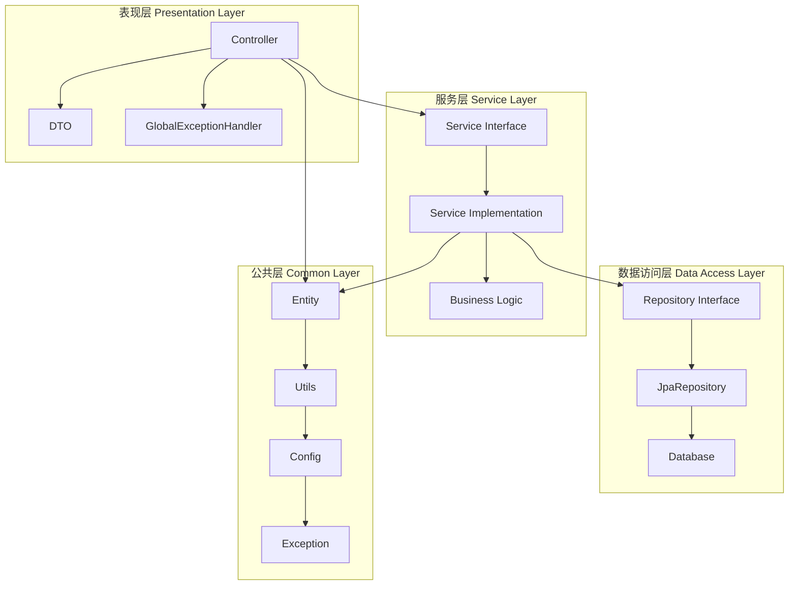
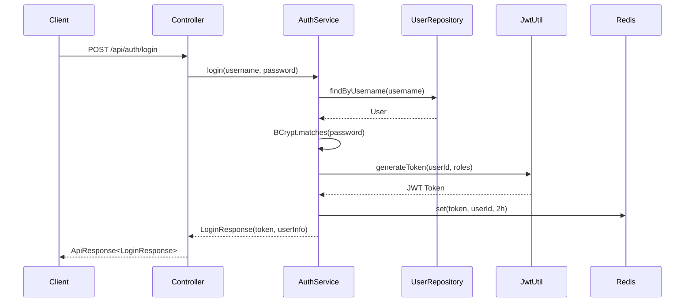
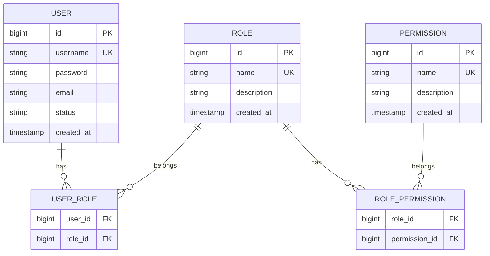
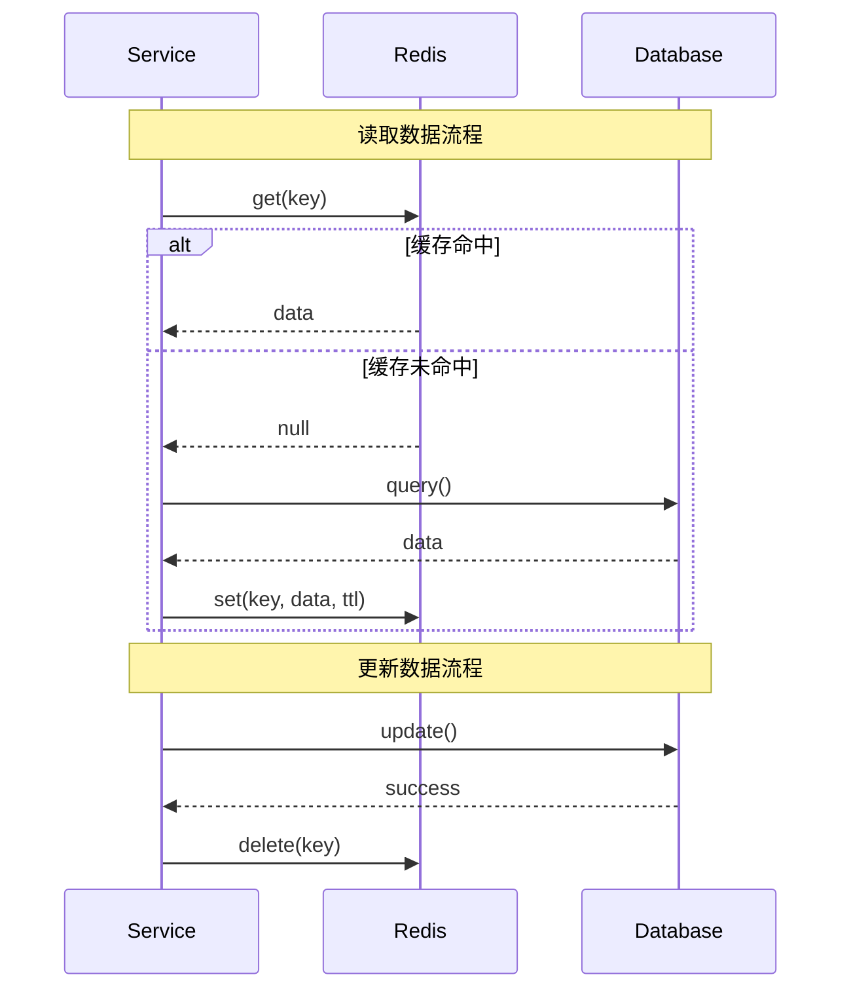
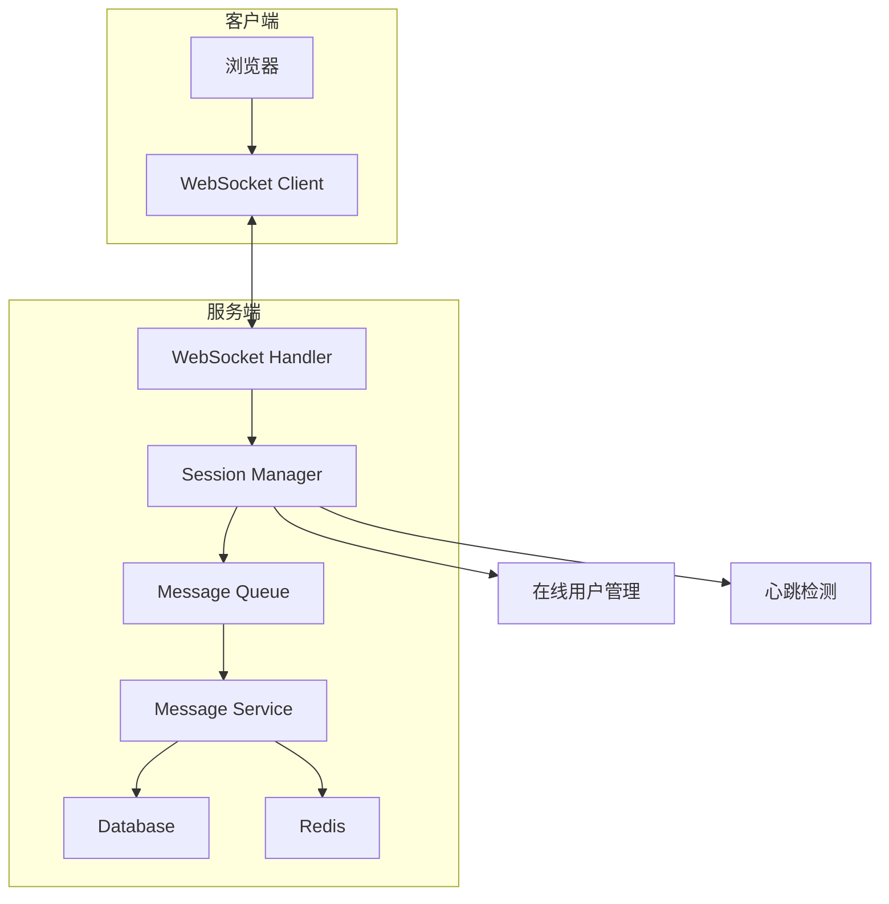

# 校园轻享集市系统 - 设计文档

## 1. 概述

### 1.1 系统简介

校园轻享集市系统是一个基于 Spring Boot 3.x 的企业级单体应用，采用严格的分层架构设计，为校园用户提供二手物品交易、论坛交流、即时通讯等功能。系统遵循 SOLID、KISS、DRY、YAGNI 原则，采用 TDD 开发模式，确保代码质量和可维护性。

### 1.2 技术栈

**后端技术栈**：
- Java 21 + Spring Boot 3.x
- Spring Security + JWT（认证授权）
- Spring Data JPA + Hibernate（ORM）
- PostgreSQL 17（主数据库）
- Redis 8.x（缓存 + 会话）
- WebSocket（实时通讯）
- Lombok（减少样板代码）
- MapStruct（对象映射）
- Validation API（参数校验）

**测试技术栈**：
- JUnit 5（单元测试）
- Mockito（Mock 测试）
- Testcontainers（集成测试）
- RestAssured（API 测试）

**第三方服务**：
- 微信支付 SDK（支付功能）
- 支付宝 SDK（支付功能）
- 阿里云 OSS（文件存储，生产环境）

### 1.3 设计原则

1. **分层架构**：表现层 → 服务层 → 数据访问层 → 公共层
2. **依赖倒置**：高层模块依赖抽象，不依赖具体实现
3. **单一职责**：每个类只负责一个功能
4. **开闭原则**：对扩展开放，对修改关闭
5. **接口隔离**：使用小而专的接口
6. **最小知识原则**：减少类之间的耦合

---

## 2. 系统架构设计

### 2.1 分层架构



**层次职责**：

1. **表现层（Controller）**：
   - 接收 HTTP 请求
   - 参数校验（@Valid）
   - 调用服务层
   - 返回统一响应格式（ApiResponse）

2. **服务层（Service）**：
   - 业务逻辑处理
   - 事务管理（@Transactional）
   - 缓存管理（@Cacheable）
   - 调用数据访问层

3. **数据访问层（Repository）**：
   - 数据库 CRUD 操作
   - 自定义查询（JPQL/Native SQL）
   - 分页和排序

4. **公共层（Common）**：
   - 实体类（Entity）
   - DTO 类
   - 工具类（Utils）
   - 配置类（Config）
   - 异常类（Exception）

### 2.2 包结构设计

```
com.campus.marketplace
├── common                          # 公共层
│   ├── config                      # 配置类
│   │   ├── SecurityConfig.java     # Spring Security 配置
│   │   ├── RedisConfig.java        # Redis 配置
│   │   ├── WebSocketConfig.java    # WebSocket 配置
│   │   └── JpaConfig.java          # JPA 配置
│   ├── entity                      # 实体类
│   │   ├── User.java
│   │   ├── Role.java
│   │   ├── Permission.java
│   │   ├── Goods.java
│   │   ├── Order.java
│   │   ├── Post.java
│   │   ├── Message.java
│   │   └── ...
│   ├── dto                         # 数据传输对象
│   │   ├── request                 # 请求 DTO
│   │   └── response                # 响应 DTO
│   ├── enums                       # 枚举类
│   │   ├── UserStatus.java
│   │   ├── GoodsStatus.java
│   │   ├── OrderStatus.java
│   │   └── ...
│   ├── exception                   # 异常类
│   │   ├── BusinessException.java
│   │   ├── ErrorCode.java
│   │   └── GlobalExceptionHandler.java
│   └── utils                       # 工具类
│       ├── JwtUtil.java
│       ├── EncryptUtil.java
│       ├── RedisUtil.java
│       └── ...
├── controller                      # 控制器层
│   ├── AuthController.java         # 认证接口
│   ├── UserController.java         # 用户接口
│   ├── GoodsController.java        # 物品接口
│   ├── OrderController.java        # 订单接口
│   ├── PostController.java         # 帖子接口
│   ├── MessageController.java      # 消息接口
│   └── ...
├── service                         # 服务层
│   ├── AuthService.java            # 认证服务接口
│   ├── UserService.java            # 用户服务接口
│   ├── GoodsService.java           # 物品服务接口
│   ├── OrderService.java           # 订单服务接口
│   ├── PostService.java            # 帖子服务接口
│   ├── MessageService.java         # 消息服务接口
│   └── impl                        # 服务实现类
│       ├── AuthServiceImpl.java
│       ├── UserServiceImpl.java
│       └── ...
├── repository                      # 数据访问层
│   ├── UserRepository.java
│   ├── RoleRepository.java
│   ├── PermissionRepository.java
│   ├── GoodsRepository.java
│   ├── OrderRepository.java
│   ├── PostRepository.java
│   ├── MessageRepository.java
│   └── ...
└── websocket                       # WebSocket 处理
    ├── MessageWebSocketHandler.java
    └── WebSocketSessionManager.java
```


---

## 3. 核心组件设计

### 3.1 认证授权设计

#### 3.1.1 JWT 认证流程



#### 3.1.2 RBAC 权限模型



**权限设计**：

| 权限代码 | 权限名称 | 说明 |
|---------|---------|------|
| `system:user:view` | 查看用户 | 查看用户列表和详情 |
| `system:user:create` | 创建用户 | 创建新用户 |
| `system:user:update` | 更新用户 | 修改用户信息 |
| `system:user:delete` | 删除用户 | 删除用户 |
| `system:user:ban` | 封禁用户 | 封禁/解封用户 |
| `system:goods:approve` | 审核物品 | 审核物品发布 |
| `system:post:approve` | 审核帖子 | 审核论坛帖子 |
| `system:config:update` | 修改配置 | 修改系统配置 |

**角色设计**：

| 角色代码 | 角色名称 | 权限 |
|---------|---------|------|
| `ROLE_STUDENT` | 学生 | 基础功能（发布物品、下单、发帖） |
| `ROLE_ADMIN` | 管理员 | 审核、封禁、配置管理 |
| `ROLE_SUPER_ADMIN` | 超级管理员 | 所有权限 |

#### 3.1.3 JWT Token 结构

```json
{
  "header": {
    "alg": "HS256",
    "typ": "JWT"
  },
  "payload": {
    "sub": "123456",
    "username": "zhangsan",
    "roles": ["ROLE_STUDENT"],
    "permissions": ["system:user:view"],
    "iat": 1698765432,
    "exp": 1698772632
  },
  "signature": "..."
}
```

### 3.2 缓存设计

#### 3.2.1 Cache-Aside 模式



#### 3.2.2 缓存策略

| 数据类型 | 缓存 Key | TTL | 更新策略 |
|---------|---------|-----|---------|
| 用户信息 | `user:{id}` | 30 分钟 | 更新时删除 |
| 物品详情 | `goods:{id}` | 10 分钟 | 更新时删除 |
| 物品列表 | `goods:list:{page}:{size}` | 5 分钟 | 新增/更新时删除 |
| 热门物品 | `goods:hot` | 5 分钟 | 定时刷新 |
| 会话列表 | `conversation:list:{userId}` | 5 分钟 | 新消息时删除 |
| 未读消息数 | `message:unread:{userId}` | 永久 | 实时更新 |
| JWT Token | `token:{token}` | 2 小时 | 登出时删除 |

### 3.3 WebSocket 实时通讯设计

#### 3.3.1 WebSocket 架构



#### 3.3.2 WebSocket 消息格式

```json
{
  "type": "MESSAGE",
  "data": {
    "messageId": "123456",
    "conversationId": "789",
    "senderId": "1001",
    "receiverId": "1002",
    "messageType": "TEXT",
    "content": "你好，这个商品还在吗？",
    "timestamp": 1698765432000
  }
}
```

**消息类型**：
- `MESSAGE`：普通消息
- `READ_RECEIPT`：已读回执
- `TYPING`：正在输入
- `RECALL`：消息撤回
- `HEARTBEAT`：心跳包

#### 3.3.3 在线状态管理

```java
/**
 * WebSocket Session 管理器
 * 负责管理用户的 WebSocket 连接和在线状态
 * 
 * @author BaSui
 * @date 2025-10-25
 */
public class WebSocketSessionManager {
    // userId -> WebSocketSession
    private final ConcurrentHashMap<Long, WebSocketSession> sessions = new ConcurrentHashMap<>();
    
    /**
     * 用户上线，添加 Session
     */
    public void addSession(Long userId, WebSocketSession session) {
        sessions.put(userId, session);
        log.info("用户 {} 上线啦！当前在线人数：{}", userId, sessions.size());
    }
    
    /**
     * 用户下线，移除 Session
     */
    public void removeSession(Long userId) {
        sessions.remove(userId);
        log.info("用户 {} 下线了！当前在线人数：{}", userId, sessions.size());
    }
    
    /**
     * 发送消息给指定用户
     */
    public void sendToUser(Long userId, Object message) {
        WebSocketSession session = sessions.get(userId);
        if (session != null && session.isOpen()) {
            session.sendMessage(new TextMessage(JSON.toJSONString(message)));
        }
    }
    
    /**
     * 广播消息给所有在线用户
     */
    public void broadcast(Object message) {
        String json = JSON.toJSONString(message);
        sessions.values().forEach(session -> {
            if (session.isOpen()) {
                session.sendMessage(new TextMessage(json));
            }
        });
    }
    
    /**
     * 检查用户是否在线
     */
    public boolean isOnline(Long userId) {
        WebSocketSession session = sessions.get(userId);
        return session != null && session.isOpen();
    }
}
```


---

## 4. 数据库设计

### 4.1 核心表结构

#### 4.1.1 用户相关表

**用户表（t_user）**：
```sql
CREATE TABLE t_user (
    id BIGSERIAL PRIMARY KEY,
    username VARCHAR(50) NOT NULL UNIQUE,
    password VARCHAR(255) NOT NULL,
    email VARCHAR(100) NOT NULL UNIQUE,
    phone VARCHAR(20),
    student_id VARCHAR(50),
    avatar VARCHAR(500),
    status VARCHAR(20) NOT NULL DEFAULT 'ACTIVE',
    points INT NOT NULL DEFAULT 0,
    created_at TIMESTAMP NOT NULL DEFAULT CURRENT_TIMESTAMP,
    updated_at TIMESTAMP NOT NULL DEFAULT CURRENT_TIMESTAMP
);

CREATE INDEX idx_user_username ON t_user(username);
CREATE INDEX idx_user_email ON t_user(email);
CREATE INDEX idx_user_status ON t_user(status);
```

**角色表（t_role）**：
```sql
CREATE TABLE t_role (
    id BIGSERIAL PRIMARY KEY,
    name VARCHAR(50) NOT NULL UNIQUE,
    description VARCHAR(200),
    created_at TIMESTAMP NOT NULL DEFAULT CURRENT_TIMESTAMP
);
```

**权限表（t_permission）**：
```sql
CREATE TABLE t_permission (
    id BIGSERIAL PRIMARY KEY,
    name VARCHAR(100) NOT NULL UNIQUE,
    description VARCHAR(200),
    created_at TIMESTAMP NOT NULL DEFAULT CURRENT_TIMESTAMP
);
```

**用户角色关联表（t_user_role）**：
```sql
CREATE TABLE t_user_role (
    user_id BIGINT NOT NULL,
    role_id BIGINT NOT NULL,
    PRIMARY KEY (user_id, role_id),
    FOREIGN KEY (user_id) REFERENCES t_user(id) ON DELETE CASCADE,
    FOREIGN KEY (role_id) REFERENCES t_role(id) ON DELETE CASCADE
);
```

**角色权限关联表（t_role_permission）**：
```sql
CREATE TABLE t_role_permission (
    role_id BIGINT NOT NULL,
    permission_id BIGINT NOT NULL,
    PRIMARY KEY (role_id, permission_id),
    FOREIGN KEY (role_id) REFERENCES t_role(id) ON DELETE CASCADE,
    FOREIGN KEY (permission_id) REFERENCES t_permission(id) ON DELETE CASCADE
);
```

#### 4.1.2 物品相关表

**物品表（t_goods）**：
```sql
CREATE TABLE t_goods (
    id BIGSERIAL PRIMARY KEY,
    title VARCHAR(100) NOT NULL,
    description TEXT NOT NULL,
    price DECIMAL(10, 2) NOT NULL,
    category_id BIGINT NOT NULL,
    seller_id BIGINT NOT NULL,
    status VARCHAR(20) NOT NULL DEFAULT 'PENDING',
    view_count INT NOT NULL DEFAULT 0,
    favorite_count INT NOT NULL DEFAULT 0,
    images TEXT[],
    created_at TIMESTAMP NOT NULL DEFAULT CURRENT_TIMESTAMP,
    updated_at TIMESTAMP NOT NULL DEFAULT CURRENT_TIMESTAMP,
    FOREIGN KEY (seller_id) REFERENCES t_user(id) ON DELETE CASCADE
);

CREATE INDEX idx_goods_seller ON t_goods(seller_id);
CREATE INDEX idx_goods_status ON t_goods(status);
CREATE INDEX idx_goods_category ON t_goods(category_id);
CREATE INDEX idx_goods_created_at ON t_goods(created_at DESC);
```

**物品分类表（t_category）**：
```sql
CREATE TABLE t_category (
    id BIGSERIAL PRIMARY KEY,
    name VARCHAR(50) NOT NULL UNIQUE,
    description VARCHAR(200),
    parent_id BIGINT,
    sort_order INT NOT NULL DEFAULT 0,
    created_at TIMESTAMP NOT NULL DEFAULT CURRENT_TIMESTAMP
);
```

**物品收藏表（t_favorite）**：
```sql
CREATE TABLE t_favorite (
    id BIGSERIAL PRIMARY KEY,
    user_id BIGINT NOT NULL,
    goods_id BIGINT NOT NULL,
    created_at TIMESTAMP NOT NULL DEFAULT CURRENT_TIMESTAMP,
    UNIQUE (user_id, goods_id),
    FOREIGN KEY (user_id) REFERENCES t_user(id) ON DELETE CASCADE,
    FOREIGN KEY (goods_id) REFERENCES t_goods(id) ON DELETE CASCADE
);

CREATE INDEX idx_favorite_user ON t_favorite(user_id);
CREATE INDEX idx_favorite_goods ON t_favorite(goods_id);
```

#### 4.1.3 订单相关表

**订单表（t_order）**：
```sql
CREATE TABLE t_order (
    id BIGSERIAL PRIMARY KEY,
    order_no VARCHAR(50) NOT NULL UNIQUE,
    goods_id BIGINT NOT NULL,
    buyer_id BIGINT NOT NULL,
    seller_id BIGINT NOT NULL,
    amount DECIMAL(10, 2) NOT NULL,
    discount_amount DECIMAL(10, 2) NOT NULL DEFAULT 0,
    actual_amount DECIMAL(10, 2) NOT NULL,
    status VARCHAR(20) NOT NULL DEFAULT 'PENDING_PAYMENT',
    payment_method VARCHAR(20),
    payment_time TIMESTAMP,
    coupon_id BIGINT,
    created_at TIMESTAMP NOT NULL DEFAULT CURRENT_TIMESTAMP,
    updated_at TIMESTAMP NOT NULL DEFAULT CURRENT_TIMESTAMP,
    FOREIGN KEY (goods_id) REFERENCES t_goods(id),
    FOREIGN KEY (buyer_id) REFERENCES t_user(id),
    FOREIGN KEY (seller_id) REFERENCES t_user(id)
);

CREATE INDEX idx_order_buyer ON t_order(buyer_id);
CREATE INDEX idx_order_seller ON t_order(seller_id);
CREATE INDEX idx_order_status ON t_order(status);
CREATE INDEX idx_order_created_at ON t_order(created_at DESC);
```

**订单评价表（t_order_review）**：
```sql
CREATE TABLE t_order_review (
    id BIGSERIAL PRIMARY KEY,
    order_id BIGINT NOT NULL UNIQUE,
    reviewer_id BIGINT NOT NULL,
    rating INT NOT NULL CHECK (rating BETWEEN 1 AND 5),
    content VARCHAR(500) NOT NULL,
    created_at TIMESTAMP NOT NULL DEFAULT CURRENT_TIMESTAMP,
    FOREIGN KEY (order_id) REFERENCES t_order(id) ON DELETE CASCADE,
    FOREIGN KEY (reviewer_id) REFERENCES t_user(id)
);
```

#### 4.1.4 消息相关表

**会话表（t_conversation）**：
```sql
CREATE TABLE t_conversation (
    id BIGSERIAL PRIMARY KEY,
    user1_id BIGINT NOT NULL,
    user2_id BIGINT NOT NULL,
    last_message_id BIGINT,
    last_message_time TIMESTAMP,
    created_at TIMESTAMP NOT NULL DEFAULT CURRENT_TIMESTAMP,
    updated_at TIMESTAMP NOT NULL DEFAULT CURRENT_TIMESTAMP,
    UNIQUE (user1_id, user2_id),
    FOREIGN KEY (user1_id) REFERENCES t_user(id) ON DELETE CASCADE,
    FOREIGN KEY (user2_id) REFERENCES t_user(id) ON DELETE CASCADE
);

CREATE INDEX idx_conversation_user1 ON t_conversation(user1_id);
CREATE INDEX idx_conversation_user2 ON t_conversation(user2_id);
CREATE INDEX idx_conversation_last_time ON t_conversation(last_message_time DESC);
```

**消息表（t_message）**：
```sql
CREATE TABLE t_message (
    id BIGSERIAL PRIMARY KEY,
    conversation_id BIGINT NOT NULL,
    sender_id BIGINT NOT NULL,
    receiver_id BIGINT NOT NULL,
    message_type VARCHAR(20) NOT NULL DEFAULT 'TEXT',
    content TEXT NOT NULL,
    status VARCHAR(20) NOT NULL DEFAULT 'UNREAD',
    is_recalled BOOLEAN NOT NULL DEFAULT FALSE,
    created_at TIMESTAMP NOT NULL DEFAULT CURRENT_TIMESTAMP,
    read_at TIMESTAMP,
    FOREIGN KEY (conversation_id) REFERENCES t_conversation(id) ON DELETE CASCADE,
    FOREIGN KEY (sender_id) REFERENCES t_user(id),
    FOREIGN KEY (receiver_id) REFERENCES t_user(id)
);

CREATE INDEX idx_message_conversation ON t_message(conversation_id);
CREATE INDEX idx_message_sender ON t_message(sender_id);
CREATE INDEX idx_message_receiver ON t_message(receiver_id);
CREATE INDEX idx_message_status ON t_message(status);
CREATE INDEX idx_message_created_at ON t_message(created_at DESC);
```

**黑名单表（t_blacklist）**：
```sql
CREATE TABLE t_blacklist (
    id BIGSERIAL PRIMARY KEY,
    user_id BIGINT NOT NULL,
    blocked_user_id BIGINT NOT NULL,
    created_at TIMESTAMP NOT NULL DEFAULT CURRENT_TIMESTAMP,
    UNIQUE (user_id, blocked_user_id),
    FOREIGN KEY (user_id) REFERENCES t_user(id) ON DELETE CASCADE,
    FOREIGN KEY (blocked_user_id) REFERENCES t_user(id) ON DELETE CASCADE
);

CREATE INDEX idx_blacklist_user ON t_blacklist(user_id);
```

#### 4.1.5 论坛相关表

**帖子表（t_post）**：
```sql
CREATE TABLE t_post (
    id BIGSERIAL PRIMARY KEY,
    title VARCHAR(100) NOT NULL,
    content TEXT NOT NULL,
    author_id BIGINT NOT NULL,
    status VARCHAR(20) NOT NULL DEFAULT 'PENDING',
    view_count INT NOT NULL DEFAULT 0,
    reply_count INT NOT NULL DEFAULT 0,
    images TEXT[],
    created_at TIMESTAMP NOT NULL DEFAULT CURRENT_TIMESTAMP,
    updated_at TIMESTAMP NOT NULL DEFAULT CURRENT_TIMESTAMP,
    FOREIGN KEY (author_id) REFERENCES t_user(id) ON DELETE CASCADE
);

CREATE INDEX idx_post_author ON t_post(author_id);
CREATE INDEX idx_post_status ON t_post(status);
CREATE INDEX idx_post_created_at ON t_post(created_at DESC);
```

**帖子回复表（t_post_reply）**：
```sql
CREATE TABLE t_post_reply (
    id BIGSERIAL PRIMARY KEY,
    post_id BIGINT NOT NULL,
    author_id BIGINT NOT NULL,
    content VARCHAR(1000) NOT NULL,
    parent_id BIGINT,
    created_at TIMESTAMP NOT NULL DEFAULT CURRENT_TIMESTAMP,
    FOREIGN KEY (post_id) REFERENCES t_post(id) ON DELETE CASCADE,
    FOREIGN KEY (author_id) REFERENCES t_user(id),
    FOREIGN KEY (parent_id) REFERENCES t_post_reply(id) ON DELETE CASCADE
);

CREATE INDEX idx_reply_post ON t_post_reply(post_id);
CREATE INDEX idx_reply_author ON t_post_reply(author_id);
CREATE INDEX idx_reply_created_at ON t_post_reply(created_at DESC);
```

#### 4.1.6 积分和优惠券表

**积分流水表（t_points_log）**：
```sql
CREATE TABLE t_points_log (
    id BIGSERIAL PRIMARY KEY,
    user_id BIGINT NOT NULL,
    change_type VARCHAR(50) NOT NULL,
    change_amount INT NOT NULL,
    balance_after INT NOT NULL,
    description VARCHAR(200),
    created_at TIMESTAMP NOT NULL DEFAULT CURRENT_TIMESTAMP,
    FOREIGN KEY (user_id) REFERENCES t_user(id) ON DELETE CASCADE
);

CREATE INDEX idx_points_log_user ON t_points_log(user_id);
CREATE INDEX idx_points_log_created_at ON t_points_log(created_at DESC);
```

**优惠券表（t_coupon）**：
```sql
CREATE TABLE t_coupon (
    id BIGSERIAL PRIMARY KEY,
    name VARCHAR(100) NOT NULL,
    type VARCHAR(20) NOT NULL,
    discount_amount DECIMAL(10, 2),
    discount_rate DECIMAL(3, 2),
    min_amount DECIMAL(10, 2) NOT NULL DEFAULT 0,
    total_count INT NOT NULL,
    used_count INT NOT NULL DEFAULT 0,
    per_user_limit INT NOT NULL DEFAULT 1,
    start_time TIMESTAMP NOT NULL,
    end_time TIMESTAMP NOT NULL,
    created_at TIMESTAMP NOT NULL DEFAULT CURRENT_TIMESTAMP
);

CREATE INDEX idx_coupon_time ON t_coupon(start_time, end_time);
```

**用户优惠券表（t_user_coupon）**：
```sql
CREATE TABLE t_user_coupon (
    id BIGSERIAL PRIMARY KEY,
    user_id BIGINT NOT NULL,
    coupon_id BIGINT NOT NULL,
    status VARCHAR(20) NOT NULL DEFAULT 'UNUSED',
    used_order_id BIGINT,
    received_at TIMESTAMP NOT NULL DEFAULT CURRENT_TIMESTAMP,
    used_at TIMESTAMP,
    FOREIGN KEY (user_id) REFERENCES t_user(id) ON DELETE CASCADE,
    FOREIGN KEY (coupon_id) REFERENCES t_coupon(id) ON DELETE CASCADE
);

CREATE INDEX idx_user_coupon_user ON t_user_coupon(user_id);
CREATE INDEX idx_user_coupon_status ON t_user_coupon(status);
```

#### 4.1.7 系统管理表

**举报表（t_report）**：
```sql
CREATE TABLE t_report (
    id BIGSERIAL PRIMARY KEY,
    reporter_id BIGINT NOT NULL,
    target_type VARCHAR(20) NOT NULL,
    target_id BIGINT NOT NULL,
    report_type VARCHAR(50) NOT NULL,
    reason VARCHAR(200) NOT NULL,
    status VARCHAR(20) NOT NULL DEFAULT 'PENDING',
    handler_id BIGINT,
    handle_result VARCHAR(200),
    created_at TIMESTAMP NOT NULL DEFAULT CURRENT_TIMESTAMP,
    handled_at TIMESTAMP,
    FOREIGN KEY (reporter_id) REFERENCES t_user(id),
    FOREIGN KEY (handler_id) REFERENCES t_user(id)
);

CREATE INDEX idx_report_status ON t_report(status);
CREATE INDEX idx_report_target ON t_report(target_type, target_id);
```

**审计日志表（t_audit_log）**：
```sql
CREATE TABLE t_audit_log (
    id BIGSERIAL PRIMARY KEY,
    operator_id BIGINT NOT NULL,
    operation_type VARCHAR(50) NOT NULL,
    target_type VARCHAR(50) NOT NULL,
    target_id BIGINT NOT NULL,
    operation_result VARCHAR(20) NOT NULL,
    details TEXT,
    ip_address VARCHAR(50),
    created_at TIMESTAMP NOT NULL DEFAULT CURRENT_TIMESTAMP,
    FOREIGN KEY (operator_id) REFERENCES t_user(id)
);

CREATE INDEX idx_audit_log_operator ON t_audit_log(operator_id);
CREATE INDEX idx_audit_log_type ON t_audit_log(operation_type);
CREATE INDEX idx_audit_log_created_at ON t_audit_log(created_at DESC);
```

---

## 5. API 设计

### 5.1 统一响应格式

`java
/**
 * 统一 API 响应格式
 * 
 * @author BaSui
 * @date 2025-10-25
 */
@Data
@Builder
public class ApiResponse<T> {
    private Integer code;
    private String message;
    private T data;
    private Long timestamp;
    
    public static <T> ApiResponse<T> success(T data) {
        return ApiResponse.<T>builder()
            .code(200)
            .message("操作成功")
            .data(data)
            .timestamp(System.currentTimeMillis())
            .build();
    }
    
    public static <T> ApiResponse<T> error(Integer code, String message) {
        return ApiResponse.<T>builder()
            .code(code)
            .message(message)
            .data(null)
            .timestamp(System.currentTimeMillis())
            .build();
    }
}
`

### 5.2 核心 API 接口

#### 5.2.1 认证接口

`java
@RestController
@RequestMapping("/api/auth")
@RequiredArgsConstructor
public class AuthController {
    
    private final AuthService authService;
    
    /**
     * 用户注册
     */
    @PostMapping("/register")
    public ApiResponse<Void> register(@Valid @RequestBody RegisterRequest request) {
        authService.register(request);
        return ApiResponse.success(null);
    }
    
    /**
     * 用户登录
     */
    @PostMapping("/login")
    public ApiResponse<LoginResponse> login(@Valid @RequestBody LoginRequest request) {
        LoginResponse response = authService.login(request);
        return ApiResponse.success(response);
    }
    
    /**
     * 用户登出
     */
    @PostMapping("/logout")
    public ApiResponse<Void> logout(@RequestHeader("Authorization") String token) {
        authService.logout(token);
        return ApiResponse.success(null);
    }
    
    /**
     * 刷新 Token
     */
    @PostMapping("/refresh")
    public ApiResponse<LoginResponse> refresh(@RequestHeader("Authorization") String token) {
        LoginResponse response = authService.refreshToken(token);
        return ApiResponse.success(response);
    }
}
`

#### 5.2.2 物品接口

`java
@RestController
@RequestMapping("/api/goods")
@RequiredArgsConstructor
public class GoodsController {
    
    private final GoodsService goodsService;
    
    /**
     * 发布物品
     */
    @PostMapping
    @PreAuthorize("hasRole('STUDENT')")
    public ApiResponse<Long> createGoods(@Valid @RequestBody CreateGoodsRequest request) {
        Long goodsId = goodsService.createGoods(request);
        return ApiResponse.success(goodsId);
    }
    
    /**
     * 查询物品列表
     */
    @GetMapping
    public ApiResponse<Page<GoodsResponse>> listGoods(
        @RequestParam(required = false) String keyword,
        @RequestParam(required = false) Long categoryId,
        @RequestParam(required = false) BigDecimal minPrice,
        @RequestParam(required = false) BigDecimal maxPrice,
        @RequestParam(defaultValue = "0") int page,
        @RequestParam(defaultValue = "20") int size
    ) {
        Page<GoodsResponse> result = goodsService.listGoods(keyword, categoryId, minPrice, maxPrice, page, size);
        return ApiResponse.success(result);
    }
    
    /**
     * 查询物品详情
     */
    @GetMapping("/{id}")
    public ApiResponse<GoodsDetailResponse> getGoodsDetail(@PathVariable Long id) {
        GoodsDetailResponse response = goodsService.getGoodsDetail(id);
        return ApiResponse.success(response);
    }
    
    /**
     * 更新物品
     */
    @PutMapping("/{id}")
    @PreAuthorize("hasRole('STUDENT')")
    public ApiResponse<Void> updateGoods(
        @PathVariable Long id,
        @Valid @RequestBody UpdateGoodsRequest request
    ) {
        goodsService.updateGoods(id, request);
        return ApiResponse.success(null);
    }
    
    /**
     * 删除物品
     */
    @DeleteMapping("/{id}")
    @PreAuthorize("hasRole('STUDENT')")
    public ApiResponse<Void> deleteGoods(@PathVariable Long id) {
        goodsService.deleteGoods(id);
        return ApiResponse.success(null);
    }
}
`

#### 5.2.3 订单接口

`java
@RestController
@RequestMapping("/api/orders")
@RequiredArgsConstructor
public class OrderController {
    
    private final OrderService orderService;
    
    /**
     * 创建订单
     */
    @PostMapping
    @PreAuthorize("hasRole('STUDENT')")
    public ApiResponse<CreateOrderResponse> createOrder(@Valid @RequestBody CreateOrderRequest request) {
        CreateOrderResponse response = orderService.createOrder(request);
        return ApiResponse.success(response);
    }
    
    /**
     * 支付订单
     */
    @PostMapping("/{orderNo}/pay")
    @PreAuthorize("hasRole('STUDENT')")
    public ApiResponse<PaymentResponse> payOrder(
        @PathVariable String orderNo,
        @Valid @RequestBody PaymentRequest request
    ) {
        PaymentResponse response = orderService.payOrder(orderNo, request);
        return ApiResponse.success(response);
    }
    
    /**
     * 查询订单列表
     */
    @GetMapping
    @PreAuthorize("hasRole('STUDENT')")
    public ApiResponse<Page<OrderResponse>> listOrders(
        @RequestParam(required = false) String status,
        @RequestParam(defaultValue = "0") int page,
        @RequestParam(defaultValue = "20") int size
    ) {
        Page<OrderResponse> result = orderService.listOrders(status, page, size);
        return ApiResponse.success(result);
    }
    
    /**
     * 查询订单详情
     */
    @GetMapping("/{orderNo}")
    @PreAuthorize("hasRole('STUDENT')")
    public ApiResponse<OrderDetailResponse> getOrderDetail(@PathVariable String orderNo) {
        OrderDetailResponse response = orderService.getOrderDetail(orderNo);
        return ApiResponse.success(response);
    }
}
`

#### 5.2.4 消息接口

`java
@RestController
@RequestMapping("/api/messages")
@RequiredArgsConstructor
public class MessageController {
    
    private final MessageService messageService;
    
    /**
     * 获取会话列表
     */
    @GetMapping("/conversations")
    @PreAuthorize("hasRole('STUDENT')")
    public ApiResponse<List<ConversationResponse>> listConversations() {
        List<ConversationResponse> result = messageService.listConversations();
        return ApiResponse.success(result);
    }
    
    /**
     * 获取聊天记录
     */
    @GetMapping("/conversations/{conversationId}/messages")
    @PreAuthorize("hasRole('STUDENT')")
    public ApiResponse<Page<MessageResponse>> listMessages(
        @PathVariable Long conversationId,
        @RequestParam(defaultValue = "0") int page,
        @RequestParam(defaultValue = "20") int size
    ) {
        Page<MessageResponse> result = messageService.listMessages(conversationId, page, size);
        return ApiResponse.success(result);
    }
    
    /**
     * 发送消息
     */
    @PostMapping
    @PreAuthorize("hasRole('STUDENT')")
    public ApiResponse<MessageResponse> sendMessage(@Valid @RequestBody SendMessageRequest request) {
        MessageResponse response = messageService.sendMessage(request);
        return ApiResponse.success(response);
    }
    
    /**
     * 标记消息已读
     */
    @PutMapping("/{messageId}/read")
    @PreAuthorize("hasRole('STUDENT')")
    public ApiResponse<Void> markAsRead(@PathVariable Long messageId) {
        messageService.markAsRead(messageId);
        return ApiResponse.success(null);
    }
    
    /**
     * 撤回消息
     */
    @PostMapping("/{messageId}/recall")
    @PreAuthorize("hasRole('STUDENT')")
    public ApiResponse<Void> recallMessage(@PathVariable Long messageId) {
        messageService.recallMessage(messageId);
        return ApiResponse.success(null);
    }
}
`

### 5.3 错误码设计

`java
/**
 * 错误码枚举
 * 
 * @author BaSui
 * @date 2025-10-25
 */
@Getter
@AllArgsConstructor
public enum ErrorCode {
    
    // 通用错误 (1000-1999)
    SUCCESS(200, "操作成功"),
    SYSTEM_ERROR(1000, "系统错误"),
    PARAM_ERROR(1001, "参数错误"),
    NOT_FOUND(1002, "资源不存在"),
    
    // 用户相关错误 (2000-2999)
    USER_NOT_FOUND(2000, "用户不存在"),
    USERNAME_EXISTS(2001, "用户名已存在"),
    EMAIL_EXISTS(2002, "邮箱已存在"),
    PASSWORD_ERROR(2003, "密码错误"),
    USER_BANNED(2004, "账号已被封禁"),
    UNAUTHORIZED(2005, "未授权"),
    TOKEN_EXPIRED(2006, "Token 已过期"),
    
    // 物品相关错误 (3000-3999)
    GOODS_NOT_FOUND(3000, "物品不存在"),
    GOODS_SOLD(3001, "物品已售出"),
    GOODS_NOT_APPROVED(3002, "物品未审核通过"),
    
    // 订单相关错误 (4000-4999)
    ORDER_NOT_FOUND(4000, "订单不存在"),
    ORDER_PAID(4001, "订单已支付"),
    ORDER_CANCELLED(4002, "订单已取消"),
    PAYMENT_FAILED(4003, "支付失败"),
    
    // 消息相关错误 (5000-5999)
    MESSAGE_NOT_FOUND(5000, "消息不存在"),
    RECALL_TIMEOUT(5001, "消息已超过撤回时限"),
    BLOCKED_USER(5002, "无法发送消息"),
    
    // 权限相关错误 (6000-6999)
    PERMISSION_DENIED(6000, "权限不足"),
    ROLE_NOT_FOUND(6001, "角色不存在");
    
    private final Integer code;
    private final String message;
}
`


---

## 6. 安全设计

### 6.1 数据加密

**敏感数据加密策略**：

| 数据类型 | 加密算法 | 存储方式 | 展示方式 |
|---------|---------|---------|---------|
| 密码 | BCrypt | 加密存储 | 不展示 |
| 手机号 | AES-256 | 加密存储 | 脱敏展示（138****5678） |
| 身份证 | AES-256 | 加密存储 | 脱敏展示（110***********123） |
| 邮箱 | 明文 | 明文存储 | 部分脱敏（z***@campus.edu） |

**加密工具类**：

`java
/**
 * 加密工具类
 * 
 * @author BaSui
 * @date 2025-10-25
 */
public class EncryptUtil {
    
    private static final String AES_KEY = "your-32-char-secret-key-here!";
    
    /**
     * AES 加密
     */
    public static String aesEncrypt(String plainText) {
        // AES 加密实现
    }
    
    /**
     * AES 解密
     */
    public static String aesDecrypt(String cipherText) {
        // AES 解密实现
    }
    
    /**
     * 手机号脱敏
     */
    public static String maskPhone(String phone) {
        if (phone == null || phone.length() != 11) {
            return phone;
        }
        return phone.substring(0, 3) + "****" + phone.substring(7);
    }
    
    /**
     * 邮箱脱敏
     */
    public static String maskEmail(String email) {
        if (email == null || !email.contains("@")) {
            return email;
        }
        String[] parts = email.split("@");
        String username = parts[0];
        if (username.length() <= 2) {
            return username.charAt(0) + "***@" + parts[1];
        }
        return username.charAt(0) + "***" + username.charAt(username.length() - 1) + "@" + parts[1];
    }
}
`

### 6.2 防护机制

#### 6.2.1 SQL 注入防护

- 使用 JPA 参数化查询
- 禁止拼接 SQL 字符串
- 对用户输入进行严格校验

`java
// ✅ 正确：使用参数化查询
@Query("SELECT u FROM User u WHERE u.username = :username")
User findByUsername(@Param("username") String username);

// ❌ 错误：拼接 SQL
@Query(value = "SELECT * FROM t_user WHERE username = '" + username + "'", nativeQuery = true)
`

#### 6.2.2 XSS 防护

- 使用 Spring Security 的 XSS 过滤器
- 对用户输入进行 HTML 转义
- 前端使用 DOMPurify 清理 HTML

`java
/**
 * XSS 过滤器
 */
@Component
public class XssFilter implements Filter {
    
    @Override
    public void doFilter(ServletRequest request, ServletResponse response, FilterChain chain) {
        XssHttpServletRequestWrapper wrapper = new XssHttpServletRequestWrapper((HttpServletRequest) request);
        chain.doFilter(wrapper, response);
    }
}
`

#### 6.2.3 CSRF 防护

- 使用 Spring Security 的 CSRF Token
- 前端在请求头中携带 CSRF Token
- 对状态变更操作（POST/PUT/DELETE）进行 CSRF 验证

`java
@Configuration
public class SecurityConfig {
    
    @Bean
    public SecurityFilterChain filterChain(HttpSecurity http) throws Exception {
        http.csrf()
            .csrfTokenRepository(CookieCsrfTokenRepository.withHttpOnlyFalse());
        return http.build();
    }
}
`

#### 6.2.4 频率限制

使用 Redis + AOP 实现接口频率限制：

`java
/**
 * 频率限制注解
 */
@Target(ElementType.METHOD)
@Retention(RetentionPolicy.RUNTIME)
public @interface RateLimit {
    int limit() default 100;  // 限制次数
    int period() default 60;  // 时间窗口（秒）
}

/**
 * 频率限制切面
 */
@Aspect
@Component
@RequiredArgsConstructor
public class RateLimitAspect {
    
    private final RedisTemplate<String, Integer> redisTemplate;
    
    @Around("@annotation(rateLimit)")
    public Object around(ProceedingJoinPoint point, RateLimit rateLimit) throws Throwable {
        String ip = getClientIp();
        String key = "rate_limit:" + ip + ":" + point.getSignature().getName();
        
        Integer count = redisTemplate.opsForValue().get(key);
        if (count != null && count >= rateLimit.limit()) {
            throw new BusinessException(ErrorCode.RATE_LIMIT_EXCEEDED);
        }
        
        redisTemplate.opsForValue().increment(key);
        redisTemplate.expire(key, rateLimit.period(), TimeUnit.SECONDS);
        
        return point.proceed();
    }
}
`

### 6.3 敏感词过滤

使用 DFA 算法实现敏感词过滤：

`java
/**
 * 敏感词过滤器
 * 
 * @author BaSui
 * @date 2025-10-25
 */
@Component
public class SensitiveWordFilter {
    
    private final Map<String, Object> wordMap = new HashMap<>();
    
    /**
     * 初始化敏感词库
     */
    @PostConstruct
    public void init() {
        List<String> words = loadSensitiveWords();
        for (String word : words) {
            addWord(word);
        }
    }
    
    /**
     * 检查文本是否包含敏感词
     */
    public boolean contains(String text) {
        // DFA 算法实现
    }
    
    /**
     * 替换敏感词为 ***
     */
    public String filter(String text) {
        // DFA 算法实现
    }
}
`

---

## 7. 性能优化设计

### 7.1 数据库优化

#### 7.1.1 索引设计

**索引原则**：
- 为高频查询字段添加索引
- 为外键字段添加索引
- 为排序字段添加索引
- 避免过多索引影响写入性能

**核心索引**：

`sql
-- 用户表索引
CREATE INDEX idx_user_username ON t_user(username);
CREATE INDEX idx_user_email ON t_user(email);
CREATE INDEX idx_user_status ON t_user(status);

-- 物品表索引
CREATE INDEX idx_goods_seller ON t_goods(seller_id);
CREATE INDEX idx_goods_status ON t_goods(status);
CREATE INDEX idx_goods_category ON t_goods(category_id);
CREATE INDEX idx_goods_created_at ON t_goods(created_at DESC);
CREATE INDEX idx_goods_price ON t_goods(price);

-- 订单表索引
CREATE INDEX idx_order_buyer ON t_order(buyer_id);
CREATE INDEX idx_order_seller ON t_order(seller_id);
CREATE INDEX idx_order_status ON t_order(status);
CREATE INDEX idx_order_created_at ON t_order(created_at DESC);

-- 消息表索引
CREATE INDEX idx_message_conversation ON t_message(conversation_id);
CREATE INDEX idx_message_receiver_status ON t_message(receiver_id, status);
CREATE INDEX idx_message_created_at ON t_message(created_at DESC);
`

#### 7.1.2 查询优化

**优化策略**：
- 使用分页查询避免全表扫描
- 使用 JOIN 代替 N+1 查询
- 使用 EXISTS 代替 IN（大数据量）
- 避免 SELECT *，只查询需要的字段

`java
// ✅ 正确：使用 JOIN 避免 N+1 查询
@Query("SELECT g FROM Goods g JOIN FETCH g.seller WHERE g.status = :status")
List<Goods> findApprovedGoodsWithSeller(@Param("status") GoodsStatus status);

// ❌ 错误：N+1 查询
List<Goods> goods = goodsRepository.findByStatus(GoodsStatus.APPROVED);
goods.forEach(g -> g.getSeller().getUsername()); // 每次都查询数据库
`

#### 7.1.3 连接池配置

`yaml
spring:
  datasource:
    hikari:
      minimum-idle: 10
      maximum-pool-size: 50
      connection-timeout: 30000
      idle-timeout: 600000
      max-lifetime: 1800000
`

### 7.2 缓存优化

#### 7.2.1 多级缓存

`
客户端 → 浏览器缓存 → CDN → Redis → 数据库
`

#### 7.2.2 缓存预热

系统启动时预加载热点数据：

`java
@Component
@RequiredArgsConstructor
public class CacheWarmer implements ApplicationRunner {
    
    private final GoodsService goodsService;
    private final RedisTemplate<String, Object> redisTemplate;
    
    @Override
    public void run(ApplicationArguments args) {
        log.info("开始缓存预热...");
        
        // 预热热门物品
        List<Goods> hotGoods = goodsService.getHotGoods();
        redisTemplate.opsForValue().set("goods:hot", hotGoods, 5, TimeUnit.MINUTES);
        
        // 预热分类列表
        List<Category> categories = categoryService.listAll();
        redisTemplate.opsForValue().set("categories", categories, 1, TimeUnit.HOURS);
        
        log.info("缓存预热完成！");
    }
}
`

#### 7.2.3 缓存穿透防护

使用布隆过滤器防止缓存穿透：

`java
@Component
public class BloomFilterService {
    
    private final BloomFilter<Long> goodsBloomFilter = BloomFilter.create(
        Funnels.longFunnel(),
        100000,
        0.01
    );
    
    @PostConstruct
    public void init() {
        List<Long> goodsIds = goodsRepository.findAllIds();
        goodsIds.forEach(goodsBloomFilter::put);
    }
    
    public boolean mightContain(Long goodsId) {
        return goodsBloomFilter.mightContain(goodsId);
    }
}
`

### 7.3 异步处理

使用异步任务处理耗时操作：

`java
@Configuration
@EnableAsync
public class AsyncConfig {
    
    @Bean
    public Executor taskExecutor() {
        ThreadPoolTaskExecutor executor = new ThreadPoolTaskExecutor();
        executor.setCorePoolSize(10);
        executor.setMaxPoolSize(50);
        executor.setQueueCapacity(200);
        executor.setThreadNamePrefix("async-");
        executor.initialize();
        return executor;
    }
}

@Service
@RequiredArgsConstructor
public class NotificationService {
    
    /**
     * 异步发送邮件通知
     */
    @Async
    public void sendEmailAsync(String to, String subject, String content) {
        // 发送邮件逻辑
        log.info("异步发送邮件给 {}", to);
    }
}
`

---

## 8. 测试策略

### 8.1 测试金字塔

`
       /\
      /  \  E2E 测试（5%）
     /____\
    /      \  集成测试（15%）
   /________\
  /          \  单元测试（80%）
 /____________\
`

### 8.2 单元测试

`java
@ExtendWith(MockitoExtension.class)
class UserServiceTest {
    
    @Mock
    private UserRepository userRepository;
    
    @Mock
    private PasswordEncoder passwordEncoder;
    
    @InjectMocks
    private UserServiceImpl userService;
    
    @Test
    @DisplayName("注册成功 - 用户名和邮箱都不存在")
    void register_Success_WhenUsernameAndEmailNotExist() {
        // Arrange
        RegisterRequest request = RegisterRequest.builder()
            .username("zhangsan")
            .email("zhangsan@campus.edu")
            .password("Password123")
            .build();
        
        when(userRepository.existsByUsername("zhangsan")).thenReturn(false);
        when(userRepository.existsByEmail("zhangsan@campus.edu")).thenReturn(false);
        when(passwordEncoder.encode("Password123")).thenReturn("encrypted");
        
        // Act
        userService.register(request);
        
        // Assert
        verify(userRepository).save(any(User.class));
    }
    
    @Test
    @DisplayName("注册失败 - 用户名已存在")
    void register_Fail_WhenUsernameExists() {
        // Arrange
        RegisterRequest request = RegisterRequest.builder()
            .username("zhangsan")
            .email("zhangsan@campus.edu")
            .password("Password123")
            .build();
        
        when(userRepository.existsByUsername("zhangsan")).thenReturn(true);
        
        // Act & Assert
        assertThrows(BusinessException.class, () -> userService.register(request));
    }
}
`

### 8.3 集成测试

`java
@SpringBootTest
@Testcontainers
@AutoConfigureTestDatabase(replace = AutoConfigureTestDatabase.Replace.NONE)
class GoodsServiceIntegrationTest {
    
    @Container
    static PostgreSQLContainer<?> postgres = new PostgreSQLContainer<>("postgres:16")
        .withDatabaseName("test")
        .withUsername("test")
        .withPassword("test");
    
    @Autowired
    private GoodsService goodsService;
    
    @Autowired
    private GoodsRepository goodsRepository;
    
    @Test
    @DisplayName("创建物品 - 集成测试")
    void createGoods_IntegrationTest() {
        // Arrange
        CreateGoodsRequest request = CreateGoodsRequest.builder()
            .title("二手自行车")
            .description("9成新，骑了半年")
            .price(new BigDecimal("200.00"))
            .categoryId(1L)
            .build();
        
        // Act
        Long goodsId = goodsService.createGoods(request);
        
        // Assert
        assertNotNull(goodsId);
        Goods goods = goodsRepository.findById(goodsId).orElseThrow();
        assertEquals("二手自行车", goods.getTitle());
        assertEquals(GoodsStatus.PENDING, goods.getStatus());
    }
}
`

---

## 9. 部署架构

### 9.1 开发环境

`
开发机 → Spring Boot (内嵌 Tomcat) → PostgreSQL (Docker) → Redis (Docker)
`

### 9.2 生产环境

`
Nginx (负载均衡) → Spring Boot (多实例) → PostgreSQL (主从) → Redis (哨兵)
                                      ↓
                                  阿里云 OSS
`

### 9.3 配置文件

**application.yml**：

`yaml
spring:
  profiles:
    active: dev
  
  datasource:
    url: jdbc:postgresql://localhost:5432/campus_marketplace
    username: postgres
    password: postgres
    driver-class-name: org.postgresql.Driver
  
  jpa:
    hibernate:
      ddl-auto: validate
    show-sql: true
    properties:
      hibernate:
        format_sql: true
  
  data:
    redis:
      host: localhost
      port: 6379
      password:
      database: 0
  
  servlet:
    multipart:
      max-file-size: 5MB
      max-request-size: 10MB

jwt:
  secret: your-secret-key-at-least-256-bits
  expiration: 7200000  # 2小时

logging:
  level:
    com.campus.marketplace: DEBUG
    org.hibernate.SQL: DEBUG
`

---

## 10. 总结

本设计文档详细描述了校园轻享集市系统的技术架构、核心组件、数据库设计、API 设计、安全设计、性能优化和测试策略。

**核心特点**：
- ✅ 严格的分层架构，高内聚低耦合
- ✅ 完善的 RBAC 权限模型
- ✅ 高性能的缓存策略
- ✅ 实时的 WebSocket 通讯
- ✅ 全面的安全防护机制
- ✅ 完整的测试覆盖

**技术亮点**：
- JWT 无状态认证
- Cache-Aside 缓存模式
- WebSocket 实时推送
- 敏感词过滤
- 频率限制
- 异步任务处理

**下一步**：
根据本设计文档创建详细的实现任务列表（tasks.md），开始 TDD 开发！🚀


---

## 10. Java 21 特性应用

### 10.1 Virtual Threads（虚拟线程）

Java 21 引入的虚拟线程可以大幅提升并发性能，特别适合 I/O 密集型操作。

**应用场景**：
- WebSocket 连接管理（支持百万级并发连接）
- 异步消息发送
- 文件上传处理
- 第三方 API 调用（支付、OSS）

**配置示例**：

```java
/**
 * 虚拟线程配置
 * 
 * @author BaSui
 * @date 2025-10-25
 */
@Configuration
public class VirtualThreadConfig {
    
    /**
     * 配置虚拟线程执行器（用于异步任务）
     */
    @Bean
    public Executor virtualThreadExecutor() {
        return Executors.newVirtualThreadPerTaskExecutor();
    }
    
    /**
     * 配置 Tomcat 使用虚拟线程处理请求
     */
    @Bean
    public TomcatProtocolHandlerCustomizer<?> protocolHandlerVirtualThreadExecutorCustomizer() {
        return protocolHandler -> {
            protocolHandler.setExecutor(Executors.newVirtualThreadPerTaskExecutor());
        };
    }
}
```

**WebSocket 虚拟线程应用**：

```java
/**
 * 使用虚拟线程处理 WebSocket 消息
 */
@Component
@RequiredArgsConstructor
public class MessageWebSocketHandler extends TextWebSocketHandler {
    
    private final MessageService messageService;
    private final Executor virtualThreadExecutor;
    
    @Override
    protected void handleTextMessage(WebSocketSession session, TextMessage message) {
        // 每个消息在独立的虚拟线程中处理，不阻塞主线程
        virtualThreadExecutor.execute(() -> {
            try {
                processMessage(session, message);
            } catch (Exception e) {
                log.error("处理消息失败", e);
            }
        });
    }
}
```

### 10.2 Record 类型

使用 Record 简化 DTO 定义，自动生成构造器、getter、equals、hashCode 和 toString。

```java
/**
 * 登录请求 DTO（使用 Record）
 */
public record LoginRequest(
    @NotBlank(message = "用户名不能为空")
    String username,
    
    @NotBlank(message = "密码不能为空")
    String password
) {}

/**
 * 物品查询条件（使用 Record）
 */
public record GoodsQueryCriteria(
    String keyword,
    Long categoryId,
    BigDecimal minPrice,
    BigDecimal maxPrice,
    GoodsStatus status
) {}
```


### 10.3 Pattern Matching（模式匹配）

使用 Pattern Matching 简化类型判断和转换。

```java
/**
 * 使用 Pattern Matching 处理不同类型的通知
 */
public void sendNotification(Notification notification) {
    switch (notification) {
        case EmailNotification email -> sendEmail(email.to(), email.subject(), email.content());
        case SmsNotification sms -> sendSms(sms.phone(), sms.message());
        case PushNotification push -> sendPush(push.userId(), push.title(), push.body());
        default -> log.warn("未知的通知类型: {}", notification.getClass());
    }
}

/**
 * 使用 instanceof Pattern Matching
 */
public String formatPaymentMethod(Object payment) {
    return switch (payment) {
        case WechatPayment wp -> "微信支付: " + wp.transactionId();
        case AlipayPayment ap -> "支付宝: " + ap.tradeNo();
        case null -> "未支付";
        default -> "其他支付方式";
    };
}
```

### 10.4 Sequenced Collections

Java 21 新增的有序集合接口，提供统一的首尾元素访问方法。

```java
/**
 * 使用 Sequenced Collections 处理消息列表
 */
public class MessageHistoryService {
    
    /**
     * 获取最新的 N 条消息
     */
    public List<Message> getLatestMessages(Long conversationId, int limit) {
        List<Message> messages = messageRepository.findByConversationId(conversationId);
        // 使用 reversed() 反转列表
        return messages.reversed().stream().limit(limit).toList();
    }
    
    /**
     * 获取第一条和最后一条消息
     */
    public MessageRange getMessageRange(Long conversationId) {
        List<Message> messages = messageRepository.findByConversationId(conversationId);
        return new MessageRange(
            messages.getFirst(),  // 第一条消息
            messages.getLast()    // 最后一条消息
        );
    }
}
```

---

## 11. JPA 性能优化

### 11.1 懒加载策略

**默认加载策略**：
- `@OneToOne`、`@ManyToOne`：默认 EAGER（立即加载）
- `@OneToMany`、`@ManyToMany`：默认 LAZY（懒加载）

**优化建议**：统一使用 LAZY 加载，按需使用 JOIN FETCH。

```java
@Entity
@Table(name = "t_goods")
public class Goods {
    
    @Id
    @GeneratedValue(strategy = GenerationType.IDENTITY)
    private Long id;
    
    // 卖家信息：使用懒加载，避免 N+1 查询
    @ManyToOne(fetch = FetchType.LAZY)
    @JoinColumn(name = "seller_id")
    private User seller;
    
    // 分类信息：使用懒加载
    @ManyToOne(fetch = FetchType.LAZY)
    @JoinColumn(name = "category_id")
    private Category category;
}
```


**使用 JOIN FETCH 避免 N+1 查询**：

```java
@Repository
public interface GoodsRepository extends JpaRepository<Goods, Long> {
    
    /**
     * 使用 JOIN FETCH 一次性加载物品和卖家信息
     */
    @Query("SELECT g FROM Goods g JOIN FETCH g.seller WHERE g.status = :status")
    List<Goods> findApprovedGoodsWithSeller(@Param("status") GoodsStatus status);
    
    /**
     * 使用多个 JOIN FETCH 加载多个关联
     */
    @Query("SELECT g FROM Goods g " +
           "JOIN FETCH g.seller " +
           "JOIN FETCH g.category " +
           "WHERE g.id = :id")
    Optional<Goods> findByIdWithDetails(@Param("id") Long id);
    
    /**
     * 使用 EntityGraph 动态指定加载策略
     */
    @EntityGraph(attributePaths = {"seller", "category"})
    @Query("SELECT g FROM Goods g WHERE g.id = :id")
    Optional<Goods> findByIdWithGraph(@Param("id") Long id);
}
```

### 11.2 二级缓存配置

使用 Hibernate 二级缓存 + Redis 提升查询性能。

**依赖配置**：

```xml
<dependency>
    <groupId>org.hibernate.orm</groupId>
    <artifactId>hibernate-jcache</artifactId>
</dependency>
<dependency>
    <groupId>org.redisson</groupId>
    <artifactId>redisson-hibernate-6</artifactId>
    <version>3.24.3</version>
</dependency>
```

**Hibernate 二级缓存配置**：

```yaml
spring:
  jpa:
    properties:
      hibernate:
        cache:
          use_second_level_cache: true
          use_query_cache: true
          region:
            factory_class: org.redisson.hibernate.RedissonRegionFactory
          redisson:
            config: classpath:redisson.yaml
```

**实体缓存配置**：

```java
@Entity
@Table(name = "t_user")
@Cacheable
@org.hibernate.annotations.Cache(usage = CacheConcurrencyStrategy.READ_WRITE)
public class User {
    // 用户信息变化不频繁，适合二级缓存
}

@Entity
@Table(name = "t_category")
@Cacheable
@org.hibernate.annotations.Cache(usage = CacheConcurrencyStrategy.READ_ONLY)
public class Category {
    // 分类信息几乎不变，使用只读缓存
}
```

### 11.3 批量操作优化

**批量插入配置**：

```yaml
spring:
  jpa:
    properties:
      hibernate:
        jdbc:
          batch_size: 50
        order_inserts: true
        order_updates: true
```


**批量操作示例**：

```java
/**
 * 批量插入优化
 */
@Service
@RequiredArgsConstructor
public class MessageBatchService {
    
    private final EntityManager entityManager;
    
    @Transactional
    public void batchInsertMessages(List<Message> messages) {
        int batchSize = 50;
        for (int i = 0; i < messages.size(); i++) {
            entityManager.persist(messages.get(i));
            
            // 每 50 条刷新一次，避免内存溢出
            if (i > 0 && i % batchSize == 0) {
                entityManager.flush();
                entityManager.clear();
            }
        }
    }
}
```

### 11.4 投影查询优化

使用投影查询只查询需要的字段，减少数据传输量。

```java
/**
 * 投影接口（只查询需要的字段）
 */
public interface GoodsListProjection {
    Long getId();
    String getTitle();
    BigDecimal getPrice();
    String getStatus();
    LocalDateTime getCreatedAt();
}

@Repository
public interface GoodsRepository extends JpaRepository<Goods, Long> {
    
    /**
     * 使用投影查询物品列表（不加载完整实体）
     */
    @Query("SELECT g.id as id, g.title as title, g.price as price, " +
           "g.status as status, g.createdAt as createdAt " +
           "FROM Goods g WHERE g.status = :status")
    List<GoodsListProjection> findGoodsList(@Param("status") GoodsStatus status);
}
```

---

## 12. PostgreSQL 高级特性

### 12.1 JSONB 类型

使用 JSONB 存储灵活的 JSON 数据，支持索引和查询。

**应用场景**：
- 物品扩展属性（不同分类有不同属性）
- 用户偏好设置
- 审计日志详情

**表结构设计**：

```sql
-- 物品表添加 JSONB 字段存储扩展属性
ALTER TABLE t_goods ADD COLUMN extra_attrs JSONB;

-- 为 JSONB 字段创建 GIN 索引
CREATE INDEX idx_goods_extra_attrs ON t_goods USING GIN (extra_attrs);

-- 示例数据
INSERT INTO t_goods (title, price, extra_attrs) VALUES 
('二手自行车', 200.00, '{"brand": "捷安特", "color": "蓝色", "size": "26寸"}'),
('二手手机', 1500.00, '{"brand": "iPhone", "model": "13", "storage": "128GB"}');

-- JSONB 查询示例
SELECT * FROM t_goods WHERE extra_attrs->>'brand' = 'iPhone';
SELECT * FROM t_goods WHERE extra_attrs @> '{"color": "蓝色"}';
```


**JPA 实体映射**：

```java
@Entity
@Table(name = "t_goods")
public class Goods {
    
    @Id
    @GeneratedValue(strategy = GenerationType.IDENTITY)
    private Long id;
    
    private String title;
    private BigDecimal price;
    
    /**
     * 使用 JSONB 存储扩展属性
     * 需要配置 Hibernate 的 JSON 类型处理器
     */
    @Type(JsonBinaryType.class)
    @Column(name = "extra_attrs", columnDefinition = "jsonb")
    private Map<String, Object> extraAttrs;
}

/**
 * Repository 中使用原生 SQL 查询 JSONB
 */
@Repository
public interface GoodsRepository extends JpaRepository<Goods, Long> {
    
    @Query(value = "SELECT * FROM t_goods WHERE extra_attrs->>'brand' = :brand", 
           nativeQuery = true)
    List<Goods> findByBrand(@Param("brand") String brand);
}
```

### 12.2 全文搜索

使用 PostgreSQL 的全文搜索功能实现高性能的中文搜索。

**配置中文分词**：

```sql
-- 安装中文分词扩展（需要 pg_jieba 或 zhparser）
CREATE EXTENSION pg_jieba;

-- 创建中文全文搜索配置
CREATE TEXT SEARCH CONFIGURATION chinese (PARSER = jieba);
ALTER TEXT SEARCH CONFIGURATION chinese ADD MAPPING FOR n,v,a,i,e,l WITH simple;

-- 为物品表添加全文搜索向量列
ALTER TABLE t_goods ADD COLUMN search_vector tsvector;

-- 创建 GIN 索引
CREATE INDEX idx_goods_search_vector ON t_goods USING GIN (search_vector);

-- 创建触发器自动更新搜索向量
CREATE OR REPLACE FUNCTION goods_search_vector_update() RETURNS trigger AS $$
BEGIN
    NEW.search_vector := 
        setweight(to_tsvector('chinese', COALESCE(NEW.title, '')), 'A') ||
        setweight(to_tsvector('chinese', COALESCE(NEW.description, '')), 'B');
    RETURN NEW;
END;
$$ LANGUAGE plpgsql;

CREATE TRIGGER trig_goods_search_vector_update 
BEFORE INSERT OR UPDATE ON t_goods
FOR EACH ROW EXECUTE FUNCTION goods_search_vector_update();
```

**全文搜索查询**：

```java
@Repository
public interface GoodsRepository extends JpaRepository<Goods, Long> {
    
    /**
     * 使用 PostgreSQL 全文搜索
     */
    @Query(value = "SELECT * FROM t_goods " +
                   "WHERE search_vector @@ to_tsquery('chinese', :query) " +
                   "ORDER BY ts_rank(search_vector, to_tsquery('chinese', :query)) DESC",
           nativeQuery = true)
    List<Goods> fullTextSearch(@Param("query") String query);
}
```

### 12.3 分区表

对大数据量表使用分区提升查询性能。

**订单表分区（按月分区）**：

```sql
-- 创建分区主表
CREATE TABLE t_order (
    id BIGSERIAL,
    order_no VARCHAR(50) NOT NULL,
    goods_id BIGINT NOT NULL,
    buyer_id BIGINT NOT NULL,
    seller_id BIGINT NOT NULL,
    amount DECIMAL(10, 2) NOT NULL,
    status VARCHAR(20) NOT NULL,
    created_at TIMESTAMP NOT NULL DEFAULT CURRENT_TIMESTAMP,
    PRIMARY KEY (id, created_at)
) PARTITION BY RANGE (created_at);

-- 创建分区表（按月）
CREATE TABLE t_order_2025_01 PARTITION OF t_order
    FOR VALUES FROM ('2025-01-01') TO ('2025-02-01');

CREATE TABLE t_order_2025_02 PARTITION OF t_order
    FOR VALUES FROM ('2025-02-01') TO ('2025-03-01');

-- 为每个分区创建索引
CREATE INDEX idx_order_2025_01_buyer ON t_order_2025_01(buyer_id);
CREATE INDEX idx_order_2025_02_buyer ON t_order_2025_02(buyer_id);
```


### 12.4 物化视图

使用物化视图缓存复杂查询结果。

```sql
-- 创建热门物品物化视图
CREATE MATERIALIZED VIEW mv_hot_goods AS
SELECT 
    g.id,
    g.title,
    g.price,
    g.view_count,
    g.favorite_count,
    u.username as seller_name,
    c.name as category_name
FROM t_goods g
JOIN t_user u ON g.seller_id = u.id
JOIN t_category c ON g.category_id = c.id
WHERE g.status = 'APPROVED'
ORDER BY (g.view_count * 0.7 + g.favorite_count * 0.3) DESC
LIMIT 100;

-- 创建索引
CREATE INDEX idx_mv_hot_goods_id ON mv_hot_goods(id);

-- 定时刷新物化视图（每小时）
CREATE OR REPLACE FUNCTION refresh_hot_goods_view()
RETURNS void AS $$
BEGIN
    REFRESH MATERIALIZED VIEW CONCURRENTLY mv_hot_goods;
END;
$$ LANGUAGE plpgsql;

-- 创建定时任务（使用 pg_cron 扩展）
SELECT cron.schedule('refresh-hot-goods', '0 * * * *', 'SELECT refresh_hot_goods_view()');
```

---

## 13. Redis 高级架构

### 13.1 Redis Sentinel 哨兵模式

使用 Redis Sentinel 实现高可用，自动故障转移。

**架构图**：

```
┌─────────────┐     ┌─────────────┐     ┌─────────────┐
│  Sentinel 1 │     │  Sentinel 2 │     │  Sentinel 3 │
└──────┬──────┘     └──────┬──────┘     └──────┬──────┘
       │                   │                   │
       └───────────────────┼───────────────────┘
                           │
              ┌────────────┴────────────┐
              │                         │
       ┌──────▼──────┐          ┌──────▼──────┐
       │ Redis Master│          │ Redis Slave │
       └─────────────┘          └─────────────┘
```

**配置文件（sentinel.conf）**：

```conf
# 哨兵端口
port 26379

# 监控主节点
sentinel monitor mymaster 127.0.0.1 6379 2

# 主节点密码
sentinel auth-pass mymaster your-password

# 主节点下线判断时间（30秒）
sentinel down-after-milliseconds mymaster 30000

# 故障转移超时时间
sentinel failover-timeout mymaster 180000

# 同时进行同步的从节点数量
sentinel parallel-syncs mymaster 1
```

**Spring Boot 配置**：

```yaml
spring:
  data:
    redis:
      sentinel:
        master: mymaster
        nodes:
          - 127.0.0.1:26379
          - 127.0.0.1:26380
          - 127.0.0.1:26381
      password: your-password
      lettuce:
        pool:
          max-active: 50
          max-idle: 20
          min-idle: 10
          max-wait: 3000ms
```


### 13.2 Redis 数据结构优化

**使用 Hash 存储对象**：

```java
/**
 * 使用 Hash 存储用户信息（比 String 更节省内存）
 */
@Service
@RequiredArgsConstructor
public class UserCacheService {
    
    private final RedisTemplate<String, Object> redisTemplate;
    
    /**
     * 缓存用户信息到 Hash
     */
    public void cacheUser(User user) {
        String key = "user:" + user.getId();
        Map<String, Object> userMap = Map.of(
            "id", user.getId(),
            "username", user.getUsername(),
            "email", user.getEmail(),
            "status", user.getStatus().name()
        );
        redisTemplate.opsForHash().putAll(key, userMap);
        redisTemplate.expire(key, 30, TimeUnit.MINUTES);
    }
    
    /**
     * 从 Hash 获取用户信息
     */
    public User getUser(Long userId) {
        String key = "user:" + userId;
        Map<Object, Object> userMap = redisTemplate.opsForHash().entries(key);
        if (userMap.isEmpty()) {
            return null;
        }
        // 转换为 User 对象
        return convertToUser(userMap);
    }
}
```

**使用 Sorted Set 实现排行榜**：

```java
/**
 * 使用 Sorted Set 实现热门物品排行榜
 */
@Service
@RequiredArgsConstructor
public class GoodsRankingService {
    
    private final RedisTemplate<String, Object> redisTemplate;
    private static final String HOT_GOODS_KEY = "ranking:hot_goods";
    
    /**
     * 增加物品热度分数
     */
    public void incrementScore(Long goodsId, double score) {
        redisTemplate.opsForZSet().incrementScore(HOT_GOODS_KEY, goodsId, score);
    }
    
    /**
     * 获取热门物品 Top N
     */
    public List<Long> getTopGoods(int limit) {
        Set<Object> topGoods = redisTemplate.opsForZSet()
            .reverseRange(HOT_GOODS_KEY, 0, limit - 1);
        return topGoods.stream()
            .map(obj -> (Long) obj)
            .toList();
    }
}
```

**使用 Bitmap 实现签到功能**：

```java
/**
 * 使用 Bitmap 实现用户签到
 */
@Service
@RequiredArgsConstructor
public class CheckInService {
    
    private final RedisTemplate<String, Object> redisTemplate;
    
    /**
     * 用户签到
     */
    public void checkIn(Long userId, LocalDate date) {
        String key = "checkin:" + date.getYear() + ":" + date.getMonthValue();
        int dayOfMonth = date.getDayOfMonth();
        redisTemplate.opsForValue().setBit(key + ":" + userId, dayOfMonth, true);
    }
    
    /**
     * 查询用户本月签到天数
     */
    public long getCheckInCount(Long userId, LocalDate date) {
        String key = "checkin:" + date.getYear() + ":" + date.getMonthValue() + ":" + userId;
        return redisTemplate.execute((RedisCallback<Long>) connection -> 
            connection.bitCount(key.getBytes())
        );
    }
}
```

### 13.3 Redis 管道优化

使用管道批量执行命令，减少网络往返次数。

```java
/**
 * 使用 Pipeline 批量操作
 */
@Service
@RequiredArgsConstructor
public class RedisPipelineService {
    
    private final RedisTemplate<String, Object> redisTemplate;
    
    /**
     * 批量缓存物品信息
     */
    public void batchCacheGoods(List<Goods> goodsList) {
        redisTemplate.executePipelined((RedisCallback<Object>) connection -> {
            goodsList.forEach(goods -> {
                String key = "goods:" + goods.getId();
                connection.set(key.getBytes(), serialize(goods));
                connection.expire(key.getBytes(), 600);
            });
            return null;
        });
    }
}
```
