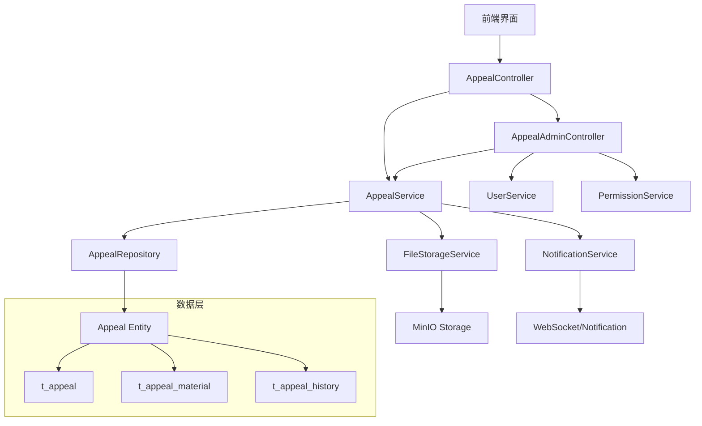
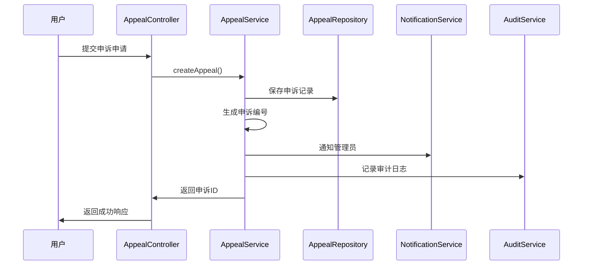
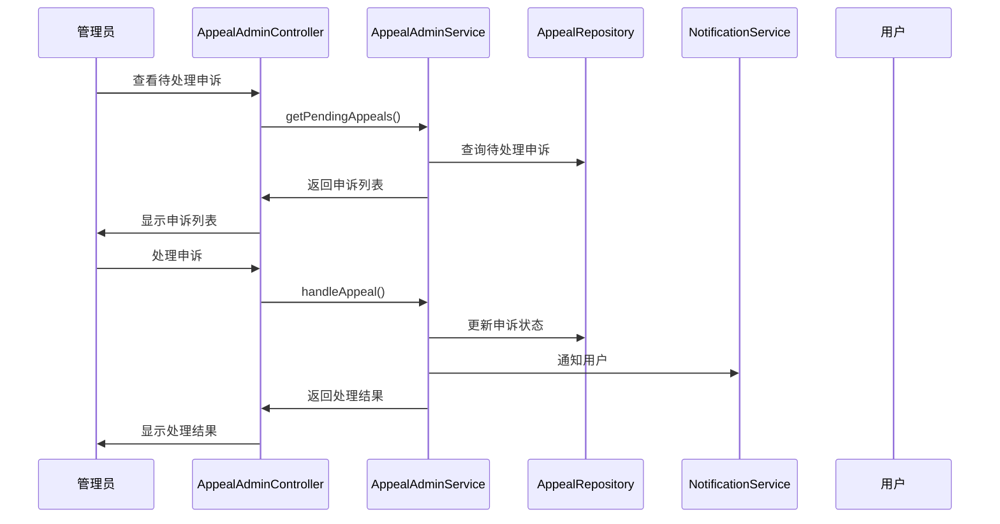

# 用户申诉系统设计文档

## Overview

用户申诉系统的设计遵循Spring Boot分层架构，集成现有的权限系统和审计日志系统，通过模块化设计实现申诉处理、材料管理、统计分析等核心功能，确保系统可扩展性和维护性。

## Architecture

### 系统架构图



### 分层设计

#### 1. 表现层 (Presentation Layer)
- **AppealController**: 用户端申诉API
- **AppealAdminController**: 管理员端申诉管理API
- ** AppealStatisticsController**: 申诉统计分析API

#### 2. 业务层 (Business Layer)
- **AppealService**: 申诉业务逻辑处理
- **AppealAdminService**: 管理员申诉处理业务
- **AppealStatisticsService**: 申诉统计分析服务
- **AppealMaterialService**: 申诉材料管理服务

#### 3. 数据层 (Data Layer)
- **AppealRepository**: 申诉数据访问
- **AppealMaterialRepository**: 材料数据访问
- **AppealHistoryRepository**: 申诉历史数据访问

#### 4. 基础设施层 (Infrastructure Layer)
- **AppealEventHandler**: 申诉事件处理
- **AppealAuditService**: 申诉审计日志

## Component Design

### 核心实体设计

#### Appeal Entity
```java
@Entity
@Table(name = "t_appeal")
public class Appeal extends BaseEntity {
    @NotNull
    @Column(name = "user_id", nullable = false)
    private Long userId;
    
    @NotNull
    @Enumerated(EnumType.STRING)
    @Column(name = "target_type", nullable = false, length = 20)
    private AppealTargetType targetType;
    
    @NotNull
    @Column(name = "target_id", nullable = false)
    private Long targetId;
    
    @NotNull
    @Enumerated(EnumType.STRING)
    @Column(name = "appeal_type", nullable = false, length = 20)
    private AppealType appealType;
    
    @NotBlank
    @Length(max = 1000)
    @Column(name = "reason", nullable = false, length = 1000)
    private String reason;
    
    @NotNull
    @Enumerated(EnumType.STRING)
    @Column(name = "status", nullable = false, length = 20)
    private AppealStatus status = AppealStatus.PENDING;
    
    @Column(name = "deadline")
    private LocalDateTime deadline;
    
    @Column(name = "appeal_code", unique = true, length = 20)
    private String appealCode;
    
    @Column(name = "handler_id")
    private Long handlerId;
    
    @Column(name = "handled_at")
    private LocalDateTime handledAt;
    
    @Column(name = "result", length = 500)
    private String result;
}
```

#### AppealMaterial Entity
```java
@Entity
@Table(name = "t_appeal_material")
public class AppealMaterial extends BaseEntity {
    @NotNull
    @Column(name = "appeal_id", nullable = false)
    private Long appealId;
    
    @NotBlank
    @Column(name = "file_name", nullable = false, length = 255)
    private String fileName;
    
    @NotBlank
    @Column(name = "file_path", nullable = false, length = 500)
    private String filePath;
    
    @NotNull
    @Column(name = "file_size", nullable = false)
    private Long fileSize;
    
    @NotNull
    @Column(name = "file_type", nullable = false, length = 50)
    private String fileType;
    
    @NotNull
    @Column(name = "mime_type", nullable = false, length = 100)
    private String mimeType;
    
    @Column(name = "thumbnail_path", length = 500)
    private String thumbnailPath;
}
```

### 服务层设计

#### AppealService 核心方法
```java
@Service
@Transactional
public interface AppealService {
    
    /**
     * 创建申诉
     * @param request 申诉创建请求
     * @param userId 用户ID
     * @return 申诉ID
     */
    Long createAppeal(CreateAppealRequest request, Long userId);
    
    /**
     * 查询用户申诉列表
     * @param userId 用户ID
     * @param pageRequest 分页请求
     * @return 申诉列表
     */
    Page<AppealResponse> getUserAppeals(Long userId, PageRequest pageRequest);
    
    /**
     * 查询申诉详情
     * @param appealId 申诉ID
     * @param userId 用户ID
     * @return 申诉详情
     */
    AppealDetailResponse getAppealDetail(Long appealId, Long userId);
    
    /**
     * 上传申诉材料
     * @param appealId 申诉ID
     * @param files 文件列表
     * @param userId 用户ID
     * @return 上传结果
     */
    List<MaterialResponse> uploadMaterials(Long appealId, MultipartFile[] files, Long userId);
    
    /**
     * 删除申诉材料
     * @param materialId 材料ID
     * @param userId 用户ID
     * @return 操作结果
     */
    boolean deleteMaterial(Long materialId, Long userId);
}
```

#### AppealAdminService 核心方法  
```java
@Service
@Transactional
public interface AppealAdminService {
    
    /**
     * 获取待处理申诉列表
     * @param adminId 管理员ID
     * @param pageRequest 分页请求
     * @return 待处理申诉列表
     */
    Page<PendingAppealResponse> getPendingAppeals(Long adminId, PageRequest pageRequest);
    
    /**
     * 处理申诉
     * @param appealId 申诉ID
     * @param request 处理请求
     * @param adminId 管理员ID
     * @return 处理结果
     */
    AppealHandleResult handleAppeal(Long appealId, HandleAppealRequest request, Long adminId);
    
    /**
     * 转交申诉
     * @param appealId 申诉ID
     * @param targetAdminId 目标管理员ID
     * @param adminId 当前管理员ID
     * @return 操作结果
     */
    boolean transferAppeal(Long appealId, Long targetAdminId, Long adminId);
    
    /**
     * 获取申诉统计信息
     * @param startDate 开始日期
     * @param endDate 结束日期
     * @return 统计信息
     */
    AppealStatistics getAppealStatistics(LocalDate startDate, LocalDate endDate);
}
```

### API设计

#### 用户端API
```java
@RestController
@RequestMapping("/api/appeals")
@RequiredArgsConstructor
public class AppealController {
    
    private final AppealService appealService;
    
    @PostMapping
    @PreAuthorize("hasAuthority(T(com.campus.marketplace.common.security.PermissionCodes).SYSTEM_USER_APPEAL)")
    public ApiResponse<Long> createAppeal(@Valid @RequestBody CreateAppealRequest request) {
        Long userId = SecurityUtil.getCurrentUserId();
        return ApiResponse.success(appealService.createAppeal(request, userId));
    }
    
    @GetMapping
    @PreAuthorize("hasAuthority(T(com.campus.marketplace.common.security.PermissionCodes).SYSTEM_USER_APPEAL)")
    public ApiResponse<Page<AppealResponse>> getMyAppeals(Pageable pageable) {
        Long userId = SecurityUtil.getCurrentUserId();
        PageRequest pageRequest = PageRequest.of(pageable.getPageNumber(), pageable.getPageSize());
        return ApiResponse.success(appealService.getUserAppeals(userId, pageRequest));
    }
    
    @GetMapping("/{appealId}")
    @PreAuthorize("hasAuthority(T(com.campus.marketplace.common.security.PermissionCodes).SYSTEM_USER_APPEAL)")
    public ApiResponse<AppealDetailResponse> getAppealDetail(@PathVariable Long appealId) {
        Long userId = SecurityUtil.getCurrentUserId();
        return ApiResponse.success(appealService.getAppealDetail(appealId, userId));
    }
    
    @PostMapping("/{appealId}/materials")
    @PreAuthorize("hasAuthority(T(com.campus.marketplace.common.security.PermissionCodes).SYSTEM_USER_APPEAL)")
    public ApiResponse<List<MaterialResponse>> uploadMaterials(
        @PathVariable Long appealId,
        @RequestParam("files") MultipartFile[] files
    ) {
        Long userId = SecurityUtil.getCurrentUserId();
        return ApiResponse.success(appealService.uploadMaterials(appealId, files, userId));
    }
    
    @DeleteMapping("/materials/{materialId}")
    @PreAuthorize("hasAuthority(T(com.campus.marketplace.common.security.PermissionCodes).SYSTEM_USER_APPEAL)")
    public ApiResponse<Void> deleteMaterial(@PathVariable Long materialId) {
        Long userId = SecurityUtil.getCurrentUserId();
        appealService.deleteMaterial(materialId, userId);
        return ApiResponse.success();
    }
}
```

#### 管理员端API
```java
@RestController
@RequestMapping("/api/admin/appeals")
@RequiredArgsConstructor
public class AppealAdminController {
    
    private final AppealAdminService appealAdminService;
    
    @GetMapping("/pending")
    @PreAuthorize("hasAuthority(T(com.campus.marketplace.common.security.PermissionCodes).SYSTEM_USER_APPEAL_HANDLE)")
    public ApiResponse<Page<PendingAppealResponse>> getPendingAppeals(Pageable pageable) {
        Long adminId = SecurityUtil.getCurrentUserId();
        PageRequest pageRequest = PageRequest.of(pageable.getPageNumber(), pageable.getPageSize());
        return ApiResponse.success(appealAdminService.getPendingAppeals(adminId, pageRequest));
    }
    
    @PostMapping("/{appealId}/handle")
    @PreAuthorize("hasAuthority(T(com.campus.marketplace.common.security.PermissionCodes).SYSTEM_USER_APPEAL_HANDLE)")
    public ApiResponse<AppealHandleResult> handleAppeal(
        @PathVariable Long appealId,
        @Valid @RequestBody HandleAppealRequest request
    ) {
        Long adminId = SecurityUtil.getCurrentUserId();
        return ApiResponse.success(appealAdminService.handleAppeal(appealId, request, adminId));
    }
    
    @PostMapping("/{appealId}/transfer")
    @PreAuthorize("hasAuthority(T(com.campus.marketplace.common.security.PermissionCodes).SYSTEM_USER_APPEAL_HANDLE)")
    public ApiResponse<Void> transferAppeal(
        @PathVariable Long appealId,
        @RequestBody TransferAppealRequest request
    ) {
        Long adminId = SecurityUtil.getCurrentUserId();
        appealAdminService.transferAppeal(appealId, request.getTargetAdminId(), adminId);
        return ApiResponse.success();
    }
    
    @GetMapping("/statistics")
    @PreAuthorize("hasAuthority(T(com.campus.marketplace.common.security.PermissionCodes).SYSTEM_USER_APPEAL_HANDLE)")
    public ApiResponse<AppealStatistics> getStatistics(
        @RequestParam @DateTimeFormat(iso = DateTimeFormat.ISO.DATE) LocalDate startDate,
        @RequestParam @DateTimeFormat(iso = DateTimeFormat.ISO.DATE) LocalDate endDate
    ) {
        return ApiResponse.success(appealAdminService.getAppealStatistics(startDate, endDate));
    }
}
```

## Data Flow

### 申诉提交流程


### 申诉处理流程


## Exception Handling

### 自定义异常
```java
// 申诉相关异常
public class AppealException extends BaseException {
    public AppealException(String message) {
        super(message);
    }
    
    public AppealException(ErrorCode errorCode, String message) {
        super(errorCode, message);
    }
}

public class AppealNotFoundException extends AppealException {
    public AppealNotFoundException(Long appealId) {
        super(ErrorCode.APPEAL_NOT_FOUND, "申诉不存在: " + appealId);
    }
}

public class AppealStatusException extends AppealException {
    public AppealStatusException(AppealStatus currentStatus, String operation) {
        super(ErrorCode.INVALID_APPEAL_STATUS, 
              String.format("申诉状态 [%s] 无法执行 [%s] 操作", currentStatus, operation));
    }
}

public class AppealPermissionException extends AppealException {
    public AppealPermissionException(String message) {
        super(ErrorCode.APPEAL_PERMISSION_DENIED, message);
    }
}
```

### 全局异常处理
```java
@RestControllerAdvice
public class AppealExceptionHandler {
    
    @ExceptionHandler(AppealNotFoundException.class)
    public ApiResponse<Void> handleAppealNotFound(AppealNotFoundException e) {
        return ApiResponse.error(ErrorCode.APPEAL_NOT_FOUND, e.getMessage());
    }
    
    @ExceptionHandler(AppealStatusException.class)
    public ApiResponse<Void> handleAppealStatusException(AppealStatusException e) {
        return ApiResponse.error(ErrorCode.INVALID_APPEAL_STATUS, e.getMessage());
    }
    
    @ExceptionHandler(AppealPermissionException.class)
    public ApiResponse<Void> handleAppealPermissionException(AppealPermissionException e) {
        return ApiResponse.error(ErrorCode.APPEAL_PERMISSION_DENIED, e.getMessage());
    }
}
```

## Performance Optimization

### 1. 数据库优化
```sql
-- 申诉表索引优化
CREATE INDEX idx_appeal_user_id ON t_appeal(user_id);
CREATE INDEX idx_appeal_status ON t_appeal(status);
CREATE INDEX idx_appeal_created_at ON t_appeal(created_at);
CREATE INDEX idx_appeal_handler_id ON t_appeal(handler_id);
CREATE INDEX idx_appeal_target ON t_appeal(target_type, target_id);

-- 材料表索引优化
CREATE INDEX idx_appeal_material_appeal_id ON t_appeal_material(appeal_id);
CREATE INDEX idx_appeal_material_file_type ON t_appeal_material(file_type);
```

### 2. 缓存策略
```java
@Service
public class AppealServiceImpl implements AppealService {
    
    @Cacheable(value = "appeal:detail", key = "#appealId")
    public AppealDetailResponse getAppealDetail(Long appealId, Long userId) {
        // 申诉详情查询逻辑
    }
    
    @CacheEvict(value = "appeal:detail", key = "#appealId")
    public void updateAppealStatus(Long appealId, AppealStatus status) {
        // 更新申诉状态逻辑
    }
    
    @Cacheable(value = "appeal:statistics", key = "#startDate.toString() + ':' + #endDate.toString()")
    public AppealStatistics getAppealStatistics(LocalDate startDate, LocalDate endDate) {
        // 统计查询逻辑
    }
}
```

### 3. 异步处理
```java
@Component
public class AppealEventHandler {
    
    @Async
    public void handleAppealCreated(AppealCreatedEvent event) {
        // 异步发送通知
        notificationService.sendAppealNotification(event);
        
        // 异步记录审计日志
        auditService.logAppealCreated(event);
    }
    
    @Async
    public void handleAppealHandled(AppealHandledEvent event) {
        // 异步发送处理结果通知
        notificationService.sendAppealHandledNotification(event);
        
        // 异步更新统计缓存
        statisticsService.updateAppealStatistics(event);
    }
}
```

## Security Considerations

### 1. 权限控制
- 用户只能操作自己的申诉
- 管理员需要相应权限才能处理申诉
- 敏感操作需要二次验证

### 2. 数据加密
- 申诉理由使用AES-256加密存储
- 文件上传路径加密处理
- 定期备份数据库

### 3. 防护措施
- 限流：同一用户1小时内最多提交5个申诉
- 文件安全：上传文件病毒扫描
- 审计记录：所有操作完整记录

## Testing Strategy

### 1. 单元测试
- AppealService 核心业务逻辑测试
- AppealRepository 数据访问测试
- Component 组件功能测试

### 2. 集成测试
- API接口端到端测试
- 数据库事务一致性测试
- 缓存功能测试

### 3. 性能测试
- 并发申诉创建性能测试
- 大量数据查询性能测试
- 文件上传性能测试

## Monitoring & Logging

### 1. 关键指标监控
- 申诉提交成功率
- 申诉处理平均时长
- 系统响应时间

### 2. 日志记录
- 审计日志通过已有的AuditLogService
- 业务操作日志通过自定义Logger
- 错误日志详细记录堆栈信息

### 3. 告警机制
- 申诉堆积超过阈值告警
- 系统错误率过高告警
- 存储空间不足告警

## Integration Points

### 1. 权限系统集成
- 查询用户申诉权限
- 记录管理员处理权限
- 复用现有权限编码：SYSTEM_USER_APPEAL、SYSTEM_USER_APPEAL_HANDLE

### 2. 审计系统集成
- 记录申诉创建、处理、材料操作等关键动作
- 支持撤销操作的审计追踪
- 扩展现有AuditEntityType枚举：APPEAL

### 3. 通知系统集成
- 利用WebSocket实时通知
- 集成站内信、邮件通知
- 支持批量消息推送

### 4. 文件存储集成
- 复用文件上传服务
- 支持MinIO对象存储
- 图片缩略图自动生成

## Deployment Considerations

### 1. 数据库迁移脚本
```sql
-- 申诉表
CREATE TABLE t_appeal (
    id BIGINT PRIMARY KEY AUTO_INCREMENT,
    user_id BIGINT NOT NULL COMMENT '用户ID',
    target_type VARCHAR(20) NOT NULL COMMENT '申诉目标类型',
    target_id BIGINT NOT NULL COMMENT '申诉目标ID',
    appeal_type VARCHAR(20) NOT NULL COMMENT '申诉类型',
    reason TEXT NOT NULL COMMENT '申诉理由',
    status VARCHAR(20) NOT NULL DEFAULT 'PENDING' COMMENT '申诉状态',
    deadline DATETIME COMMENT '处理截止时间',
    appeal_code VARCHAR(20) UNIQUE NOT NULL COMMENT '申诉编号',
    handler_id BIGINT COMMENT '处理人ID',
    handled_at DATETIME COMMENT '处理时间',
    result TEXT COMMENT '处理结果',
    created_at TIMESTAMP DEFAULT CURRENT_TIMESTAMP,
    updated_at TIMESTAMP DEFAULT CURRENT_TIMESTAMP ON UPDATE CURRENT_TIMESTAMP,
    created_by BIGINT,
    updated_by BIGINT,
    deleted BOOLEAN DEFAULT FALSE,
    
    INDEX idx_user_appeal (user_id),
    INDEX idx_appeal_status (status),
    INDEX idx_appeal_created (created_at),
    INDEX idx_appeal_handler (handler_id),
    INDEX idx_appeal_target (target_type, target_id)
);

-- 申诉材料表
CREATE TABLE t_appeal_material (
    id BIGINT PRIMARY KEY AUTO_INCREMENT,
    appeal_id BIGINT NOT NULL COMMENT '申诉ID',
    file_name VARCHAR(255) NOT NULL COMMENT '文件名',
    file_path VARCHAR(500) NOT NULL COMMENT '文件路径',
    file_size BIGINT NOT NULL COMMENT '文件大小',
    file_type VARCHAR(50) NOT NULL COMMENT '文件类型',
    mime_type VARCHAR(100) NOT NULL COMMENT 'MIME类型',
    thumbnail_path VARCHAR(500) COMMENT '缩略图路径',
    created_at TIMESTAMP DEFAULT CURRENT_TIMESTAMP,
    updated_at TIMESTAMP DEFAULT CURRENT_TIMESTAMP ON UPDATE CURRENT_TIMESTAMP,
    created_by BIGINT,
    updated_by BIGINT,
    deleted BOOLEAN DEFAULT FALSE,
    
    INDEX idx_appeal_material_appeal (appeal_id),
    INDEX idx_appeal_material_type (file_type)
);
```

### 2. 配置项
```yaml
# appeal相关配置
appeal:
  max-submissions-per-hour: 5
  max-file-size-mb: 10
  allowed-file-types: jpg,jpeg,png,pdf,doc,docx
  processing-deadline-days: 7
  auto-cleanup-days: 30
  
# storage配置
storage:
  appeal-materials:
    bucket: appeal-materials
    path-prefix: appeals/
    thumbnail-size: 200x200
```

### 3. 容器化部署
- 环境变量配置
- 健康检查端点
- 日志收集配置
- 监控指标集成
