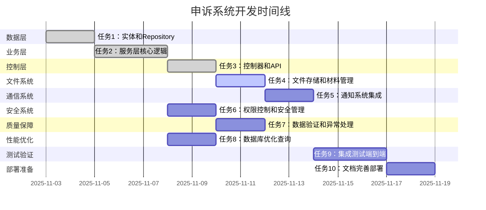

# 用户申诉系统任务分解

## Overview

基于用户申诉系统的设计文档，将系统开发分解为独立的、原子性的开发任务。每个任务遵循TDD原则，包含完整的测试、实现和验证步骤，确保代码质量和功能完整性。

## Task Breakdown

### 📋 任务 1: 申诉核心实体和数据访问层

**_Prompt**: Implement the task for spec appeal-system, first run spec-workflow-guide to get the workflow guide then implement the task:
```text
**Role**: 数据层工程师
**Task**: 开发申诉系统的核心实体和数据访问组件，包括Appeal、AppealMaterial、AppealHistory以及对应的Repository接口，确保数据模型的完整性和数据访问的高效性。
**Constraints**: 
- 严格遵循JPA规范，使用合理的命名策略和索引策略
- 所有实体必须继承BaseEntity，利用现有基础架构
-Repository接口必须继承JpaRepository，提供基本CRUD操作
- 实体字段必须有适当的验证注解和数据完整性约束
**_Leverage**: 现有的BaseEntity、BaseRepository模式、现有的JPA配置和数据库连接池
**_Requirements**: 需求69(申诉提交功能)、需求70(申诉状态查询)、需求71(管理员申诉处理)
**Success**: 
- 所有实体类编译通过，JPA元模型生成正确
- 数据库表结构自动创建且符合设计规范
- 所有Repository基本操作测试通过，数据访问性能达标
- 完整的单元测试覆盖，测试覆盖率≥95%
**Instructions**: 按照以下步骤实施：
1. 首先编写失败的单元测试，定义预期行为
2. 实现Appeal实体类，包含所有必要字段和关联
3. 实现AppealMaterial实体类，支持文件存储关联
4. 实现Repository接口，提供自定义查询方法
5. 编写集成测试验证数据访问正确性
6. 在tasks.md中将此任务标记为[-]进行中，完成后标记为[x]
```

#### 1.1 创建Appeal实体类
**文件**: `backend/src/main/java/com/campus/marketplace/common/entity/Appeal.java`
**依赖**: `BaseEntity.java`, `AppealStatus.java`, `AppealType.java`, `AppealTargetType.java`
**验收标准**:
- [ ] 实体继承BaseEntity，包含基础字段
- [ ] 所有业务字段有适当的验证和约束注解
- [ ] JPA映射正确，表名和字段名符合规范
- [ ] 构造函数、Builder模式支持
- [ ] toString/equals/hashCode方法合理实现

#### 1.2 创建AppealMaterial实体类  
**文件**: `backend/src/main/java/com/campus/marketplace/common/entity/AppealMaterial.java`
**依赖**: `BaseEntity.java`, `Appeal.java`
**验收标准**:
- [ ] 文件字段支持多种类型和大小限制
- [ ] 与Appeal的关联关系正确定义
- [ ] 支持缩略图路径和文件元数据存储
- [ ] 数据验证确保文件信息完整性

#### 1.3 创建Repository接口
**文件**: `backend/src/main/java/com/campus/marketplace/repository/AppealRepository.java`
**依赖**: `JpaRepository.java`, `Appeal.java`
**验收标准**:
- [ ] 继承JpaRepository，提供基础CRUD操作
- [ ] 自定义查询方法支持复杂条件查询
- [ ] 分页查询方法支持所有业务场景
- [ ] 按用户、状态、类型等条件的高效查询

#### 1.4 创建AppealMaterialRepository
**文件**: `backend/src/main/java/com/campus/marketplace/repository/AppealMaterialRepository.java`
**依赖**: `JpaRepository.java`, `AppealMaterial.java`
**验收标准**:
- [ ] 按申诉ID查询所有材料
- [ ] 文件类型和大小过滤查询
- [ ] 批量删除和统计操作支持

---

### 📋 任务 2: 申诉服务层核心业务逻辑

**_Prompt**: Implement the task for spec appeal-system, first run spec-workflow-guide to get the workflow guide then implement the task:
```text
**Role**: 业务逻辑工程师  
**Task**: 开发申诉系统的核心服务层，实现AppealService和AppealAdminService的业务逻辑，包括申诉创建、状态管理、管理员处理、材料管理等功能，确保业务规则正确性和事务一致性。
**Constraints**:
- 所有业务方法必须用@Transactional注解控制事务
- 服务层不能直接操作数据库，必须通过Repository
- 所有业务异常必须抛出自定义异常类
- 服务方法必须有详细的Javadoc注释
- 利用现有的权限系统和通知系统
**_Leverage**: 现有的BaseService模式、TransactionManager、权限验证组件、通知系统、AuditLogService
**_Requirements**: 需求69(申诉提交功能)、需求70(申诉状态查询)、需求71(管理员申诉处理)、需求72(申诉材料管理)  
**Success**:
- 所有服务方法正确实现业务逻辑
- 事务管理和异常处理符合规范
- 业务规则验证完整有效
- 单元测试覆盖率≥90%，集成测试通过
- 性能测试满足设计要求
**Instructions**: 按照以下步骤实施：
1. 编写业务逻辑的失败测试用例
2. 实现AppealService接口和实现类
3. 实现AppealAdminService接口和实现类  
4. 实现AppealMaterialService材料管理服务
5. 集成权限验证和通知系统
6. 在tasks.md中将此任务标记为[-]进行中，完成后标记为[x]
```

#### 2.1 创建AppealService接口
**文件**: `backend/src/main/java/com/campus/marketplace/service/AppealService.java`
**依赖**: `BaseService.java`, `Appeal.java`, `CreateAppealRequest.java`
**验收标准**:
- [ ] 申诉创建、查询、管理方法定义完整
- [ ] 方法参数和返回值类型正确
- [ ] 异常声明和业务契约明确
- [ ] 与现有服务接口风格一致

#### 2.2 实现AppealService核心方法
**文件**: `backend/src/main/java/com/campus/marketplace/service/impl/AppealServiceImpl.java`
**依赖**: `AppealService.java`, `AppealRepository.java`, `AuditLogService.java`
**验收标准**:
- [ ] 申诉创建逻辑包含权限验证和业务规则检查
- [ ] 申诉查询支持分页和条件过滤
- [ ] 申诉状态管理符合业务流程
- [ ] 材料上传和删除功能正常
- [ ] 错误处理和异常信息准确

#### 2.3 创建AppealAdminService
**文件**: `backend/src/main/java/com/campus/marketplace/service/AppealAdminService.java`
**依赖**: `BaseService.java`, `Appeal.java`, `HandleAppealRequest.java`
**验收标准**:
- [ ] 管理员申诉处理方法定义
- [ ] 统计分析功能接口定义
- [ ] 权限检查和操作验证声明

#### 2.4 实现AppealAdminService实现类
**文件**: `backend/src/main/java/com/campus/marketplace/service/impl/AppealAdminServiceImpl.java`
**依赖**: `AppealAdminService.java`, `AppealService.java`, `UserService.java`
**验收标准**:
- [ ] 申诉处理逻辑包含业务规则验证
- [ ] 申诉转交功能正常工作
- [ ] 统计查询结果准确高效
- [ ] 与权限系统正确集成

---

### 📋 任务 3: 控制器层和API接口

**_Prompt**: Implement the task for spec appeal-system, first run spec-workflow-guide to get the workflow guide then implement the task:
```text
**Role**: API架构工程师
**Task**: 开发申诉系统的REST控制器层，实现用户端和管理员端的API接口，包括参数验证、权限控制、响应格式化等功能，确保API的规范性、安全性和易用性。
**Constraints**:
- 所有控制器必须使用Spring Security进行权限验证
- API路径必须遵循RESTful规范
- 所有输入参数必须使用@Valid注解验证
- 响应格式必须使用统一的ApiResponse结构
- 异常处理必须使用@ControllerAdvice全局处理
**_Leverage**: 现有的BaseController模式、全局异常处理器、统一响应格式、权限验证框架、Swagger文档
**_Requirements**: 需求69(申诉提交功能)、需求70(申诉状态查询)、需求71(管理员申诉处理)、需求73(申诉统计分析)
**Success**:
- 所有API接口正常工作，响应格式正确
- 权限验证有效，非法请求被正确拦截
- 参数验证功能正常，错误信息友好
- API文档完整，Swagger可用
- 性能测试满足并发要求
**Instructions**: 按照以下步骤实施：
1. 编写API接口的失败测试
2. 实现AppealController用户端API
3. 实现AppealAdminController管理员端API
4. 实现AppealStatisticsController统计API
5. 配置权限验证和异常处理
6. 在tasks.md中将此任务标记为[-]进行中，完成后标记为[x]
```

#### 3.1 创建DTO和请求响应类
**文件**: `backend/src/main/java/com/campus/marketplace/common/dto/request/CreateAppealRequest.java`
**文件**: `backend/src/main/java/com/campus/marketplace/common/dto/response/AppealResponse.java`
**文件**: `backend/src/main/java/com/campus/marketplace/common/dto/response/AppealDetailResponse.java`
**依赖**: `BaseRequest.java`, `BaseResponse.java`
**验收标准**:
- [ ] DTO类包含所有必要字段和验证注解
- [ ] 请求和响应格式符合API规范
- [ ] 数据转换方法准确高效
- [ ] 序列化和反序列化正常工作

#### 3.2 实现AppealController
**文件**: `backend/src/main/java/com/campus/marketplace/controller/AppealController.java`
**依赖**: `AppealService.java`, `BaseController.java`
**验收标准**:
- [ ] 申诉创建API正常工作
- [ ] 申诉查询API支持分页和过滤
- [ ] 申诉材料上传和删除API功能正常
- [ ] 权限验证有效，用户只能操作自己的申诉
- [ ] 输入验证和异常处理正确

#### 3.3 实现AppealAdminController
**文件**: `backend/src/main/java/com/campus/marketplace/controller/AppealAdminController.java`
**依赖**: `AppealAdminService.java`, `BaseController.java`
**验收标准**:
- [ ] 待处理申诉查询API工作正常
- [ ] 申诉处理API包含业务验证
- [ ] 申诉转交功能正常
- [ ] 管理员权限验证有效
- [ ] 操作日志记录完整

#### 3.4 实现AppealStatisticsController
**文件**: `backend/src/main/java/com/campus/marketplace/controller/AppealStatisticsController.java`
**依赖**: `AppealAdminService.java`
**验收标准**:
- [ ] 申诉统计数据API返回正确结果
- [ ] 时间范围查询功能正常
- [ ] 数据聚合计算准确
- [ ] 权限验证和缓存支持

---

### 📋 任务 4: 文件存储和材料管理

**_Prompt**: Implement the task for spec appeal-system, first run spec-workflow-guide to get the workflow guide then implement the task:
```text
**Role**: 文件系统工程师
**Task**: 开发申诉系统的文件存储和材料管理功能，包括文件上传、下载、缩略图生成、安全检查等功能，确保文件操作的安全性、可靠性和性能。
**Constraints**:
- 文件上传必须使用MinIO对象存储
- 图片文件必须生成缩略图
- 所有上传文件必须进行病毒扫描和安全检查
- 文件路径必须加密存储，防止路径暴露
- 支持断点续传和进度追踪
**_Leverage**: 现有的FileStorageService、MinIO配置、病毒扫描服务、加密工具类
**_Requirements**: 需求72(申诉材料管理)
**Success**:
- 文件上传下载功能正常工作
- 缩略图自动生成且质量良好
- 安全检查有效，恶意文件被拦截
- 文件存储和访问性能达标
- 错误处理和异常恢复机制完善
**Instructions**: 按照以下步骤实施：
1. 编写文件操作的失败测试
2. 扩展AppealMaterialService文件处理功能
3. 实现文件上传和验证逻辑
4. 实现缩略图生成和存储
5. 集成安全检查和病毒扫描
6. 在tasks.md中将此任务标记为[-]进行中，完成后标记为[x]
```

#### 4.1 扩展AppealMaterialService
**文件**: `backend/src/main/java/com/campus/marketplace/service/impl/AppealMaterialServiceImpl.java`
**依赖**: `FileStorageService.java`, `AppealRepository.java`
**验收标准**:
- [ ] 文件上传包含格式和大小验证
- [ ] 支持多种文件类型的安全处理
- [ ] 缩略图自动生成和存储
- [ ] 文件删除包含资源清理

#### 4.2 实现文件安全检查
**文件**: `backend/src/main/java/com/campus/marketplace/service/impl/FileSecurityServiceImpl.java`
**依赖**: `VirusScanService.java`, `FileTypeValidator.java`
**验收标准**:
- [ ] 文件类型验证准确
- [ ] 病毒扫描及时有效
- [ ] 恶意文件拦截和记录
- [ ] 安全检查性能优化

#### 4.3 实现文件控制器接口
**文件**: `backend/src/main/java/com/campus/marketplace/controller/AppealMaterialController.java`
**依赖**: `AppealController.java`, `FileStorageService.java`
**验收标准**:
- [ ] 文件上传API支持批量上传
- [ ] 文件下载和预览功能正常
- [ ] 文件删除权限验证有效
- [ ] 文件操作进度可追踪

---

### 📋 任务 5: 通知系统集成

**_Prompt**: Implement the task for spec appeal-system, first run spec-workflow-guide to get the workflow guide then implement the task:
```text
**Role**: 通信系统工程师  
**Task**: 开发申诉系统的通知功能，集成现有的WebSocket、站内信、邮件通知系统，实现申诉进度通知、处理结果通知、超时提醒等功能，确保通知的及时性和可配置性。
**Constraints**:
- 必须复用现有的NotificationService
- 通知内容必须支持个性化配置
- 通知发送必须异步处理，避免阻塞主流程
- 支持通知订阅和取消订阅功能
- 通知发送状态必须可追踪
**_Leverage**: 现有的WebSocketManager、NotificationService、站内信系统、邮件服务
**_Requirements**: 需求70(申诉状态查询)、需求71(管理员申诉处理)
**Success**:
- 申诉相关通知正确发送给目标用户
- 实时通知推送及时有效
- 通知内容格式化正确，信息完整
- 通知发送状态可查询和管理
- 通知系统性能稳定，不阻塞业务
**Instructions**: 按照以下步骤实施：
1. 编写通知功能的失败测试
2. 实现申诉通知事件监听器
3. 配置通知模板和消息格式
4. 集成WebSocket实时推送
5. 实现通知发送状态追踪
6. 在tasks.md中将此任务标记为[-]进行中，完成后标记为[x]
```

#### 5.1 创建申诉事件类
**文件**: `backend/src/main/java/com/campus/marketplace/event/AppealEvent.java`
**文件**: `backend/src/main/java/com/campus/marketplace/event/AppealStatusChangedEvent.java`
**文件**: `backend/src/main/java/com/campus/marketplace/event/AppealHandledEvent.java`
**依赖**: `BaseEvent.java`, `Appeal.java`
**验收标准**:
- [ ] 事件类包含完整的上下文信息
- [ ] 事件序列化和反序列化正常
- [ ] 事件类型和业务对应关系正确

#### 5.2 实现事件监听器
**文件**: `backend/src/main/java/com/campus/marketplace/event/listener/AppealEventListener.java`
**依赖**: `NotificationService.java`, `WebSocketManager.java`
**验收标准**:
- [ ] 申诉创建事件监听和通知发送
- [ ] 状态变更事件实时推送
- [ ] 处理完成事件通知各方当事人
- [ ] 通知发送异常处理和重试机制

#### 5.3 配置通知模板
**文件**: `backend/src/main/resources/templates/appeal-templates.properties`
**验收标准**:
- [ ] 申诉创建通知模板
- [ ] 状态变更通知模板
- [ ] 处理结果通知模板
- [ ] 超时提醒通知模板

---

### 📋 任务 6: 权限控制和安全管理

**_Prompt**: Implement the task for spec appeal-system, first run spec-workflow-guide to get the workflow guide then implement the task:
```text
**Role**: 安全工程师
**Task**: 开发申诉系统的权限控制和安全管理功能，集成现有权限系统，实现操作权限验证、数据权限控制、审计日志记录等功能，确保系统的安全性和合规性。
**Constraints**:
- 必须复用现有的PermissionCodes和权限验证机制
- 数据权限必须强制执行，用户只能操作自己的申诉
- 所有敏感操作必须记录审计日志
- 权限验证必须高效，不影响业务性能
- 支持动态权限配置和权限委托
**_Leverage**: 现有的PermissionService、SecurityUtil、AuditLogService、权限编码定义
**_Requirements**: 需求70(申诉状态查询)、需求71(管理员申诉处理)、需求73(申诉统计分析)
**Success**:
- 权限验证机制完全有效，无权限申请被正确拦截
- 审计日志记录完整，所有操作可追溯
- 数据权限控制严格，数据安全无漏洞
- 权限系统响应快速，性能满足要求
- 权限配置灵活，支持业务扩展
**Instructions**: 按照以下步骤实施：
1. 编写权限控制的失败测试
2. 实现申诉权限验证服务
3. 集成全局权限注解和拦截器
4. 配置审计日志记录机制
5. 实现数据权限控制逻辑
6. 在tasks.md中将此任务标记为[-]进行中，完成后标记为[x]
```

#### 6.1 创建权限验证服务
**文件**: `backend/src/main/java/com/campus/marketplace/service/AppealPermissionService.java`
**依赖**: `PermissionService.java`, `UserService.java`
**验收标准**:
- [ ] 申诉操作权限验证方法
- [ ] 管理员权限分级验证
- [ ] 数据所有权权限检查
- [ ] 权限查询缓存优化

#### 6.2 自定义权限验证切面
**文件**: `backend/src/main/java/com/campus/marketplace/aspect/AppealPermissionAspect.java`
**依赖**: `AppealPermissionService.java`, `Spring AOP`
**验收标准**:
- [ ] 自定义权限注解定义
- [ ] AOP切面自动权限验证
- [ ] 权限验证异常处理
- [ ] 性能监控和日志记录

#### 6.3 集成审计日志
**文件**: `backend/src/main/java/com/campus/marketplace/event/listener/AppealAuditListener.java`
**依赖**: `AuditLogService.java`, `AppealEvent.java`
**验收标准**:
- [ ] 申诉操作审计日志记录
- [ ] 管理员处理操作记录
- [ ] 敏感数据访问日志
- [ ] 审计日志查询和统计

---

### 📋 任务 7: 数据验证和异常处理

**_Prompt**: Implement the task for spec appeal-system, first run spec-workflow-guide to get the workflow guide then implement the task:
```text
**Role**: 质量保障工程师
**Task**: 开发申诉系统的数据验证和异常处理机制，实现输入参数验证、业务规则验证、异常分类处理、错误消息国际化等功能，确保系统的健壮性和用户体验。
**Constraints**:
- 参数验证必须使用Spring Validation框架
- 异常处理必须使用@ControllerAdvice全局处理
- 错误消息必须支持国际化配置
- 业务异常和系统异常必须明确分类
- 异常处理不能影响事务完整性
**_Leverage**: 现有的BaseException、全局异常处理器、国际化配置、Spring Validation
**_Requirements**: 所有需求都需要数据验证和异常处理
**Success**:
- 所有输入参数验证有效，无效输入被正确拦截
- 业务异常处理完善，错误信息准确
- 异常分类清晰，处理流程规范
- 错误消息用户友好，支持多语言
- 系统异常恢复机制有效
**Instructions**: 按照以下步骤实施：
1. 编写参数验证和异常处理的失败测试
2. 实现自定义验证器和验证规则
3. 创建申诉相关自定义异常类
4. 全局异常处理器集成
5. 配置国际化错误消息
6. 在tasks.md中将此任务标记为[-]进行中，完成后标记为[x]
```

#### 7.1 创建自定义验证器
**文件**: `backend/src/main/java/com/campus/marketplace/validation/AppealRequestValidator.java`
**文件**: `backend/src/main/java/com/campus/marketplace/validation/FileUploadValidator.java`
**依赖**: `ConstraintValidator.java`, `StringUtils.java`
**验收标准**:
- [ ] 申诉内容验证器
- [ ] 文件上传验证器
- [ ] 业务规则验证器
- [ ] 组合验证逻辑

#### 7.2 创建自定义异常类
**文件**: `backend/src/main/java/com/campus/marketplace/exception/AppealException.java`
**文件**: `backend/src/main/java/com/campus/marketplace/exception/AppealNotFoundException.java`
**文件**: `backend/src/main/java/com/campus/marketplace/exception/AppealPermissionException.java`
**依赖**: `BaseException.java`
**验收标准**:
- [ ] 申诠相关异常分类完整
- [ ] 异常构造函数和错误码支持
- [ ] 异常信息和用户友好消息
- [ ] 异常传播和日志记录

#### 7.3 全局异常处理器扩展
**文件**: `backend/src/main/java/com/campus/marketplace/exception/handler/AppealExceptionHandler.java`
**依赖**: `ControllerAdvice.java`, `AppealException.java`
**验收标准**:
- [ ] 申诉异常统一处理
- [ ] 错误响应格式标准统一
- [ ] 异常监控和告警
- [ ] 异常恢复和重试机制

---

### 📋 任务 8: 数据库优化和查询性能

**_Prompt**: Implement the task for spec appeal-system, first run spec-workflow-guide to get the workflow guide then implement the task:
```text
**Role**: 数据库性能工程师
**Task**: 开发申诉系统的数据库优化功能，实现索引创建、查询优化、缓存策略、分页查询等功能，确保大数据量下的查询性能和系统响应速度。
**Constraints**:
- 数据库索引起名必须遵循项目规范
- 查询优化不能改变业务逻辑
- 缓存必须考虑数据一致性
- 分页查询必须支持深度分页
- 数据库连接池配置必须优化
**_Leverage**: 现有的数据库配置、Redis缓存、查询优化工具、性能监控
**_Requirements**: 需求70(申诉状态查询)、需求71(管理员申诉处理)、需求73(申诉统计分析)
**Success**:
- 数据库查询响应时间<300ms
- 大数据量查询性能稳定
- 缓存命中率≥80%
- 分页查询支持深度分页
- 监控指标正常，性能告警及时
**Instructions**: 按照以下步骤实施：
1. 编写性能测试用例
2. 创建数据库索引和视图
3. 实现查询优化和缓存
4. 配置分页查询策略
5. 集成性能监控和告警
6. 在tasks.md中将此任务标记为[-]进行中，完成后标记为[x]
```

#### 8.1 创建数据库迁移脚本
**文件**: `backend/src/main/resources/db/migration/V3__create_appeal_tables.sql`
**依赖**: Flyway迁移系统
**验收标准**:
- [ ] 申诉表结构符合设计规范
- [ ] 索引创建策略合理
- [ ] 外键约束正确设置
- [ ] 切换数据完整性保证

#### 8.2 实现查询优化
**文件**: `backend/src/main/java/com/campus/marketplace/repository/impl/AppealRepositoryImpl.java`
**依赖**: `EntityManager.java`, `JPA Criteria API`
**验收标准**:
- [ ] 复杂查询优化实现
- [ ] 动态查询条件构建
- [ ] 查询结果映射优化
- [ ] N+1查询问题解决

#### 8.3 配置缓存策略
**文件**: `backend/src/main/java/com/campus/marketplace/cache/AppealCacheManager.java`
**依赖**: `RedisTemplate.java`, `CacheConfiguration.java`
**验收标准**:
- [ ] 申诉详情缓存配置
- [ ] 申诉列表缓存策略
- [ ] 缓存失效和更新机制
- [ ] 缓存性能监控指标

---

### 📋 任务 9: 集成测试和端到端测试

**_Prompt**: Implement the task for spec appeal-system, first run spec-workflow-guide to get the workflow guide then implement the task:
```text
**Role**: 测试工程师
**Task**: 开发申诉系统的集成测试和端到端测试，实现API测试、服务测试、数据库测试、性能测试等功能，确保系统整体功能的正确性和稳定性。
**Constraints**:
- 测试必须使用Spring Boot Test框架
- 集成测试必须使用TestContainers或模拟环境
- API测试必须使用MockMvc或RestAssured
- 性能测试必须满足设计指标
- 测试覆盖率必须≥85%
**_Leverage**: 现有的测试框架、测试工具、测试数据管理
**_Requirements**: 覆盖所有需求的功能测试
**Success**:
- 所有功能测试通过，无关键缺陷
- 集成测试覆盖主要业务流程
- 性能测试满足设计要求
- 测试报告完整，覆盖率达标
- 测试环境稳定，可重复执行
**Instructions**: 按照以下步骤实施：
1. 设计测试用例和测试数据
2. 实现API集成测试
3. 实现服务层集成测试
4. 实现性能测试
5. 生成测试报告和覆盖率报告
6. 在tasks.md中将此任务标记为[-]进行中，完成后标记为[x]
```

#### 9.1 创建API集成测试
**文件**: `backend/src/test/java/com/campus/marketplace/controller/AppealControllerIntegrationTest.java`
**文件**: `backend/src/test/java/com/campus/marketplace/controller/AppealAdminControllerIntegrationTest.java`
**依赖**: `MockMvc.java`, `@SpringBootTest.java`
**验收标准**:
- [ ] 申诉创建流程测试
- [ ] 申诉状态查询测试
- [ ] 管理员处理流程测试
- [ ] 权限验证测试

#### 9.2 创建服务层集成测试
**文件**: `backend/src/test/java/com/campus/marketplace/service/AppealServiceIntegrationTest.java`
**依赖**: `@DataJpaTest.java`, `TestContainers.java`
**验收标准**:
- [ ] 申诉业务逻辑测试
- [ ] 事务管理测试
- [ ] 异常处理测试
- [ ] 复杂场景测试

#### 9.3 创建性能测试
**文件**: `backend/src/test/java/com/campus/marketplace/performance/AppealSystemPerformanceTest.java`
**依赖**: `JMH.java`, `Gatling.java`
**验收标准**:
- [ ] 并发创建申诉性能测试
- [ ] 大数据量查询性能测试
- [ ] 文件上传性能测试
- [ ] 系统内存和CPU使用测试

---

### 📋 任务 10: 文档完善和部署准备

**_Prompt**: Implement the task for spec appeal-system, first run spec-workflow-guide to get the workflow guide then implement the task:
```text
**Role**: DevOps工程师
**Task**: 开发申诉系统的文档完善和部署准备工作，包括API文档、用户手册、部署脚本、配置文件、监控配置等功能，确保系统的可维护性和可部署性。
**Constraints**:
- API文档必须使用Swagger/OpenAPI规范
- 部署脚本必须支持多环境配置
- 监控配置必须覆盖关键指标
- 文档内容必须准确且及时更新
- 部署过程必须自动化
**_Leverage**: 现有的API文档系统、部署工具、监控系统、文档模板
**_Requirements**: 支持系统交付和运维
**Success**:
- API文档完整且可用
- 部署脚本自动化且可靠
- 监控配置覆盖全面
- 用户手册实用易懂
- 系统交付标准符合要求
**Instructions**: 按照以下步骤实施：
1. 完善API文档和注释
2. 创建部署脚本和配置
3. 配置监控和告警
4. 编写用户手册和FAQ
5. 准备验收测试环境
6. 在tasks.md中将此任务标记为[-]进行中，完成后标记为[x]
```

#### 10.1 完善API文档
**文件**: `backend/src/main/java/com/campus/marketplace/controller/AppealController.java` (添加Swagger注解)
**依赖**: `Swagger.java`, `OpenAPI.java`
**验收标准**:
- [ ] 所有API接口文档完整
- [ ] 参数和响应格式准确
- [ ] 示例数据和错误案例
- [ ] 文档可在线调试

#### 10.2 创建部署配置
**文件**: `backend/src/main/resources/application-appeal.yml`
**文件**: `docker/appeal/docker-compose.yml`
**文件**: `scripts/deploy-appeal.sh`
**验收标准**:
- [ ] 多环境配置支持
- [ ] Docker容器化部署
- [ ] 数据库迁移脚本
- [ ] 健康检查和监控配置

#### 10.3 准备用户文档
**文件**: `docs/user-guide/appeal-system-guide.md`
**文件**: `docs/api/appeal-api-manual.md`
**验收标准**:
- [ ] 用户操作指南完整
- [ ] API使用说明详细
- [ ] 常见问题和解决方案
- [ ] 联系支持信息准确

---

## 任务依赖关系



## 质量检查清单

### 开发阶段检查
- [ ] **第0步复用检查**: 所有组件都复用现有基础架构，无重复创建
- [ ] **第1步测试先行**: 每个任务都先写失败的测试用例
- [ ] **实体设计遵循JPA规范**: 实体继承BaseEntity，字段注解完整
- [ ] **服务层事务正确**: @Transactional注解使用恰当，异常处理完整
- [ ] **RESTful API规范**: 路径设计合理，HTTP方法使用正确

### 代码质量检查  
- [ ] **Spring Boot规范**: 配置使用注解和yml，代码结构清晰
- [ ] **异常处理规范**: 自定义异常继承BaseException，全局处理器覆盖完整
- [ ] **代码注释规范**: 关键方法有完整Javadoc，复杂逻辑有内联注释
- [ ] **命名规范统一**: 类名、方法名、变量名遵循项目约定

### 测试质量检查
- [ ] **单元测试覆盖率**: ≥90%，关键业务逻辑100%覆盖
- [ ] **集成测试完整**: 主要业务流程端到端测试通过
- [ ] **性能测试达标**: 响应时间<500ms，并发100+用户稳定
- [ ] **安全测试有效**: 权限验证、SQL注入、XSS攻击防护测试通过

### 部署质量检查
- [ ] **数据库脚本正确**: Flyway迁移脚本无错误，索引策略合理
- [ ] **配置文件完整**: 环境变量配置合理，敏感信息加密
- [ ] **监控指标齐全**: 关键业务指标、系统指标、错误指标全面
- [ ] **文档资料完整**: API文档、用户手册、部署指南齐全

## 验收标准

### 功能验收
- ✅ 用户可以成功提交申诉，包含材料上传
- ✅ 管理员可以高效处理申诉，支持多种处理方式
- ✅ 申诉状态实时更新，用户可查询处理进度
- ✅ 申诉统计数据准确，支持多维度分析
- ✅ 通知推送及时，支持多种通知渠道

### 性能验收
- ✅ 申诉创建响应时间 < 500ms
- ✅ 申诉查询响应时间 < 300ms  
- ✅ 并发创建申诉支持100+用户同时操作
- ✅ 文件上传处理时间 < 2s
- ✅ 数据库查询优化，大数据量查询性能稳定

### 安全验收
- ✅ 权限验证有效，用户只能操作自己的申诉
- ✅ 数据传输和存储加密，敏感信息保护
- ✅ 文件上传安全检查，恶意文件拦截
- ✅ 操作日志完整，所有操作可追溯
- ✅ 异常处理完善，系统无信息泄漏风险

### 可维护性验收
- ✅ 代码结构清晰，遵循项目规范
- ✅ 测试覆盖率达标，质量保障可靠
- ✅ 文档资料完整，支持团队协作
- ✅ 配置管理规范，支持多环境部署
- ✅ 监控告警健全，故障及时发现

---

**实施说明**: 每个任务完成后，请在tasks.md中更新任务状态，标记为[x]。任务间有依赖关系，请按序执行并确保前置任务质量达标后才开始后续任务。
