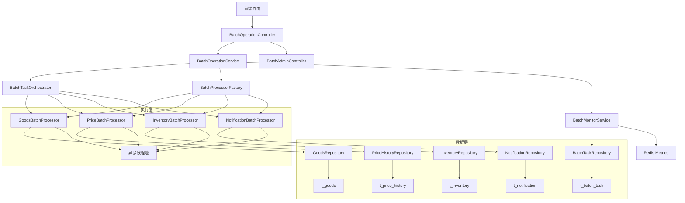
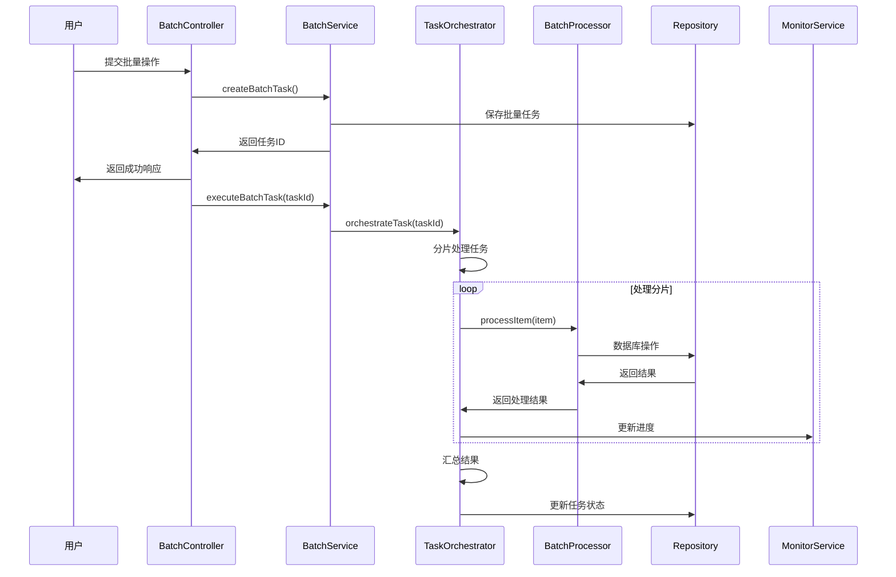
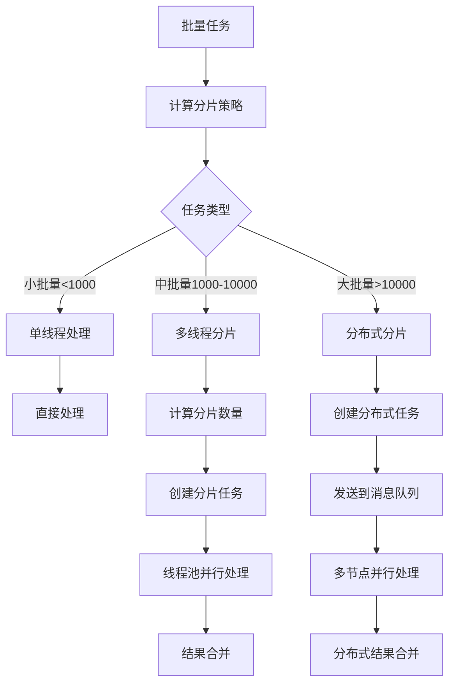

# 批量操作系统设计文档

## Overview

批量操作系统基于Spring Boot微服务架构，提供高性能的批量数据处理能力，支持商品批量操作、用户通知批量发送等功能，通过异步处理、分片执行、事务保障等机制确保大批量操作的可靠性和性能。

## Architecture

### 系统架构图



### 分层设计

#### 1. 表现层 (Presentation Layer)
- **BatchOperationController**: 商家端批量操作API
- **BatchAdminController**: 管理员端批量操作管理API
- **BatchMonitorController**: 批量操作监控API

#### 2. 业务层 (Business Layer)
- **BatchOperationService**: 批量操作业务逻辑
- **BatchTaskOrchestrator**: 批量任务编排器
- **BatchMonitorService**: 批量操作监控服务
- **BatchProcessorFactory**: 批量处理器工厂

#### 3. 执行层 (Execution Layer)
- **GoodsBatchProcessor**: 商品批量处理器
- **PriceBatchProcessor**: 价格批量处理器
- **InventoryBatchProcessor**: 库存批量处理器
- **NotificationBatchProcessor**: 通知批量处理器

#### 4. 数据层 (Data Layer)
- **BatchTaskRepository**: 批量任务数据访问
- 各业务域Repository复用现有组件

## Component Design

### 核心实体设计

#### BatchTask Entity
```java
@Entity
@Table(name = "t_batch_task")
public class BatchTask extends BaseEntity {
    @NotNull
    @Column(name = "task_code", unique = true, length = 50)
    private String taskCode;
    
    @NotNull
    @Enumerated(EnumType.STRING)
    @Column(name = "batch_type", nullable = false, length = 20)
    private BatchType batchType;
    
    @NotNull
    @Column(name = "user_id", nullable = false)
    private Long userId;
    
    @Column(name = "total_count", nullable = false)
    private Integer totalCount;
    
    @Column(name = "success_count", nullable = false)
    private Integer successCount = 0;
    
    @Column(name = "error_count", nullable = false)
    private Integer errorCount = 0;
    
    @NotNull
    @Enumerated(EnumType.STRING)
    @Column(name = "status", nullable = false, length = 20)
    private BatchTaskStatus status = BatchTaskStatus.PENDING;
    
    @Column(name = "start_time")
    private LocalDateTime startTime;
    
    @Column(name = "end_time")
    private LocalDateTime endTime;
    
    @Column(name = "estimated_duration")
    private Integer estimatedDuration; // 预计执行时间(秒)
    
    @Column(name = "progress_percentage")
    private Double progressPercentage = 0.0;
    
    @Lob
    @Column(name = "request_data")
    private String requestData; // JSON格式的请求数据
    
    @Lob
    @Column(name = "result_data")
    private String resultData; // JSON格式的执行结果
    
    @Column(name = "error_summary", length = 1000)
    private String errorSummary;
}
```

#### BatchTaskItem Entity
```java
@Entity
@Table(name = "t_batch_task_item")
public class BatchTaskItem extends BaseEntity {
    @NotNull
    @Column(name = "batch_task_id", nullable = false)
    private Long batchTaskId;
    
    @Column(name = "target_id", nullable = false)
    private Long targetId;
    
    @Column(name = "target_type", length = 20)
    private String targetType;
    
    @NotNull
    @Enumerated(EnumType.STRING)
    @Column(name = "status", nullable = false, length = 20)
    private BatchItemStatus status = BatchItemStatus.PENDING;
    
    @Lob
    @Column(name = "input_data")
    private String inputData;
    
    @Lob
    @Column(name = "output_data")
    private String outputData;
    
    @Column(name = "error_message", length = 500)
    private String errorMessage;
    
    @Column(name = "retry_count", nullable = false)
    private Integer retryCount = 0;
    
    @Column(name = "processing_time")
    private Integer processingTime; // 处理时间(毫秒)
    
    @Column(name = "shard_key", length = 50)
    private String shardKey; // 分片键
}
```

### 服务层设计

#### BatchOperationService 核心方法
```java
@Service
@Transactional
public interface BatchOperationService {
    
    /**
     * 创建批量任务
     * @param request 批量操作请求
     * @param userId 用户ID
     * @return 任务ID
     */
    Long createBatchTask(CreateBatchTaskRequest request, Long userId);
    
    /**
     * 执行批量任务
     * @param taskId 任务ID
     * @return 执行结果
     */
    BatchTaskResult executeBatchTask(Long taskId);
    
    /**
     * 取消批量任务
     * @param taskId 任务ID
     * @param userId 用户ID
     * @return 取消结果
     */
    boolean cancelBatchTask(Long taskId, Long userId);
    
    /**
     * 查询任务列表
     * @param userId 用户ID
     * @param status 任务状态
     * @param pageRequest 分页请求
     * @return 任务列表
     */
    Page<BatchTaskResponse> getUserBatchTasks(Long userId, BatchTaskStatus status, PageRequest pageRequest);
    
    /**
     * 查询任务详情
     * @param taskId 任务ID
     * @param userId 用户ID
     * @return 任务详情
     */
    BatchTaskDetailResponse getBatchTaskDetail(Long taskId, Long userId);
    
    /**
     * 查询任务进度
     * @param taskId 任务ID
     * @return 进度信息
     */
    BatchTaskProgressResponse getTaskProgress(Long taskId);
}
```

#### BatchTaskOrchestrator 核心方法
```java
@Component
public class BatchTaskOrchestrator {
    
    /**
     * 任务编排执行
     * @param taskId 任务ID
     */
    @Async
    public void orchestrateTask(Long taskId);
    
    /**
     * 任务分片处理
     * @param taskId 任务ID
     * @param shardId 分片ID
     */
    @Async
    public void processShard(Long taskId, String shardId);
    
    /**
     * 任务结果汇总
     * @param taskId 任务ID
     */
    private void aggregateResults(Long taskId);
    
    /**
     * 任务完成处理
     * @param taskId 任务ID
     */
    private void completeTask(Long taskId);
    
    /**
     * 任务异常处理
     * @param taskId 任务ID
     * @param exception 异常信息
     */
    private void handleTaskError(Long taskId, Exception exception);
}
```

### 批量处理器设计

#### GoodsBatchProcessor 商品批量处理器
```java
@Component
public class GoodsBatchProcessor implements BatchProcessor {
    
    private final GoodsRepository goodsRepository;
    private final AuditLogService auditLogService;
    private final CacheService cacheService;
    
    @Override
    public BatchType getSupportedType() {
        return BatchType.GOODS_BATCH;
    }
    
    @Override
    public BatchItemResult processItem(BatchTaskItem item) {
        Long startTime = System.currentTimeMillis();
        try {
            GoodsBatchRequest request = parseRequest(item.getInputData());
            BatchItemResult result = switch (request.getOperation()) {
                case BATCH_ONLINE -> batchOnlineGoods(request);
                case BATCH_OFFLINE -> batchOfflineGoods(request);
                case BATCH_DELETE -> batchDeleteGoods(request);
                default -> new BatchItemResult(false, "不支持的操作类型", null);
            };
            
            // 记录处理时间
            item.setProcessingTime((int) (System.currentTimeMillis() - startTime));
            return result;
            
        } catch (Exception e) {
            item.setErrorMessage(e.getMessage());
            return new BatchItemResult(false, e.getMessage(), null);
        }
    }
    
    private BatchItemResult batchOnlineGoods(GoodsBatchRequest request) {
        List<Goods> goodsList = goodsRepository.findAllById(request.getTargetIds());
        
        for (Goods goods : goodsList) {
            // 验证商品状态和完整性
            if (!validateGoodsForOnline(goods)) {
                continue;
            }
            
            // 更新商品状态
            goods.setStatus(GoodsStatus.ONLINE);
            goods.setUpdatedAt(LocalDateTime.now());
            
            // 清除缓存
            cacheService.evictGoodsCache(goods.getId());
            
            // 记录审计日志
            auditLogService.logEntityChange(
                SecurityUtil.getCurrentUserId(),
                SecurityUtil.getCurrentUserName(),
                AuditActionType.UPDATE,
                "Goods",
                goods.getId(),
                null,
                goods
            );
        }
        
        goodsRepository.saveAll(goodsList);
        return new BatchItemResult(true, "批量上架成功", goodsList.size());
    }
}
```

#### PriceBatchProcessor 价格批量处理器
```java
@Component
public class PriceBatchProcessor implements BatchProcessor {
    
    private final GoodsRepository goodsRepository;
    private final PriceHistoryRepository priceHistoryRepository;
    
    @Override
    public BatchItemResult processItem(BatchTaskItem item) {
        PriceBatchRequest request = parseRequest(item.getInputData());
        
        List<Goods> goodsList = goodsRepository.findAllById(request.getTargetIds());
        List<PriceHistory> priceHistories = new ArrayList<>();
        
        for (Goods goods : goodsList) {
            BigDecimal oldPrice = goods.getPrice();
            BigDecimal newPrice = calculateNewPrice(oldPrice, request.getPriceRule());
            
            // 验证价格调整幅度
            if (Math.abs(newPrice.doubleValue() - oldPrice.doubleValue()) / oldPrice.doubleValue() > 2.0) {
                throw new BusinessException("价格调整幅度超过200%");
            }
            
            // 记录价格历史
            PriceHistory history = PriceHistory.builder()
                .goodsId(goods.getId())
                .oldPrice(oldPrice)
                .newPrice(newPrice)
                .changeReason(request.getChangeReason())
                .changedBy(SecurityUtil.getCurrentUserId())
                .build();
            priceHistories.add(history);
            
            // 更新商品价格
            goods.setPrice(newPrice);
            goods.setUpdatedAt(LocalDateTime.now());
        }
        
        // 批量保存
        goodsRepository.saveAll(goodsList);
        priceHistoryRepository.saveAll(priceHistories);
        
        return new BatchItemResult(true, "价格调整成功", goodsList.size());
    }
}
```

### API设计

#### 商家端批量操作API
```java
@RestController
@RequestMapping("/api/batch")
@RequiredArgsConstructor
public class BatchOperationController {
    
    private final BatchOperationService batchOperationService;
    
    @PostMapping("/goods/online")
    @PreAuthorize("hasAuthority(T(com.campus.marketplace.common.security.PermissionCodes).SYSTEM_BATCH_GOODS_ONLINE)")
    public ApiResponse<Long> batchOnlineGoods(@Valid @RequestBody GoodsBatchRequest request) {
        Long userId = SecurityUtil.getCurrentUserId();
        CreateBatchTaskRequest batchRequest = CreateBatchTaskRequest.builder()
            .batchType(BatchType.GOODS_BATCH)
            .requestData(objectMapper.writeValueAsString(request))
            .build();
        return ApiResponse.success(batchOperationService.createBatchTask(batchRequest, userId));
    }
    
    @PostMapping("/goods/offline")
    @PreAuthorize("hasAuthority(T(com.campus.marketplace.common.security.PermissionCodes).SYSTEM_BATCH_GOODS_OFFLINE)")
    public ApiResponse<Long> batchOfflineGoods(@Valid @RequestBody GoodsBatchRequest request) {
        Long userId = SecurityUtil.getCurrentUserId();
        CreateBatchTaskRequest batchRequest = CreateBatchTaskRequest.builder()
            .batchType(BatchType.GOODS_BATCH)
            .requestData(objectMapper.writeValueAsString(request))
            .build();
        return ApiResponse.success(batchOperationService.createBatchTask(batchRequest, userId));
    }
    
    @PostMapping("/goods/price")
    @PreAuthorize("hasAuthority(T(com.campus.marketplace.common.security.PermissionCodes).SYSTEM_BATCH_GOODS_UPDATE)")
    public ApiResponse<Long> batchUpdatePrice(@Valid @RequestBody PriceBatchRequest request) {
        Long userId = SecurityUtil.getCurrentUserId();
        CreateBatchTaskRequest batchRequest = CreateBatchTaskRequest.builder()
            .batchType(BatchType.PRICE_BATCH)
            .requestData(objectMapper.writeValueAsString(request))
            .build();
        return ApiResponse.success(batchOperationService.createBatchTask(batchRequest, userId));
    }
    
    @PostMapping("/inventory/update")
    @PreAuthorize("hasAuthority(T(com.campus.marketplace.common.security.PermissionCodes).SYSTEM_BATCH_GOODS_UPDATE)")
    public ApiResponse<Long> batchUpdateInventory(@Valid @RequestBody InventoryBatchRequest request) {
        Long userId = SecurityUtil.getCurrentUserId();
        CreateBatchTaskRequest batchRequest = CreateBatchTaskRequest.builder()
            .batchType(BatchType.INVENTORY_BATCH)
            .requestData(objectMapper.writeValueAsString(request))
            .build();
        return ApiResponse.success(batchOperationService.createBatchTask(batchRequest, userId));
    }
    
    @GetMapping("/tasks")
    @PreAuthorize("hasAuthority(T(com.campus.marketplace.common.security.PermissionCodes).SYSTEM_BATCH_GOODS_VIEW)")
    public ApiResponse<Page<BatchTaskResponse>> getBatchTasks(
        @RequestParam(required = false) BatchTaskStatus status,
        Pageable pageable
    ) {
        Long userId = SecurityUtil.getCurrentUserId();
        PageRequest pageRequest = PageRequest.of(pageable.getPageNumber(), pageable.getPageSize());
        return ApiResponse.success(batchOperationService.getUserBatchTasks(userId, status, pageRequest));
    }
    
    @GetMapping("/tasks/{taskId}/progress")
    @PreAuthorize("hasAuthority(T(com.campus.marketplace.common.security.PermissionCodes).SYSTEM_BATCH_GOODS_VIEW)")
    public ApiResponse<BatchTaskProgressResponse> getTaskProgress(@PathVariable Long taskId) {
        return ApiResponse.success(batchOperationService.getTaskProgress(taskId));
    }
    
    @PostMapping("/tasks/{taskId}/cancel")
    @PreAuthorize("hasAuthority(T(com.campus.marketplace.common.security.PermissionCodes).SYSTEM_BATCH_GOODS_MANAGE)")
    public ApiResponse<Void> cancelBatchTask(@PathVariable Long taskId) {
        Long userId = SecurityUtil.getCurrentUserId();
        batchOperationService.cancelBatchTask(taskId, userId);
        return ApiResponse.success();
    }
}
```

## Data Flow

### 批量操作执行流程


### 任务分片策略


## Exception Handling

### 自定义异常
```java
public class BatchException extends BaseException {
    public BatchException(String message) {
        super(message);
    }
    
    public BatchException(ErrorCode errorCode, String message) {
        super(errorCode, message);
    }
}

public class BatchTaskNotFoundException extends BatchException {
    public BatchTaskNotFoundException(Long taskId) {
        super(ErrorCode.BATCH_TASK_NOT_FOUND, "批量任务不存在: " + taskId);
    }
}

public class BatchPermissionException extends BatchException {
    public BatchPermissionException(String message) {
        super(ErrorCode.BATCH_PERMISSION_DENIED, message);
    }
}

public class BatchLimitExceededException extends BatchException {
    public BatchLimitExceededException(String limitType, String limit) {
        super(ErrorCode.BATCH_LIMIT_EXCEEDED, 
              String.format("批量操作%s限制: %s", limitType, limit));
    }
}
```

## Performance Optimization

### 1. 分片处理策略
```java
@Configuration
public class BatchConfiguration {
    
    @Bean
    public TaskExecutor batchTaskExecutor() {
        ThreadPoolTaskExecutor executor = new ThreadPoolTaskExecutor();
        executor.setCorePoolSize(4);
        executor.setMaxPoolSize(20);
        executor.setQueueCapacity(1000);
        executor.setThreadNamePrefix("batch-");
        executor.setRejectedExecutionHandler(new ThreadPoolExecutor.CallerRunsPolicy());
        executor.initialize();
        return executor;
    }
    
    @Bean
    public BatchShardStrategy batchShardStrategy() {
        return new SmartShardStrategy(); // 智能分片策略
    }
}
```

### 2. 数据库优化
```sql
-- 批量任务表索引
CREATE INDEX idx_batch_task_user_id ON t_batch_task(user_id);
CREATE INDEX idx_batch_task_status ON t_batch_task(status);
CREATE INDEX idx_batch_task_created ON t_batch_task(created_at);
CREATE INDEX idx_batch_task_type ON t_batch_task(batch_type);

-- 批量任务项表索引
CREATE INDEX idx_batch_item_task_id ON t_batch_task_item(batch_task_id);
CREATE INDEX idx_batch_item_status ON t_batch_task_item(status);
CREATE INDEX idx_batch_item_shard ON t_batch_task_item(shard_key);
CREATE INDEX idx_batch_item_target ON t_batch_task_item(target_type, target_id);
```

### 3. 缓存优化
```java
@Service
public class BatchCacheService {
    
    @Cacheable(value = "batch:task:detail", key = "#taskId")
    public BatchTaskDetailResponse getTaskDetail(Long taskId) {
        // 从查询任务详情
    }
    
    @Cacheable(value = "batch:task:progress", key = "#taskId")
    public BatchTaskProgressResponse getTaskProgress(Long taskId) {
        // 查询任务进度
    }
    
    @CacheEvict(value = {"batch:task:detail", "batch:task:progress"}, key = "#taskId")
    public void evictTaskCache(Long taskId) {
        // 清除任务缓存
    }
}
```

## Security Considerations

### 1. 权限控制
- 批量操作权限分级：普通商家、VIP商家、管理员
- 批量数量限制：普通500个、VIP2000个、管理员不限
- 敏感操作二次验证

### 2. 限流保护
```java
@Component
public class BatchRateLimiter {
    
    private final RateLimiter userBatchLimiter = RateLimiter.create(0.1); // 用户10秒1次
    private final RateLimiter adminBatchLimiter = RateLimiter.create(1.0); // 管理员1秒1次
    
    public boolean tryAcquireBatchPermission(Long userId, boolean isAdmin) {
        if (isAdmin) {
            return adminBatchLimiter.tryAcquire();
        } else {
            return userBatchLimiter.tryAcquire();
        }
    }
}
```

### 3. 数据安全
- 批量请求数据加密存储
- 操作日志完整记录
- 定期数据备份

## Monitoring & Alerting

### 1. 关键指标监控
- 批量任务执行时间分布
- 批量操作成功率统计
- 系统资源使用情况

### 2. 实时监控
```java
@Component
public class BatchMetricsCollector {
    
    private final MeterRegistry meterRegistry;
    
    public void recordBatchExecution(String batchType, long duration, boolean success) {
        Timer.Sample sample = Timer.start(meterRegistry);
        sample.stop(Timer.builder("batch.execution.time")
            .tag("batch.type", batchType)
            .tag("success", String.valueOf(success))
            .register(meterRegistry));
        
        meterRegistry.counter("batch.execution.count",
            "batch.type", batchType,
            "success", String.valueOf(success)).increment();
    }
    
    public void recordBatchProgress(Long taskId, double progress) {
        meterRegistry.gauge("batch.task.progress", Tags.of("task.id", String.valueOf(taskId)), progress);
    }
}
```

### 3. 告警机制
- 批量任务堆积告警
- 系统资源告警
- 错误率阈值告警

## Integration Points

### 1. 权限系统集成
- 复用现有权限编码：SYSTEM_BATCH_GOODS_OFFLINE、SYSTEM_BATCH_GOODS_UPDATE等
- 集成RoleDefinition中的批量操作角色

### 2. 审计系统集成
- 批量操作审计记录
- 扩展AuditEntityType枚举：BATCH_OPERATION

### 3. 通知系统集成
- 批量任务完成通知
- 批量操作失败告警
- 进度实时推送

### 4. 外部系统集成
- 支持Excel文件导入
- 第三方物流批量查询
- 财务系统批量数据同步

## Deployment Considerations

### 1. 环境配置
```yaml
# 批量操作配置
batch:
  # 线程池配置
  thread-pool:
    core-size: 4
    max-size: 20
    queue-capacity: 1000
  
  # 分片配置
  shard:
    small-batch-size: 1000
    medium-batch-size: 10000
    shard-size: 100
  
  # 限流配置
  rate-limit:
    user-permits-per-second: 0.1
    admin-permits-per-second: 1.0
    vip-multiplier: 4.0
  
  # 权限配置
  limits:
    regular-user: 500
    vip-user: 2000
    admin: unlimited
```

### 2. 数据库配置
- 连接池配置优化
- 批量操作事务隔离级别
- 读写分离配置

### 3. 容器化部署
- 资源限制配置
- 健康检查配置
- 日志收集配置
- 监控集成配置

### 4. 扩容策略
- 水平扩容支持
- 负载均衡配置
- 分布式锁机制
- 数据分片策略
