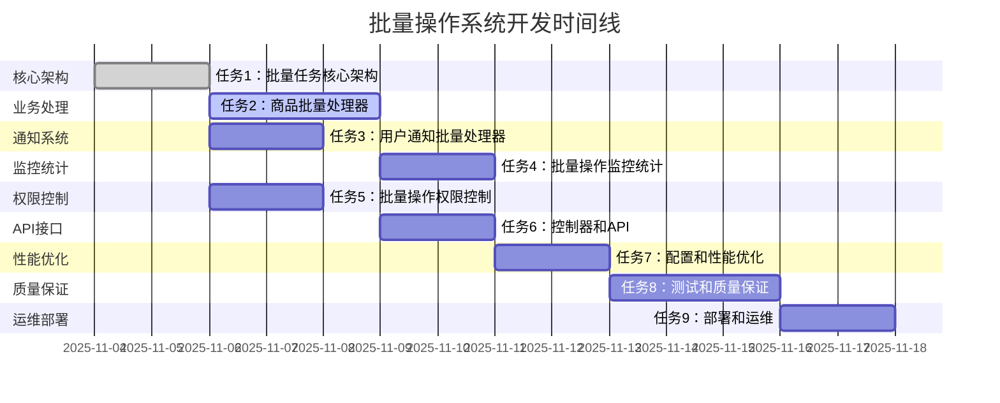

# 批量操作系统任务分解

## Overview

基于批量操作系统的设计文档，将系统开发分解为独立的、原子性的开发任务。每个任务遵循TDD原则，包含完整的测试、实现和验证步骤，确保代码质量和功能完整性。

## Task Breakdown

### 📦 任务 1: 批量任务核心架构 [x]

**_Prompt**: Implement the task for spec batch-operation-system, first run spec-workflow-guide to get the workflow guide then implement the task:
```text
**Role**: 架构工程师
**Task**: 开发批量操作系统的核心架构，包括BatchTask、BatchTaskItem实体、任务编排器、处理器工厂等核心组件，为批量操作提供稳定的基础设施。
**Constraints**:
- 架构设计必须支持多种批量操作类型的扩展
- 任务编排必须支持分片处理和异步执行
- 处理器工厂必须采用策略模式，支持插件化扩展
- 任务状态管理必须支持事务一致性
- 核心组件必须有完整的监控和日志记录
**_Leverage**: 现有的BaseEntity、JPA配置、Spring异步处理、策略模式实现、分布式锁
**_Requirements**: 需求74(商品批量上下架)、需求75(价格批量调整)、需求76(库存批量更新)、需求77(批量用户通知)
**Success**:
- 批量任务架构稳定，支持高并发处理
- 分片策略有效，能够处理超大批量数据
- 处理器工厂设计合理，易于扩展新操作类型
- 任务状态管理准确，支持异常恢复
- 架构性能达标，满足设计要求
**Instructions**: 按照以下步骤实施：
1. 编写核心架构的失败测试
2. 实现BatchTask和BatchTaskItem实体
3. 实现BatchTaskOrchestrator任务编排器
4. 实现BatchProcessorFactory处理器工厂
5. 实现任务状态管理和监控
6. 在tasks.md中将此任务标记为[-]进行中，完成后标记为[x]
```

#### 1.1 创建BatchTask实体 [x]
**文件**: `backend/src/main/java/com/campus/marketplace/common/entity/BatchTask.java`
**依赖**: `BaseEntity.java`, `BatchType.java`, `BatchTaskStatus.java`
**验收标准**:
- [x] 批量任务基础字段完整
- [x] 任务状态枚举支持所有业务状态
- [x] 任务进度跟踪字段准确
- [x] 任务执行时间统计完整
- [x] 查询索引优化配置

#### 1.2 创建BatchTaskItem实体 [x]
**文件**: `backend/src/main/java/com/campus/marketplace/common/entity/BatchTaskItem.java`
**依赖**: `BaseEntity.java`, `BatchTask.java`, `BatchItemStatus.java`
**验收标准**:
- [x] 任务项字段支持各种数据类型
- [x] 分片键支持分布式处理
- [x] 重试计数和处理时间记录
- [x] 错误信息记录完整
- [x] 与主表关联关系正确

#### 1.3 实现BatchTaskOrchestrator [x]
**文件**: `backend/src/main/java/com/campus/marketplace/service/batch/BatchTaskOrchestrator.java`
**依赖**: `BatchTaskRepository.java`, `ThreadPoolTaskExecutor.java`, `RedisTemplate.java`
**验收标准**:
- [x] 任务编排逻辑完整
- [x] 分片处理策略智能
- [x] 异步执行性能优化
- [x] 任务状态同步准确
- [x] 异常恢复机制有效

#### 1.4 实现BatchProcessorFactory [x]
**文件**: `backend/src/main/java/com/campus/marketplace/service/batch/BatchProcessorFactory.java`
**依赖**: `ApplicationContext.java`, `BatchProcessor.java`
**验收标准**:
- [x] 处理器注册和发现机制
- [x] 策略模式实现完整
- [x] 插件化扩展支持
- [x] 处理器生命周期管理
- [x] 性能监控和统计

---

### 📦 任务 2: 商品批量处理器 [x] [x]

**_Prompt**: Implement the task for spec batch-operation-system, first run spec-workflow-guide to get the workflow guide then implement the task:
```text
**Role**: 商品业务工程师
**Task**: 开发批量操作系统的商品批量处理器，实现商品批量上下架、批量删除、价格批量调整等功能，确保批量操作的高效性和数据一致性。
**Constraints**:
- 商品批量操作必须支持事务一致性
- 批量操作不能影响正常商品交易
- 处理错误必须是部分失败的，不影响其他商品处理
- 操作完成后必须缓存更新和通知发送
- 必须支持操作回滚和撤销功能
**_Leverage**: 现有的GoodsRepository、GoodsService、AuditLogService、CacheService、FileStorageService
**_Requirements**: 需求74(商品批量上下架)、需求75(价格批量调整)、需求76(库存批量更新)
**Success**:
- 商品批量操作功能完整正确
- 数据一致性得到保证
- 操作性能满足设计要求
- 错误处理和恢复机制完善
- 缓存和通知集成正常
**Instructions**: 按照以下步骤实施：
1. 编写商品批量操作的失败测试
2. 实现GoodsBatchProcessor处理器
3. 实现商品批量上下架功能
4. 实现价格批量调整功能
5. 实现库存批量更新功能
6. 在tasks.md中将此任务标记为[-]进行中，完成后标记为[x]
```

#### 2.1 创建GoodsBatchRequest DTO [x]
**文件**: `backend/src/main/java/com/campus/marketplace/common/dto/request/GoodsBatchRequest.java`
**依赖**: `BaseRequest.java`, `BatchOperationType.java`
**验收标准**:
- [x] 批量请求字段完整
- [x] 验证注解配置正确
- [x] 序列化和反序列化正常
- [x] 不同操作类型支持

#### 2.2 实现GoodsBatchProcessor [x]
**文件**: `backend/src/main/java/com/campus/marketplace/service/batch/processor/GoodsBatchProcessor.java`
**依赖**: `BatchProcessor.java`, `GoodsRepository.java`, `GoodsService.java`
**验收标准**:
- [x] 批量上下架功能实现
- [x] 批量删除机制完善
- [x] 商品状态验证准确
- [x] 事务管理正确
- [x] 性能优化有效

#### 2.3 实现PriceBatchProcessor [x]
**文件**: `backend/src/main/java/com/campus/marketplace/service/batch/processor/PriceBatchProcessor.java`
**依赖**: `BatchProcessor.java`, `GoodsRepository.java`
**验收标准**:
- [x] 价格调整逻辑正确
- [x] 调价幅度验证有效
- [x] 价格历史记录（审计日志）
- [x] 调价报告生成准确
- [x] 缓存集成正常

#### 2.4 实现InventoryBatchProcessor [x]
**文件**: `backend/src/main/java/com/campus/marketplace/service/batch/processor/InventoryBatchProcessor.java`
**依赖**: `BatchProcessor.java`, `GoodsRepository.java`
**验收标准**:
- [x] 库存数据处理正确
- [x] 库存更新事务安全
- [x] 错误处理和验证机制
- [x] 库存状态同步及时
- [x] 数据验证严格

---

### 📦 任务 3: 用户通知批量处理器 [x]

**_Prompt**: Implement the task for spec batch-operation-system, first run spec-workflow-guide to get the workflow guide then implement the task:
```text
**Role**: 通知系统工程师
**Task**: 开发批量操作系统的用户通知批量处理器，实现用户筛选、批量消息发送、发送结果跟踪等功能，确保通知的高效送达和准确的统计分析。
**Constraints**:
- 通知批量发送必须支持多种渠道（短信、邮件、站内信）
- 用户筛选必须支持复杂条件和组合查询
- 发送失败必须支持重试和降级策略
- 发送状态必须实时更新和可查询
- 批量发送不能影响系统性能
**_Leverage**: 现有的NotificationService、UserService、WebSocketManager、MessageQueue、短信网关、邮件服务
**_Requirements**: 需求77(批量用户通知)
**Success**:
- 批量通知发送功能完整可用
- 用户筛选精确，条件组合灵活
- 发送结果统计准确
- 失败重试和降级机制有效
- 系统性能稳定，无阻塞
**Instructions**: 按照以下步骤实施：
1. 编写通知批量操作的失败测试
2. 实现NotificationBatchProcessor处理器
3. 实现用户筛选和过滤逻辑
4. 实现多渠道消息发送
5. 实现发送状态跟踪和统计
6. 在tasks.md中将此任务标记为[-]进行中，完成后标记为[x]
```

#### 3.1 创建NotificationBatchRequest DTO
**文件**: `backend/src/main/java/com/campus/marketplace/common/dto/request/NotificationBatchRequest.java`
**依赖**: `BaseRequest.java`, `NotificationChannel.java`
**验收标准**:
- [ ] 批量通知请求字段完整
- [ ] 用户筛选条件灵活
- [ ] 消息模板支持变量替换
- [ ] 发送配置可定制

#### 3.2 实现NotificationBatchProcessor
**文件**: `backend/src/main/java/com/campus/marketplace/processor/notification/NotificationBatchProcessor.java`
**依赖**: `BatchProcessor.java`, `NotificationService.java`, `UserService.java`
**验收标准**:
- [ ] 用户筛选逻辑准确
- [ ] 多渠道发送功能完整
- [ ] 消息个性化正确
- [ ] 发送状态实时更新
- [ ] 异常处理和重试机制

#### 3.3 实现BatchUserFilter
**文件**: `backend/src/main/java/com/campus/marketplace/filter/BatchUserFilter.java`
**依赖**: `UserRepository.java`, `JPA Criteria API`
**验收标准**:
- [ ] 多条件用户筛选
- [ ] 组合查询支持
- [ ] 筛选性能优化
- [ ] 筛选结果缓存
- [ ] 权限检查集成

#### 3.4 实现BatchNotificationTracker
**文件**: `backend/src/main/java/com/campus/marketplace/tracker/BatchNotificationTracker.java`
**依赖**: `NotificationRepository.java`, `RedisTemplate.java`
**验收标准**:
- [ ] 发送状态追踪准确
- [ ] 统计数据实时更新
- [ ] 失败分析报告完整
- [ ] 发送性能监控
- [ ] 告警机制有效

---

### 📦 任务 4: 批量操作监控和统计 [x]

**_Prompt**: Implement the task for spec batch-operation-system, first run spec-workflow-guide to get the workflow guide then implement the task:
```text
**Role**: 监控系统工程师
**Task**: 开发批量操作系统的监控和统计功能，实现任务进度追踪、执行结果分析、性能指标收集、异常告警等功能，确保批量操作的可靠性和可维护性。
**Constraints**:
- 监控数据收集不能影响批量操作性能
- 进度更新必须是实时的，支持WebSocket推送
- 统计查询必须支持大数据量和复杂条件
- 异常告警必须及时准确
- 监控数据必须支持持久化和历史查询
**_Leverage**: 现有的监控系统、WebSocketManager、MeterRegistry、Redis缓存、消息队列
**_Requirements**: 需求78(批量操作监控和日志)
**Success**:
- 批量操作监控完整可用
- 进度推送及时准确
- 统计分析功能强大
- 异常告警机制有效
- 系统可观测性良好
**Instructions**: 按照以下步骤实施：
1. 编写监控统计的失败测试
2. 实现BatchMonitorService监控服务
3. 实现实时进度推送功能
4. 实现统计分析和报表功能
5. 实现异常告警和通知
6. 在tasks.md中将此任务标记为[-]进行中，完成后标记为[x]
```

#### 4.1 创建BatchMonitorService
**文件**: `backend/src/main/java/com/campus/marketplace/service/BatchMonitorService.java`
**依赖**: `BatchTaskRepository.java`, `WebSocketManager.java`
**验收标准**:
- [ ] 任务状态监控完整
- [ ] 进度计算准确
- [ ] 实时推送及时
- [ ] 监控性能优化
- [ ] 监控数据安全

#### 4.2 实现BatchMetricsCollector
**文件**: `backend/src/main/java/com/campus/marketplace/monitor/BatchMetricsCollector.java`
**依赖**: `MeterRegistry.java`, `BatchTaskOrchestrator.java`
**验收标准**:
- [ ] 性能指标收集完整
- [ ] 业务指标统计准确
- [ ] 指标存储和查询高效
- [ ] 告警阈值配置灵活
- [ ] 指标展示直观

#### 4.3 实现BatchAlertManager
**文件**: `backend/src/main/java/com/campus/marketplace/alert/BatchAlertManager.java`
**依赖**: `AlertService.java`, `NotificationService.java`
**验收标准**:
- [ ] 异常检测及时
- [ ] 告警规则灵活
- [ ] 告警送达率高
- [ ] 告警恢复及时
- [ ] 告警噪音控制

#### 4.4 实现BatchStatisticsService
**文件**: `backend/src/main/java/com/campus/marketplace/service/BatchStatisticsService.java`
**依赖**: `BatchTaskRepository.java`, `JdbcTemplate.java`
**验收标准**:
- [ ] 统计查询性能优化
- [ ] 多维度统计分析
- [ ] 报表生成准确
- [ ] 历史数据查询
- [ ] 统计数据缓存

---

### 📦 任务 5: 批量操作权限控制 [x]

**_Prompt**: Implement the task for spec batch-operation-system, first run spec-workflow-guide to get the workflow guide then implement the task:
```text
**Role**: 权限系统工程师
**Task**: 开发批量操作系统的权限控制功能，实现操作权限验证、批量数量限制、用户分级管理、安全审计等功能，确保批量操作的安全性和合规性。
**Constraints**:
- 权限验证必须高效，不能影响批量操作性能
- 批量数量限制必须区分用户级别
- 权限检查必须支持细粒度控制
- 操作审计必须完整记录
- 异常操作必须及时拦截
**_Leverage**: 现有的PermissionService、SecurityUtil、AuditLogService、权限编码定义、用户角色系统
**_Requirements**: 需求79(批量操作权限控制)
**Success**:
- 权限控制机制完善有效
- 用户分级管理合理
- 操作审计记录完整
- 安全防护措施到位
- 权限管理易于扩展
**Instructions**: 按照以下步骤实施：
1. 编写权限控制的失败测试
2. 实现BatchPermissionService权限服务
3. 实现批量数量限制机制
4. 实现操作权限验证
5. 实现操作审计和安全控制
6. 在tasks.md中将此任务标记为[-]进行中，完成后标记为[x]
```

#### 5.1 创建BatchPermissionService
**文件**: `backend/src/main/java/com/campus/marketplace/service/BatchPermissionService.java`
**依赖**: `PermissionService.java`, `UserService.java`, `RoleDefinition.java`
**验收标准**:
- [ ] 权限验证逻辑准确
- [ ] 用户级别判断正确
- [ ] 操作权限检查严格
- [ ] 权限验证性能优化
- [ ] 权限配置灵活

#### 5.2 实现BatchRateLimiter
**文件**: `backend/src/main/java/com/campus/marketplace/security/BatchRateLimiter.java`
**依赖**: `Guava RateLimiter.java`, `RedisTemplate.java`
**验收标准**:
- [ ] 限流策略合理
- [ ] 用户区分准确
- [ ] 限流性能高效
- [ ] 限流告警及时
- [ ] 限流配置可调整

#### 5.3 实现BatchSecurityValidator
**文件**: `backend/src/main/java/com/campus/marketplace/validator/BatchSecurityValidator.java`
**依赖**: `FileValidator.java`, `SQLInjectionChecker.java`
**验收标准**:
- [ ] 输入验证严格
- [ ] SQL注入防护
- [ ] XSS攻击防护
- [ ] 文件安全检查
- [ ] 恶意操作拦截

#### 5.4 实现BatchAuditService
**文件**: `backend/src/main/java/com/campus/marketplace/service/BatchAuditService.java`
**依赖**: `AuditLogService.java`, `BatchTaskRepository.java`
**验收标准**:
- [ ] 操作审计记录完整
- [ ] 审计数据结构化
- [ ] 审计查询高效
- [ ] 审计报表生成
- [ ] 审计数据安全

---

### 📦 任务 6: 批量操作控制器和API [x]

**_Prompt**: Implement the task for spec batch-operation-system, first run spec-workflow-guide to get the workflow guide then implement the task:
```text
**Role**: API架构工程师
**Task**: 开发批量操作系统的控制器和API接口，实现用户端批量操作API、管理员端管理API、任务查询API、进度跟踪API等功能，确保API的规范性和易用性。
**Constraints**:
- API设计必须遵循RESTful规范
- 参数验证必须严格，错误信息友好
- API响应必须统一格式，支持分页
- 异常处理必须全局统一
- API文档必须完整且可调试
**_Leverage**: 现有的BaseController、全局异常处理、权限验证、API文档系统、分页支持
**_Requirements**: 需求74(商品批量上下架)、需求75(价格批量调整)、需求76(库存批量更新)、需求77(批量用户通知)
**Success**:
- 所有API接口功能正常
- 参数验证和权限检查有效
- API响应格式统一规范
- 错误处理完善友好
- API文档完整可用
**Instructions**: 按照以下步骤实施：
1. 编写API接口的失败测试
2. 实现BatchOperationController用户API
3. 实现BatchAdminController管理API
4. 实现BatchMonitorController监控API
5. 配置API安全和验证
6. 在tasks.md中将此任务标记为[-]进行中，完成后标记为[x]
```

#### 6.1 创建批量请求响应DTO
**文件**: `backend/src/main/java/com/campus/marketplace/common/dto/response/BatchOperationResponse.java`
**文件**: `backend/src/main/java/com/campus/marketplace/common/dto/response/BatchTaskResponse.java`
**文件**: `backend/src/main/java/com/campus/marketplace/common/dto/response/BatchTaskProgressResponse.java`
**依赖**: `BaseResponse.java`, `BatchOperationResult.java`
**验收标准**:
- [ ] 批量操作响应结构完整
- [ ] 任务查询响应格式正确
- [ ] 进度信息推送及时
- [ ] 错误信息分类清晰
- [ ] 数据序列化正常

#### 6.2 实现BatchOperationController
**文件**: `backend/src/main/java/com/campus/marketplace/controller/BatchOperationController.java`
**依赖**: `BatchOperationService.java`, `BaseController.java`
**验收标准**:
- [ ] 商品批量操作API完整
- [ ] 参数验证严格有效
- [ ] 权限检查准确
- [ ] 错误处理友好
- [ ] API文档完整

#### 6.3 实现BatchAdminController
**文件**: `backend/src/main/java/com/campus/marketplace/controller/BatchAdminController.java`
**依赖**: `BatchAdminService.java`, `BaseController.java`
**验收标准**:
- [ ] 管理员API功能完整
- [ ] 管理操作权限验证
- [ ] 任务管理功能正常
- [ ] 统计查询高效
- [ ] 操作审计记录

#### 6.4 实现BatchMonitorController
**文件**: `backend/src/main/java/com/campus/marketplace/controller/BatchMonitorController.java`
**依赖**: `BatchMonitorService.java`, `WebSocketController.java`
**验收标准**:
- [ ] 监控API功能完整
- [ ] 进度查询实时准确
- [ ] WebSocket推送稳定
- [ ] 统计数据准确
- [ ] 告警接口有效

---

### 📦 任务 7: 批量操作配置和性能优化 [x]

**_Prompt**: Implement the task for spec batch-operation-system, first run spec-workflow-guide to get the workflow guide then implement the task:
```text
**Role**: 性能优化工程师
**Task**: 开发批量操作系统的配置和性能优化功能，包括线程池配置、分片策略优化、缓存配置、数据库优化等功能，确保批量操作的高性能和可扩展性。
**Constraints**:
- 配置必须支持多环境动态调整
- 性能优化不能影响功能正确性
- 线程池配置必须合理可控
- 分片策略必须支持自动调整
- 优化效果必须可测量
**_Leverage**: 现有的配置管理系统、缓存系统、数据库连接池、性能测试工具、监控系统
**_Requirements**: 所有批量操作都需要性能优化
**Success**:
- 批量操作性能指标达标
- 系统资源利用率合理
- 配置管理灵活易用
- 优化效果可观测
- 系统可扩展性良好
**Instructions**: 按照以下步骤实施：
1. 编写性能测试基准
2. 优化线程池和分片配置
3. 实现缓存策略
4. 优化数据库查询
5. 集成性能监控
6. 在tasks.md中将此任务标记为[-]进行中，完成后标记为[x]
```

#### 7.1 创建批量操作配置
**文件**: `backend/src/main/resources/application-batch.yml`
**文件**: `backend/src/main/java/com/campus/marketplace/config/BatchConfiguration.java`
**依赖**: `ConfigurationProperties.java`, `ThreadPoolTaskExecutor.java`
**验收标准**:
- [ ] 配置项完整准确
- [ ] 多环境支持
- [ ] 配置验证有效
- [ ] 默认值合理
- [ ] 配置文档完整

#### 7.2 优化分片策略
**文件**: `backend/src/main/java/com/campus/marketplace/strategy/SmartShardStrategy.java`
**依赖**: `BatchTaskSizeCalculator.java`, `ResourceMonitor.java`
**验收标准**:
- [ ] 分片计算准确
- [ ] 自适应调整有效
- [ ] 资源利用优化
- [ ] 性能提升明显
- [ ] 策略配置灵活

#### 7.3 配置缓存策略
**文件**: `backend/src/main/java/com/campus/marketplace/cache/BatchCacheManager.java`
**依赖**: `RedisTemplate.java`, `CacheConfiguration.java`
**验收标准**:
- [ ] 缓存策略合理
- [ ] 缓存命中率达标
- [ ] 缓存一致性保证
- [ ] 缓存性能优化
- [ ] 缓存监控完善

#### 7.4 优化数据库查询
**文件**: `backend/src/main/java/com/campus/marketplace/repository/impl/BatchTaskRepositoryImpl.java`
**依赖**: `EntityManager.java`, `JPA Criteria API`
**验收标准**:
- [ ] 查询性能优化
- [ ] N+1查询问题解决
- [ ] 批量操作优化
- [ ] 查询缓存集成
- [ ] 查询监控完备

---

### 📦 任务 8: 批量操作测试和质量保证

**_Prompt**: Implement the task for spec batch-operation-system, first run spec-workflow-guide to get the workflow guide then implement the task:
```text
**Role**: 测试质量工程师
**Task**: 开发批量操作系统的测试和质量保证功能，包括单元测试、集成测试、性能测试、压力测试等功能，确保系统的稳定性和可靠性。
**Constraints**:
- 测试覆盖率必须≥85%
- 性能测试必须满足设计指标
- 集成测试必须覆盖主要流程
- 测试环境必须可重复使用
- 测试报告必须完整准确
**_Leverage**: 现有的测试框架、性能测试工具、测试数据管理、持续集成系统
**_Requirements**: 覆盖所有批量操作功能的测试
**Success**:
- 所有测试用例通过
- 测试覆盖率达标
- 性能指标满足要求
- 测试文档完整
- 质量门禁有效
**Instructions**: 按照以下步骤实施：
1. 设计测试策略和用例
2. 实现单元测试
3. 实现集成测试
4. 实现性能测试
5. 配置质量门禁
6. 在tasks.md中将此任务标记为[-]进行中，完成后标记为[x]
```

#### 8.1 创建单元测试套件
**文件**: `backend/src/test/java/com/campus/marketplace/service/BatchOperationServiceTest.java`
**文件**: `backend/src/test/java/com/campus/marketplace/processor/GoodsBatchProcessorTest.java`
**依赖**: `JUnit5.java`, `Mockito.java`, `Spring Boot Test`
**验收标准**:
- [ ] 核心业务逻辑测试完整
- [ ] 边界条件测试覆盖
- [ ] 异常处理测试有效
- [ ] 测试数据管理规范
- [ ] 测试执行效率高

#### 8.2 创建集成测试套件
**文件**: `backend/src/test/java/com/campus/marketplace/integration/BatchOperationIntegrationTest.java`
**文件**: `backend/src/test/java/com/campus/marketplace/integration/BatchControllerTest.java`
**依赖**: `@SpringBootTest.java`, `TestContainers.java`, `MockMvc.java`
**验收标准**:
- [ ] API集成测试完整
- [ ] 数据库集成稳定
- [ ] 事务测试有效
- [ ] 异常场景覆盖
- [ ] 测试环境隔离

#### 8.3 创建性能测试套件
**文件**: `backend/src/test/java/com/campus/marketplace/performance/BatchOperationPerformanceTest.java`
**文件**: `backend/src/test/java/com/campus/marketplace/performance/BatchConcurrencyTest.java`
**依赖**: `JMH.java`, `Gatling.java`, `性能监控工具`
**验收标准**:
- [ ] 性能基准测试准确
- [ ] 并发测试稳定性
- [ ] 资源使用监控
- [ ] 性能回归检测
- [ ] 性能报告完整

#### 8.4 配置质量门禁
**文件**: `backend/scripts/quality-gate-check.sh`
**依赖**: `JUnit.java`, `Jacoco.java`, `SonarQube.java`
**验收标准**:
- [ ] 代码覆盖率检查
- [ ] 质量指标检查
- [ ] 性能指标检查
- [ ] 安全扫描检查
- [ ] 告警机制有效

---

### 📦 任务 9: 批量操作部署和运维

**_Prompt**: Implement the task for spec batch-operation-system, first run spec-workflow-guide to get the workflow guide then implement the task:
```text
**Role**: DevOps工程师
**Task**: 开发批量操作系统的部署和运维功能，包括容器化部署、配置管理、监控告警、日志收集、故障恢复等功能，确保系统的可维护性和可部署性。
**Constraints**:
- 部署必须支持多环境
- 监控必须覆盖关键指标
- 日志必须集中管理
- 故障恢复必须自动化
- 运维文档必须完整
**_Leverage**: 现有的Docker配置、Kubernetes配置、监控系统、日志系统、运维脚本
**_Requirements**: 支持系统生产环境部署和运维
**Success**:
- 部署流程自动化稳定
- 监控告警及时有效
- 日志收集分析完善
- 故障处理快速响应
- 运维文档详细准确
**Instructions**: 按照以下步骤实施：
1. 设计部署架构
2. 创建容器化配置
3. 配置监控告警
4. 设置日志收集
5. 准备运维文档
6. 在tasks.md中将此任务标记为[-]进行中，完成后标记为[x]
```

#### 9.1 创建Docker配置
**文件**: `docker/batch/Dockerfile`
**文件**: `docker/batch/docker-compose.yml`
**依赖**: `OpenJDK.java`, `Spring Boot.java`
**验收标准**:
- [ ] Dockerfile优化合理
- [ ] 镜像大小控制优秀
- [ ] 安全配置严格
- [ ] 启动速度较快
- [ ] 健康检查完善

#### 9.2 创建Kubernetes配置
**文件**: `k8s/batch/deployment.yaml`
**文件**: `k8s/batch/service.yaml`
**文件**: `k8s/batch/ingress.yaml`
**依赖**: `Kubernetes API`
**验收标准**:
- [ ] 资源配置合理
- [ ] 健康检查有效
- [ ] 服务发现正常
- [ ] 网络策略安全
- [ ] 扩缩容支持

#### 9.3 配置监控和告警
**文件**: `monitoring/batch/prometheus.yml`
**文件**: `monitoring/batch/grafana-dashboard.json`
**依赖**: `Prometheus.java`, `Grafana.java`
**验收标准**:
- [ ] 监控指标完整
- [ ] 告警规则合理
- [ ] 仪表板直观
- [ ] 数据收集稳定
- [ ] 告警通知及时

#### 9.4 设置日志收集
**文件**: `logging/batch/logback-spring.xml`
**文件**: `logging/batch/fluentd.conf`
**依赖**: `Logback.java`, `ELK Stack.java`
**验收标准**:
- [ ] 日志格式统一规范
- [ ] 日志级别配置合理
- [ ] 日志收集完整
- [ ] 日志查询便捷
- [ ] 日志归档有效

#### 9.5 创建运维文档
**文件**: `docs/ops/batch-deployment-guide.md`
**文件**: `docs/ops/batch-troubleshooting-guide.md`
**验收标准**:
- [ ] 部署指南详细准确
- [ ] 运维手册实用完整
- [ ] 故障处理及时有效
- [ ] 性能调优指导
- [ ] 安全配置规范

---

## 任务依赖关系



## 质量检查清单

### 架构设计检查
- [ ] **第0步复用检查**: 复用现有架构组件，避免重复创建
- [ ] **第1步测试先行**: 核心组件先写测试用例
- [ ] **分片策略**: 大批量数据使用合理分片算法
- [ ] **异步处理**: 使用Spring异步机制，避免阻塞主线程
- [ ] **事务管理**: 批量操作使用适当的事务隔离级别

### 性能优化检查
- [ ] **线程池配置**: 根据系统资源合理配置线程池参数
- [ ] **缓存策略**: 热点数据缓存，命中率≥80%
- [ ] **数据库优化**: 批量SQL操作，减少数据库交互
- [ **内存管理**:大批量数据处理避免OOM，使用流式处理
- [ ] **监控指标**: 关键性能指标实时监控

### 安全性检查
- [ ] **权限验证**: 严格检查批量操作权限
- [ ] **数量限制**: 根据用户级别限制批量操作数量
- [ ] **安全审计**: 记录所有批量操作日志
- [ ] **输入验证**: 严格验证批量操作输入参数
- [ ] **防攻击**: 实施限流和防爬虫机制

### 可靠性检查
- [ ] **容错处理**: 部分失败不影响整体任务
- [ ] **重试机制**: 临时故障自动重试
- [ ] **状态管理**: 任务状态准确记录和恢复
- [ ] **异常恢复**: 系统故障后任务自动恢复
- [ ] **数据一致**: 批量操作数据一致性保障

### 可维护性检查
- [ ] **配置管理**: 支持多环境配置，配置热更新
- [ ] **日志规范**: 日志格式统一，包含关键上下文信息
- [ ] **监控告警**: 关键指标监控，及时告警通知
- [ ] **文档齐全**: 设计文档、API文档、运维文档完整
- [ ] **代码规范**: 遵循项目编码规范，注释详细

## 验收标准

### 功能验收
- ✅ 商品批量上下架功能完整正确
- ✅ 价格批量调整功能稳定可用
- ✅ 库存批量更新功能高效可靠
- ✅ 用户通知批量发送功能正常
- ✅ 任务监控和统计功能完善

### 性能验收
- ✅ 批量操作启动响应时间 < 1s
- ✅ 单个批量任务处理速度 ≥ 1000条/秒
- ✅ 支持1000+并发批量任务提交
- ✅ 批量操作状态更新实时性 < 500ms
- ✅ 系统内存和CPU使用率合理

### 安全验收
- ✅ 权限验证严格，非法操作被正确拦截
- ✅ 批量操作数量限制有效
- ✅ 操作审计日志记录完整
- ✅ 输入验证严格，SQL注入防护有效
- ✅ 系统异常信息不泄露敏感数据

### 可靠性验收
- ✅ 批量操作成功率 ≥ 99.5%
- ✅ 系统故障恢复时间 < 5分钟
- ✅ 任务状态管理准确，支持异常恢复
- ✅ 数据一致性保障，无数据丢失
- ✅ 系统高可用，单节点故障不影响服务

### 可扩展性验收
- ✅ 支持新增批量操作类型
- ✅ 配置模块化，支持灵活调整
- ✅ 处理器插件化，易于扩展
- ✅ 监控指标可定制
- ✅ 部署支持水平扩展

---

**实施说明**: 每个任务完成后，请在tasks.md中更新任务状态，标记为[x]。注意任务间的依赖关系，确保前置任务质量达标后再开始后续任务。批量操作涉及大量数据，请确保数据安全和性能优化到位。
