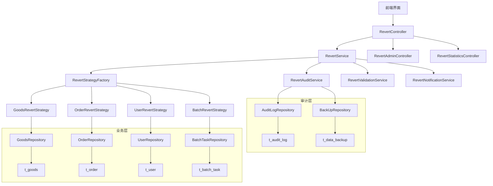
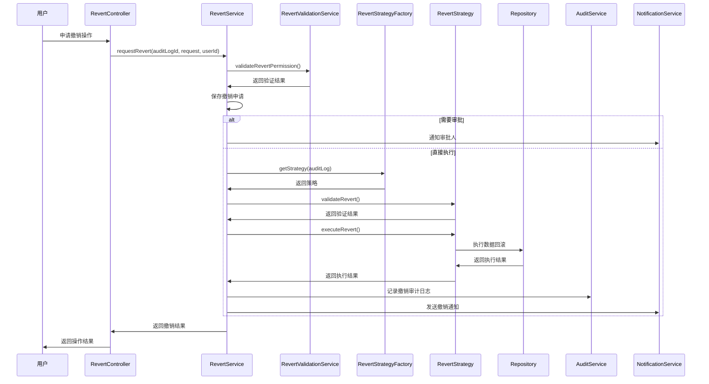
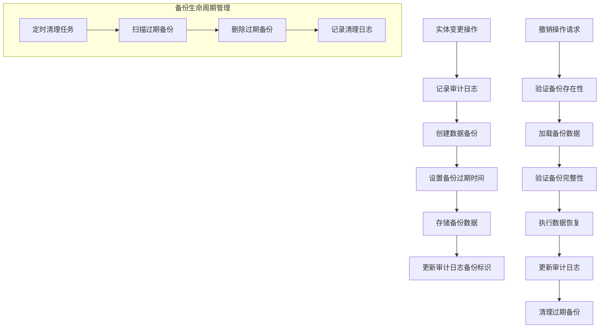

# 数据撤销系统设计文档

## Overview

数据撤销系统基于事件溯源和审计回滚机制，通过记录实体变更历史、提供撤销策略、确保数据一致性等功能，为平台用户提供操作撤销能力。系统与现有审计日志深度集成，支持多实体类型的撤销操作，确保数据操作的安全性和可追溯性。

## Architecture

### 系统架构图



### 分层设计

#### 1. 表现层 (Presentation Layer)
- **RevertController**: 用户端撤销操作API
- **RevertAdminController**: 管理员端撤销管理API
- **RevertStatisticsController**: 撤销统计分析API

#### 2. 业务层 (Business Layer)
- **RevertService**: 撤销业务逻辑处理
- **RevertStrategyFactory**: 撤销策略工厂
- **RevertAuditService**: 撤销审计服务
- **RevertValidationService**: 撤销验证服务
- **RevertNotificationService**: 撤销通知服务

#### 3. 策略层 (Strategy Layer)
- **GoodsRevertStrategy**: 商品撤销策略
- **OrderRevertStrategy**: 订单撤销策略
- **UserRevertStrategy**: 用户撤销策略
- **BatchRevertStrategy**: 批量操作撤销策略

#### 4. 数据层 (Data Layer)
- **AuditLogRepository**: 审计日志数据访问（复用现有）
- **DataBackupRepository**: 数据备份数据访问
- 各业务域Repository（复用现有）

## Component Design

### 核心扩展设计

#### AuditLog扩展 - 支持撤销追踪
```java
@Entity
@Table(name = "t_audit_log")
public class AuditLog extends BaseEntity {
    // ... 现有字段 ...
    
    // 撤销相关扩展字段
    @Column(name = "is_reversible")
    @Builder.Default
    private Boolean isReversible = false;
    
    @Column(name = "revert_deadline")
    private LocalDateTime revertDeadline;
    
    @Column(name = "reverted_by_log_id")
    private Long revertedByLogId;
    
    @Column(name = "reverted_at")
    private LocalDateTime revertedAt;
    
    @Column(name = "revert_count")
    @Builder.Default
    private Integer revertCount = 0;
}
```

#### RevertRequest Entity
```java
@Entity
@Table(name = "t_revert_request")
public class RevertRequest extends BaseEntity {
    @NotNull
    @Column(name = "audit_log_id", nullable = false)
    private Long auditLogId;
    
    @NotNull
    @Column(name = "requester_id", nullable = false)
    private Long requesterId;
    
    @NotNull
    @Column(name = "requester_type", nullable = false, length = 20)
    private RequesterType requesterType;
    
    @NotNull
    @Enumerated(EnumType.STRING)
    @Column(name = "status", nullable = false, length = 20)
    private RevertRequestStatus status = RevertRequestStatus.PENDING;
    
    @Column(name = "reason", length = 500)
    private String reason;
    
    @Column(name = "approved_by")
    private Long approvedBy;
    
    @Column(name = "approved_at")
    private LocalDateTime approvedAt;
    
    @Column(name = "revert_log_id")
    private Long revertLogId;
    
    @Column(name = "executed_at")
    private LocalDateTime executedAt;
}
```

#### DataBackup Entity
```java
@Entity
@Table(name = "t_data_backup")
public class DataBackup extends BaseEntity {
    @NotNull
    @Column(name = "entity_type", nullable = false, length = 20)
    private String entityType;
    
    @NotNull
    @Column(name = "entity_id", nullable = false)
    private Long entityId;
    
    @Lob
    @Column(name = "backup_data", columnDefinition = "MEDIUMTEXT")
    private String backupData; // JSON格式的完整数据备份
    
    @Column(name = "backup_version", nullable = false)
    private Integer backupVersion;
    
    @NotNull
    @Column(name = "expire_at", nullable = false)
    private LocalDateTime expireAt;
    
    @Column(name = "is_active")
    @Builder.Default
    private Boolean isActive = true;
}
```

### 服务层设计

#### RevertService 核心方法
```java
@Service
@Transactional
public interface RevertService {
    
    /**
     * 申请撤销操作
     * @param auditLogId 审计日志ID
     * @param request 撤销申请请求
     * @param applicantId 申请人ID
     * @return 申请结果
     */
    RevertResult requestRevert(Long auditLogId, CreateRevertRequest request, Long applicantId);
    
    /**
     * 执行撤销操作
     * @param revertRequestId 撤销请求ID
     * @param approverId 审批人ID
     * @return 执行结果
     */
    RevertResult executeRevert(Long revertRequestId, Long approverId);
    
    /**
     * 查询可撤销的操作列表
     * @param userId 用户ID
     * @param entityType 实体类型
     * @param pageRequest 分页请求
     * @return 可撤销操作列表
     */
    Page<RevertableOperationResponse> getRevertableOperations(Long userId, String entityType, PageRequest pageRequest);
    
    /**
     * 查询撤销历史记录
     * @param userId 用户ID
     * @param pageRequest 分页请求
     * @return 撤销历史记录
     */
    Page<RevertHistoryResponse> getRevertHistory(Long userId, PageRequest pageRequest);
    
    /**
     * 验证撤销权限
     * @param auditLogId 审计日志ID
     * @param userId 用户ID
     * @return 验证结果
     */
    boolean validateRevertPermission(Long auditLogId, Long userId);
}
```

#### RevertStrategyFactory 策略工厂
```java
@Component
public class RevertStrategyFactory {
    
    private final Map<String, RevertStrategy> revertStrategies;
    
    public RevertStrategyFactory() {
        Map<String, RevertStrategy> strategies = new HashMap<>();
        strategies.put("Goods", new GoodsRevertStrategy());
        strategies.put("Order", new OrderRevertStrategy());
        strategies.put("User", new UserRevertStrategy());
        strategies.put("BatchOperation", new BatchRevertStrategy());
        this.revertStrategies = Collections.unmodifiableMap(strategies);
    }
    
    public RevertStrategy getStrategy(AuditLog auditLog) {
        String entityType = auditLog.getEntityType();
        RevertStrategy strategy = revertStrategies.get(entityType);
        if (strategy == null) {
            throw new RevertException("不支持的撤销实体类型: " + entityType);
        }
        return strategy;
    }
    
    public Set<String> getSupportedEntityTypes() {
        return revertStrategies.keySet();
    }
}
```

#### 撤销策略接口
```java
public interface RevertStrategy {
    
    /**
     * 获取支持的实体类型
     */
    String getSupportedEntityType();
    
    /**
     * 验证撤销条件
     * @param auditLog 审计日志
     * @param revertRequest 撤销请求
     * @return 验证结果
     */
    RevertValidationResult validateRevert(AuditLog auditLog, RevertRequest revertRequest);
    
    /**
     * 执行撤销操作
     * @param auditLog 审计日志
     * @param revertRequest 撤销请求
     * @return 撤销结果
     */
    RevertExecutionResult executeRevert(AuditLog auditLog, RevertRequest revertRequest);
    
    /**
     * 撤销后处理
     * @param auditLog 原审计日志
     * @param revertAuditLog 撤销审计日志
     * @param result 撤销结果
     */
    void postRevertProcess(AuditLog auditLog, AuditLog revertAuditLog, RevertExecutionResult result);
    
    /**
     * 获取撤销时限（天）
     */
    int getRevertTimeLimitDays();
    
    /**
     * 是否需要审批
     */
    boolean requiresApproval(AuditLog auditLog, Long applicantId);
}
```

### 具体策略实现

#### GoodsRevertStrategy 商品撤销策略
```java
@Component
public class GoodsRevertStrategy implements RevertStrategy {
    
    private final GoodsRepository goodsRepository;
    private final FileStorageService fileStorageService;
    private final OrderService orderService;
    private final RevertNotificationService notificationService;
    
    @Override
    public String getSupportedEntityType() {
        return "Goods";
    }
    
    @Override
    public RevertValidationResult validateRevert(AuditLog auditLog, RevertRequest revertRequest) {
        // 1. 检查撤销时限
        if (auditLog.getCreatedAt().plusDays(30).isBefore(LocalDateTime.now())) {
            return RevertValidationResult.failed("商品删除超过30天，无法撤销");
        }
        
        // 2. 检查商品是否影响交易
        Long goodsId = auditLog.getEntityId();
        Long activeOrderCount = orderService.countActiveOrdersByGoodsId(goodsId);
        if (activeOrderCount > 0) {
            return RevertValidationResult.warning(
                "商品存在" + activeOrderCount + "个进行中的订单，撤销可能影响交易");
        }
        
        // 3. 检查文件资源是否存在
        if (auditLog.getActionType() == AuditActionType.DELETE) {
            if (!fileStorageService.checkFilesExist(goodsId)) {
                return RevertValidationResult.failed("商品相关资源文件已被清理，无法完全恢复");
            }
        }
        
        return RevertValidationResult.success();
    }
    
    @Override
    public RevertExecutionResult executeRevert(AuditLog auditLog, RevertRequest revertRequest) {
        Long goodsId = auditLog.getEntityId();
        
        try {
            if (auditLog.getActionType() == AuditActionType.DELETE) {
                return undeleteGoods(goodsId, auditLog, revertRequest);
            } else if (auditLog.getActionType() == AuditActionType.UPDATE) {
                return updateGoods(goodsId, auditLog, revertRequest);
            } else {
                throw new RevertException("不支持的操作类型: " + auditLog.getActionType());
            }
        } catch (Exception e) {
            throw new RevertException("商品撤销执行失败", e);
        }
    }
    
    private RevertExecutionResult undeleteGoods(Long goodsId, AuditLog auditLog, RevertRequest revertRequest) {
        // 1. 从备份恢复商品基本数据
        DataBackup backup = dataBackupRepository.findByEntityIdAndEntityType(goodsId, "Goods")
            .orElseThrow(() -> new RevertException("商品备份数据不存在"));
        
        ObjectMapper objectMapper = new ObjectMapper();
        Goods restoredGoods = objectMapper.readValue(backup.getBackupData(), Goods.class);
        
        // 2. 恢复商品状态
        restoredGoods.setId(goodsId);
        restoredGoods.setStatus(GoodsStatus.OFFLINE); // 撤销后默认下线
        restoredGoods.setDeleted(false);
        restoredGoods.setUpdatedAt(LocalDateTime.now());
        restoredGoods.setUpdatedBy(revertRequest.getRequesterId());
        
        // 3. 保存恢复的商品
        goodsRepository.save(restoredGoods);
        
        // 4. 恢复文件关联
        fileStorageService.restoreGoodsFileReferences(goodsId);
        
        return RevertExecutionResult.success("商品删除撤销成功", goodsId);
    }
    
    @Override
    public void postRevertProcess(AuditLog auditLog, AuditLog revertAuditLog, RevertExecutionResult result) {
        // 更新原审计日志的撤销信息
        auditLog.setRevertedByLogId(revertAuditLog.getId());
        auditLog.setRevertedAt(LocalDateTime.now());
        auditLog.setRevertCount(auditLog.getRevertCount() + 1);
        auditLogRepository.save(auditLog);
        
        // 清除相关缓存
        cacheService.evictGoodsCache(auditLog.getEntityId());
        
        // 发送撤销通知
        notificationService.sendRevertNotification(revertAuditLog, result);
    }
}
```

#### OrderRevertStrategy 订单撤销策略
```java
@Component
public class OrderRevertStrategy implements RevertStrategy {
    
    private final OrderRepository orderRepository;
    private final PaymentService paymentService;
    private final RefundService refundService;
    
    @Override
    public String getSupportedEntityType() {
        return "Order";
    }
    
    @Override
    public int getRevertTimeLimitDays() {
        return 7; // 订单只能撤销7天内的状态变更
    }
    
    @Override
    public boolean requiresApproval(AuditLog auditLog, Long applicantId) {
        // 如果涉及资金退款，需要审批
        return auditLog.getEntityType().equals("Order") && 
               auditLog.getActionType() == AuditActionType.UPDATE;
    }
    
    @Override
    public RevertExecutionResult executeRevert(AuditLog auditLog, RevertRequest revertRequest) {
        Long orderId = auditLog.getEntityId();
        Order order = orderRepository.findById(orderId)
            .orElseThrow(() -> new RevertException("订单不存在"));
        
        try {
            String oldValue = auditLog.getOldValue();
            String newValue = auditLog.getNewValue();
            
            // 解析变更数据
            ObjectMapper mapper = new ObjectMapper();
            OrderStatus oldStatus = mapper.readTree(oldValue).get("status").asText();
            OrderStatus currentStatus = order.getStatus();
            
            // 根据原状态执行撤销逻辑
            switch (oldStatus) {
                case DELIVERED:
                    return revertDeliveredStatus(order, revertRequest);
                case PAID:
                    return revertPaidStatus(order, revertRequest);
                case CONFIRMED:
                    return revertConfirmedStatus(order, revertRequest);
                default:
                    throw new RevertException("不支持撤销到状态: " + oldStatus);
            }
        } catch (Exception e) {
            throw new RevertException("订单状态撤销执行失败", e);
        }
    }
    
    private RevertExecutionResult revertDeliveredStatus(Order order, RevertRequest revertRequest) {
        // 1. 检查是否在7天内
        if (order.getUpdatedAt().plusDays(7).isBefore(LocalDateTime.now())) {
            throw new RevertException("订单确认收货超过7天，无法撤销");
        }
        
        // 2. 检查资金结算状态
        Payment payment = paymentService.findByOrderId(order.getId());
        if (payment.isSettled()) {
            throw new RevertException("资金已结算，无法撤销");
        }
        
        // 3. 执行退款
        RefundRequest refundRequest = RefundRequest.builder()
            .orderId(order.getId())
            .amount(order.getActualAmount())
            .reason("用户误操作确认收货")
            .requesterId(revertRequest.getRequesterId())
            .build();
        
        RefundResult refundResult = refundService.processRefund(refundRequest);
        if (!refundResult.isSuccess()) {
            throw new RevertException("退款处理失败: " + refundResult.getMessage());
        }
        
        // 4. 恢复订单状态
        order.setStatus(OrderStatus.SHIPPED);
        order.setUpdatedAt(LocalDateTime.now());
        order.setUpdatedBy(revertRequest.getRequesterId());
        orderRepository.save(order);
        
        return RevertExecutionResult.success("订单状态撤销成功，退款处理中", order.getId());
    }
}
```

### API设计

#### 用户端撤销操作API
```java
@RestController
@RequestMapping("/api/revert")
@RequiredArgsConstructor
public class RevertController {
    
    private final RevertService revertService;
    
    @GetMapping("/operations")
    @PreAuthorize("hasAuthority(T(com.campus.marketplace.common.security.PermissionCodes).SYSTEM_DATA_REVERT)")
    public ApiResponse<Page<RevertableOperationResponse>> getRevertableOperations(
        @RequestParam(required = false) String entityType,
        Pageable pageable
    ) {
        Long userId = SecurityUtil.getCurrentUserId();
        PageRequest pageRequest = PageRequest.of(pageable.getPageNumber(), pageable.getPageSize());
        return ApiResponse.success(revertService.getRevertableOperations(userId, entityType, pageRequest));
    }
    
    @PostMapping("/request")
    @PreAuthorize("hasAuthority(T(com.campus.marketplace.common.security.PermissionCodes).SYSTEM_DATA_REVERT)")
    public ApiResponse<RevertResult> requestRevert(
        @RequestParam Long auditLogId,
        @Valid @RequestBody CreateRevertRequest request
    ) {
        Long userId = SecurityUtil.getCurrentUserId();
        return ApiResponse.success(revertService.requestRevert(auditLogId, request, userId));
    }
    
    @GetMapping("/requests")
    @PreAuthorize("hasAuthority(T(com.campus.marketplace.common.security.PermissionCodes).SYSTEM_DATA_REVERT)")
    public ApiResponse<Page<RevertRequestResponse>> getRevertRequests(Pageable pageable) {
        Long userId = SecurityUtil.getCurrentUserId();
        PageRequest pageRequest = PageRequest.of(pageable.getPageNumber(), pageable.getPageSize());
        return ApiResponse.success(revertRequestService.getUserRevertRequests(userId, pageRequest));
    }
    
    @GetMapping("/history")
    @PreAuthorize("hasAuthority(T(com.campus.marketplace.common.security.PermissionCodes).SYSTEM_DATA_REVERT)")
    public ApiResponse<Page<RevertHistoryResponse>> getRevertHistory(Pageable pageable) {
        Long userId = SecurityUtil.getCurrentUserId();
        PageRequest pageRequest = PageRequest.of(pageable.getPageNumber(), pageable.getPageSize());
        return ApiResponse.success(revertService.getRevertHistory(userId, pageRequest));
    }
    
    @PostMapping("/preview/{auditLogId}")
    @PreAuthorize("hasAuthority(T(com.campus.marketplace.common.security.PermissionCodes).SYSTEM_DATA_REVERT)")
    public ApiResponse<RevertPreviewResponse> previewRevert(@PathVariable Long auditLogId) {
        Long userId = SecurityUtil.getCurrentUserId();
        return ApiResponse.success(revertService.previewRevert(auditLogId, userId));
    }
}
```

#### 管理员端撤销管理API
```java
@RestController
@RequestMapping("/api/admin/revert")
@RequiredArgsConstructor
public class RevertAdminController {
    
    private final RevertAdminService revertAdminService;
    
    @GetMapping("/requests/pending")
    @PreAuthorize("hasAuthority(T(com.campus.marketplace.common.security.PermissionCodes).SYSTEM_DATA_REVERT)")
    public ApiResponse<Page<PendingRevertRequestResponse>> getPendingRevertRequests(Pageable pageable) {
        Long adminId = SecurityUtil.getCurrentUserId();
        PageRequest pageRequest = PageRequest.of(pageable.getPageNumber(), pageable.getPageSize());
        return ApiResponse.success(revertAdminService.getPendingRevertRequests(adminId, pageRequest));
    }
    
    @PostMapping("/requests/{requestId}/execute")
    @PreAuthorize("hasAuthority(T(com.campus.marketplace.common.security.PermissionCodes).SYSTEM_DATA_REVERT)")
    public ApiResponse<RevertResult> executeRevert(
        @PathVariable Long requestId,
        @Valid @RequestBody ExecuteRevertRequest request
    ) {
        Long adminId = SecurityUtil.getCurrentUserId();
        return ApiResponse.success(revertAdminService.executeRevert(requestId, request, adminId));
    }
    
    @PostMapping("/requests/{requestId}/reject")
    @PreAuthorize("hasAuthority(T(com.campus.marketplace.common.security.PermissionCodes).SYSTEM_DATA_REVERT)")
    public ApiResponse<Void> rejectRevertRequest(
        @PathVariable Long requestId,
        @RequestBody RejectRevertRequest request
    ) {
        Long adminId = SecurityUtil.getCurrentUserId();
        revertAdminService.rejectRevertRequest(requestId, request, adminId);
        return ApiResponse.success();
    }
    
    @GetMapping("/system/rollback")
    @PreAuthorize("hasAuthority(T(com.campus.marketplace.common.security.PermissionCodes).SYSTEM_DATA_REVERT)")
    public ApiResponse<SystemRollbackResponse> getSystemRollbackPoints(Pageable pageable) {
        return ApiResponse.success(revertAdminService.getSystemRollbackPoints(pageable));
    }
    
    @PostMapping("/system/rollback")
    @PreAuthorize("hasAuthority(T(com.campus.marketplace.common.security.PermissionCodes).SYSTEM_DATA_REVERT)")
    public ApiResponse<RollbackResult> executeSystemRollback(@Valid @RequestBody SystemRollbackRequest request) {
        Long adminId = SecurityUtil.getCurrentUserId();
        return ApiResponse.success(revertAdminService.executeSystemRollback(request, adminId));
    }
}
```

## Data Flow

### 撤销操作执行流程


### 数据备份与恢复流程


## Exception Handling

### 自定义异常
```java
public class RevertException extends BaseException {
    public RevertException(String message) {
        super(message);
    }
    
    public RevertException(String message, Throwable cause) {
        super(message, cause);
    }
    
    public RevertException(ErrorCode errorCode, String message) {
        super(errorCode, message);
    }
}

public class RevertTimeoutException extends RevertException {
    public RevertTimeoutException(String entityType, Long entityId) {
        super(ErrorCode.REVERT_TIMEOUT, 
              String.format("%s %d 超过撤销时限", entityType, entityId));
    }
}

public class RevertPermissionDeniedException extends RevertException {
    public RevertPermissionDeniedException(String message) {
        super(ErrorCode.REVERT_PERMISSION_DENIED, message);
    }
}

public class RevertDataCorruptedException extends RevertException {
    public RevertDataCorruptedException(String entityType, Long entityId) {
        super(ErrorCode.REVERT_DATA_CORRUPTED, 
              String.format("%s %d 备份数据损坏", entityType, entityId));
    }
}
```

## Performance Optimization

### 1. 数据备份策略
```java
@Component
public class DataBackupManager {
    
    @Async
    public void createDataBackup(AuditLog auditLog, Object oldData, Object newData) {
        try {
            // 仅对关键操作创建备份
            if (shouldCreateBackup(auditLog.getActionType(), auditLog.getEntityType())) {
                DataBackup backup = DataBackup.builder()
                    .entityType(auditLog.getEntityType())
                    .entityId(auditLog.getEntityId())
                    .backupData(objectMapper.writeValueAsString(oldData))
                    .backupVersion(getNextVersion(auditLog.getEntityId(), auditLog.getEntityType()))
                    .expireAt(calculateExpireTime(auditLog.getEntityType()))
                    .build();
                dataBackupRepository.save(backup);
            }
        } catch (Exception e) {
            log.error("创建数据备份失败", e);
        }
    }
    
    private LocalDateTime calculateExpireTime(String entityType) {
        // 根据实体类型设置不同的过期时间
        return switch (entityType) {
            case "Goods" -> LocalDateTime.now().plusDays(30);
            case "Order" -> LocalDateTime.now().plusDays(7);
            case "User" -> LocalDateTime.now().plusDays(15);
            default -> LocalDateTime.now().plusDays(30);
        };
    }
}
```

### 2. 缓存优化
```java
@Service
public class RevertCacheService {
    
    @Cacheable(value = "revert:available", key = "#userId + ':' + #entityType")
    public List<RevertableOperationResponse> getRevertableOperations(Long userId, String entityType) {
        // 查询可撤销操作
    }
    
    @CacheEvict(value = "revert:available", allEntries = true)
    public void evictRevertableOperationsCache() {
        // 清除可撤销操作缓存
    }
    
    @Cacheable(value = "revert:backup", key = "#entityType + ':' + #entityId")
    public Optional<DataBackup> getDataBackup(String entityType, Long entityId) {
        return dataBackupRepository.findByEntityIdAndEntityTypeAndIsActiveTrue(entityId, entityType);
    }
}
```

### 3. 分页优化
```java
@Configuration
public class RevertQueryConfiguration {
    
    @Bean
    public JpaTransactionManager transactionManager(EntityManagerFactory entityManagerFactory) {
        JpaTransactionManager transactionManager = new JpaTransactionManager();
        transactionManager.setEntityManagerFactory(entityManagerFactory);
        return transactionManager;
    }
    
    // 优化大结果集查询
    @Bean
    public QueryHintsProvider auditLogQueryHintsProvider() {
        return (queryHints, domainType) -> {
            queryHints.addHint("org.hibernate.fetchSize", "100");
            queryHints.addHint("org.hibernate.cacheable", "true");
        };
    }
}
```

## Security Considerations

### 1. 撤销权限控制
```java
@Component
public class RevertPermissionValidator {
    
    public boolean validateRevertPermission(AuditLog auditLog, Long userId) {
        User user = userService.findById(userId);
        String entityType = auditLog.getEntityType();
        AuditActionType actionType = auditLog.getActionType();
        
        // 1. 检查基础权限
        if (!hasRevertPermission(user, entityType, actionType)) {
            return false;
        }
        
        // 2. 检查资源所有权
        if (!hasResourceOwnership(user, auditLog)) {
            return false;
        }
        
        // 3. 检查时限限制
        if (!isWithinRevertTimeLimit(auditLog)) {
            return false;
        }
        
        return true;
    }
    
    private boolean hasRevertPermission(User user, String entityType, AuditActionType actionType) {
        String permissionCode = getRevertPermissionCode(entityType, actionType);
        return permissionService.hasPermission(user.getId(), permissionCode);
    }
}
```

### 2. 审批流程
```java
@Service
public class RevertApprovalService {
    
    public boolean requiresApproval(AuditLog auditLog, Long applicantId) {
        // 1. 涉及资金的操作需要审批
        if (auditLog.getEntityType().equals("Order") && 
            auditLog.getActionType() == AuditActionType.UPDATE) {
            return true;
        }
        
        // 2. 超过一定金额的操作需要审批
        if (auditLog.getEntityType().equals("Goods") && 
            calculateGoodsValue(auditLog) > new BigDecimal("10000")) {
            return true;
        }
        
        // 3. 敏感用户操作需要审批
        if (isSensitiveUser(auditLog.getEntityId())) {
            return true;
        }
        
        return false;
    }
    
    public void requestApproval(RevertRequest revertRequest) {
        // 根据操作类型分配审批人
        List<Long> approverIds = selectApprovers(revertRequest);
        
        for (Long approverId : approverIds) {
            ApprovalTask approvalTask = ApprovalTask.builder()
                .revertRequestId(revertRequest.getId())
                .approverId(approverId)
                .taskType(ApprovalTaskType.REVERT_APPROVAL)
                .build();
            approvalTaskService.createTask(approvalTask);
        }
    }
}
```

## Monitoring & Alerting

### 1. 撤销操作监控
```java
@Component
public class RevertMetricsCollector {
    
    private final MeterRegistry meterRegistry;
    
    public void recordRevertExecution(String entityType, long duration, boolean success) {
        Timer.Sample sample = Timer.start(meterRegistry);
        sample.stop(Timer.builder("revert.execution.time")
            .tag("entity.type", entityType)
            .tag("success", String.valueOf(success))
            .register(meterRegistry));
        
        meterRegistry.counter("revert.execution.count",
            "entity.type", entityType,
            "success", String.valueOf(success)).increment();
    }
    
    public void recordBackupCreation(String entityType, long size) {
        timer.record(() -> meterRegistry.gauge("revert.backup.size",
            Tags.of("entity.type", entityType), size));
    }
    
    public void recordRevertRequest(String status) {
        meterRegistry.counter("revert.request.count",
            "status", status).increment();
    }
}
```

### 2. 告警机制
```java
@Component
public class RevertAlertManager {
    
    @EventListener
    public void handleRevertFailure(RevertFailureEvent event) {
        // 撤销失败告警
        if (event.getCriticalLevel() == CriticalLevel.HIGH) {
            alertService.sendCriticalAlert(
                "撤销操作严重失败",
                String.format("实体类型: %s, 实体ID: %d", event.getEntityType(), event.getEntityId()),
                "/admin/revert/failures"
            );
        }
    }
    
    @Scheduled(fixedRate = 300000) // 每5分钟检查
    public void checkRevertHealth() {
        // 检查撤销系统健康状态
        RevertHealthStatus status = revertHealthService.checkHealth();
        if (!status.isHealthy()) {
            alertService.sendWarningAlert(
                "撤销系统异常",
                status.getMessage(),
                "/admin/revert/system-status"
            );
        }
    }
}
```

## Integration Points

### 1. 审计系统深度集成
- 扩展AuditLog实体支持撤销追踪
- 利用现有AuditLogService记录撤销操作
- 扩展AuditEntityType枚举添加撤相关类型

### 2. 权限系统集成
- 复用现有权限编码：SYSTEM_DATA_REVERT
- 集成PermissionService进行权限验证
- 支持动态权限分配

### 3. 通知系统集成
- 利用WebSocket实时推送撤销结果
- 集成站内信、邮件通知
- 支持批量通知处理

### 4. 文件存储集成
- 复用文件存储服务处理文件恢复
- 支持垃圾文件的自动清理
- 文件版本管理

## Deployment Considerations

### 1. 数据库迁移
```sql
-- 撤销请求表
CREATE TABLE t_revert_request (
    id BIGINT PRIMARY KEY AUTO_INCREMENT,
    audit_log_id BIGINT NOT NULL COMMENT '审计日志ID',
    requester_id BIGINT NOT NULL COMMENT '申请人ID',
    requester_type VARCHAR(20) NOT NULL COMMENT '申请人类型',
    status VARCHAR(20) NOT NULL DEFAULT 'PENDING' COMMENT '状态',
    reason VARCHAR(500) COMMENT '撤销原因',
    approved_by BIGINT COMMENT '审批人ID',
    approved_at DATETIME COMMENT '审批时间',
    revert_log_id BIGINT COMMENT '撤销审计日志ID',
    executed_at DATETIME COMMENT '执行时间',
    created_at TIMESTAMP DEFAULT CURRENT_TIMESTAMP,
    updated_at TIMESTAMP DEFAULT CURRENT_TIMESTAMP ON UPDATE CURRENT_TIMESTAMP,
    created_by BIGINT,
    updated_by BIGINT,
    deleted BOOLEAN DEFAULT FALSE,
    
    INDEX idx_revert_request_audit_log (audit_log_id),
    INDEX idx_revert_request_requester (requester_id),
    INDEX idx_revert_request_status (status),
    INDEX idx_revert_request_created (created_at)
);

-- 数据备份表
CREATE TABLE t_data_backup (
    id BIGINT PRIMARY KEY AUTO_INCREMENT,
    entity_type VARCHAR(20) NOT NULL COMMENT '实体类型',
    entity_id BIGINT NOT NULL COMMENT '实体ID',
    backup_data MEDIUMTEXT COMMENT '备份数据JSON',
    backup_version INT NOT NULL COMMENT '备份版本',
    expire_at DATETIME NOT NULL COMMENT '过期时间',
    is_active BOOLEAN DEFAULT TRUE COMMENT '是否有效',
    created_at TIMESTAMP DEFAULT CURRENT_TIMESTAMP,
    updated_at TIMESTAMP DEFAULT CURRENT_TIMESTAMP ON UPDATE CURRENT_TIMESTAMP,
    created_by BIGINT,
    updated_by BIGINT,
    deleted BOOLEAN DEFAULT FALSE,
    
    INDEX idx_data_backup_entity (entity_type, entity_id),
    INDEX idx_data_backup_expire (expire_at),
    INDEX idx_data_backup_active (is_active),
    UNIQUE KEY uk_entity_version (entity_type, entity_id, backup_version)
);

-- 扩展审计日志表
ALTER TABLE t_audit_log ADD COLUMN is_reversible BOOLEAN DEFAULT FALSE;
ALTER TABLE t_audit_log ADD COLUMN revert_deadline DATETIME;
ALTER TABLE t_audit_log ADD COLUMN reverted_by_log_id BIGINT;
ALTER TABLE t_audit_log ADD COLUMN reverted_at DATETIME;
ALTER TABLE t_audit_log ADD COLUMN revert_count INT DEFAULT 0;
ALTER TABLE t_audit_log ADD INDEX idx_audit_log_reversible (is_reversible);
ALTER TABLE t_audit_log ADD INDEX idx_audit_log_deadline (revert_deadline);
```

### 2. 配置项
```yaml
# 撤销系统配置
revert:
  # 撤销时限配置
  time-limits:
    goods: 30  # 商品30天
    order: 7   # 订单7天
    user: 15   # 用户15天
    default: 30 # 默认30天
  
  # 审批配置
  approval:
    amount-threshold: 10000  # 超过10000元需要审批
    sensitive-user-threshold: 10  # 重要用户需要审批
    auto-approval-amount: 1000  # 1000元以下自动审批
  
  # 备份配置
  backup:
    automatic-enabled: true
    retention-policy-days: 90
    storage-type: database
    compression-enabled: true
  
  # 性能配置
  performance:
    batch-size: 100
    thread-pool-size: 10
    cache-ttl: 300
```

### 3. 容器化部署
- 环境变量配置
- 健康检查端点
- 日志收集配置
- 监控指标集成

### 4. 扩容策略
- 水平扩容支持
- 负载均衡配置
- 分布式锁机制
- 数据分区策略
