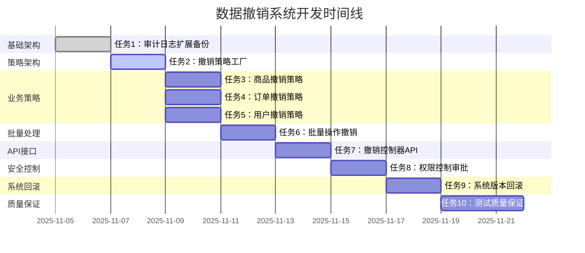

# 数据撤销系统任务分解

## Overview

基于数据撤销系统的设计文档，将系统开发分解为独立的、原子性的开发任务。每个任务遵循TDD原则，包含完整的测试、实现和验证步骤，确保代码质量和功能完整性。

## Task Breakdown

### 🔄 任务 1: 审计日志扩展和数据备份

**_Prompt**: Implement the task for spec data-revert-system, first run spec-workflow-guide to get the workflow guide then implement the task:
```text
**Role**: 数据基础工程师
**Task**: 开发数据撤销系统的审计日志扩展和数据备份功能，包括AuditLog实体扩展、数据备份机制、备份生命周期管理等功能，为撤销操作提供完整的数据支持。
**Constraints**:
- 审计日志扩展不能影响现有系统功能
- 数据备份必须高效且不影响主业务性能
- 备份数据必须完整且可验证
- 备份存储必须支持压缩和加密
- 备份生命周期必须自动管理
**_Leverage**: 现有的AuditLog实体、数据备份系统、压缩工具、加密服务、定时任务框架
**_Requirements**: 需求80(商品操作撤销)、需求81(订单状态撤销)、需求82(用户操作撤销)、需求84(数据版本回滚)
**Success**:
- 审计日志扩展功能正常
- 数据备份机制稳定可靠
- 备份数据完整准确
- 备份性能满足要求
- 备份生命周期自动管理
**Instructions**: 按照以下步骤实施：
1. 编写数据备份的失败测试
2. 扩展AuditLog实体支持撤销跟踪
3. 实现DataBackup数据备份实体
4. 实现自动备份机制
5. 实现备份生命周期管理
6. 在tasks.md中将此任务标记为[-]进行中，完成后标记为[x]
```

#### 1.1 扩展AuditLog实体
**文件**: `backend/src/main/java/com/campus/marketplace/common/entity/AuditLog.java` (扩展)
**依赖**: `BaseEntity.java`, `现有AuditLog字段`
**验收标准**:
- [ ] 新增撤销相关字段：isReversible、revertDeadline、revertedByLogId、revertedAt、revertCount
- [ ] 实体映射配置正确
- [ ] 数据库迁移脚本完整
- [ ] 索引优化配置
- [ ] 向后兼容性保证

#### 1.2 创建DataBackup实体
**文件**: `backend/src/main/java/com/campus/marketplace/common/entity/DataBackup.java`
**依赖**: `BaseEntity.java`
**验收标准**:
- [ ] 数据备份字段完整：entityType、entityId、backupData、backupVersion、expireAt
- [ ] 备份数据压缩存储
- [ ] 备份版本管理正确
- [ ] 过期时间设置合理
- [ ] 数据完整性验证

#### 1.3 实现DataBackupService
**文件**: `backend/src/main/java/com/campus/marketplace/service/DataBackupService.java`
**文件**: `backend/src/main/java/com/campus/marketplace/service/impl/DataBackupServiceImpl.java`
**依赖**: `AuditLogService.java`, `DataBackupRepository.java`
**验收标准**:
- [ ] 数据备份创建机制
- [ ] 备份数据压缩和存储
- [ ] 备份完整性和校验
- [ ] 备份数据查询和验证
- [ ] 备份性能优化

#### 1.4 实现备份生命周期管理
**文件**: `backend/src/main/java/com/campus/marketplace/task/BackupCleanupTask.java`
**依赖**: `DataBackupService.java`, `TimedScheduler.java`
**验收标准**:
- [ ] 过期备份自动清理
- [ ] 清理任务调度配置
- [ ] 清理异常处理
- [ ] 清理记录和日志
- [ ] 清理监控和告警

---

### 🔄 任务 2: 撤销策略工厂和核心接口

**_Prompt**: Implement the task for spec data-revert-system, first run spec-workflow-guide to get the workflow guide then implement the task:
```text
**Role**: 架构设计工程师
**Task**: 开发数据撤销系统的策略工厂和核心接口，包括撤销策略接口、策略工厂、撤销请求管理等基础设施，为各种实体类型的撤销操作提供统一的架构支持。
**Constraints**:
- 策略工厂必须支持插件化扩展
- 撤销接口设计必须简洁统一
- 策略注册和发现必须自动化
- 策略生命周期管理必须完整
- 策略性能必须满足要求
**_Leverage**: 策略模式、工厂模式、Spring配置、依赖注入、接口设计
**_Requirements**: 所有撤销功能都需要统一架构支持
**Success**:
- 撤销策略架构清晰稳定
- 策略工厂功能完善
- 接口设计合理易用
- 策略扩展机制灵活
- 架构性能达标
**Instructions**: 按照以下步骤实施：
1. 编写策略工厂的失败测试
2. 设计撤销策略接口
3. 实现撤销策略工厂
4. 创建撤销请求管理
5. 配置策略注册机制
6. 在tasks.md中将此任务标记为[-]进行中，完成后标记为[x]
```

#### 2.1 设计撤销策略接口
**文件**: `backend/src/main/java/com/campus/marketplace/revert/strategy/RevertStrategy.java`
**文件**: `backend/src/main/java/com/campus/marketplace/revert/dto/RevertValidationResult.java`
**文件**: `backend/src/main/java/com/campus/marketplace/revert/dto/RevertExecutionResult.java`
**依赖**: 现有DTO和Exception框架
**验收标准**:
- [ ] 撤销策略接口方法完整
- [ ] 验证结果结构合理
- [ ] 执行结果结构准确
- [ ] 异常处理机制完善
- [ ] 接口文档清晰

#### 2.2 实现撤销策略工厂
**文件**: `backend/src/main/java/com/campus/marketplace/revert/factory/RevertStrategyFactory.java`
**依赖**: `ApplicationContext.java`, `RevertStrategy.java`
**验收标准**:
- [ ] 策略自动注册发现
- [ ] 策略获取和验证
- [ ] 不支持异常处理
- [ ] 工厂性能优化
- [ ] 策略生命周期管理

#### 2.3 创建撤销请求管理
**文件**: `backend/src/main/java/com/campus/marketplace/revert/RevertRequestManager.java`
**依赖**: `RevertRequestRepository.java`, `WorkflowEngine.java`
**验收标准**:
- [ ] 撤销请求创建和验证
- [ ] 请求状态流转管理
- [ ] 审批流程集成
- [ ] 请求权限检查
- [ ] 请求生命周期管理

---

### 🔄 任务 3: 商品撤销策略实现

**_Prompt**: Implement the task for spec data-revert-system, first run spec-workflow-guide to get the workflow guide then implement the task:
```text
**Role**: 商品业务工程师
**Task**: 开发数据撤销系统的商品撤销策略，实现商品删除撤销、商品更新撤销、文件资源恢复等功能，确保商品相关操作的可撤销性和数据完整性。
**Constraints**:
- 商品撤销必须考虑交易影响
- 文件资源恢复必须验证文件存在性
- 撤销后商品状态必须合理控制
- 撤销操作必须记录详细日志
- 必须支持批量商品撤销
**_Leverage**: 现有的GoodsService、FileStorageService、OrderService、AuditLogService、缓存系统
**_Requirements**: 需求80(商品操作撤销)
**Success**:
- 商品删除撤销功能完整
- 商品更新撤销准确可靠
- 文件资源恢复正常
- 商品状态管理正确
- 交易影响处理有效
**Instructions**: 按照以下步骤实施：
1. 编写商品撤销的失败测试
2. 实现GoodsRevertStrategy策略
3. 实现商品删除撤销功能
4. 实现商品更新撤销功能
5. 实现文件资源恢复
6. 在tasks.md中将此任务标记为[-]进行中，完成后标记为[x]
```

#### 3.1 实现GoodsRevertStrategy
**文件**: `backend/src/main/java/com/campus/marketplace/revert/strategy/GoodsRevertStrategy.java`
**依赖**: `RevertStrategy.java`, `GoodsRepository.java`, `FileStorageService.java`
**验收标准**:
- [ ] 商品删除撤销逻辑完整
- [ ] 商品更新撤销准确
- [ ] 撤销验证严格
- [ ] 异常处理完善
- [ ] 日志记录详细

#### 3.2 实现商品文件恢复
**文件**: `backend/src/main/java/com/campus/marketplace/service/GoodsFileRecoveryService.java`
**依赖**: `FileStorageService.java`, `BackupStorageService.java`
**验收标准**:
- [ ] 文件存在性验证
- [ ] 文件恢复过程安全
- [ ] 缩略图恢复支持
- [ ] 文件完整性校验
- [ ] 恢复失败处理

#### 3.3 实现商品状态恢复
**文件**: `backend/src/main/java/com/campus/marketplace/service/GoodsStatusRecoveryService.java`
**依赖**: `GoodsRepository.java`, `CacheService.java`, `AuditLogService.java`
**验收标准**:
- [ ] 商品状态恢复正确
- [ ] 缓存更新及时
- [ ] 审计记录完整
- [ ] 状态流转验证
- [ ] 并发控制有效

---

### 🔄 任务 4: 订单撤销策略实现

**_Prompt**: Implement the task for spec data-revert-system, first run spec-workflow-guide to get the workflow guide then implement the task:
```text
**Role**: 订单业务工程师
**Task**: 开发数据撤销系统的订单撤销策略，实现订单状态撤销、资金退款处理、交易记录回滚等功能，确保订单操作的可撤销性和资金安全。
**Constraints**:
- 订单撤销必须检查时间限制
- 资金退款必须验证结算状态
- 订单状态回滚必须保证数据一致性
- 退款流程必须与支付系统集成
- 必须记录详细的撤销原因
**_Leverage**: 现有的OrderService、PaymentService、RefundService、AuditLogService、事务管理
**_Requirements**: 需求81(订单状态撤销)
**Success**:
- 订单状态撤销功能完整
- 资金退款流程安全
- 交易记录回滚正确
- 订单状态流转准确
- 资金安全保障有效
**Instructions**: 按照以下步骤实施：
1. 编写订单撤销的失败测试
2. 实现OrderRevertStrategy策略
3. 实现订单状态撤销功能
4. 实现资金退款处理
5. 实现交易记录回滚
6. 在tasks.md中将此任务标记为[-]进行中，完成后标记为[x]
```

#### 4.1 实现OrderRevertStrategy
**文件**: `backend/src/main/java/com/campus/marketplace/revert/strategy/OrderRevertStrategy.java`
**依赖**: `RevertStrategy.java`, `OrderRepository.java`, `PaymentService.java`
**验收标准**:
- [ ] 订单状态撤销逻辑正确
- [ ] 时间限制验证严格
- [ ] 资金状态检查准确
- [ ] 撤销权限验证有效
- [ ] 操作日志记录详细

#### 4.2 实现资金退款处理
**文件**: `backend/src/main/java/com/campus/marketplace/service/OrderRefundRevertService.java`
**依赖**: `PaymentService.java`, `RefundService.java`, `AccountService.java`
**验收标准**:
- [ ] 退款申请流程正确
- [ ] 资金结算状态验证
- [ ] 退款状态跟踪准确
- [ ] 退款异常处理完善
- [ ] 资金安全保障有效

#### 4.3 实现订单状态回滚
**文件**: `backend/src/main/java/com/campus/marketplace/service/OrderStatusRecoveryService.java`
**依赖**: `OrderRepository.java`, `OrderStatusHistoryRepository.java`, `NotificationService.java`
**验收标准**:
- [ ] 订单状态回滚准确
- [ ] 状态历史记录完整
- [ ] 相关方通知及时
- [ ] 库存和订单更新
- [ ] 数据一致性保证

---

### 🔄 任务 5: 用户操作撤销策略

**_Prompt**: Implement the task for spec data-revert-system, first run spec-workflow-guide to get the workflow guide then implement the task:
```text
**Role**: 用户管理工程师
**Task**: 开发数据撤销系统的用户操作撤销策略，实现用户处罚撤销、账户状态恢复、权限重置等功能，确保用户管理操作的可撤销性和操作合规性。
**Constraints**:
- 用户撤销必须检查操作权限
- 账户状态恢复必须安全可控
- 权限重置必须影响准确
- 撤销操作必须高级审批
- 必须考虑用户影响评估
**_Leverage**: 现有的UserService、PermissionService、RoleService、AuditLogService、审批工作流
**_Requirements**: 需求82(用户操作撤销)
**Success**:
- 用户处罚撤销功能完整
- 账户状态恢复安全
- 权限重置操作准确
- 影响评估机制完善
- 撤销审批流程规范
**Instructions**: 按照以下步骤实施：
1. 编写用户撤销的失败测试
2. 实现UserRevertStrategy策略
3. 实现用户处罚撤销功能
4. 实现账户状态恢复
5. 实现权限重置操作
6. 在tasks.md中将此任务标记为[-]进行中，完成后标记为[x]
```

#### 5.1 实现UserRevertStrategy
**文件**: `backend/src/main/java/com/campus/marketplace/revert/strategy/UserRevertStrategy.java`
**依赖**: `RevertStrategy.java`, `UserService.java`, `PermissionService.java`
**验收标准**:
- [ ] 用户处罚撤销逻辑正确
- [ ] 撤销权限验证严格
- [ ] 影响评估机制完善
- [ ] 审批流程集成正常
- [ ] 操作记录详细

#### 5.2 实现账户状态恢复
**文件**: `backend/src/main/java/com/campus/marketplace/service/UserAccountRecoveryService.java`
**依赖**: `UserService.java`, `SecurityService.java`, `CacheService.java`
**验证标准**:
- [ ] 账户状态恢复准确
- [ ] 登录状态处理正确
- [ ] 缓存和会话更新
- [ ] 安全验证严格
- [ ] 恢复通知发送及时

#### 5.3 实现权限重置操作
**文件**: `backend/src/main/java/com/campus/marketplace/service/UserPermissionRecoveryService.java`
**依赖**: `PermissionService.java`, `RoleService.java`, `CacheService.java`
**验收标准**:
- [ ] 权限重置操作准确
- [ ] 角色关联处理正确
- [ ] 缓存权限更新及时
- [ ] 权限验证机制有效
- [ ] 操作日志记录详细

---

### 🔄 任务 6: 批量操作撤销策略

**_Prompt**: Implement the task for spec data-revert-system, first run spec-workflow-guide to get the workflow guide then implement the:
```text
**Role**: 批量处理工程师
**Task**: 开发数据撤销系统的批量操作撤销策略，实现批量操作回滚、分布式撤销处理、事务一致性保证等功能，确保批量操作的可撤销性和数据完整性。
**Constraints**:
- 批量撤销必须支持分片处理
- 事务一致性必须严格保证
- 撤销过程必须支持断点续传
- 回滚顺序必须正确
- 必须支持大规模数据回滚
**_Leverage**: 现有的BatchTaskOrchestrator、分布式锁、事务管理、分片处理、批量操作框架
**_Requirements**: 需求83(批量操作撤销)
**Success**:
- 批量操作撤销功能完整
- 分布式撤销处理稳定
- 事务一致性保证有效
- 断点续传机制完善
- 大规模回滚性能达标
**Instructions**: 按照以下步骤实施：
1. 编写批量撤销的失败测试
2. 实现BatchRevertStrategy策略
3. 实现批量操作回滚功能
4. 实现分布式撤销处理
5. 实现事务一致性保证
6. 在tasks.md中将此任务标记为[-]进行中，完成后标记为[x]
```

#### 6.1 实现BatchRevertStrategy
**文件**: `backend/src/main/java/com/campus/marketplace/revert/strategy/BatchRevertStrategy.java`
**依赖**: `RevertStrategy.java`, `BatchTaskOrchestrator.java`, `DistributedLockService.java`
**验收标准**:
- [ ] 批量撤销策略完整
- [ ] 分片处理逻辑正确
- [ ] 分布式锁使用合理
- [ ] 回滚顺序控制准确
- [ ] 性能优化有效

#### 6.2 实现批量操作回滚
**文件**: `backend/src/main/java/com/campus/marketplace/service/BatchOperationRevertService.java`
**依赖**: `BatchTaskRepository.java`, `RevertStrategyFactory.java`, `TransactionManager.java`
**验收标准**:
- [ ] 批量操作回滚实现
- [ ] 回滚状态跟踪准确
- [ ] 部分失败处理机制
- [ ] 重试和恢复策略
- [ ] 性能监控完善

#### 6.3 实现分布式撤销处理
**文件**: `backend/src/main/java/com/campus/marketplace/service/DistributedRevertService.java`
**依赖**: `MessageQueue.java`, `ClusterCoordinator.java`, `TaskScheduler.java`
**验收标准**:
- [ ] 分布式任务分配
- [ ] 节点间通信可靠
- [ ] 故障转移机制完善
- [ ] 负载均衡策略有效
- [ ] 状态同步及时

---

### 🔄 任务 7: 撤销控制器和API接口

**_Prompt**: Implement the task for spec data-revert-system, first run spec-workflow-guide to get the workflow guide then implement the task:
```text
**Role**: API架构工程师
**Task**: 开发数据撤销系统的控制器和API接口，实现撤销申请API、撤销执行API、撤销查询API、系统回滚API等功能，确保API的规范性、安全性和易用性。
**Constraints**:
- API设计必须遵循RESTful规范
- 撤销权限验证必须严格
- API响应必须统一规范
- 审批流程必须完善集成
- 数据安全必须严格保障
**_Leverage**: 现有的BaseController、权限验证、全局异常处理、API文档、审批系统
**_Requirements**: 需求80(商品操作撤销)、需求81(订单状态撤销)、需求82(用户操作撤销)、需求84(数据版本回滚)、需求85(撤销权限控制)
**Success**:
- 撤销API功能完整可用
- 权限验证严格有效
- API响应格式统一
- 审批流程集成正常
- 数据安全保障到位
**Instructions**: 按照以下步骤实施：
1. 编写撤销API的失败测试
2. 实现RevertController用户API
3. 实现RevertAdminController管理API
4. 实现SystemRollbackController系统API
5. 配置权限验证和安全控制
6. 在tasks.md中将此任务标记为[-]进行中，完成后标记为[x]
```

#### 7.1 创建撤销请求响应DTO
**文件**: `backend/src/main/java/com/campus/marketplace/common/dto/request/RevertRequest.java`
**文件**: `backend/src/main/java/com/campus/marketplace/common/dto/response/RevertResult.java`
**文件**: `backend/src/main/java/com/campus/marketplace/common/dto/response/RevertPreviewResponse.java`
**依赖**: `BaseRequest.java`, `BaseResponse.java`
**验收标准**:
- [ ] 撤销请求DTO字段完整
- [ ] 参数验证注解配置正确
- [ ] 响应结构统一规范
- [ ] 序列化反序列化正常
- [ ] 文档注释详细

#### 7.2 实现RevertController
**文件**: `backend/src/main/java/com/campus/marketplace/controller/RevertController.java`
**依赖**: `RevertService.java`, `BaseController.java`
**验收标准**:
- [ ] 撤销申请API功能完整
- [ ] 撤销历史查询API准确
- [ ] 撤销预览API实时有效
- [ ] 权限验证严格
- [ ] 错误处理友好

#### 7.3 实现RevertAdminController
**文件**: `backend/src/main/java/com/campus/marketplace/controller/RevertAdminController.java`
**依赖**: `RevertAdminService.java`, `BaseController.java`
**验收标准**:
- [ ] 撤销管理API功能完整
- [ ] 撤销审批流程正常
- [ ] 系统回滚API安全
- [ ] 管理员权限验证严格
- [ ] 操作审计记录详细

#### 7.4 实现SystemRollbackController
**文件**: `backend/src/main/java/com/campus/marketplace/controller/SystemRollbackController.java`
**依赖**: `DataRevertService.java`, `SystemAdminController.java`
**验收标准**:
- [ ] 系统回滚API功能完整
- [ ] 回滚点管理API准确
- [ ] 系统状态验证API有效
- [ ] 超级权限验证严格
- [ ] 回滚操作安全保障

---

### 🔄 任务 8: 撤销权限控制和审批流程

**_Prompt**: Implement the task for spec data-revert-system, first run spec-workflow-guide to get the workflow guide then implement the task:
```text
**Role**: 权限安全工程师
**Task**: 开发数据撤销系统的权限控制和审批流程，实现撤销权限验证、撤销审批分级、高级操作多因子认证等功能，确保撤销操作的安全性和合规性。
**Constraints**:
- 权限验证必须分层分级
- 审批流程必须灵活可配置
- 多因子认证必须安全可靠
- 权限委托必须受控管理
- 审计日志必须完整记录
**_Leverage**: 现有的PermissionService、权限编码、审批系统、多因子认证、审计服务
**_Requirements**: 需求85(撤销权限控制)
**Success**:
- 权限验证机制完善
- 审批流程规范有效
- 多因子认证安全
- 权限委托管理严格
- 审计记录完整准确
**Instructions**: 按照以下步骤实施：
1. 编写权限控制的失败测试
2. 实现RevertPermissionService权限服务
3. 实现审批流程管理
4. 实现多因子认证
5. 实现权限委托管理
6. 在tasks.md中将此任务标记为[-]进行中，完成后标记为[x]
```

#### 8.1 创建RevertPermissionService
**文件**: `backend/src/main/java/com/campus/marketplace/service/RevertPermissionService.java`
**依赖**: `PermissionService.java`, `UserService.java`, `RoleService.java`
**验收标准**:
- [ ] 撤销权限验证逻辑准确
- [ ] 权限分级管理合理
- [ ] 权限委托机制完善
- [ ] 权限验证性能优化
- [ ] 权限配置灵活

#### 8.2 实现审批流程管理
**文件**: `backend/src/main/java/com/campus/marketplace/service/ApprovalFlowService.java`
**依赖**: `WorkflowEngine.java`, `NotificationService.java`, `ApprovalTaskService.java`
**验收标准**:
- [ ] 审批流程配置灵活
- [ ] 审批路由策略合理
- [ ] 审批状态跟踪准确
- [ ] 审批超时处理完善
- [ ] 审批通知及时

#### 8.3 实现多因子认证
**文件**: `backend/src/main/java/com/campus/marketplace/security/MfaRevertService.java`
**依赖**: `MfaService.java`, `SecurityContext.java`, `AuthenticationService.java`
**验收标准**:
- [ ] 多因子认证流程正确
- [ ] 认证方式配置灵活
- [ ] 认证安全控制严格
- [ ] 认证失败处理完善
- [ ] 认证记录详细

#### 8.4 实现权限委托管理
**文件**: `backend/src/main/java/com/campus/marketplace/service/PermissionDelegationService.java`
**依赖**: `PermissionService.java`, `UserRoleService.java`, `AuditService.java`
**验收标准**:
- [ ] 权限委托申请流程
- [ ] 委托权限范围控制
- [ ] 委托时效管理严格
- [ ] 委托审计记录详细
- [ ] 委托撤销机制有效

---

### 🔄 任务 9: 系统版本回滚功能

**_Prompt**: Implement the task for spec data-revert-system, first run spec-workflow-guide to get the workflow guide then implement the task:
```text
**Role**: 系统架构工程师
**Task**: 开发数据撤销系统的系统版本回滚功能，实现时间点回滚、数据表回滚、系统状态恢复、灾难恢复等功能，确保系统故障时的快速恢复能力。
**Constraints**:
- 系统回滚必须保证数据一致性
- 回滚点管理必须完整准确
- 灾难恢复必须及时有效
- 回滚操作必须可监控可回溯
- 数据安全必须严格保障
**_Leverage**: 现有的数据库管理工具、备份恢复系统、监控系统、灾难恢复方案
**_Requirements**: 需求84(数据版本回滚)
**Success**:
- 系统版本回滚功能完整
- 时间点回滚准确可靠
- 灾难恢复机制完善
- 数据安全保障到位
- 回滚监控健全
**Instructions**: 按照以下步骤实施：
1. 编写系统回滚的失败测试
2. 实现系统回滚策略
3. 实现时间点回滚功能
4. 实现灾难恢复机制
5. 实现回滚监控告警
6. 在tasks.md中将此任务标记为[-]进行中，完成后标记为[x]
```

#### 9.1 创建SystemRollbackService
**文件**: `backend/src/main/java/com/campus/marketplace/service/SystemRollbackService.java`
**依赖**: `DataRevertService.java`, `BackupManager.java`, `DatabaseManager.java`
**验收标准**:
- [ ] 系统回滚策略完整
- [ ] 回滚操作安全控制
- [ ] 回滚状态跟踪准确
- [ ] 回滚性能优化
- [ ] 回滚日志记录详细

#### 9.2 实现时间点回滚
**文件**: `backend/src/main/java/com/campus/marketplace/service/PointInTimeRollbackService.java`
**依赖**: `DatabaseBackupService.java`, `TransactionManager.java`, `AuditService.java`
**验收标准**:
- [ ] 时间点选择灵活
- [ ] 回滚范围可配置
- [ ] 回滚一致性保证
- [ ] 回滚速度优化
- [ ] 回滚验证严格

#### 9.3 实现灾难恢复
**文件**: `backend/src/main/java/com/campus/marketplace/service/DisasterRecoveryService.java`
**依赖**: `BackupStorageService.java`, `ReplicationService.java`, `MonitoringService.java`
**验收标准**:
- [ ] 灾难检测机制
- [ ] 快速恢复流程
- [ ] 数据完整性验证
- [ ] 系统状态恢复
- [ ] 恢复结果验证

#### 9.4 实现回滚监控告警
**文件**: `backend/src/main/java/com/campus/marketplace/service/RollbackMonitorService.java`
**依赖**: `MonitorService.java`, `AlertService.java`, `NotificationService.java`
**验收标准**:
- [ ] 回滚过程监控
- [ ] 状态指标收集
- [ ] 异常告警及时
- [ ] 进度报告准确
- [ ] 监控数据存储

---

### 🔄 任务 10: 撤销系统测试和质量保证

**_Prompt**: Implement the task for spec data-revert-system, first run spec-workflow-guide to get the workflow guide then implement the task:
```text
**Role**: 测试质量工程师
**Task**: 开发数据撤销系统的测试和质量保证功能，包括功能测试、安全测试、性能测试、灾难恢复测试等功能，确保撤销系统的可靠性和安全性。
**Constraints**:
- 测试覆盖率必须≥90%
- 安全测试必须覆盖所有攻击场景
- 性能测试必须满足设计要求
- 灾难恢复测试必须验证有效性
- 质量门禁必须严格执行
**_Leverage**: 现有的测试框架、安全测试工具、性能测试工具、灾难恢复演练
**_Requirements**: 覆盖所有撤销功能的测试
**Success**:
- 所有测试用例通过
- 测试覆盖率达标
- 安全测试无高危漏洞
- 性能指标满足要求
- 质量门禁有效
**Instructions**: 按照以下步骤实施：
1. 设计测试策略和用例
2. 实现功能测试
3. 实现安全测试
4. 实现性能测试
5. 实现灾难恢复测试
6. 在tasks.md中将此任务标记为[-]进行中，完成后标记为[x]
```

#### 10.1 创建功能测试套件
**文件**: `backend/src/test/java/com/campus/marketplace/revert/RevertServiceTest.java`
**文件**: `backend/src/test/java/com/campus/marketplace/revert/GoodsRevertStrategyTest.java`
**依赖**: `JUnit5.java`, `Mockito.java`, `Spring Boot Test`
**验收标准**:
- [ ] 撤销功能测试完整
- [ ] 边界条件测试覆盖
- [ ] 异常场景测试有效
- [ ] 集成测试覆盖全面
- [ ] 测试执行效率高

#### 10.2 创建安全测试套件
**文件**: `backend/src/test/java/com/campus/marketplace/security/RevertSecurityTest.java`
**文件**: `backend/src/test/java/com/campus/marketplace/security/RevertPermissionTest.java`
**依赖**: `Spring Security Test.java`, `安全测试工具`
**验收标准**:
- [ ] 权限验证测试严格
- [ ] 数据安全测试完善
- [ ] 认证测试准确
- [ ] 攻击防御测试有效
- [ ] 安全漏洞扫描通过

#### 10.3 创建性能测试套件
**文件**: `backend/src/test/java/com/campus/marketplace/performance/RevertPerformanceTest.java`
**文件**: `backend/src/test/java/com/campus/marketplace/performance/SystemRollbackTest.java`
**依赖**: `JMH.java`, `性能测试工具`
**验收标准**:
- [ ] 撤销操作性能达标
- [ ] 系统回滚性能满足要求
- [ ] 大批量数据处理能力
- [ ] 并发撤销性能稳定
- [ ] 资源使用控制合理

#### 10.4 创建灾难恢复测试
**文件**: `backend/src/test/java/com/campus/marketplace/disaster/DisasterRecoveryTest.java`
**依赖**: `灾难恢复演练环境`, `测试数据管理`
**验收标准**:
- [ ] 灾难场景覆盖全面
- [ ] 恢复流程验证有效
- [ ] 数据完整性保证
- [ ] 恢复时间达标
- [ ] 恢复方案可靠

---

## 任务依赖关系



## 质量检查清单

### 数据安全检查
- [ ] **第0步复用检查**: 复用现有关键组件，避免安全漏洞
- [ ] **第1步测试先行**: 所有安全功能先写测试用例
- [ ] **数据完整性**: 撤销操作必须保证数据一致性
- [ ] **访问控制**: 撤销操作权限验证必须严格
- [ ] **审计完善**: 所有撤销操作必须完整记录

### 可靠性检查
- [ ] **备份机制**: 数据备份必须完整且可验证
- [ ] **事务管理**: 撤销操作事务必须严格控制
- [ ] **异常处理**: 撤销失败必须不影响系统稳定
- [ ] **回滚顺序**: 批量撤销必须按正确顺序执行
- [ ] **状态管理**: 撤销状态必须准确跟踪

### 性能检查
- [ ] **响应时间**: 撤销操作启动时间<500ms
- [ ] **处理能力**: 单次撤销处理速度≥100条/秒
- [ ] **并发支持**: 支持100+并发撤销请求
- [ ] **资源使用**: 内存和CPU使用率合理可控
- [ ] **缓存优化**: 热点数据缓存命中率≥80%

### 可扩展性检查
- [ ] **策略扩展**: 新撤销类型易于添加
- [ ] **配置灵活**: 撤销策略配置可动态调整
- [ ] **接口规范**: 撤销接口设计易于扩展
- [ ] **插件化**: 支持第三方撤销策略插件
- [ ] **版本兼容**: 系统升级不影响现有撤销功能

### 合规性检查
- [ ] **权限分级**: 撤销权限按风险等级分级
- [ ] **审批流程**: 高风险撤销必须有审批
- [ ] **多因子认证**: 敏感撤销必须多因子认证
- [ ] **数据隐私**: 撤销过程不能泄露敏感信息
- [ ] **操作可追溯**: 每个撤销操作都可审计追踪

## 验收标准

### 功能验收
- ✅ 所有实体类型支持撤销操作
- ✅ 撤销操作功能完整且准确
- ✅ 批量撤销机制稳定可靠
- ✅ 系统回滚功能安全有效
- ✅ 权限控制和审批流程完善

### 安全验收
- ✅ 撤销权限验证严格有效
- ✅ 数据安全保障到位
- ✅ 访问控制机制完善
- ✅ 审计日志记录完整
- ✅ 安全测试无高危漏洞

### 性能验收
- ✅ 撤销操作响应时间<500ms
- ✅ 大批量撤销处理能力达标
- ✅ 并发撤销支持稳定
- ✅ 系统资源使用合理
- ✅ 缓存优化效果明显

### 可靠性验收
- ✅ 撤销成功率≥99.9%
- ✅ 数据一致性保证有效
- ✅ 异常恢复机制完善
- ✅ 灾难恢复能力可靠
- ✅ 系统高可用性保障

### 可维护性验收
- ✅ 策略架构清晰易扩展
- ✅ 配置管理灵活规范
- ✅ 监控告警及时准确
- ✅ 文档资料完整详细
- ✅ 测试质量达标覆盖全面

---

**实施说明**: 数据撤销系统涉及数据安全，每个任务完成后必须进行严格的安全测试和数据验证。任务间的依赖关系必须严格遵循，确保系统安全可靠。撤销操作是不可逆操作，请在实施过程中严格把控质量。
