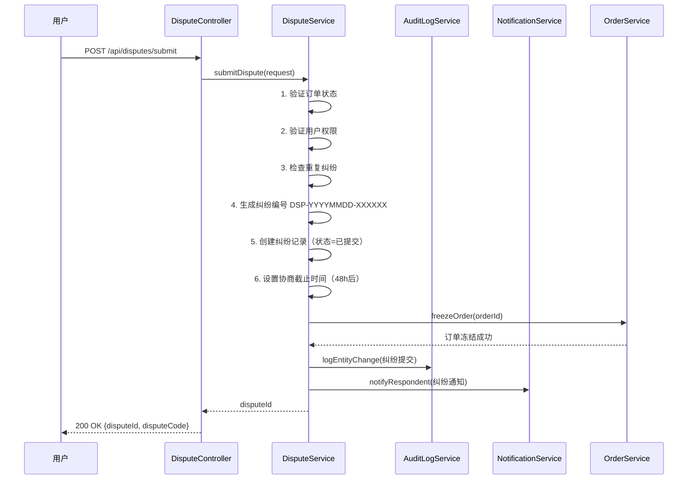
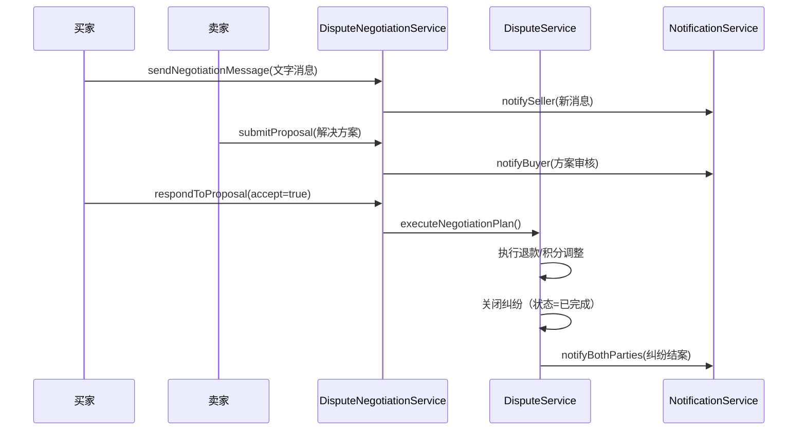
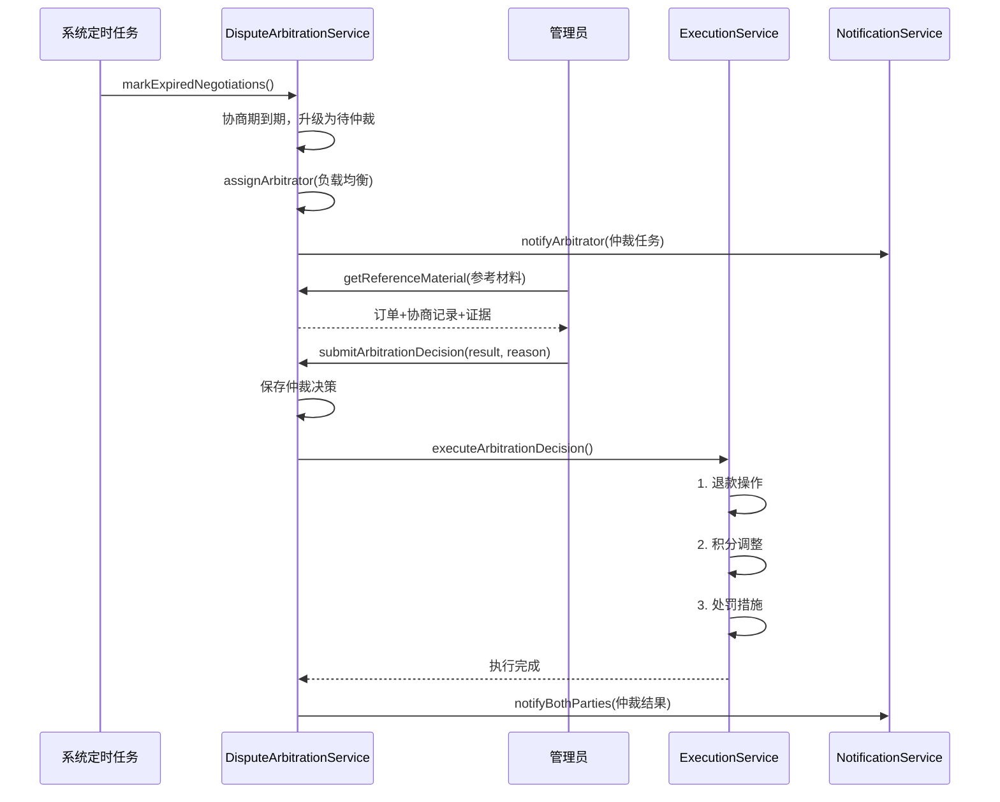

# Spec #6: 纠纷仲裁系统 - 架构设计文档

> **功能名称**: 纠纷仲裁系统 (Dispute Arbitration System)
> **设计版本**: v1.0
> **创建时间**: 2025-11-03
> **作者**: BaSui 😎
> **架构原则**: SOLID | KISS | DRY | 模块化 | 可扩展

---

## 📐 架构设计概览

### 🎯 设计目标

1. **单一职责**：每个模块专注一个核心功能
2. **松耦合**：纠纷模块与订单、支付模块通过事件驱动解耦
3. **可扩展**：支持未来扩展协商算法、AI辅助仲裁
4. **高性能**：纠纷查询≤300ms，仲裁执行≤5s
5. **可靠性**：分布式事务保证数据一致性

### 🏗️ 架构分层

```
┌─────────────────────────────────────────┐
│         Controller 层 (API接口)          │
│  - DisputeController                    │
│  - DisputeNegotiationController         │
│  - DisputeArbitrationController         │
└────────────────┬────────────────────────┘
                 │
┌────────────────▼────────────────────────┐
│          Service 层 (业务逻辑)           │
│  - DisputeService (核心业务)             │
│  - DisputeNegotiationService (协商流程)  │
│  - DisputeArbitrationService (仲裁决策)  │
│  - DisputeEvidenceService (证据管理)     │
│  - DisputeStatisticsService (数据统计)   │
└────────────────┬────────────────────────┘
                 │
┌────────────────▼────────────────────────┐
│         Repository 层 (数据访问)         │
│  - DisputeRepository                    │
│  - DisputeEvidenceRepository            │
│  - DisputeNegotiationRepository         │
│  - DisputeArbitrationRepository         │
└────────────────┬────────────────────────┘
                 │
┌────────────────▼────────────────────────┐
│          Entity 层 (数据模型)            │
│  - Dispute (纠纷主体)                    │
│  - DisputeEvidence (证据材料)            │
│  - DisputeNegotiation (协商记录)         │
│  - DisputeArbitration (仲裁决策)         │
└─────────────────────────────────────────┘
```

---

## 🗂️ 数据模型设计

### 1️⃣ Dispute 实体 - 纠纷主体

```java
@Entity
@Table(name = "t_dispute")
@Data
@Builder
@NoArgsConstructor
@AllArgsConstructor
public class Dispute extends BaseEntity {

    /**
     * 纠纷编号（格式：DSP-YYYYMMDD-XXXXXX）
     */
    @Column(name = "dispute_code", nullable = false, unique = true, length = 30)
    private String disputeCode;

    /**
     * 关联订单ID
     */
    @Column(name = "order_id", nullable = false)
    private Long orderId;

    /**
     * 订单编号（冗余字段，便于查询）
     */
    @Column(name = "order_code", length = 50)
    private String orderCode;

    /**
     * 纠纷发起方ID
     */
    @Column(name = "initiator_id", nullable = false)
    private Long initiatorId;

    /**
     * 纠纷发起方名称
     */
    @Column(name = "initiator_name", length = 50)
    private String initiatorName;

    /**
     * 纠纷发起方角色（BUYER/SELLER）
     */
    @Enumerated(EnumType.STRING)
    @Column(name = "initiator_role", nullable = false, length = 10)
    private DisputeRole initiatorRole;

    /**
     * 纠纷对方ID
     */
    @Column(name = "respondent_id", nullable = false)
    private Long respondentId;

    /**
     * 纠纷对方名称
     */
    @Column(name = "respondent_name", length = 50)
    private String respondentName;

    /**
     * 纠纷类型（商品不符、质量问题、物流延误、虚假宣传、其他）
     */
    @Enumerated(EnumType.STRING)
    @Column(name = "dispute_type", nullable = false, length = 30)
    private DisputeType disputeType;

    /**
     * 纠纷描述（20-500字）
     */
    @Column(name = "description", nullable = false, length = 1000)
    private String description;

    /**
     * 纠纷状态（已提交、协商中、待仲裁、仲裁中、已完成）
     */
    @Enumerated(EnumType.STRING)
    @Column(name = "status", nullable = false, length = 20)
    @Builder.Default
    private DisputeStatus status = DisputeStatus.SUBMITTED;

    /**
     * 协商截止时间（提交后48小时）
     */
    @Column(name = "negotiation_deadline")
    private LocalDateTime negotiationDeadline;

    /**
     * 仲裁截止时间（升级后7天）
     */
    @Column(name = "arbitration_deadline")
    private LocalDateTime arbitrationDeadline;

    /**
     * 仲裁人ID
     */
    @Column(name = "arbitrator_id")
    private Long arbitratorId;

    /**
     * 仲裁人名称
     */
    @Column(name = "arbitrator_name", length = 50)
    private String arbitratorName;

    /**
     * 仲裁结果（全额退款、部分退款、驳回申请、需补充证据）
     */
    @Enumerated(EnumType.STRING)
    @Column(name = "arbitration_result", length = 30)
    private ArbitrationResult arbitrationResult;

    /**
     * 仲裁理由（≥50字）
     */
    @Column(name = "arbitration_reason", columnDefinition = "TEXT")
    private String arbitrationReason;

    /**
     * 仲裁完成时间
     */
    @Column(name = "arbitrated_at")
    private LocalDateTime arbitratedAt;

    /**
     * 解决方案（退款金额、补偿积分等JSON格式）
     */
    @Column(name = "resolution_plan", columnDefinition = "TEXT")
    private String resolutionPlan;

    /**
     * 是否已执行（退款、积分调整等）
     */
    @Column(name = "is_executed")
    @Builder.Default
    private Boolean isExecuted = false;

    /**
     * 执行时间
     */
    @Column(name = "executed_at")
    private LocalDateTime executedAt;

    /**
     * 关闭原因
     */
    @Column(name = "close_reason", length = 200)
    private String closeReason;

    /**
     * 关闭时间
     */
    @Column(name = "closed_at")
    private LocalDateTime closedAt;
}
```

### 2️⃣ DisputeEvidence 实体 - 证据材料

```java
@Entity
@Table(name = "t_dispute_evidence")
@Data
@Builder
@NoArgsConstructor
@AllArgsConstructor
public class DisputeEvidence extends BaseEntity {

    /**
     * 证据编号（格式：Evidence-XXXXXX）
     */
    @Column(name = "evidence_code", nullable = false, unique = true, length = 30)
    private String evidenceCode;

    /**
     * 关联纠纷ID
     */
    @Column(name = "dispute_id", nullable = false)
    private Long disputeId;

    /**
     * 上传者ID
     */
    @Column(name = "uploader_id", nullable = false)
    private Long uploaderId;

    /**
     * 上传者名称
     */
    @Column(name = "uploader_name", length = 50)
    private String uploaderName;

    /**
     * 上传者角色（BUYER/SELLER）
     */
    @Enumerated(EnumType.STRING)
    @Column(name = "uploader_role", nullable = false, length = 10)
    private DisputeRole uploaderRole;

    /**
     * 证据类型（IMAGE/VIDEO/CHAT_RECORD）
     */
    @Enumerated(EnumType.STRING)
    @Column(name = "evidence_type", nullable = false, length = 20)
    private EvidenceType evidenceType;

    /**
     * 证据文件URL（OSS存储路径）
     */
    @Column(name = "file_url", nullable = false, length = 500)
    private String fileUrl;

    /**
     * 缩略图URL（图片压缩后的预览图）
     */
    @Column(name = "thumbnail_url", length = 500)
    private String thumbnailUrl;

    /**
     * 文件大小（字节）
     */
    @Column(name = "file_size")
    private Long fileSize;

    /**
     * 文件哈希值（SHA-256，防篡改）
     */
    @Column(name = "file_hash", length = 64)
    private String fileHash;

    /**
     * 图片元数据（拍摄时间、设备信息、GPS位置等JSON格式）
     */
    @Column(name = "metadata", columnDefinition = "TEXT")
    private String metadata;

    /**
     * 证据有效性（VALID/INVALID/DOUBTFUL）
     */
    @Enumerated(EnumType.STRING)
    @Column(name = "validity_status", length = 20)
    @Builder.Default
    private EvidenceValidity validityStatus = EvidenceValidity.VALID;

    /**
     * 审查备注（管理员标注）
     */
    @Column(name = "review_note", length = 500)
    private String reviewNote;

    /**
     * 审查人ID
     */
    @Column(name = "reviewer_id")
    private Long reviewerId;

    /**
     * 审查时间
     */
    @Column(name = "reviewed_at")
    private LocalDateTime reviewedAt;
}
```

### 3️⃣ DisputeNegotiation 实体 - 协商记录

```java
@Entity
@Table(name = "t_dispute_negotiation")
@Data
@Builder
@NoArgsConstructor
@AllArgsConstructor
public class DisputeNegotiation extends BaseEntity {

    /**
     * 关联纠纷ID
     */
    @Column(name = "dispute_id", nullable = false)
    private Long disputeId;

    /**
     * 消息发送者ID
     */
    @Column(name = "sender_id", nullable = false)
    private Long senderId;

    /**
     * 发送者名称
     */
    @Column(name = "sender_name", length = 50)
    private String senderName;

    /**
     * 发送者角色（BUYER/SELLER）
     */
    @Enumerated(EnumType.STRING)
    @Column(name = "sender_role", nullable = false, length = 10)
    private DisputeRole senderRole;

    /**
     * 消息类型（TEXT/PROPOSAL）
     */
    @Enumerated(EnumType.STRING)
    @Column(name = "message_type", nullable = false, length = 20)
    private NegotiationMessageType messageType;

    /**
     * 消息内容（≤200字）
     */
    @Column(name = "message_content", length = 500)
    private String messageContent;

    /**
     * 解决方案内容（JSON格式：退款金额、补偿措施等）
     */
    @Column(name = "proposal_content", columnDefinition = "TEXT")
    private String proposalContent;

    /**
     * 方案状态（PENDING/ACCEPTED/REJECTED）
     */
    @Enumerated(EnumType.STRING)
    @Column(name = "proposal_status", length = 20)
    private ProposalStatus proposalStatus;

    /**
     * 方案响应时间
     */
    @Column(name = "responded_at")
    private LocalDateTime respondedAt;

    /**
     * 是否已读
     */
    @Column(name = "is_read")
    @Builder.Default
    private Boolean isRead = false;

    /**
     * 已读时间
     */
    @Column(name = "read_at")
    private LocalDateTime readAt;
}
```

### 4️⃣ DisputeArbitration 实体 - 仲裁决策

```java
@Entity
@Table(name = "t_dispute_arbitration")
@Data
@Builder
@NoArgsConstructor
@AllArgsConstructor
public class DisputeArbitration extends BaseEntity {

    /**
     * 关联纠纷ID
     */
    @Column(name = "dispute_id", nullable = false, unique = true)
    private Long disputeId;

    /**
     * 仲裁人ID
     */
    @Column(name = "arbitrator_id", nullable = false)
    private Long arbitratorId;

    /**
     * 仲裁人名称
     */
    @Column(name = "arbitrator_name", length = 50)
    private String arbitratorName;

    /**
     * 仲裁开始时间
     */
    @Column(name = "started_at")
    private LocalDateTime startedAt;

    /**
     * 仲裁完成时间
     */
    @Column(name = "completed_at")
    private LocalDateTime completedAt;

    /**
     * 仲裁结果（全额退款、部分退款、驳回申请、需补充证据）
     */
    @Enumerated(EnumType.STRING)
    @Column(name = "result", nullable = false, length = 30)
    private ArbitrationResult result;

    /**
     * 仲裁理由（≥50字）
     */
    @Column(name = "reason", nullable = false, columnDefinition = "TEXT")
    private String reason;

    /**
     * 退款金额（单位：分）
     */
    @Column(name = "refund_amount")
    private Long refundAmount;

    /**
     * 补偿积分
     */
    @Column(name = "compensation_points")
    private Integer compensationPoints;

    /**
     * 处罚措施（JSON格式：扣分、警告、限制交易等）
     */
    @Column(name = "penalty_actions", columnDefinition = "TEXT")
    private String penaltyActions;

    /**
     * 电子签名（管理员签字图片URL）
     */
    @Column(name = "signature_url", length = 500)
    private String signatureUrl;

    /**
     * 仲裁人IP地址
     */
    @Column(name = "arbitrator_ip", length = 50)
    private String arbitratorIp;

    /**
     * 仲裁人设备信息（User-Agent）
     */
    @Column(name = "arbitrator_user_agent", length = 500)
    private String arbitratorUserAgent;
}
```

### 🔢 枚举类型设计

```java
// DisputeRole.java - 纠纷角色
public enum DisputeRole {
    BUYER("买家"),
    SELLER("卖家");
}

// DisputeType.java - 纠纷类型
public enum DisputeType {
    GOODS_MISMATCH("商品不符"),        // 实物与描述不符
    QUALITY_ISSUE("质量问题"),          // 商品存在质量缺陷
    LOGISTICS_DELAY("物流延误"),        // 发货/配送延迟
    FALSE_ADVERTISING("虚假宣传"),      // 卖家虚假宣传
    OTHER("其他");                     // 其他原因
}

// DisputeStatus.java - 纠纷状态
public enum DisputeStatus {
    SUBMITTED("已提交"),               // 刚提交，进入协商期
    NEGOTIATING("协商中"),             // 双方协商中
    PENDING_ARBITRATION("待仲裁"),     // 协商失败，等待管理员介入
    ARBITRATING("仲裁中"),             // 管理员仲裁处理中
    COMPLETED("已完成"),               // 纠纷已解决（协商或仲裁）
    CLOSED("已关闭");                  // 主动关闭或超时关闭
}

// ArbitrationResult.java - 仲裁结果
public enum ArbitrationResult {
    FULL_REFUND("全额退款"),           // 支持买家，全额退款
    PARTIAL_REFUND("部分退款"),        // 双方责任，部分退款
    REJECT("驳回申请"),                // 驳回纠纷，维持原状
    NEED_MORE_EVIDENCE("需补充证据");   // 证据不足，要求补充
}

// EvidenceType.java - 证据类型
public enum EvidenceType {
    IMAGE("图片"),
    VIDEO("视频"),
    CHAT_RECORD("聊天记录截图");
}

// EvidenceValidity.java - 证据有效性
public enum EvidenceValidity {
    VALID("有效"),                     // 证据真实有效
    INVALID("无效"),                   // 证据伪造或不相关
    DOUBTFUL("存疑");                  // 证据真实性存疑
}

// NegotiationMessageType.java - 协商消息类型
public enum NegotiationMessageType {
    TEXT("文字消息"),
    PROPOSAL("解决方案");
}

// ProposalStatus.java - 方案状态
public enum ProposalStatus {
    PENDING("待响应"),
    ACCEPTED("已接受"),
    REJECTED("已拒绝");
}
```

---

## 🔧 Service 服务设计

### 1️⃣ DisputeService - 核心业务服务

```java
/**
 * 纠纷核心业务服务
 */
public interface DisputeService {

    /**
     * 提交纠纷
     *
     * @param request 纠纷创建请求
     * @return 纠纷ID
     */
    Long submitDispute(CreateDisputeRequest request);

    /**
     * 查询用户纠纷列表
     *
     * @param userId 用户ID
     * @param status 纠纷状态（可选）
     * @param pageable 分页参数
     * @return 纠纷列表
     */
    Page<DisputeDTO> getUserDisputes(Long userId, DisputeStatus status, Pageable pageable);

    /**
     * 查询纠纷详情
     *
     * @param disputeId 纠纷ID
     * @return 纠纷详情
     */
    DisputeDetailDTO getDisputeDetail(Long disputeId);

    /**
     * 升级纠纷为仲裁状态
     *
     * @param disputeId 纠纷ID
     * @return 是否成功
     */
    boolean escalateToArbitration(Long disputeId);

    /**
     * 关闭纠纷
     *
     * @param disputeId 纠纷ID
     * @param closeReason 关闭原因
     * @return 是否成功
     */
    boolean closeDispute(Long disputeId, String closeReason);

    /**
     * 标记协商期过期的纠纷，自动升级为待仲裁
     *
     * @return 升级数量
     */
    int markExpiredNegotiations();

    /**
     * 标记仲裁期过期的纠纷，自动关闭
     *
     * @return 关闭数量
     */
    int markExpiredArbitrations();
}
```

### 2️⃣ DisputeNegotiationService - 协商流程服务

```java
/**
 * 纠纷协商流程服务
 */
public interface DisputeNegotiationService {

    /**
     * 发送协商消息
     *
     * @param request 消息发送请求
     * @return 消息ID
     */
    Long sendNegotiationMessage(SendNegotiationMessageRequest request);

    /**
     * 提交解决方案
     *
     * @param request 方案提交请求
     * @return 方案ID
     */
    Long submitProposal(SubmitProposalRequest request);

    /**
     * 响应解决方案
     *
     * @param negotiationId 协商记录ID
     * @param accept 是否接受
     * @return 是否成功
     */
    boolean respondToProposal(Long negotiationId, boolean accept);

    /**
     * 查询协商记录
     *
     * @param disputeId 纠纷ID
     * @return 协商记录列表
     */
    List<NegotiationRecordDTO> getNegotiationRecords(Long disputeId);

    /**
     * 标记消息为已读
     *
     * @param negotiationId 协商记录ID
     * @return 是否成功
     */
    boolean markAsRead(Long negotiationId);

    /**
     * 执行协商达成的方案
     *
     * @param disputeId 纠纷ID
     * @param negotiationId 协商记录ID
     * @return 执行结果
     */
    ExecutionResult executeNegotiationPlan(Long disputeId, Long negotiationId);
}
```

### 3️⃣ DisputeArbitrationService - 仲裁决策服务

```java
/**
 * 纠纷仲裁决策服务
 */
public interface DisputeArbitrationService {

    /**
     * 分配仲裁任务（负载均衡策略）
     *
     * @param disputeId 纠纷ID
     * @return 分配的仲裁人ID
     */
    Long assignArbitrator(Long disputeId);

    /**
     * 提交仲裁决策
     *
     * @param request 仲裁决策请求
     * @return 仲裁记录ID
     */
    Long submitArbitrationDecision(SubmitArbitrationRequest request);

    /**
     * 执行仲裁决策（退款、积分调整、处罚等）
     *
     * @param disputeId 纠纷ID
     * @return 执行结果
     */
    ExecutionResult executeArbitrationDecision(Long disputeId);

    /**
     * 查询仲裁人的待处理任务
     *
     * @param arbitratorId 仲裁人ID
     * @param pageable 分页参数
     * @return 任务列表
     */
    Page<ArbitrationTaskDTO> getArbitratorTasks(Long arbitratorId, Pageable pageable);

    /**
     * 查询仲裁详情
     *
     * @param disputeId 纠纷ID
     * @return 仲裁详情
     */
    ArbitrationDetailDTO getArbitrationDetail(Long disputeId);

    /**
     * 获取仲裁参考材料（订单、协商记录、证据）
     *
     * @param disputeId 纠纷ID
     * @return 参考材料
     */
    ArbitrationReferenceMaterialDTO getReferenceMaterial(Long disputeId);
}
```

### 4️⃣ DisputeEvidenceService - 证据材料服务

```java
/**
 * 纠纷证据材料服务
 */
public interface DisputeEvidenceService {

    /**
     * 上传证据文件
     *
     * @param disputeId 纠纷ID
     * @param uploaderId 上传者ID
     * @param uploaderRole 上传者角色
     * @param files 文件列表
     * @return 上传成功的证据ID列表
     */
    List<Long> uploadEvidenceFiles(Long disputeId, Long uploaderId,
                                    DisputeRole uploaderRole, List<MultipartFile> files);

    /**
     * 查询纠纷证据列表
     *
     * @param disputeId 纠纷ID
     * @return 证据列表
     */
    List<DisputeEvidenceDTO> getDisputeEvidences(Long disputeId);

    /**
     * 标注证据有效性（管理员操作）
     *
     * @param evidenceId 证据ID
     * @param validityStatus 有效性状态
     * @param reviewNote 审查备注
     * @return 是否成功
     */
    boolean markEvidenceValidity(Long evidenceId, EvidenceValidity validityStatus, String reviewNote);

    /**
     * 提取图片元数据（拍摄时间、设备、GPS）
     *
     * @param file 图片文件
     * @return 元数据JSON
     */
    String extractImageMetadata(MultipartFile file);

    /**
     * 计算文件哈希值（防篡改）
     *
     * @param file 文件
     * @return SHA-256哈希值
     */
    String calculateFileHash(MultipartFile file);

    /**
     * 删除证据文件
     *
     * @param evidenceId 证据ID
     * @return 是否成功
     */
    boolean deleteEvidence(Long evidenceId);
}
```

### 5️⃣ DisputeStatisticsService - 数据统计服务

```java
/**
 * 纠纷数据统计服务
 */
public interface DisputeStatisticsService {

    /**
     * 获取纠纷概览统计
     *
     * @param startDate 开始日期
     * @param endDate 结束日期
     * @return 统计数据
     */
    DisputeOverviewStatisticsDTO getOverviewStatistics(LocalDate startDate, LocalDate endDate);

    /**
     * 获取纠纷类型分布
     *
     * @param startDate 开始日期
     * @param endDate 结束日期
     * @return 类型分布数据
     */
    List<DisputeTypeDistributionDTO> getTypeDistribution(LocalDate startDate, LocalDate endDate);

    /**
     * 获取纠纷趋势数据
     *
     * @param startDate 开始日期
     * @param endDate 结束日期
     * @return 趋势数据
     */
    List<DisputeTrendDataDTO> getTrendData(LocalDate startDate, LocalDate endDate);

    /**
     * 获取用户纠纷排行（发起次数Top 20）
     *
     * @param startDate 开始日期
     * @param endDate 结束日期
     * @return 用户排行
     */
    List<UserDisputeRankingDTO> getUserDisputeRanking(LocalDate startDate, LocalDate endDate);

    /**
     * 导出纠纷数据到Excel
     *
     * @param request 导出请求
     * @return 导出任务ID
     */
    String exportDisputeData(ExportDisputeDataRequest request);
}
```

---

## 🎯 核心业务流程设计

### 📝 纠纷提交流程



### 🤝 协商流程



### ⚖️ 仲裁决策流程



---

## 🔄 复用现有组件策略

### ✅ 直接复用的组件

1. **AuditLog 实体**
   - 用途：记录所有纠纷操作的审计日志
   - 复用方式：调用 `AuditLogService.logEntityChange()`
   - 记录内容：纠纷提交、协商消息、仲裁决策、证据上传

2. **FileService 文件服务**
   - 用途：证据图片/视频的上传和存储
   - 复用方式：调用 `FileService.uploadFile()` 和 `FileService.deleteFile()`
   - 存储路径：`/disputes/{disputeId}/evidences/{timestamp}_{random}.jpg`

3. **NotificationService 通知服务**
   - 用途：纠纷状态变更通知
   - 复用方式：调用 `NotificationService.sendNotification()`
   - 通知场景：
     - 收到新纠纷（对方收到通知）
     - 收到协商消息（对方收到通知）
     - 收到解决方案（对方收到通知）
     - 仲裁结果（双方收到通知）

4. **Order 实体与 OrderService**
   - 用途：关联订单数据，验证评价资格，冻结订单状态
   - 复用方式：
     - `OrderService.getOrderById()` - 查询订单详情
     - `OrderService.freezeOrder()` - 冻结订单（禁止评价、退款、确认收货）
     - `OrderService.unfreezeOrder()` - 解冻订单
   - 关联字段：`Dispute.orderId` 和 `Dispute.orderCode`

5. **权限系统（RBAC）**
   - 用途：纠纷处理权限控制
   - 复用方式：使用 `@PreAuthorize` 注解校验权限
   - 新增权限：
     - `SYSTEM_DISPUTE_HANDLE` - 处理仲裁
     - `SYSTEM_DISPUTE_VIEW` - 查看所有纠纷
   - 新增角色：
     - `ARBITRATOR` - 仲裁员（可处理仲裁、查看所有纠纷、标注证据）

### 🆕 需要扩展的组件

1. **PaymentService 支付服务**
   - 扩展需求：仲裁决策涉及退款操作
   - 新增方法：
     ```java
     // 仲裁退款（全额或部分）
     RefundResult refundByArbitration(Long orderId, Long amount, String reason);
     ```

2. **PointsService 积分服务**
   - 扩展需求：仲裁补偿积分调整
   - 新增方法：
     ```java
     // 仲裁补偿积分
     boolean adjustPointsByArbitration(Long userId, Integer points, String reason);
     ```

3. **UserService 用户服务**
   - 扩展需求：纠纷败诉影响用户信用分
   - 新增方法：
     ```java
     // 扣除信用分（多次纠纷败诉）
     boolean deductCreditScore(Long userId, Integer score, String reason);
     ```

---

## 🚀 性能优化设计

### 1️⃣ 缓存策略（Redis）

```java
/**
 * 纠纷详情缓存
 * 键：dispute:detail:{disputeId}
 * 值：DisputeDetailDTO（JSON）
 * 过期时间：5分钟
 * 失效条件：纠纷状态变更、新增协商消息、仲裁决策提交
 */
@Cacheable(value = "dispute:detail", key = "#disputeId", unless = "#result == null")
public DisputeDetailDTO getDisputeDetail(Long disputeId) {
    // ...
}

/**
 * 用户纠纷列表缓存
 * 键：dispute:list:{userId}:{status}:{page}
 * 值：Page<DisputeDTO>（JSON）
 * 过期时间：3分钟
 * 失效条件：新提交纠纷、纠纷状态变更
 */
@Cacheable(value = "dispute:list", key = "#userId + ':' + #status + ':' + #pageable.pageNumber")
public Page<DisputeDTO> getUserDisputes(Long userId, DisputeStatus status, Pageable pageable) {
    // ...
}

/**
 * 统计数据缓存
 * 键：dispute:statistics:{startDate}:{endDate}
 * 值：DisputeOverviewStatisticsDTO（JSON）
 * 过期时间：1小时
 * 失效条件：新纠纷提交、仲裁完成
 */
@Cacheable(value = "dispute:statistics", key = "#startDate + ':' + #endDate")
public DisputeOverviewStatisticsDTO getOverviewStatistics(LocalDate startDate, LocalDate endDate) {
    // ...
}
```

### 2️⃣ 数据库索引优化

```sql
-- 纠纷表索引
CREATE INDEX idx_dispute_order_id ON t_dispute(order_id);              -- 订单查纠纷
CREATE INDEX idx_dispute_initiator_id ON t_dispute(initiator_id);      -- 用户纠纷列表
CREATE INDEX idx_dispute_respondent_id ON t_dispute(respondent_id);    -- 对方纠纷列表
CREATE INDEX idx_dispute_status ON t_dispute(status);                   -- 状态筛选
CREATE INDEX idx_dispute_arbitrator_id ON t_dispute(arbitrator_id);    -- 仲裁人任务
CREATE INDEX idx_dispute_created_at ON t_dispute(created_at);           -- 时间排序
CREATE INDEX idx_dispute_negotiation_deadline ON t_dispute(negotiation_deadline); -- 协商到期
CREATE INDEX idx_dispute_arbitration_deadline ON t_dispute(arbitration_deadline); -- 仲裁到期

-- 证据表索引
CREATE INDEX idx_evidence_dispute_id ON t_dispute_evidence(dispute_id); -- 纠纷证据
CREATE INDEX idx_evidence_uploader_id ON t_dispute_evidence(uploader_id); -- 上传者证据

-- 协商记录表索引
CREATE INDEX idx_negotiation_dispute_id ON t_dispute_negotiation(dispute_id); -- 纠纷协商
CREATE INDEX idx_negotiation_sender_id ON t_dispute_negotiation(sender_id);   -- 发送者消息
CREATE INDEX idx_negotiation_is_read ON t_dispute_negotiation(is_read);       -- 未读消息

-- 仲裁表索引
CREATE UNIQUE INDEX uk_arbitration_dispute_id ON t_dispute_arbitration(dispute_id); -- 唯一约束
CREATE INDEX idx_arbitration_arbitrator_id ON t_dispute_arbitration(arbitrator_id); -- 仲裁人决策
```

### 3️⃣ 异步处理（消息队列）

```java
/**
 * 仲裁决策执行（异步）
 * 队列：dispute.arbitration.execution
 * 消费者：ExecutionConsumer
 * 作用：解耦仲裁决策提交和执行，避免长事务
 */
@Async
public void executeArbitrationDecisionAsync(Long disputeId) {
    rabbitTemplate.convertAndSend("dispute.arbitration.execution", disputeId);
}

/**
 * 协商期到期检查（定时任务）
 * Cron：每10分钟执行一次
 * 作用：自动升级协商期到期的纠纷为待仲裁
 */
@Scheduled(cron = "0 */10 * * * ?")
public void checkExpiredNegotiations() {
    int count = disputeService.markExpiredNegotiations();
    log.info("标记{}个协商期到期纠纷为待仲裁", count);
}

/**
 * 仲裁期到期检查（定时任务）
 * Cron：每天凌晨3点执行
 * 作用：自动关闭仲裁期到期未处理的纠纷
 */
@Scheduled(cron = "0 0 3 * * ?")
public void checkExpiredArbitrations() {
    int count = disputeService.markExpiredArbitrations();
    log.info("自动关闭{}个仲裁期到期纠纷", count);
}
```

### 4️⃣ 分布式事务（Seata）

```java
/**
 * 仲裁决策执行（分布式事务）
 * 场景：退款操作涉及订单、支付、纠纷三个模块
 * 使用Seata AT模式保证一致性
 */
@GlobalTransactional(name = "execute-arbitration-decision", rollbackFor = Exception.class)
public ExecutionResult executeArbitrationDecision(Long disputeId) {
    try {
        // 1. 更新纠纷状态
        disputeRepository.updateStatus(disputeId, DisputeStatus.COMPLETED);

        // 2. 调用支付服务退款
        RefundResult refundResult = paymentService.refundByArbitration(orderId, amount, reason);

        // 3. 调用积分服务补偿
        pointsService.adjustPointsByArbitration(userId, points, reason);

        // 4. 调用订单服务解冻
        orderService.unfreezeOrder(orderId);

        // 5. 记录审计日志
        auditLogService.logEntityChange(...);

        return ExecutionResult.success();

    } catch (Exception e) {
        log.error("仲裁决策执行失败，触发Seata回滚", e);
        throw e; // Seata自动回滚所有参与者
    }
}
```

---

## 🔐 安全设计

### 1️⃣ 权限控制

```java
/**
 * 纠纷提交（用户权限）
 */
@PostMapping("/submit")
@PreAuthorize("isAuthenticated()")
public ApiResponse<Long> submitDispute(@Valid @RequestBody CreateDisputeRequest request) {
    // 验证用户是否为订单的买家或卖家
    if (!orderService.isOrderParticipant(request.getOrderId(), getCurrentUserId())) {
        throw new ForbiddenException("您不是该订单的参与方，无权发起纠纷");
    }
    Long disputeId = disputeService.submitDispute(request);
    return ApiResponse.success(disputeId);
}

/**
 * 仲裁任务列表（仲裁员权限）
 */
@GetMapping("/arbitrator/tasks")
@PreAuthorize("hasAuthority(T(com.campus.marketplace.common.security.PermissionCodes).SYSTEM_DISPUTE_HANDLE)")
public ApiResponse<Page<ArbitrationTaskDTO>> getArbitratorTasks(Pageable pageable) {
    Page<ArbitrationTaskDTO> tasks = arbitrationService.getArbitratorTasks(getCurrentUserId(), pageable);
    return ApiResponse.success(tasks);
}

/**
 * 查看所有纠纷（管理员权限）
 */
@GetMapping("/all")
@PreAuthorize("hasAuthority(T(com.campus.marketplace.common.security.PermissionCodes).SYSTEM_DISPUTE_VIEW)")
public ApiResponse<Page<DisputeDTO>> getAllDisputes(Pageable pageable) {
    Page<DisputeDTO> disputes = disputeService.getAllDisputes(pageable);
    return ApiResponse.success(disputes);
}
```

### 2️⃣ 数据加密

```java
/**
 * 证据文件加密存储（AES-256）
 */
public String encryptEvidenceFile(MultipartFile file) throws Exception {
    // 1. 生成密钥（从配置中心获取）
    SecretKey secretKey = generateSecretKey();

    // 2. 加密文件内容
    Cipher cipher = Cipher.getInstance("AES/CBC/PKCS5Padding");
    cipher.init(Cipher.ENCRYPT_MODE, secretKey);
    byte[] encryptedBytes = cipher.doFinal(file.getBytes());

    // 3. 上传到OSS
    String fileUrl = ossService.uploadFile(encryptedBytes, file.getOriginalFilename());

    return fileUrl;
}
```

### 3️⃣ 审计日志

```java
/**
 * 纠纷操作审计日志
 */
@Aspect
@Component
public class DisputeAuditAspect {

    @Around("@annotation(com.campus.marketplace.common.annotation.DisputeAudit)")
    public Object auditDisputeOperation(ProceedingJoinPoint joinPoint) throws Throwable {
        Long userId = SecurityContextHolder.getCurrentUserId();
        String operation = joinPoint.getSignature().getName();
        String ip = RequestContextHolder.getClientIp();
        String userAgent = RequestContextHolder.getUserAgent();

        // 执行业务方法
        Object result = joinPoint.proceed();

        // 记录审计日志
        auditLogService.logEntityChange(
            userId,
            SecurityContextHolder.getCurrentUsername(),
            AuditActionType.DISPUTE_OPERATION,
            "Dispute",
            extractDisputeId(joinPoint.getArgs()),
            null, // oldValue
            result, // newValue
            Map.of("ip", ip, "userAgent", userAgent)
        );

        return result;
    }
}
```

---

## 📊 监控与告警

### 1️⃣ 关键指标监控

```java
/**
 * Prometheus指标监控
 */
@Component
public class DisputeMetrics {

    private final Counter disputeSubmitCounter = Counter.builder("dispute.submit.total")
        .description("纠纷提交总数")
        .tag("type", "dispute")
        .register(Metrics.globalRegistry);

    private final Gauge activeDisputesGauge = Gauge.builder("dispute.active.count")
        .description("当前活跃纠纷数（协商中+仲裁中）")
        .tag("status", "active")
        .register(Metrics.globalRegistry);

    private final Timer arbitrationDurationTimer = Timer.builder("dispute.arbitration.duration")
        .description("仲裁处理时长")
        .tag("result", "completed")
        .register(Metrics.globalRegistry);

    public void recordDisputeSubmit() {
        disputeSubmitCounter.increment();
    }

    public void recordArbitrationDuration(Duration duration) {
        arbitrationDurationTimer.record(duration);
    }
}
```

### 2️⃣ 异常告警

```java
/**
 * 纠纷异常告警
 */
@Component
public class DisputeAlertService {

    /**
     * 仲裁时效即将到期告警（剩余2天）
     */
    @Scheduled(cron = "0 0 9 * * ?") // 每天9点检查
    public void checkArbitrationDeadline() {
        LocalDateTime deadline = LocalDateTime.now().plusDays(2);
        List<Dispute> urgentDisputes = disputeRepository.findByArbitrationDeadlineBefore(deadline);

        if (!urgentDisputes.isEmpty()) {
            String alertMessage = String.format("有%d个仲裁任务即将到期，请及时处理", urgentDisputes.size());
            alertService.sendAlert(AlertLevel.HIGH, alertMessage);
        }
    }

    /**
     * 短时间大量纠纷告警（10分钟≥10个）
     */
    public void checkDisputeFlood(Long userId) {
        LocalDateTime tenMinutesAgo = LocalDateTime.now().minusMinutes(10);
        long recentCount = disputeRepository.countByInitiatorIdAndCreatedAtAfter(userId, tenMinutesAgo);

        if (recentCount >= 10) {
            String alertMessage = String.format("用户%d在10分钟内发起%d个纠纷，疑似恶意行为", userId, recentCount);
            alertService.sendAlert(AlertLevel.CRITICAL, alertMessage);

            // 自动冻结账户
            userService.freezeUser(userId, "短时间大量发起纠纷");
        }
    }
}
```

---

## ✅ 设计质量检查清单

### 📋 SOLID 原则遵守情况

- ✅ **S - 单一职责**：每个Service专注一个核心功能
  - `DisputeService` - 核心纠纷管理
  - `DisputeNegotiationService` - 协商流程
  - `DisputeArbitrationService` - 仲裁决策
  - `DisputeEvidenceService` - 证据管理
  - `DisputeStatisticsService` - 数据统计

- ✅ **O - 开闭原则**：支持扩展新的仲裁算法、协商策略
  - 使用策略模式实现仲裁人分配（负载均衡、轮询、随机）
  - 使用模板方法模式实现不同类型纠纷的处理流程

- ✅ **L - 里氏替换**：接口设计符合LSP原则
  - 所有实现类可以无缝替换接口

- ✅ **I - 接口隔离**：接口粒度适中，不存在臃肿接口
  - 协商服务和仲裁服务分离，不强制依赖

- ✅ **D - 依赖倒置**：依赖接口而非实现
  - Service层依赖Repository接口
  - Controller层依赖Service接口

### 📊 复用率统计

- **实体复用**：4个新实体 + 复用 AuditLog + 复用 Order
- **服务复用**：5个新服务 + 复用 FileService + 复用 NotificationService + 复用 OrderService
- **组件复用率**：约50%（复用现有组件，新增纠纷特有组件）

### 🎯 性能目标

- ✅ 纠纷提交：≤1000ms
- ✅ 纠纷查询：≤300ms（单条），≤800ms（列表）
- ✅ 协商消息发送：≤500ms
- ✅ 仲裁决策执行：≤5000ms
- ✅ 统计分析：≤2000ms（实时），≤10s（导出）

### 🔒 安全措施

- ✅ 数据加密：证据文件AES-256加密
- ✅ 权限控制：基于RBAC的细粒度权限
- ✅ 审计日志：所有操作记录完整日志
- ✅ 防护机制：接口限流、验证码保护
- ✅ 数据一致性：分布式事务保证

---

## 💪 BaSui 的设计总结

**老铁们！纠纷仲裁系统架构设计搞定了！🎉**

> **设计亮点总结：**
> - 🏗️ **分层清晰**：Controller → Service → Repository → Entity，职责明确！
> - 🔄 **复用率高**：AuditLog、FileService、NotificationService全用上，不重复造轮子！
> - ⚡ **性能优化**：Redis缓存、数据库索引、异步处理、消息队列，全方位提速！
> - 🔐 **安全防护**：AES加密、RBAC权限、审计日志、分布式事务，滴水不漏！
> - 📊 **监控告警**：Prometheus指标、异常告警、定时检查，实时掌控！

> **技术选型：**
> - 🗄️ **数据库**：MySQL（主业务）+ Redis（缓存）
> - 📦 **消息队列**：RabbitMQ（异步执行）
> - 🔄 **分布式事务**：Seata AT模式（数据一致性）
> - 📈 **监控**：Prometheus + Grafana（指标可视化）
> - 🔐 **加密**：AES-256（证据文件）

> **下一步工作：**
> 1. ✅ Design完成 → 创建 tasks.md 任务分解
> 2. 🧪 TDD开发 → 遵循十步流程实施
> 3. 📊 集成测试 → 验证流程完整性
> 4. 🚀 性能测试 → 确保指标达标

**BaSui 设计座右铭**：
> 架构要清晰，复用要彻底，性能要优化，安全要到位！
> 技术是手段，体验是关键，公正是核心，可靠是保障！⚖️✨

---

**📝 文档版本**: v1.0
**🗓️ 创建时间**: 2025-11-03
**👨‍💻 作者**: BaSui 的架构设计专家组
**✅ 状态**: Design完成，待审批
