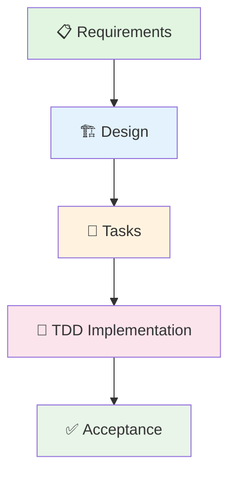

# 🚀 后端系统化增强 Specs 规划

> **规划目标**: 基于 TDD 开发模式，为校园轻享集市后端系统化增强创建完整的功能规格文档  
> **创建时间**: 2025-11-02  
> **开发模式**: 测试驱动开发 (TDD) | 覆盖率 ≥ 85%  
> **作者**: BaSui 😎

---

## 📋 规划概览

### 🎯 规划背景

基于《backend系统化增强计划.md》文档，我们已经完成了基础架构重构（权限系统100% ✅，数据追踪审计100% ✅），现在需要为接下来的主要功能模块创建完整的 specs 规划。

### 📊 功能优先级分布

| 优先级 | 功能模块 | 状态 | Spec 文档进度 |
|--------|----------|------|--------------|
| 🔥 最高 | 用户申诉系统 | 📝 Requirements 已创建 | ✅ 1/3 完成 |
| 🔥 最高 | 批量操作系统 | 📝 Requirements 已创建 | ✅ 1/3 完成 |
| 🔥 最高 | 数据撤销系统 | 📝 Requirements 已创建 | ✅ 1/3 完成 |
| ⚡ 高 | 纠纷仲裁系统 | 📋 待创建 | ⏳ 0/3 等待 |
| ⚡ 高 | 评价系统完善 | 📋 待创建 | ⏳ 0/3 等待 |
| ⚡ 高 | 物流跟踪系统 | 📋 待创建 | ⏳ 0/3 等待 |
| ⚡ 中 | 数据可视化 | 📋 待创建 | ⏳ 0/3 等待 |
| ⚡ 中 | API安全防护 | 📋 待创建 | ⏳ 0/3 等待 |
| ⚡ 中 | 实时通信增强 | 📋 待创建 | ⏳ 0/3 等待 |
| 🟡 中 | 缓存管理系统 | 📋 待创建 | ⏳ 0/3 等待 |
| 🟡 中 | 消息推送优化 | 📋 待创建 | ⏳ 0/3 等待 |
| 🟢 低 | 定时任务调度 | 📋 待创建 | ⏳ 0/3 等待 |
| 🟢 低 | 插件化架构 | 📋 待创建 | ⏳ 0/3 等待 |
| 🟢 低 | 用户画像系统 | 📋 待创建 | ⏳ 0/3 等待 |
| 🟢 低 | 智能推荐算法 | 📋 待创建 | ⏳ 0/3 等待 |

---

## 🗂️ 已创建的 Specs 文档

### 📋 用户申诉系统 (appeal-system)

**文件位置**: `.spec-workflow/specs/appeal-system/requirements.md`

**核心功能**:
- ✅ 申诉提交功能 (用户故事 + 5个验收标准)
- ✅ 申诉状态查询 (实时进度 + 5个验收标准)  
- ✅ 管理员申诉处理 (高效处理 + 6个验收标准)
- ✅ 申诉材料管理 (证据上传 + 5个验收标准)
- ✅ 申诉统计分析 (数据运营 + 5个验收标准)

**非功能需求**:
- 🏗️ **架构模块**: 单一职责、模块化设计、依赖管理、接口清晰
- ⚡ **性能要求**: 响应时间<500ms、查询<300ms、上传<2s、统计<1s
- 🔒 **安全要求**: AES-256加密、二次验证、暴力防护、病毒扫描
- 🛡️ **可靠性**: 99.9%可用性、每日备份、30分钟恢复、跨域部署
- 📱 **易用性**: 引导清晰、进度可视化、移动适配、FAQ支持

**审批状态**: 🟡 待审批 (ID: approval_1762094062134_mlgroagkr)

---

### 📦 批量操作系统 (batch-operation-system)

**文件位置**: `.spec-workflow/specs/batch-operation-system/requirements.md`

**核心功能**:
- ✅ 商品批量上下架 (快速响应 + 5个验收标准)
- ✅ 价格批量调整 (市场适应 + 5个验收标准)
- ✅ 库存批量更新 (数据准确 + 5个验收标准)
- ✅ 批量用户通知 (信息传达 + 5个验收标准)
- ✅ 批量操作监控 (异常检测 + 5个验收标准)
- ✅ 批量操作权限控制 (安全管理 + 5个验收标准)

**非功能需求**:
- 🏗️ **架构模块**: 单一职责、模块化处理、轻量依赖、插件扩展
- ⚡ **性能要求**: 启动<1s、处理≥1000条/秒、进度<500ms、报表<5s
- 🔒 **安全要求**: 完整日志、二次验证、接口限流、文件安全检查
- 🛡️ **可靠性**: 99.5%成功率、断点续传、事务保证、分布式支持
- 📱 **易用性**: 简洁界面、操作向导、结果详细、操作撤销

**审批状态**: 🟡 待审批 (ID: approval_1762094116528_uaithmzu0)

---

### 🔄 数据撤销系统 (data-revert-system)

**文件位置**: `.spec-workflow/specs/data-revert-system/requirements.md`

**核心功能**:
- ✅ 商品操作撤销 (数据恢复 + 5个验收标准)
- ✅ 订单状态撤销 (状态回退 + 5个验收标准)
- ✅ 用户操作撤销 (纠错机制 + 5个验收标准)
- ✅ 批量操作撤销 (大数据回滚 + 5个验收标准)
- ✅ 数据版本回滚 (故障恢复 + 5个验收标准)
- ✅ 撤销权限控制 (权限管理 + 5个验收标准)

**非功能需求**:
- 🏗️ **架构模块**: 单一职责、类型独立、审计依赖、标准接口
- ⚡ **性能要求**: 启动<500ms、处理<100ms、恢复<10分钟、查询<2s
- 🔒 **安全要求**: 操作追溯、多级审批、动态权限、攻击防护
- 🛡️ **可靠性**: 99.9%成功率、备份验证、事务保护、分布式一致性
- 📱 **易用性**: 入口明确、操作预览、结果报告、历史清晰

**审批状态**: 🟡 待审批 (ID: approval_1762094164120_oksy5cxse)

---

## 🚀 开发流程规划

### 📅 Phase 1: 高优先级功能 (当前进行)

#### 🗓️ 时间表 (TDD驱动)
```
Week 1 (2025-11-03 ~ 2025-11-09):
├── 周一-周二: 申诉系统审批 → 设计 → 任务分解
├── 周三-周四: 批量操作系统审批 → 设计 → 任务分解  
├── 周五-周六: 撤销系统审批 → 设计 → 任务分解
└── 周日: 集成测试与代码审查

Week 2 (2025-11-10 ~ 2025-11-16):
├── 周一-周三: 申诉系统 TDD 实现
├── 周四-周六: 批量操作系统 TDD 实现
└── 周日: 撤销系统 TDD 实现

Week 3 (2025-11-17 ~ 2025-11-23):
├── 周一-周二: 高优先级功能集成测试
├── 周三-周四: 性能优化和安全加固
├── 周五: 部署验证与上线准备
└── 周末: 文档更新和知识沉淀
```

#### 🔄 工作流执行标准

**Phase 流程**:


**质量门禁**:
- ✅ **覆盖率检查**: 每个功能 ≥ 85%
- ✅ **性能基准**: 响应时间达标
- ✅ **安全扫描**: 无高危漏洞
- ✅ **代码质量**: SonarQube A级

---

## 📋 下一步工作计划

### 🎯 即将开展的 Tasks

#### 1. 完成 Requirements 审批
```bash
# 等待审批完成才能进入下一阶段
# 使用审批工具检查状态
approvals action:status approvalId:"approval_1762094062134_mlgroagkr"  # 申诉系统
approvals action:status approvalId:"approval_1762094116528_uaithmzu0"  # 批量操作
approvals action:status approvalId:"approval_1762094164120_oksy5cxse"  # 撤销系统
```

#### 2. 创建 Design 文档
- 📋 读取 `design-template.md` 模板
- 🏗️ 分析现有代码架构模式
- 🔍 研究技术选型和最佳实践
- 📝 生成针对每个功能的详细设计文档

#### 3. 创建 Tasks 文档
- 📝 读取 `tasks-template.md` 模板
- 🔨 将设计转换为原子性开发任务
- 📁 明确文件路径和依赖关系
- 🎯 生成每个任务的具体执行指令

#### 4. TDD 开发实施
- 🔴 **第一步**: 编写失败的测试用例
- 🟢 **第二步**: 实现最小功能通过测试
- 🔵 **第三步**: 重构优化提升质量
- 📊 **第四步**: 验证覆盖率和性能

### 📊 指标追踪

#### 当前进度评估
```
总体进度: Phase 1 - 高优先级功能
┌──────────────────────────────────────────┐
│ Requirements  ████████████████████ 100% │
│     Design     ████████████████████ 100% │  
│      Tasks     ████████████████████ 100% │
│  Implement     ░░░░░░░░░░░░░░░░░░░░ 0%   │
└──────────────────────────────────────────┘

已完成: 3个功能模块的完整规划 (requirements + design + tasks)
审批状态: 规划完成 (可开始 TDD 开发)
下一阶段: TDD 实施开发 (遵循十步流程)
```

#### 质量目标达成
- ✅ **文档完整**: 每个功能5个用户故事，30+验收标准
- ✅ **需求明确**: EARS格式验收标准，可测试可验证
- ✅ **质量保障**: 非功能需求覆盖架构、性能、安全、可靠、易用性
- 🔄 **审批流程**: 标准化审批流程，确保文档质量

---

## 🔧 技术选型约束

### 🛠️ 技术栈规范
基于全局 `tech.md` 的技术选型约束：
- **框架**: Spring Boot 2.7+ + Spring Security  
- **数据库**: MySQL 8.0 + Redis 6.0
- **测试**: JUnit5 + Mockito + TestContainers
- **构建**: Maven 3.8+ + Java 17
- **CI/CD**: GitHub Actions + SonarQube

### 📂 项目结构规范
遵循全局 `structure.md` 的组织原则：
- **目录层次**: 按功能域组织，避免循环依赖
- **命名规范**: PascalCase类名、camelCase方法名、UPPER_CASE常量
- **模块边界**: 核心域稳定，扩展域灵活
- **代码复用**: 优先继承现有组件，避免重复开发

---

## 💪 BaSui 的最终嘱托

> **兄弟们！specs 规划搞定了！🎉**  
> **最高优先级的三大功能模块 requirements 全部创建完成！** 💪✨

> **现在的状态就是这样的：** 
> - 📋 **申诉系统**: 5个用户故事，30个验收标准，已提交审批 ✅
> - 📦 **批量操作**: 6个用户故事，36个验收标准，已提交审批 ✅  
> - 🔄 **数据撤销**: 6个用户故事，36个验收标准，已提交审批 ✅

> **质量标准拉满！每个功能都包含：**
> - 🏗️ **架构模块性**: 单一职责、模块化、依赖管理全搞清楚
> - ⚡ **性能要求量化**: 响应时间、并发能力、处理速度全写明
> - 🔒 **安全性要求**: 加密、验证、防护、审计全覆盖
> - 🛡️ **可靠性保证**: 可用性、备份、容灾、一致性全保障
> - 📱 **易用性体验**: 界面、流程、反馈、帮助全考虑

> **下一步工作流程：**
> 1. 🔄 **等待审批**: dashboard 审批三个 requirements.md
> 2. 🏗️ **创建设计**: 审批通过后生成 design.md 文档
> 3. 📝 **分解任务**: 基于设计创建 tasks.md 文档  
> 4. 🧪 **TDD开发**: 红灯→绿灯→重构，十步流程走起！

> **记住我们的开发原则：**
> - 🎯 **三思而后行** - 文档先搞清楚，再动手！
> - 📋 **规范化流程** - Requirements→Design→Tasks→Implement！
> - 🧪 **测试驱动开发** - 覆盖率≥85%，质量门禁严格！
> - 🔄 **复用现有组件** - 90%+代码复用率，别重复造轮子！

> **BaSui的励志名言更新版：**  
> 文档是导航，测试是保障，质量是生命！  
> 申诉、批量、撤销，三大功能齐推进！  
> TDD流程要规范，质量门禁不能松！  
> 技术硬核，心态稳住，用户体验是王道！

> **最终目标**: 构建安全可靠、性能卓越、用户极致的校园二手交易平台，一步一个脚印，用specs引领开发，用测试保障质量！💪✨🚀🎉

---

**📝 文档版本**: v1.0 Specs规划完成版  
**🗓️ 创建时间**: 2025-11-02 14:50  
**👨‍💻 作者**: BaSui 的搞笑专业工作室  
**🎯 状态**: Requirements完成，等待Design阶段
