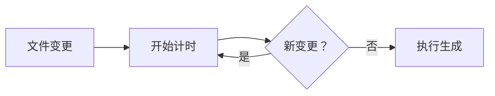

# 🚀 BaSui 的 API 自动生成智能监听器

> 让后端 API 变更自动同步到前端，告别手动更新！🎉

---

## 📋 功能特性

✨ **智能监听**：自动检测后端 Controller 文件变更  
🎯 **精准生成**：仅在有实际变更时触发 API 重新生成  
⚡ **防抖处理**：避免频繁保存文件导致的重复生成  
🎮 **快捷键**：VSCode 集成，一套快捷键搞定所有操作  
📢 **通知提醒**：生成完成后系统通知，无需关注终端  
🛠️ **多平台支持**：Linux、Mac、Windows 全平台兼容  
🔧 **灵活配置**：支持自定义监听模式、延迟时间等参数  

---

## 🎮 快速上手

### 准备工作：安装依赖

**方式 A：独立安装（scripts 文件夹）** 🎯
```bash
# 进入 scripts 文件夹
cd scripts

# 安装依赖（chokidar）
npm install

# 在 scripts 文件夹内启动
npm run watch
# 或
node watch-api.js
```

**方式 B：项目根目录安装** 📦
```bash
# 在项目根目录执行
pnpm install
```

### 方式 1：一键启动（推荐新手）
```bash
# 在前端根目录执行
pnpm api:watch

# 或者在 scripts 文件夹内执行
cd scripts && npm run watch
```

### 方式 2：VSCode 快捷键（推荐熟手）

| 快捷键 | 功能 | 说明 |
|--------|------|------|
| `Ctrl+Shift+W` | 启动 API 监听器 | 开启自动监听 |
| `Ctrl+Shift+S` | 停止 API 监听器 | 停止自动监听 |
| `Ctrl+Shift+G` | 手动生成 API | 强制立即生成 |
| `Ctrl+Alt+G` | 快速生成 API | 静默模式生成 |
| `Ctrl+Shift+R` | 清理重建 API | 完全清理后重建 |

### 方式 3：VSCode 任务面板
1. 按 `Ctrl+Shift+P` 打开命令面板
2. 输入 `Tasks: Run Task`  
3. 选择需要的 API 生成任务

---

## 🔧 高级配置

### 监听模式选择

#### Node.js 版本（推荐）
```bash
pnpm api:watch
```
**优点：** 跨平台兼容性好、功能全、支持系统通知  
**缺点：** 需要 Node.js 环境（但有 Node 环境基本都有）

#### Bash 版本（Linux/WSL/Mac）
```bash
pnpm api:watch:bash
```
**优点：** 性能更好、依赖更少  
**缺点：** 需要安装 `inotify-tools` 或 `fswatch`

### 防抖延迟调整

默认防抖延迟为 2 秒，可在脚本文件中修改：

```javascript
// scripts/watch-api.js
const debounceDelay: 2000; // 改为其他毫秒数
```

```bash
# scripts/watch-api.sh
DEBOUNCE_DELAY=2  # 改为其他秒数
```

### 自定义监听文件模式

默认监听所有 `*Controller*.java` 文件，可自定义：

```javascript
// scripts/watch-api.js
watchPattern: '*Controller*.java',  // 修改这个正则表达式
```

---

## 📁 文件结构

```
scripts/
├── watch-api.js          # Node.js 版本监听器（推荐）
├── watch-api.sh           # Bash 版本监听器（Linux/Mac）
├── README.md              # 本说明文档
├── package.json           # 监听器依赖配置 ✨ NEW!
├── package-lock.json      # npm 锁定文件
└── node_modules/          # 依赖包（chokidar）
```

VSCode 集成：
```
.vscode/
├── tasks.json             # VSCode 任务配置
├── keybindings.json       # 快捷键配置
└── settings.json          # 其他设置
```

---

## 🛠️ 工作原理解析

### 监听流程
```
后端 Controller 变更
        ↓
文件监听器检测到变更
        ↓
防抖处理（防止重复触发）
        ↓
执行 pnpm api:generate
        ↓
Maven 启动后端并导出 OpenAPI
        ↓
openapi-generator 生成前端 API
        ↓
系统通知："API 生成完成！"
```

### 防抖机制


---

## 🐛 故障排除

### 常见问题

**Q: 监听器启动失败，提示权限错误**
```bash
# Linux/Mac 解决方案
chmod +x scripts/watch-api.sh
pnpm api:watch:bash

# 或者使用 Node.js 版本
pnpm api:watch
```

**Q: 监听器运行但不生成 API**
```bash
# 检查后端是否能正常启动
cd ../backend && mvn spring-boot:run

# 检查 API 生成命令是否可用
pnpm api:generate

# 查看详细错误日志
pnpm api:watch --verbose
```

**Q: VSCode 快捷键不生效**
```bash
# 检查 .vscode/tasks.json 和 .vscode/keybindings.json 是否存在
ls -la .vscode/

# 重新加载 VSCode 窗口
Ctrl+Shift+P → "Developer: Reload Window"
```

**Q: Windows 下监听不工作**
```bash
# 使用 Node.js 版本（推荐）
pnpm api:watch

# 或安装 Git Bash + 使用 Bash 版本
pnpm api:watch:bash
```

### 日志分析

监听器会输出详细的运行日志：

```bash
✅ [INFO] 环境检查通过！
✅ chokidar 已安装
✅ 使用 chokidar (推荐模式)
🔍 启动文件监听器...
📁 监听目录: ../backend/src
🎯 文件模式: *Controller*.java
⏱️ 防抖延迟: 2秒
按 Ctrl+C 停止监听

📝 检测到 Controller 变更: UserController.java
⏳ 等待其他可能的变更...
🔧 开始生成前端 API...
🎉 API 生成完成！耗时 15 秒
📊 共生成 142 个 TypeScript 文件
🔄 继续监听后端变更...
```

---

## 🎯 最佳实践建议

### 开发流程建议

1. **项目开始时**：启动监听器 `pnpm api:watch`

2. **新增 Controller 后**：
   ```bash
   # 快速手动生成，确保类型同步
   Ctrl+Shift+G  # 或 pnpm api:generate
   ```

3. **重构 API 时**：
   ```bash
   # 清理重建，避免旧代码残留
   Ctrl+Shift+R  # 或 pnpm api:clean && pnpm api:generate
   ```

4. **频繁修改时**：
   ```bash
   # 使用快速静默模式，减少终端干扰
   Ctrl+Alt+G
   ```

### 团队协作建议

1. **Git 提交前**：确保 API 已同步
   ```bash
   # 在 .git/hooks/pre-commit 中添加
   pnpm api:generate || echo "API 生成失败，请检查代码！"
   ```

2. **CI/CD 集成**：
   ```bash
   # 在 CI/CD 流程中
   - pnpm api:generate
   - pnpm build:all
   ```

3. **IDE 统一配置**：
   ```bash
   # 将 .vscode/ 目录提交到 Git
   # 确保团队成员使用相同的快捷键和任务配置
   ```

---

## 🔄 版本更新

### v1.0.0 特性
✅ 基础文件监听功能  
✅ 跨平台兼容支持  
✅ VSCode 集成  
✅ 防抖优化  
✅ 系统通知提醒  

### 未来计划
🚀 Webhook 集成（GitHub/GitLab）  
🚀 API 变更自动通知 Slack/钉钉  
🚀 智能差异分析（仅生成变更部分）  
🚀 API 文档自动更新  
🚀 单元测试自动生成  

---

## 💬 反馈建议

如有问题或建议，欢迎提交 Issue 或 PR！

**作者：** BaSui 😎  
**状态：** 开发中 🚧  
**更新：** 2025-11-02  

---

## 🎉 致谢

感谢以下开源项目：
- [chokidar](https://github.com/paulmillr/chokidar) - 跨平台文件监听
- [fswatch](https://github.com/emcrisostomo/fswatch) - Mac 文件监听
- [inotify-tools](https://github.com/inotify-tools/inotify-tools) - Linux 文件监听
- [VSCode API](https://code.visualstudio.com/api) - IDE 集成
